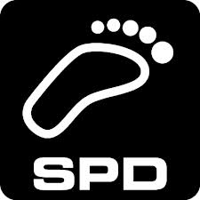

# aTrainingTracker
An android app for tracking your sports activities (supporting ANT+ and BTLE).

Featuring certified wireless ANT+™ connectivity. 
Visit www.thisisant.com/directory for compatible products.

       

### This Android app is for the really serious athletes.

For those, who want to track all the details of every training session but do not want to waste their time.  
This app is for all the athletes, who want a powerful yet simple to use app to track their training.

Once configured and paired with all your remote sensors, you only have to press start when you start your 
training session and stop when you are done.  Except for the name of the workout, everything else should go 
without further interaction.  The app automagically determines the sport and the equipment (shoe or bike) 
you used during a training session based on the remote sensors that where used during this session. Moreover, 
the app can upload the files to your Dropbox.  So when you have finished your shower, the data is already on 
your computer, waiting to be analyzed with your favorite software like WKO+, or Golden Cheetah.

## Main Features:

* Support of many ANT+ sensors (heart rate, run speed and cadence, bike speed, bike cadence, bike speed and cadence, bike power, temperature/environment).
* Support of many Bluetooth LE sensors (heart rate, run speed and cadence, cycling speed, cycling cadence, cycling speed and cadence).
* Pair an unlimited number of remote (ANT+ or Bluetooth) sensors, e.g., a speed or cadence sensor on each of your bikes.
* Simply swipe through the different configurable views
* Export to TCX, GPX, CSV, and Golden Cheetah.
* Upload to Dropbox.
* Upload to various online communities: Strava, TrainingPeaks, Runkeeper.
* Use your Pebble to display values.
* When the app starts, it searches for all paired sensors and takes the data from the "best" available one.
* The sport type (run, bike) is derived from the available remote sensors.  When no remote sensors were available, the sport type is guessed from the average speed.
* The equipment is synchronized with Strava.  The equipment used in a training session is then derived from the available remote sensors.
* Simple setting of the calibration factor.  You only have to input the measured and true distance.

## More than a decade ago, I had a dream.

Back then, I studied mechatronics, jogged from time to time, and did my first tries in writing code for mobile phones, so called Midlets.  When jogging, I wore a heart rate strap and wrist watch to display the heart rate values.  My wrist watch could not store the heart rate data but there were very very expensive ones available that could do this.  Moreover, the first version of speed sensors for running (very clumpy ones) were appearing.  Once, I thought about the amazing possibilities that open up, when a mobile phone could get all the data and store it.  Most obviously, a mobile phone has an almost infinite amount of storage (even back then) and it is simple to get the data from the phone to the computer (honestly, back then this was not as simple as today). Even better, the mobile phone has a huge display and can do complex computations.  Only the possibility to display the data on a wrist watch seemed to be out of reach.

Over the years, I increased my running volume, added swimming and cycling and became a passionate triathlete.

## Now, this dream becomes true.

In 2011, I realized that there are smartphones available that support the ANT+ protocol, the de facto standard for transmitting fitness data (heart rate, speed, cadence, power, ...).  Thus, I became excited and bought such a smartphone but non of the available apps were enough powerful and simple to use to satisfy me.  So I started coding ...

Over the years, I invest much more time in developing this app than training.  Now, that my time becomes more and more limited I published the app here on GitHub under an open source licence.

### Support

You can support the development of this app by contributing on GitHub or sending some bitcoins to
1CwwNwhpqvT77Dqoo9ByMHAMKhyVRvAEq1
