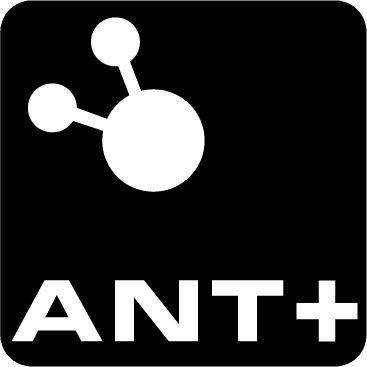
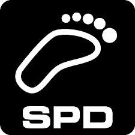
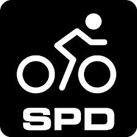
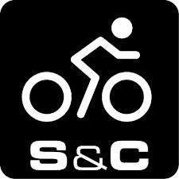

# aTrainingTracker
**The serious athlete's tracking cockpit for Android.**

aTrainingTracker is a high-performance sports tracking application designed for athletes who demand precision and automation. While the primary focus is providing a solid tracking experience during your session, the app also includes tools for basic aftermath analysis and long-term volume tracking. By leveraging multi-sensor connectivity (ANT+ and Bluetooth LE), it transforms your smartphone into a training computer.

**[Get it on Google Play](https://play.google.com/store/apps/details?id=com.atrainingtracker)**

         
Featuring wireless ANT+™ connectivity.  
Visit [www.thisisant.com/directory](https://www.thisisant.com/directory) for compatible products.

### Focused on Performance, Minimize Interaction

For those who want to track every detail of their training without wasting time on their phone. aTrainingTracker is powerful yet simple:
*   **Zero-Touch Automation**: Once configured, just press **Start**. The app automagically determines the sport (Run/Bike) and the specific equipment (bike or shoes) based on the remote sensors detected during the session.
*   **Best-Sensor Logic**: Intelligent priority system selects the highest quality data source (e.g., preferring a dedicated ANT+ or BTLE speed sensor over GPS-based speed for superior precision).
*   **Cloud Ready**: Automatic synchronization with **Strava** and **Dropbox**. Your data is ready for analysis on your computer (WKO+, Golden Cheetah) by the time you've finished your post-workout shower.
*   **Privacy First**: All tracked data is stored exclusively on your device (unless you choose to upload it to the cloud). Of course, I do not collect, store, or have access to your personal workout data.

## Main Features:

*   **Extensive Sensor Support**:
    *   **ANT+**: Heart Rate, Run Speed/Cadence, Bike Speed, Bike Cadence, Combined Speed & Cadence, Power Meters, and Temperature.
    *   **Bluetooth LE**: Heart Rate, Cycling Speed/Cadence, Running Speed/Cadence.
*   **Multi-Sensor Pairing**: Pair an unlimited number of sensors; the app automatically connects to what is available when you start.
*   **Highly Customizable Cockpits**: Build your perfect dashboard by swiping through multiple configurable views. Cockpits are sport-type dependent, ensuring you always see the exact metrics relevant to your current activity (e.g., Power/Cadence for cycling vs. Pace for running).
*   **Versatile Export**: Support for TCX, GPX, CSV, and Golden Cheetah formats.
*   **Cloud Integration**: Automatic synchronization with **Strava** and **Dropbox** for seamless data analysis and backup.
*   **Social Sharing**: Generate and share snapshots that combine your map, elevation profile, and key metrics into a single image.
*   **Navigation & Routes**: Import routes from GPX or the Strava server and follow them on the live map during your session.
*   **Strava Segments**: Manage your starred segments with detailed metrics and elevation profiles. Sort by proximity, grade, or elevation gain, with automatic detection and live feedback while on the segment.
*   **Customizable Sport Types**: Fully flexible sport definitions to suit your specific training needs.
*   **Multilingual**: Available in English, German, Spanish, French, Italian, Portuguese, Dutch, Polish, and Japanese.
*   **Training History**: Built-in summaries (weekly, monthly, yearly) to monitor your training volume at a glance.

## More than two Decades ago, I had a Dream

This project began as a vision more than two decades ago. Back then, I was an engineering student exploring the first possibilities of mobile coding with Java Midlets. When jogging, I wore a heart rate strap and a simple wrist watch.  Expensive watches that could store data were just appearing but out of reach for me. 

I dreamt of a future where the mobile phone—with its massive storage, large display, and computational power—could act as the ultimate training log, gathering and storing every bit of data from remote sensors.

Over the years, I transitioned from a casual jogger to a passionate triathlete. By the time the first smartphones supporting the ANT+ protocol hit the market in 2011, I was ready. I bought one immediately, but found that none of the available apps were powerful or automated enough for a serious athlete. 

So, I started coding.

After many years of active development and use, the project saw a lengthy hiatus between 2019 and 2025. However, my passion for the ultimate tracking cockpit never faded. I have now returned to the project with renewed energy, modernizing the user interface while keeping the solid core tracking logic intact.

Recently, I have invested significantly more time in refining this code than in actual training, and I am proud to share this labor of love with the community.

## Support & Contributing

We welcome support from the community to keep aTrainingTracker the best tool for serious athletes:
*   **Report Issues**: Add feature requests or bug reports on [GitHub](https://github.com/rainerblind/aTrainingTracker/issues).
*   **Contribute Code**: Pull requests for Java or Kotlin improvements are always welcome.
*   **Translate**: Help localize the app into your mother tongue. No coding is required—just simple text translation.

---
*Wireless ANT+™ connectivity. Visit www.thisisant.com/directory for compatible products.*
