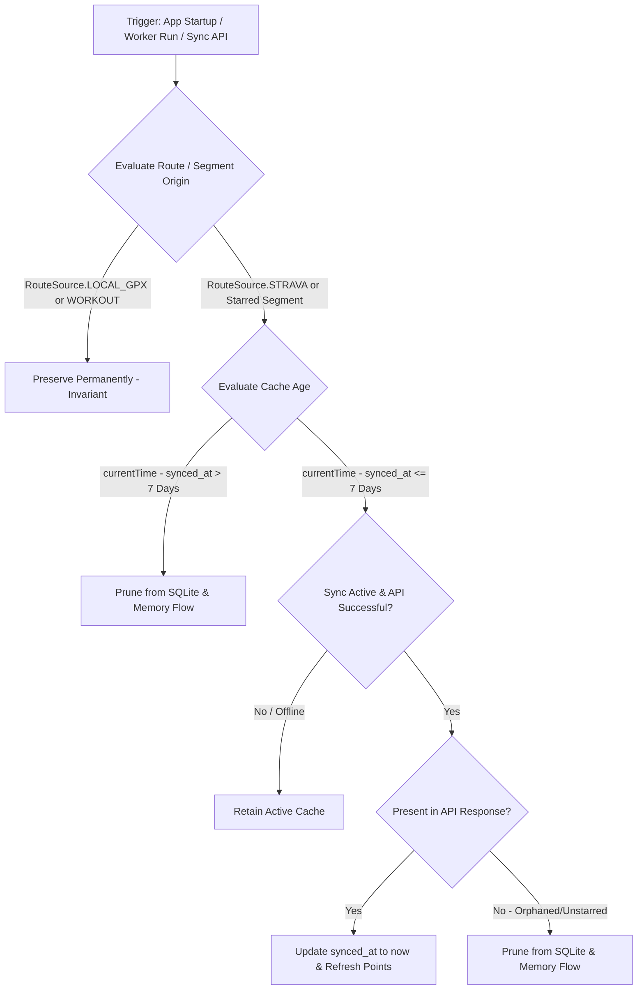

# Forensic Analysis: Enforce 7-Day TTL Cache Retention & Orphan Pruning for Strava Routes and Segments (ATT-1177)

## 1. Executive Summary & Problem Context
* **Ticket Key**: `ATT-1177`
* **Summary**: `[Verbesserung] Enforce 7-day TTL cache retention and orphan pruning for Strava routes and segments`
* **Target Version**: `V4.9.37`
* **Target Branch**: `feature/ATT-1177`
* **Stage Sub-Task**: `ATT-1180` (`[Analysis]`)
* **Parent Epic**: `ATT-597` (Strava Support)

### Problem Description & Regulatory Background
Under Section 6.2 ("Cache and Retention") of the Strava API Agreement and Developer Terms:
1. **7-Day Retention Limit**:
   Developers may cache Strava Data only to the extent reasonably necessary to operate their application. In no event may an application retain Strava Data (including segments, leaderboards, and routes) for longer than **7 days**, unless explicitly permitted by Strava in writing.
2. **Orphan / Deletion Pruning**:
   If a resource (such as a route or starred segment) is deleted, modified, or unstarred by the athlete on Strava, it must be promptly pruned from the local client cache.
3. **Current State in aTrainingTracker**:
   * Imported Strava routes (`RouteSource.STRAVA`) in `Routes.db` and starred segments in `Segments.db` are stored indefinitely.
   * If a device stays offline or background synchronization does not execute for > 7 days, cached Strava data persists locally, violating Section 6.2.
   * In `RoutesRepository.syncRoutesFromStrava()`, synchronization only performs additive inserts/updates; it does NOT detect or delete local routes that were deleted or unstarred on Strava.
   * If an athlete wants to retain a route permanently for offline navigation, there is currently no explicit mechanism to duplicate/convert a Strava route into a user-owned local route (`RouteSource.LOCAL_GPX`).

---

## 2. Architectural Deep Dive & Gap Analysis

### 2.1 Storage Vector Analysis

| Component | Storage Layer | Current State | Defect / Gap | Target Architectural Solution |
| :--- | :--- | :--- | :--- | :--- |
| **Strava Routes** | `Routes.db` (`TABLE_ROUTES`) | No timestamp column indicating when a route was cached or updated. | Routes persist indefinitely if offline > 7 days. Orphan routes are never deleted during sync. | • Add `synced_at` (epoch millis) column to `TABLE_ROUTES` (Schema v8). • Prune expired records (`currentTime - synced_at > 7 days`). • Prune orphan records missing from Strava API response during sync. |
| **Starred Segments** | `Segments.db` (`TABLE_STARRED_SEGMENTS`) | No timestamp column indicating when a segment was cached. | Segments persist indefinitely if offline > 7 days. | • Add `synced_at` (epoch millis) column to `TABLE_STARRED_SEGMENTS` (Schema v8). • Prune expired segments and streams when TTL expires. |
| **Sync Workers** | `WorkManager` (`StravaRoutesSyncWorker`, `StravaSegmentsSyncWorker`) | Workers trigger periodic sync, but do not enforce TTL pruning when synchronization fails or is delayed. | Offline devices retain stale data past 7 days without self-healing eviction. | • Enforce TTL expiration check at worker startup, repository instantiation, and database query time. |
| **Athlete Route Ownership** | `RoutesRepository.kt` | No feature to convert Strava routes into local user-owned routes. | Athletes lose access to desired routes when the 7-day TTL evicts them. | • Provide `duplicateRouteAsLocal(routeId: Long)` to clone a route into `RouteSource.LOCAL_GPX`, granting permanent offline retention as user-owned data. |

### 2.2 TTL & Orphan Pruning State Matrix

---

## 3. Implementation Surface Breakdown

### 3.1 Database Migrations (Schema v8)
1. **`RoutesDatabaseManager.kt`**:
   - Increment `DB_VERSION` from 7 to 8.
   - Add column `COLUMN_SYNCED_AT = "synced_at"` (`INTEGER DEFAULT 0`) to `TABLE_ROUTES`.
   - Migration in `onUpgrade`: `ALTER TABLE Routes ADD COLUMN synced_at INTEGER DEFAULT 0;`.
   - Implement `pruneExpiredStravaRoutes(maxAgeMs: Long = 7 * 24 * 60 * 60 * 1000L): Int`.
   - Implement `pruneOrphanStravaRoutes(activeStravaIds: Set<String>): Int`.
   - Implement `duplicateRouteAsLocal(routeId: Long): Long` copying route points and assigning `RouteSource.LOCAL_GPX`.

2. **`SegmentsDatabaseManager.java`**:
   - Increment `DB_VERSION` from 7 to 8.
   - Add column `SYNCED_AT = "synced_at"` (`INTEGER DEFAULT 0`) to `StarredSegmentsTable`.
   - Migration in `onUpgrade`: `ALTER TABLE StarredSegmentsTable ADD COLUMN synced_at INTEGER DEFAULT 0;`.
   - Implement `pruneExpiredSegments(long maxAgeMs): int` that deletes expired segment summaries and cascade-prunes stream coordinates.
   - Implement `pruneOrphanSegments(Set<Long> activeStravaIds): int`.

### 3.2 Repository Synchronization Logic
1. **`RoutesRepository.kt`**:
   - In `init`: execute `routesDb.pruneExpiredStravaRoutes()`.
   - In `syncRoutesFromStrava()`:
     - On successful response: update `synced_at` for all incoming routes.
     - Collect incoming Strava IDs: `activeExtIds = stravaRoutes.map { it.idStr }.toSet()`.
     - Prune orphans: delete local Strava routes where `externalId !in activeExtIds`.
     - Refresh flow via `refreshRoutes()`.
   - Expose `suspend fun convertStravaRouteToLocal(routeId: Long): Long`.

2. **`SegmentsRepository.kt`**:
   - In `init`: execute `segmentsDb.pruneExpiredSegments()`.
   - In `syncStarredSegmentsWorker()`:
     - When pagination finishes successfully, update `synced_at` timestamp.
     - Robust orphan deletion: ensure `deleteSegment` prunes both summaries and streams.
     - Refresh flow via `refreshSegments()`.

### 3.3 UI Integration
1. **Route Detail & List UI**:
   - Provide a "Save as Local Route" / "Als lokale Route speichern" action for Strava routes, allowing athletes to convert a Strava route to `RouteSource.LOCAL_GPX` before it expires.
   - Display a subtle indicator or info text showing that Strava routes are synchronized with a 7-day cache TTL per Strava API rules.

---

## 4. System Invariant Safety Checklist

* [x] **Native Workout Recordings**: `WorkoutSummaries.db`, `WorkoutSamples.db`, and `Laps.db` are athlete recordings. They MUST NOT be touched or affected by TTL expiration or orphan pruning.
* [x] **Local GPX & Workout Routes**: Routes with `source == RouteSource.LOCAL_GPX` or `source == RouteSource.WORKOUT` MUST NEVER be pruned or expired.
* [x] **Workout Clusters**: Recurring route clusters in `WorkoutCluster.db` MUST NOT be deleted when a cached Strava route expires; the cluster geometry remains valid from recorded workouts.
* [x] **Equipment & Hardware Links**: `Equipment.db` and ANT+/BLE sensor links MUST NOT be touched.
* [x] **Offline Stability**: Pruning operations MUST execute safely in background transactions without blocking UI threads or throwing exceptions when offline.

---

## 5. Verification & Test Strategy
1. **`RoutesDatabaseManagerTTLTest.kt`**:
   - Test 1: Prunes Strava routes older than 7 days while preserving routes younger than 7 days.
   - Test 2: Invariant preservation: Never prunes `LOCAL_GPX` or `WORKOUT` routes regardless of age.
   - Test 3: Prunes orphan Strava routes missing from active ID set.
   - Test 4: `duplicateRouteAsLocal` creates an independent `LOCAL_GPX` route that survives TTL pruning.
2. **`SegmentsDatabaseManagerTTLTest.kt`**:
   - Test 1: Prunes starred segments and associated polyline streams older than 7 days.
   - Test 2: Prunes orphan segments not present in remote sync set.
3. **Clean-Room Regression**:
   - Full project test suite execution: `./gradlew testDebugUnitTest` (0 failures).

---

## 6. Stage Gate 1 Readiness
- Scope is precisely bounded to Section 6.2 compliance (7-day TTL and orphan pruning) for Strava routes and segments.
- Schema v8 upgrade path designed with backward compatibility.
- User route ownership safeguarded via local route duplication.
- Ready for Stage 1 sign-off.
