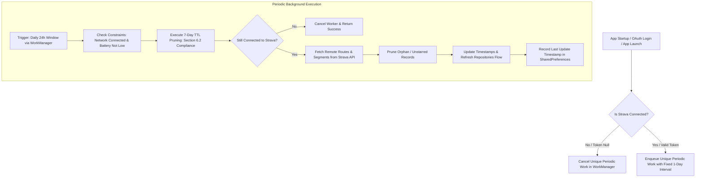

# Forensic Analysis: Mandatory Daily Synchronization for Strava Segments and Routes (ATT-1178)

## 1. Executive Summary & Problem Context
* **Ticket Key**: `ATT-1178`
* **Summary**: `[Verbesserung] Sync Strava Segments and Routes every day`
* **Target Version**: `V4.9.37`
* **Target Branch**: `feature/ATT-1178`
* **Stage Sub-Task**: `ATT-1185` (`[Analysis]`)
* **Parent Epic**: `ATT-597` (Strava Support)
* **Predecessor References**: `ATT-913` (Strava Segments Periodic Fetch), `ATT-914` (Strava Routes Periodic Fetch), `ATT-1177` (7-Day TTL Cache Retention)

### Problem Description & Regulatory Rationale
Under Strava API Developer Agreement Section 6.2 ("Cache and Retention"):
1. **Cache Freshness & Compliance**:
   Strava Data cached by applications must reflect the latest state on Strava servers, and deleted or unstarred segments/routes must be promptly evicted from client storage.
2. **Shortcoming of User-Configurable Intervals (ATT-913 / ATT-914)**:
   In ATT-913 and ATT-914, periodic background sync was implemented with user-facing toggle switches (`automated_strava_segments_sync`, `automated_strava_routes_sync`) and interval dropdown selectors (1 day, 3 days, 7 days, 30 days) in `StravaSettingsDialog.kt`.
   - If an athlete disabled automated sync or selected a 7-day or 30-day interval, cached segments and routes would expire under the 7-day TTL (ATT-1177) without being refreshed in a timely manner.
   - This caused data disappearance, stale caches, and potential violations of Strava API rules.
3. **Core Requirement ("No need to ask the user")**:
   - Synchronization for Strava segments and routes must execute **every day** automatically in the background as long as the athlete is authenticated with Strava.
   - The user must **not** be prompted or allowed to disable background synchronization or select non-daily intervals.
   - The configuration switches and interval dropdowns in `StravaSettingsDialog` must be removed, streamlining the UI and ensuring 100% compliance with Strava policies.

---

## 2. Architectural Deep Dive & Gap Analysis

### 2.1 Component State Matrix

| Component | Previous State (ATT-913 / ATT-914) | Target State (ATT-1178) | Impact / Rationale |
| :--- | :--- | :--- | :--- |
| **`StravaSettingsDialog.kt`** | Renders toggle switches and `DropdownSelector` for segment and route sync intervals (1, 3, 7, 30 days). | Removes switches and interval dropdowns. Retains manual sync cards (`updateStravaRoutes`, `updateStravaSegments`) displaying last updated timestamps. | Simplifies UI; eliminates athlete misconfiguration; adheres to "No need to ask the user". |
| **`StravaSegmentsSyncWorker.kt`** | Reads `SP_AUTOMATED_STRAVA_SEGMENTS_SYNC` and `SP_STRAVA_SEGMENTS_SYNC_INTERVAL_DAYS` to schedule or cancel. | Schedules unconditionally every **1 day** whenever `TrainingApplication.getStravaAccessToken() != null`. Cancels when disconnected. | Enforces mandatory daily refresh for starred segments and streams. |
| **`StravaRoutesSyncWorker.kt`** | Reads `SP_AUTOMATED_STRAVA_ROUTES_SYNC` and `SP_STRAVA_ROUTES_SYNC_INTERVAL_DAYS` to schedule or cancel. | Schedules unconditionally every **1 day** whenever `TrainingApplication.getStravaAccessToken() != null`. Cancels when disconnected. | Enforces mandatory daily refresh for Strava routes and path streams. |
| **`TrainingApplication.java`** | Exposes getters/setters for enable toggles and interval days. | Defaults enable getters to `true` and intervals to `"1"`. Removes or preserves backward-compatible methods as no-ops. | Guarantees legacy calls or settings cannot disable daily sync. |
| **`WorkManager` Work Requests** | Periodic work request scheduled with dynamic interval from SharedPreferences. | Fixed `PeriodicWorkRequestBuilder<...>(1, TimeUnit.DAYS)` with `NetworkType.CONNECTED` and `requiresBatteryNotLow(true)`. | Predictable 24-hour cadence ensuring cache is always fresh and within 7-day TTL. |

### 2.2 Execution & Scheduling Flow

---

## 3. Implementation Surface Breakdown

### 3.1 UI Streamlining (`StravaSettingsDialog.kt`)
1. **Remove Sections**:
   - Remove the `Automated Synchronization Configuration` section for Segments (toggle switch and interval `DropdownSelector`).
   - Remove the `Automated Routes Synchronization Configuration` section for Routes (toggle switch and interval `DropdownSelector`).
2. **Retain Manual Cards**:
   - Keep `OutlinedCard` for `updateStravaEquipment` (Equipment sync).
   - Keep `OutlinedCard` for `updateStravaRoutes` (Routes sync with last update timestamp).
   - Keep `OutlinedCard` for `updateStravaSegments` (Segments sync with last update timestamp).
3. **Save Dialog Actions**:
   - Remove mutating `SP_AUTOMATED_STRAVA_SEGMENTS_SYNC`, `SP_STRAVA_SEGMENTS_SYNC_INTERVAL_DAYS`, `SP_AUTOMATED_STRAVA_ROUTES_SYNC`, and `SP_STRAVA_ROUTES_SYNC_INTERVAL_DAYS` in `AppDialogActions.SaveCancel`.

### 3.2 Background Workers
1. **`StravaSegmentsSyncWorker.kt`**:
   - `schedule(context)`:
     - Check `TrainingApplication.getStravaAccessToken() != null`.
     - If disconnected, `cancelUniqueWork(WORK_NAME)`.
     - If connected, enqueue `PeriodicWorkRequestBuilder<StravaSegmentsSyncWorker>(1, TimeUnit.DAYS)` with `ExistingPeriodicWorkPolicy.UPDATE`.
   - `doWork()`:
     - First, prune expired segments via `SegmentsRepository.pruneExpiredSegments()`.
     - Check `TrainingApplication.getStravaAccessToken() != null`. If disconnected, return `Result.success()`.
     - Synchronize segments: `SegmentsRepository.getInstance(applicationContext).syncStarredSegments(BSportType.UNKNOWN)`.
2. **`StravaRoutesSyncWorker.kt`**:
   - `schedule(context)`:
     - Check `TrainingApplication.getStravaAccessToken() != null`.
     - If disconnected, `cancelUniqueWork(WORK_NAME)`.
     - If connected, enqueue `PeriodicWorkRequestBuilder<StravaRoutesSyncWorker>(1, TimeUnit.DAYS)` with `ExistingPeriodicWorkPolicy.UPDATE`.
   - `doWork()`:
     - First, prune expired routes via `RoutesRepository.pruneExpiredRoutes()`.
     - Check `TrainingApplication.getStravaAccessToken() != null`. If disconnected, return `Result.success()`.
     - Synchronize routes: `RoutesRepository.getInstance(applicationContext).syncRoutesFromStrava()`.

### 3.3 Preference & Application Layer (`TrainingApplication.java`)
- `isAutomatedStravaRoutesSyncEnabled()` -> always returns `true`.
- `getStravaRoutesSyncIntervalDays()` -> always returns `"1"`.
- `isAutomatedStravaSegmentsSyncEnabled()` -> always returns `true`.
- `getStravaSegmentsSyncIntervalDays()` -> always returns `"1"`.
- Setters kept for binary compatibility or made no-ops / pinned to 1 day.

### 3.4 Requirements & Specifications Documentation
- Update `REQ-EXP-011` in `docs/requirements.md`: Reflect mandatory daily background sync and removal of user configuration switches/dropdowns.
- Update `REQ-EXP-012` in `docs/requirements.md`: Reflect mandatory daily background sync and removal of user configuration switches/dropdowns.
- Update `TST-EXP-008` and `TST-EXP-009` in `docs/tests.md`.

---

## 4. System Invariant Safety Checklist

* [x] **Native Workout Recordings**: `WorkoutSummaries.db`, `WorkoutSamples.db`, and `Laps.db` are completely decoupled and untouched.
* [x] **Local GPX & Saved Routes**: Routes with `source == RouteSource.LOCAL_GPX` or `source == RouteSource.WORKOUT` are never affected by Strava worker synchronization.
* [x] **Selective Upload Controls**: Telemetry upload toggles (GPS, Altitude, HR, Power, Cadence) in `StravaSettingsDialog` remain functional and unchanged.
* [x] **Manual On-Demand Sync**: Athletes can still manually tap `updateStravaRoutes` and `updateStravaSegments` cards in `StravaSettingsDialog` or pull-to-refresh in list views at any time.
* [x] **Battery & Network Constraints**: WorkManager requests must retain `NetworkType.CONNECTED` and `requiresBatteryNotLow(true)` to avoid draining battery or cellular data when low.

---

## 5. Verification Strategy
1. **Unit Tests**:
   - Update `StravaSegmentsSyncWorkerTest.kt`: Verify scheduling always enqueues a 1-day work request when connected to Strava, cancels when disconnected, and executes sync regardless of legacy preferences.
   - Update `StravaRoutesSyncWorkerTest.kt`: Verify scheduling always enqueues a 1-day work request when connected to Strava, cancels when disconnected, and executes sync regardless of legacy preferences.
2. **UI & Regression Verification**:
   - Verify `StravaSettingsDialog` compiles cleanly and displays the connection header, manual sync cards, and selective upload section without the removed automated sync switches.
   - Run `./gradlew testDebugUnitTest` across the entire project (clean-room regression).
