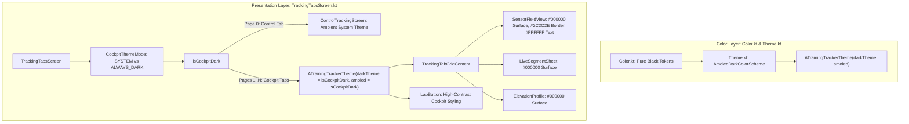

# Architectural Analysis - ATT-1263: [Cockpit] Implement AMOLED Pure Black (#000000) Theme for Tracking Views

**Parent Ticket**: [ATT-1263](https://rainerblind.atlassian.net/browse/ATT-1263)  
**Parent Epic**: [ATT-1157](https://rainerblind.atlassian.net/browse/ATT-1157) (*[Epic] Optimize dark mode*)  
**Target Release**: `V4.9.38`  
**Active Sprint**: `2026-39.3`  
**Requirement Candidate**: `REQ-UI-169` (*AMOLED Pure Black Cockpit Theme*)  
**Test Spec Candidate**: `TST-UI-121`  
**Branch**: `feature/ATT-1263`  

---

## 1. Problem Statement & Motivation

During outdoor training sessions (cycling, running, mountain biking), display readability under direct sunlight and device power consumption are paramount:
- Currently, when dark mode is active in the workout cockpit, it uses the standard Material 3 `DarkColorScheme` with a charcoal grey background (`DarkBackground = Color(0xFF1B1B1F)`) and surface (`DarkSurface = Color(0xFF1B1B1F)`).
- On OLED/AMOLED screens, charcoal grey forces OLED subpixels to emit light across the entire display area, consuming continuous battery power and lowering perceived contrast under intense ambient sunlight.
- True AMOLED pitch black (`#000000`) shuts off OLED pixels entirely. This yields zero power draw for black pixels, infinite contrast ratio, and maximum legibility for telemetry text, sensor badges, and zone indicators.
- Per user requirement: *"When dark mode for tracking is selected it should be maximal dark."*

---

## 2. Requirements Analysis (`REQ-UI-169`)

### 2.1 Scope & Boundary Invariants
1. **Target Scope**:
   - Applies to the live workout tracking cockpit (`TrackingTabGridContent` on pages 1..N of `TrackingTabsScreen`), including tab preview and tab configuration headers.
   - Applies to all cockpit subcomponents:
     - Telemetry sensor field cards (`SensorFieldView`)
     - Sensor grid background (`SensorGridScreen` / `BottomSheetScaffold`)
     - Elevation profile surface (`ElevationProfile`)
     - Live segment bottom sheet (`LiveSegmentSheet`)
     - Interactive lap button (`LapButton`)
2. **Boundary Invariants (Preserved)**:
   - **Control Tracking (Page 0)**: `ControlTrackingScreen` (sensor pairing, sport selector, start/pause/stop) remains enclosed in the standard ambient app theme.
   - **Global Application Shell**: Navigation drawer, workout history, period summaries, and settings dialogs remain strictly in standard Material 3 colors (ambient system light/dark).

### 2.2 Color System Architecture

| Material 3 Role | Standard Dark Mode | AMOLED Cockpit Mode (`#000000`) | Rationale |
|---|---|---|---|
| `background` | `#1B1B1F` (Charcoal) | **`#000000`** (Pitch Black) | Turns off OLED pixels completely across the grid scaffold canvas. |
| `surface` | `#1B1B1F` (Charcoal) | **`#000000`** (Pitch Black) | Turns off OLED pixels for uncolored sensor field tiles. |
| `surfaceVariant` | `#44474F` | **`#000000`** | Ensures fallback surface containers remain pure black. |
| `surfaceContainer` | `#1B1B1F` | **`#000000`** | M3 container surfaces remain pure black. |
| `surfaceContainerHighest` | `#201F20` | **`#121212`** | Subtle distinction for elevated containers where necessary. |
| `outlineVariant` | `#44474F` | **`#2C2C2E`** | Crisp 1dp tile separation borders between black tiles. |
| `outline` | `#8E9099` | **`#38383A`** | High-contrast divider outlines. |
| `onSurface` | `#E3E2E6` | **`#FFFFFF`** (Pure White) | Maximum contrast for telemetry digits and metric labels. |
| `onSurfaceVariant` | `#C4C6D0` | **`#C4C6D0`** (Readable Muted) | Clear distinction for unit labels and secondary information. |
| `primary` | `#A6C8FF` | `#A6C8FF` | Vibrant brand accent for icons and active indicators. |

### 2.3 Zone & Elevation Highlighting
- **Athletic Zones (Heart Rate / Power)**:
  - When a sensor field has an active zone color, `SensorFieldView` applies `fieldState.zoneColor.copy(alpha = 0.12f)` over the pure black surface with a vibrant 6dp vertical indicator strip. Against pure black (`#000000`), zone colors stand out with dramatic clarity without washing out the screen.
- **Elevation Profile & Map**:
  - Elevation profile canvas background sits seamlessly on `#000000`.
  - Google Map view renders with standard night/satellite styling when applicable.

---

## 3. Architecture & Component Changes

### 3.1 Specific Code Modifications
1. **[Color.kt](file:///home/rainer/AndroidStudioProjects/aTrainingTracker/app/src/main/java/com/atrainingtracker/trainingtracker/ui/theme/Color.kt)**:
   - Add AMOLED tokens: `AmoledBackground = Color(0xFF000000)`, `AmoledSurface = Color(0xFF000000)`, `AmoledOutlineVariant = Color(0xFF2C2C2E)`, `AmoledBorder = Color(0xFF38383A)`.
2. **[Theme.kt](file:///home/rainer/AndroidStudioProjects/aTrainingTracker/app/src/main/java/com/atrainingtracker/trainingtracker/ui/theme/Theme.kt)**:
   - Introduce `AmoledDarkColorScheme` with pitch black surfaces and high-contrast text.
   - Update `ATrainingTrackerTheme` to support `amoled: Boolean = false`.
3. **[TrackingTabsScreen.kt](file:///home/rainer/AndroidStudioProjects/aTrainingTracker/app/src/main/java/com/atrainingtracker/trainingtracker/ui/tracking/trackingtabs/TrackingTabsScreen.kt)**:
   - Pass `amoled = isCockpitDark` to `ATrainingTrackerTheme` for cockpit pages (`page > 0`) and `LapButton`.

---

## 4. Verification & Testing Strategy (`TST-UI-121`)

1. **Unit Testing**:
   - `AmoledThemeTest.kt`: Verify `AmoledDarkColorScheme` color assignments (`background == Color.Black`, `surface == Color.Black`, `onSurface == Color.White`).
2. **Theme Composition Test**:
   - Verify `ATrainingTrackerTheme(darkTheme = true, amoled = true)` resolves to `AmoledDarkColorScheme`.
   - Verify `ATrainingTrackerTheme(darkTheme = true, amoled = false)` resolves to standard `DarkColorScheme`.
3. **Clean-Room Regression**:
   - Run `./gradlew testDebugUnitTest` across the entire project.

---

## 5. ASPICE Gates & Milestones

- **Gate 1 (Analysis)**: Sub-task `ATT-1414` (Current)
- **Gate 2 (Test-Spec)**: `REQ-UI-169` & `TST-UI-121` specification in `docs/requirements.md` & `docs/tests.md`
- **Gate 3 (Impl-Plan)**: Detailed architectural plan in `docs/engineering/plans/ATT-1263_plan.md`
- **Gate 4 (Implementation)**: Code delivery, unit tests, Stage 4 walkthrough
- **Gate 5 (Release)**: Full test suite verification, merge into `develop`
