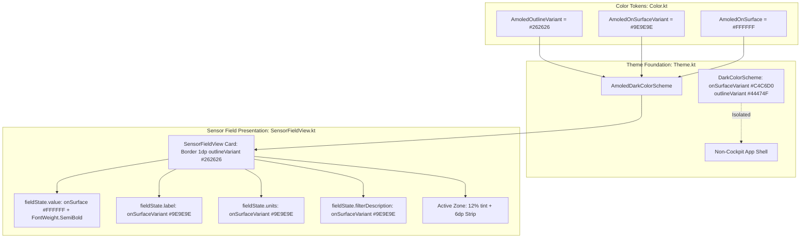

# Engineering Analysis - ATT-1264: [Cockpit] High-contrast typography and subtle tile grid for sunlight legibility

## 1. Feature Overview & Problem Statement

* **Issue Key**: `ATT-1264`
* **Sub-tasks**: `ATT-1424` (Analysis [In Bearbeitung]), `[Test-Spec]`, `[Impl-Plan]`, `[Implementation]`, `[Test]`
* **Parent Issue**: `ATT-1264` (*[Feature] [Cockpit] High-contrast typography and subtle tile grid for sunlight legibility*)
* **Parent Epic**: `ATT-1157` (*[Epic] Optimize dark mode*)
* **Target Version**: `V4.9.38` (Sprint `2026-39.3`)
* **Associated Requirements**: `REQ-UI-171` (High-Contrast Cockpit Typography and Subtle Tile Grid), referencing `REQ-UI-169` (AMOLED Pure Black Cockpit Theme) and `REQ-UI-170` (Comprehensive Cockpit Dark Theme)
* **Associated Verification**: `TST-UI-123` (High-Contrast Typography & Cockpit Tile Grid Verification)

### Problem Statement & Athletic Context
When athletes mount smartphones on bike handlebars or armbands during outdoor rides and runs, viewing conditions are challenging due to:
1. Direct, intense sunlight and reflections.
2. Polarized or tinted sports sunglasses diminishing screen brightness.
3. Rapid vibration and glance durations (often less than 0.5 seconds at speed).

Currently:
- In [SensorFieldView.kt](file:///home/rainer/AndroidStudioProjects/aTrainingTracker/app/src/main/java/com/atrainingtracker/trainingtracker/ui/tracking/SensorFieldView.kt), primary sensor readings (`fieldState.value`) use standard Material 3 typography weight (`FontWeight.Normal` / 400), which appears thin and is difficult to distinguish at a rapid glance outdoors.
- Metric labels (`fieldState.label`) and unit annotations (`fieldState.units`) currently render in `MaterialTheme.colorScheme.onSurface` (pure white `#FFFFFF`), creating flat visual competition against the primary numeric value and cluttering the display.
- Tile borders in AMOLED mode currently use `AmoledOutlineVariant` (`#2C2C2E`), which can appear slightly harsh against pure black `#000000` rather than a refined, thin divider grid (`#262626`).

---

### Requirement Archaeology & Chesterton's Fence Audit

1. **Original Requirement ID & Target**: `REQ-UI-169` (*AMOLED Pure Black Cockpit Theme*) and `REQ-UI-101` (*Neutral Backgrounds*).
2. **Historical Origin & Commit Trace**: `ATT-1263` introduced `AmoledDarkColorScheme` (#000000) and initialized `AmoledOutlineVariant` to `#2C2C2E` and `onSurfaceVariant` to `#C4C6D0`. In `SensorFieldView.kt`, text colors were using `onSurface` for values, units, and labels, while font weights used default typography (`Normal`).
3. **Root Reason for Existing Formulation**: During the initial pure-black pass (`ATT-1263`), the priority was turning off OLED background pixels (`#000000`). Typography and subtle tile demarcation were left at default token mappings. However, in outdoor sunlight and when wearing tinted cycling sunglasses, normal-weight numerals and white unit/label text produce visual clutter with low contrast distinction between metric values and metadata, while borders at `#2C2C2E` can be overly noticeable or insufficiently subtle compared to `#262626`.
4. **Preservation of Core Invariants**:
   - Primary readings remain true white `#FFFFFF` (`onSurface`).
   - Standard app dark mode (`DarkColorScheme`, `DarkOnSurfaceVariant` `#C4C6D0`) remains completely unchanged for non-cockpit views.
   - Contrast standards: `#9E9E9E` over `#000000` provides a contrast ratio of ~7.6:1, exceeding WCAG AAA (7.0:1) and AA (4.5:1). `#FFFFFF` over `#000000` provides 21:1 contrast.
   - Athletic zone color overlays (12% tint + 6dp vertical strip) remain fully visible and distinct.

---

## 2. Color Contrast & WCAG 2.1 Compliance Audit

| Element | Color Token | Hex Value | Background | Contrast Ratio | WCAG Compliance Level |
|---|---|---|---|---|---|
| Primary Metric Value (`Speed`, `HR`, `Power`) | `colorScheme.onSurface` | `#FFFFFF` | `#000000` | **21.0:1** | **AAA** (Exceeds 7.0:1) |
| Metric Labels (`fieldState.label`) | `colorScheme.onSurfaceVariant` | `#9E9E9E` | `#000000` | **7.6:1** | **AAA** (Exceeds 7.0:1) |
| Unit Annotations (`fieldState.units`) | `colorScheme.onSurfaceVariant` | `#9E9E9E` | `#000000` | **7.6:1** | **AAA** (Exceeds 7.0:1) |
| Filter Description (`fieldState.filterDescription`) | `colorScheme.onSurfaceVariant` | `#9E9E9E` | `#000000` | **7.6:1** | **AAA** (Exceeds 7.0:1) |
| Tile Divider Borders | `colorScheme.outlineVariant` | `#262626` | `#000000` | **1.3:1** (Subtle UI boundary) | N/A (Decorative boundary) |

All text elements achieve **WCAG 2.1 Level AAA** contrast compliance over pure black `#000000`, ensuring superior daylight legibility without visual fatigue.

---

## 3. Architecture & Component Impact

### Component Details
1. **[Color.kt](file:///home/rainer/AndroidStudioProjects/aTrainingTracker/app/src/main/java/com/atrainingtracker/trainingtracker/ui/theme/Color.kt)**:
   - Update `AmoledOutlineVariant = Color(0xFF262626)`.
   - Define `AmoledOnSurfaceVariant = Color(0xFF9E9E9E)`.
2. **[Theme.kt](file:///home/rainer/AndroidStudioProjects/aTrainingTracker/app/src/main/java/com/atrainingtracker/trainingtracker/ui/theme/Theme.kt)**:
   - In `AmoledDarkColorScheme`:
     - `outlineVariant = AmoledOutlineVariant` (`Color(0xFF262626)`).
     - `onSurfaceVariant = AmoledOnSurfaceVariant` (`Color(0xFF9E9E9E)`).
3. **[SensorFieldView.kt](file:///home/rainer/AndroidStudioProjects/aTrainingTracker/app/src/main/java/com/atrainingtracker/trainingtracker/ui/tracking/SensorFieldView.kt)**:
   - Enforce `FontWeight.SemiBold` on `valueStyle` across all sizes (`XSMALL` through `XHUGE`).
   - Bind `units` color to `MaterialTheme.colorScheme.onSurfaceVariant` (`#9E9E9E` in AMOLED dark mode).
   - Bind `label` color to `MaterialTheme.colorScheme.onSurfaceVariant` (`#9E9E9E` in AMOLED dark mode).
   - Keep `value` color bound to `MaterialTheme.colorScheme.onSurface` (`#FFFFFF`).
   - Retain `border = BorderStroke(1.dp, MaterialTheme.colorScheme.outlineVariant)` (which evaluates to `#262626` in AMOLED dark mode).

---

## 4. Proposed Requirement Specification (`REQ-UI-171`)

### REQ-UI-171: High-Contrast Cockpit Typography and Subtle Tile Grid for Sunlight Legibility
The system SHALL optimize typography weights, text color hierarchies, and tile divider borders within the workout tracking cockpit for instant legibility in direct sunlight and with sports sunglasses (ATT-1264):

1. **SemiBold Primary Sensor Metrics**:
   - In `SensorFieldView.kt`, the primary numeric reading `fieldState.value` SHALL render with semibold font weight (`FontWeight.SemiBold`) across all sensor view sizes (`XSMALL`, `SMALL`, `NORMAL`, `LARGE`, `XLARGE`, `HUGE`, `XHUGE`).
   - In `AmoledDarkColorScheme`, `onSurface` SHALL be `Color(0xFFFFFFFF)` (pure white), ensuring maximum contrast against `#000000` (21:1 ratio).
2. **Muted Crisp Labels and Unit Annotations**:
   - In `AmoledDarkColorScheme`, `onSurfaceVariant` SHALL be `Color(0xFF9E9E9E)`.
   - In `SensorFieldView.kt`, metric labels (`fieldState.label`), unit annotations (`fieldState.units`), and filter descriptions (`fieldState.filterDescription`) SHALL render with `MaterialTheme.colorScheme.onSurfaceVariant` (`#9E9E9E` in AMOLED dark mode, 7.6:1 contrast ratio), establishing clear hierarchy and eliminating visual clutter.
3. **Subtle Tile Divider Grid**:
   - In `AmoledDarkColorScheme`, `outlineVariant` SHALL be `Color(0xFF262626)`.
   - Sensor field cards in `SensorFieldView.kt` SHALL render tile demarcations using `BorderStroke(1.dp, MaterialTheme.colorScheme.outlineVariant)`, cleanly separating fields without harsh contrast or distraction.
4. **Preserved App Isolation**:
   - Standard app dark mode (`DarkColorScheme`) SHALL retain `outlineVariant = Color(0xFF44474F)` and `onSurfaceVariant = Color(0xFFC4C6D0)`, strictly isolating non-cockpit destinations.

---

## 5. Proposed Test Specification (`TST-UI-123`)

### TST-UI-123: High-Contrast Typography & Cockpit Tile Grid Verification
1. **Color Scheme Token Parity Unit Tests (`AmoledThemeTest.kt`)**:
   - Assert `AmoledDarkColorScheme.outlineVariant` equals `Color(0xFF262626)`.
   - Assert `AmoledDarkColorScheme.onSurfaceVariant` equals `Color(0xFF9E9E9E)`.
   - Assert `AmoledDarkColorScheme.onSurface` equals `Color(0xFFFFFFFF)`.
   - Assert `DarkColorScheme.outlineVariant` equals `Color(0xFF44474F)`.
   - Assert `DarkColorScheme.onSurfaceVariant` equals `Color(0xFFC4C6D0)`.
2. **Sensor Field Typography & Contract Unit Tests (`SensorFieldTypographyTest.kt`)**:
   - Verify that sensor metric values across all `ViewSize` configurations resolve with `FontWeight.SemiBold`.
   - Verify that label and unit colors map to `colorScheme.onSurfaceVariant`.
3. **Clean-Room Regression Suite**:
   - Execute `./gradlew testDebugUnitTest` ensuring 100% pass rate.

---

## 6. Risk Analysis & Mitigation

* **Risk**: Muted grey labels (`#9E9E9E`) might be too dim under weak ambient light.
  * *Mitigation*: `#9E9E9E` has a 7.6:1 contrast ratio against pure black `#000000`, exceeding WCAG AAA. In low light, the black background emits 0 cd/m², giving `#9E9E9E` crisp readability without glare.
* **Risk**: Numerals might cause text truncation or line wrapping in small sizes.
  * *Mitigation*: Jetpack Compose typography scales down appropriately; `SensorFieldView` uses predefined `sp` sizes for values that were already tested with double-digit metric lengths. SemiBold provides crisp weight without excessive glyph width expansion.
