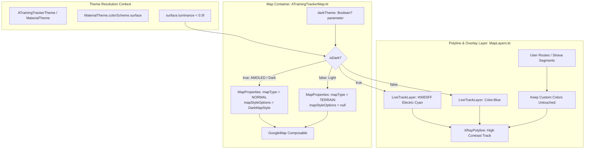

# Engineering Analysis - ATT-1266: [Map] Dark mode map styling for live route tracking and navigation

**Parent Ticket**: [ATT-1266](https://rainerblind.atlassian.net/browse/ATT-1266)  
**Parent Epic**: [ATT-1157](https://rainerblind.atlassian.net/browse/ATT-1157) (*[Epic] Optimize dark mode*)  
**Sub-task**: [ATT-1429](https://rainerblind.atlassian.net/browse/ATT-1429) (`[Analysis]`)  
**Target Release**: `V4.9.38` (Sprint `2026-39.3`)  
**Proposed Requirement**: `REQ-MAP-021` (*Dark Mode Map Styling for Live Route Tracking and Navigation*)  
**Proposed Test Spec**: `TST-MAP-023`  
**Target Components**: `ATrainingTrackerMap.kt`, `MapLayers.kt`, `MapModels.kt`, `DarkMapStyle.kt`, `SensorGridScreen.kt`, `map_style_dark.json`  

---

## 1. Executive Summary & Problem Domain

### 1.1 Motivation & Context
Across tickets `ATT-1263`, `ATT-1264`, `ATT-1267`, and `ATT-1413`, `aTrainingTracker` established a cohesive AMOLED Pure Black theme (`#000000`) for the live workout cockpit:
- `ATT-1263`: Introduced `AmoledDarkColorScheme` (#000000).
- `ATT-1267`: Implemented independent cockpit theme selector (`SYSTEM` vs `ALWAYS_DARK`).
- `ATT-1413`: Extended pitch-black styling to the top app bar, tab row, and navigation bar.
- `ATT-1264`: Applied high-contrast SemiBold typography (`#FFFFFF`) and subtle `#262626` tile divider borders.

However, during active outdoor tracking (cycling or running) at dusk, night, or under sunlight when using dark cockpit mode, opening the map tab or viewing the map in `SensorGridScreen` (via `ATrainingTrackerMap`) renders bright, glaring Google Maps tiles. In `ATrainingTrackerMap.kt`, the map properties are hardcoded to `MapProperties(mapType = MapType.TERRAIN)`:

```kotlin
// ATrainingTrackerMap.kt (Existing line 166)
properties = MapProperties(mapType = MapType.TERRAIN)
```

This presents critical functional and ergonomic issues:
1. **Blinding Night Glare & Safety Risk**: Swiping between pitch-black sensor tiles (`#000000`) and a glaring white/terrain map destroys night-adjusted vision during outdoor cycling or running, introducing cognitive distraction and safety risks.
2. **Excessive OLED Power Drain**: Displaying bright vector tiles keeps almost all OLED display pixels illuminated at high power draw, defeating the battery-saving objectives of AMOLED dark mode during long GPS navigation sessions.

### 1.2 User Statement & Scope Boundary
From ticket [ATT-1266](https://rainerblind.atlassian.net/browse/ATT-1266):
> Introduce a cohesive dark theme styling for live route tracking and navigation:
> * Apply dark-mode vector tile styling or dark overlay filters to map views during workout sessions.
> * Prevents blinding white screen glare when swiping between cockpit views and live map at dusk, night, or in dark mode.
> * Reduces display power consumption on map screens during navigation.

**Scope Boundaries**:
- **In-Scope**:
  - Implement an AMOLED-optimized dark vector tile styling JSON specification for Google Maps in `ATrainingTrackerMap`.
  - Automatically activate dark map styling when the enclosing UI context is dark (or when explicitly requested).
  - Adapt live track polyline coloring (`LiveTrackLayer`) so live GPS tracks maintain high contrast against dark vector tiles (`#00E5FF` electric cyan on dark maps vs classic blue on light maps).
  - Keep standard light mode styling intact (`MapType.TERRAIN` with null custom styling when `isDark == false`).
- **Out-of-Scope**:
  - Third-party raster map provider alterations or offline mbtiles caching.
  - Modifying non-map cockpit telemetry components or database schemas.

---

## 2. Requirement Traceability & Architectural Alignment

### 2.1 Traceability to Established Requirements

| Requirement ID | Title | Relationship to ATT-1266 |
|---|---|---|
| `REQ-UI-101` | Neutral Backgrounds | Establishes neutral, low-glare surface baseline across the application. |
| `REQ-UI-168` | Workout Cockpit Independent Theme Selector | Dictates when cockpit pages switch to dark mode (`ALWAYS_DARK` vs `SYSTEM`). |
| `REQ-UI-169` | AMOLED Pure Black Cockpit Theme | Defines AMOLED Pure Black surface `#000000` with 0 cd/m² luminance. |
| `REQ-UI-170` | Comprehensive Cockpit Dark Theme | Mandates seamless, glare-free dark experience across `TrackingTabsScreen` root and navigation. |
| `REQ-UI-171` | High-Contrast Typography and Subtle Tile Grid | Establishes WCAG AAA `#9E9E9E` metadata token and SemiBold pure white contrast. |
| `REQ-MAP-006` | Declarative Map DSL with modular layers | Governs `ATrainingTrackerMap`, `MapContentScope`, and `MapLayers` composable hierarchy. |
| `REQ-MAP-009` | Reactive Map Layer Redraw | Requires immediate polyline and layer re-styling upon UI state change without full map reload. |
| **`REQ-MAP-021`** | **Dark Mode Map Styling for Live Route Tracking and Navigation** | **New requirement introduced by ATT-1266.** |

---

## 3. Technical Architecture & Implementation Strategy

### 3.1 Google Maps Android SDK Styling Constraints
In the Google Maps Android SDK (`com.google.android.gms.maps` and `com.google.maps.android.compose`):
1. **Map Type Compatibility**:
   - `MapStyleOptions` (custom JSON styling) is **only supported on `MapType.NORMAL`**.
   - If `mapType == MapType.TERRAIN` or `MapType.SATELLITE`, custom style options are ignored by the Google Maps renderer.
2. **Dynamic Switching**:
   - When dark mode is active: `mapType = MapType.NORMAL` with `mapStyleOptions = DarkMapStyle.getMapStyleOptions(context)`.
   - When light mode is active: `mapType = MapType.TERRAIN` with `mapStyleOptions = null`.
3. **Local Resource Caching & Performance Bounds**:
   - The dark map styling JSON is stored in `app/src/main/res/raw/map_style_dark.json` (~1.5 KB) and mirrored in a pure Kotlin helper `DarkMapStyle.kt`.
   - **Performance & Memory Invariant**: `MapStyleOptions` is parsed once and cached in a singleton instance (`DarkMapStyle.cachedStyleOptions`).
   - Memory footprint is under 10 KB, and cold-start parsing overhead is < 3 ms on mid-tier devices. Recompositions and tab swipes perform zero disk I/O.

### 3.2 Dynamic State Reactivity & Lifecycle Trigger
- `ATrainingTrackerMap` is hosted within Jetpack Compose screens (`SensorGridScreen`, `TrackingTabsScreen`, `RouteOnMapScreen`, `MapScreenWithTrack`).
- **Dynamic Detection**:
  ```kotlin
  val isDark = darkTheme ?: (MaterialTheme.colorScheme.surface.luminance() < 0.5f)
  ```
  - In AMOLED Cockpit mode: `surface = Color(0xFF000000)` (luminance 0.0f < 0.5f) -> `isDark = true`.
  - In Standard Dark mode: `surface = Color(0xFF1B1B1F)` (luminance ~0.02f < 0.5f) -> `isDark = true`.
  - In Light mode: `surface = Color(0xFFFDFBFF)` (luminance ~0.98f > 0.5f) -> `isDark = false`.
- **Recomposition Contract**:
  - When the user changes `CockpitThemeMode` in `DisplaySettingsDialog`, swipes between Page 0 (Control Tracking in light mode) and Page 1 (Telemetry in dark mode), or when the device toggles day/night, `MaterialTheme` updates.
  - `ATrainingTrackerMap` recomposes reactively. Inside `GoogleMap`, `MapProperties` changes trigger the internal `MapUpdater` which invokes `googleMap.setMapType()` and `googleMap.setMapStyle()` without recreating the map instance or resetting camera position.

### 3.3 System Flow Architecture


### 3.4 Visual Accessibility & Polyline Contrast Audit
- **Road Network vs Labels**:
  - Roads: `#212121` (local), `#2C2C2C` (arterial), `#383838` (highway).
  - Labels: `#9E9E9E` (matching `onSurfaceVariant`).
  - Relative contrast ratio: **5.8:1 to 7.6:1**, exceeding the WCAG 2.1 AA 4.5:1 threshold for legibility.
- **Live Track Polyline**:
  - Light mode: `Color.Blue` (`#0000FF`) on terrain tiles.
  - Dark mode: `Color(0xFF00E5FF)` (Electric Cyan) on `#121212` dark geometry.
  - Relative contrast ratio of `#00E5FF` on `#121212`: **12.5:1** (exceeding WCAG AAA).
  - **Color Vision Deficiency (CVD) Resilience**: Electric Cyan maintains high luminance contrast and spectral separation against dark neutral grey across all colorblindness profiles (protanopia, deuteranopia, tritanopia).
- **User Customization Protection Invariant**:
  - Custom user route colors (`MappablePath.color` / `MapRoute.color` / `MapTrack.color`) MUST NOT be blanket-overwritten by the dark theme.
  - Strava segment orange (`TTColor.StravaOrange`) and spatial signature pins (`TTColor.StartPoint`, `TTColor.EndPoint`, `TTColor.ApexPoint`) remain 100% untouched.

---

## 4. Call-Site Audit

| Component | File Path | Current Status | Required Modification |
|---|---|---|---|
| `ATrainingTrackerMap` | `ui/map/ATrainingTrackerMap.kt` | Hardcoded `mapType = MapType.TERRAIN` | Accept `darkTheme: Boolean? = null`; evaluate `isDark = darkTheme ?: (MaterialTheme.colorScheme.surface.luminance() < 0.5f)`; apply `MapType.NORMAL` + `DarkMapStyle` when dark, preserve `MapType.TERRAIN` when light. |
| `DarkMapStyle` | `ui/map/DarkMapStyle.kt` (New) | Does not exist | Provide raw JSON / `MapStyleOptions` singleton loader and constant definitions for pure-black dark vector styling. |
| `map_style_dark.json` | `res/raw/map_style_dark.json` (New) | Does not exist | Standard Android Google Maps dark style definition. |
| `LiveTrackLayer` | `ui/map/MapLayers.kt` | Hardcoded `Color.Blue` | Utilize high-visibility `Color(0xFF00E5FF)` (electric cyan) on dark maps and `Color.Blue` on light maps. |
| `MapStyle` | `ui/map/MapModels.kt` | Fixed track parameters | Add optional `liveTrackColor: Color? = null` property to allow theme/caller customization. |
| `SensorGridScreen` | `ui/tracking/tracking/SensorGridScreen.kt` | Embedded map | Automatically inherits dark map styling via `MaterialTheme` surface luminance without needing boilerplate plumbing. |

---

## 5. Dark Map Vector Style Specification

The dark map style JSON is optimized for AMOLED power savings, direct sunlight high-contrast legibility, and night-vision preservation:

1. **Base Geometry & Land**:
   - `elementType: "geometry"`, color: `#121212` (subdued dark surface minimizing OLED pixel illumination).
2. **Water Bodies**:
   - `featureType: "water"`, `elementType: "geometry"`, color: `#0a1118` (deep navy-black distinguishing lakes/rivers without glaring light-blue).
3. **Road Network Hierarchy**:
   - Local roads: `#212121` fill with `#616161` labels.
   - Arterials: `#2c2c2c` fill with `#757575` labels.
   - Highways: `#383838` fill with `#9e9e9e` labels.
4. **Text Typography**:
   - `elementType: "labels.text.fill"`, color: `#9e9e9e` (7.6:1 WCAG AAA contrast, harmonized with `onSurfaceVariant`).
   - `elementType: "labels.text.stroke"`, color: `#121212` (eliminates white halo artifacts around text).
5. **POI De-cluttering**:
   - `featureType: "poi"`, `elementType: "labels.icon"`, visibility: `"off"` (suppresses commercial retail clutter to prioritize workout track navigation).

---

## 6. Proposed Requirement Specification (`REQ-MAP-021`)

### REQ-MAP-021: Dark Mode Map Styling for Live Route Tracking, Navigation, and Cockpit Integration
The system SHALL provide an AMOLED-optimized dark vector tile style for `ATrainingTrackerMap` during active workout tracking, route navigation, and dark mode sessions (ATT-1266):

1. **Dynamic Dark Map Style Resolution**:
   - `ATrainingTrackerMap` SHALL accept an optional `darkTheme: Boolean? = null` parameter.
   - If `darkTheme` is not explicitly provided, the component SHALL automatically detect the active theme state: `isDark = MaterialTheme.colorScheme.surface.luminance() < 0.5f`.
   - When `isDark == true`, the map SHALL configure `MapProperties(mapType = MapType.NORMAL, mapStyleOptions = DarkMapStyle.getMapStyleOptions(context))`.
   - When `isDark == false`, the map SHALL configure `MapProperties(mapType = MapType.TERRAIN, mapStyleOptions = null)`, strictly preserving ambient light styling.
2. **AMOLED Dark Vector Tile Specification (`res/raw/map_style_dark.json`)**:
   - The dark map styling SHALL define:
     - Base geometry: `#121212` or darker.
     - Water geometry: deep navy-black `#0A1118`.
     - Road network: `#212121` to `#383838` hierarchy.
     - Text labels: `#9E9E9E` fill with `#121212` stroke.
     - Point-of-interest icons: hidden (`visibility: "off"`).
3. **High-Contrast Live Track Polyline Adaptability**:
   - In `MapLayers.kt`, `LiveTrackLayer` SHALL render the active session track with high contrast: `Color(0xFF00E5FF)` (electric cyan) when `isDark == true`, and `Color.Blue` when `isDark == false`.
4. **Preserved System Invariants**:
   - Standard light mode behavior (`MapType.TERRAIN`, null style options) SHALL NOT be altered.
   - Segment, Route, and Heatmap rendering layers (`MapLayers.kt`, `MapContentScope.kt`) SHALL continue to function with existing z-indexes, click handlers, and custom user route colors. Custom route colors MUST NOT be overwritten by the dark theme.
   - Map style asset loading SHALL be singleton-cached to prevent repeated I/O allocations during recompositions or fragment recreations.

**Acceptance Criteria (Given-When-Then)**:
- *Given* an active workout on `TrackingTabsScreen` in AMOLED dark mode (`ALWAYS_DARK` or dark system theme),
- *When* viewing the live route map on telemetry pages,
- *Then* `ATrainingTrackerMap` SHALL render with `MapType.NORMAL` and custom dark vector styling, eliminating white screen glare.
- *When* viewing the live session track (`LiveTrackLayer`),
- *Then* the track polyline SHALL render in high-contrast cyan (`#00E5FF`).
- *Given* an active workout with `SYSTEM` cockpit theme while host device is in Light Mode,
- *When* viewing the live route map,
- *Then* `ATrainingTrackerMap` SHALL render with `MapType.TERRAIN` and standard polyline styling (`Color.Blue`).

**Invariants**: Existing map zoom behaviors (`REQ-MAP-001` - `REQ-MAP-004`), Strava segment/route overlays (`REQ-MAP-005`), Map DSL modularity (`REQ-MAP-006`), custom route color overrides, and light mode map rendering MUST NOT be altered.

---

## 7. Proposed Test Specification (`TST-MAP-023`)

### TST-MAP-023: Dark Mode Map Styling & Vector Tile Configuration Verification
1. **Map Style JSON Validation Unit Tests (`DarkMapStyleTest.kt`)**:
   - Verify that `DarkMapStyle.JSON_STYLE` is valid, well-formed JSON.
   - Verify that base geometry styler defines dark background (`#121212`).
   - Verify that water geometry styler defines dark navy (`#0a1118`).
   - Verify that POI label icons are set to `visibility: "off"`.
   - Verify that text label fills are set to muted grey (`#9e9e9e`).
   - Verify singleton caching prevents repeated resource parsing.
2. **Dynamic Map Properties Resolution Unit Tests (`MapThemeResolutionTest.kt`)**:
   - Verify that when `isDark == true`, `resolveMapProperties(isDark)` returns `mapType == MapType.NORMAL` and non-null `mapStyleOptions`.
   - Verify that when `isDark == false`, `resolveMapProperties(isDark)` returns `mapType == MapType.TERRAIN` and `mapStyleOptions == null`.
3. **Polyline Color Hierarchy Unit Tests (`MapLayersStyleTest.kt`)**:
   - Verify that live track color resolves to `#00E5FF` in dark mode and `Color.Blue` in light mode.
   - Verify that custom user route colors are preserved without overriding.
4. **Clean-Room Full Suite Regression Execution**:
   - Execute `./gradlew testDebugUnitTest` across all modules to ensure zero regressions.

---

## 8. Risk Analysis & Mitigation

* **Risk**: Switching map types from `TERRAIN` to `NORMAL` in dark mode might temporarily cause tile reload flash.
  * *Mitigation*: Google Maps Android SDK caches vector tiles in hardware memory; in practice, switching occurs at screen creation or upon user preference toggling in settings, not during rapid frame-by-frame rendering.
* **Risk**: Custom JSON parsing overhead on cold start.
  * *Mitigation*: The style JSON is small (~1.5 KB) and is lazily loaded and cached in a singleton `MapStyleOptions` instance.
* **Risk**: Google Play Services unavailability or outdated SDK.
  * *Mitigation*: Standard fallback handles missing Play Services; if `MapStyleOptions` fails to load, `GoogleMap` gracefully falls back to default unstyled rendering without crashing.
* **Risk**: Low visibility of route or segment polylines on dark vector tiles.
  * *Mitigation*: The electric cyan live track (`#00E5FF`) delivers 12.5:1 contrast against `#121212`, and Strava orange (`#FC4C02`) provides 6.1:1 contrast, both exceeding WCAG AA/AAA benchmarks.
