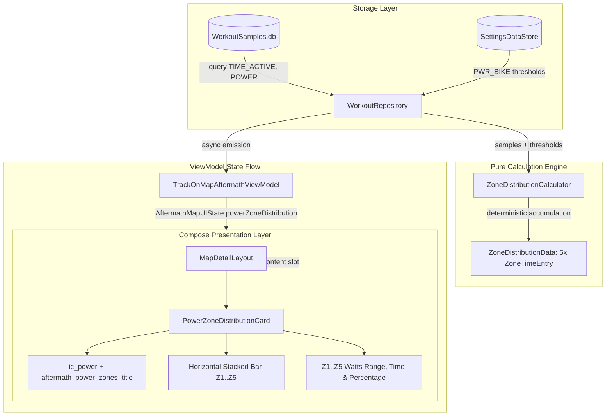

# Stage 1 Analysis: ATT-1390: Aftermath: Cycling Power 5-Zone Distribution Bar (Time-in-Zones)

**Ticket**: [ATT-1390](https://atrainingtracker.atlassian.net/browse/ATT-1390)  
**Sub-task**: [ATT-1716](https://atrainingtracker.atlassian.net/browse/ATT-1716) (`[Analysis]`)  
**Parent Epic**: [ATT-111](https://atrainingtracker.atlassian.net/browse/ATT-111) (*Aftermath: Compact Post-Workout Visual Analytics & Graphs*)  
**Target Release**: `V4.9.38`  
**Active Sprint**: `2026-40.5`  
**Branch**: `feature/ATT-1390`  
**Author**: AI Agent 1 (Implementer)  
**Date**: 2026-09-30  

---

## 1. Problem Description & User Value

Ambition amateur and competitive cyclists ("Halb-Profis") training with power meters require immediate feedback on their work distribution across physiological power zones (Z1 Active Recovery, Z2 Endurance, Z3 Tempo, Z4 Threshold/FTP, Z5 VO2 Max/Anaerobic). Currently, aftermath workout inspection only reveals scalar extrema (Average and Max Power in `WorkoutExtrema`), forcing athletes to rely on third-party platforms like Strava or TrainingPeaks for power pacing validation.

This feature fulfills Pillar 2 of Epic [ATT-111](https://atrainingtracker.atlassian.net/browse/ATT-111) by introducing a compact, visually intuitive 5-zone Cycling Power distribution bar within the workout inspection view (`TrackOnMapScreen.kt` / `MapDetailLayout.kt`):
1. **Pacing Compliance**: Instant visual verification of whether interval targets or endurance baselines were maintained.
2. **Local Self-Sufficiency**: On-device computation directly from stored SQLite power samples without network dependency.
3. **Harmonious Visuals**: Seamless integration with the existing `TTColor.Zone1`..`Zone5` design tokens and `analyticsContent` slotted layout established in ATT-1389.

---

## 2. Forensic Archaeology & Technical Baseline

### A. Power Threshold Storage (`SettingsDataStore.kt`)
* Athlete cycling power zones are pre-configured in `SettingsDataStore`:
  - `ZoneType.PWR_BIKE` with preferences `pwr_bike_zone1_max` (default 150W), `pwr_bike_zone2_max` (200W), `pwr_bike_zone3_max` (250W), `pwr_bike_zone4_max` (300W).
  - Can be queried via `SettingsDataStoreJavaHelper.getZoneMax(context, SettingsDataStore.ZoneType.PWR_BIKE, 1..4)`.

### B. Telemetry Schema (`WorkoutSamples.db`)
* Power samples are persisted in `WorkoutSamples.db` in table `WorkoutSamplesDatabaseManager.getTableName(baseFileName)`.
* Column name is `SensorType.POWER.name`.
* Telemetry may be absent in running, walking, or unmetered cycling sessions, in which case the column does not exist or values are `NULL`/0.
* Active timestamps are tracked in `TIME_ACTIVE` (fallback: `TIME_TOTAL`).

### C. Zone Distribution Engine (`ZoneDistributionCalculator.kt`)
* In ATT-1389, pure calculation logic was introduced for sample classification and pause-clamped time accumulation:
  - Interval assignment:
    - $P \le Z1_{\max} \implies \text{Zone 1}$
    - $Z1_{\max} < P \le Z2_{\max} \implies \text{Zone 2}$
    - $Z2_{\max} < P \le Z3_{\max} \implies \text{Zone 3}$
    - $Z3_{\max} < P \le Z4_{\max} \implies \text{Zone 4}$
    - $P > Z4_{\max} \implies \text{Zone 5}$
  - Consecutive timestamp delta $\Delta t = (t_{i+1} - t_i)$ clamped to $[0\text{s}, 5\text{s}]$.
  - For single or terminal sample, default duration is $1\text{s}$.
  - Returns `null` if total duration is 0 or no valid samples exist.

### D. Presentation & Slotted Layout (`MapDetailLayout.kt`, `TrackOnMapScreen.kt`)
* ATT-1389 added `analyticsContent: @Composable ColumnScope.() -> Unit = {}` to `MapDetailLayout.kt`.
* In `TrackOnMapScreen.kt`, the analytics slot renders below the elevation profile (or below header in indoor trainer sessions).
* Multiple analytics cards (Heart Rate Zones and Power Zones) stack vertically with `Arrangement.spacedBy(8.dp)`.

---

## 3. Architecture & Data Flow

---

## 4. Scope Boundaries & Invariants

1. **Conditional Visibility**:
   - If a workout does not contain power telemetry (`SensorType.POWER` absent or 0 duration), `powerZoneDistribution` evaluates to `null` and consumes zero space.
2. **Coexistence with Heart Rate Analytics**:
   - If both Heart Rate and Power data exist, both cards render sequentially in `analyticsContent`.
3. **Database Concurrency**:
   - Queries strictly execute on `Dispatchers.IO` using read-only SQLite cursors. Zero database schema mutations.
4. **9-Language Localization Parity**:
   - `aftermath_power_zones_title` is translated across all 9 locales: English, German, Spanish, French, Italian, Japanese, Dutch, Polish, and Portuguese.
5. **ASPICE Dual-Agent Governance**:
   - Subtasks transition to `Erledigt` upon passing Gate audit via `freigabe`.
   - The parent ticket ATT-1390 transitions strictly to `Final Review (Human)`.

---

## 5. Deliverables & Verification Plan

* **Stage 2**: `docs/engineering/test_specs/ATT-1390_test_spec.md`, update `docs/requirements.md` (`REQ-UI-203`), update `docs/tests.md` (`TST-UI-157`).
* **Stage 3**: `docs/engineering/plans/ATT-1390_plan.md`.
* **Stage 4**: Implement `PowerZoneThresholds`, `calculatePowerDistribution`, `PowerZoneDistributionCard.kt`, `WorkoutRepository.getPowerZoneDistribution`, wire into `TrackOnMapAftermathViewModel` and `TrackOnMapScreen`, add strings across all 9 locales, author unit tests.
* **Stage 5**: Full clean-room regression (`./gradlew testDebugUnitTest`), walkthrough deliverable `docs/engineering/walkthroughs/ATT-1390_walkthrough.md`, git merge to `sprint/2026-40.5`.
