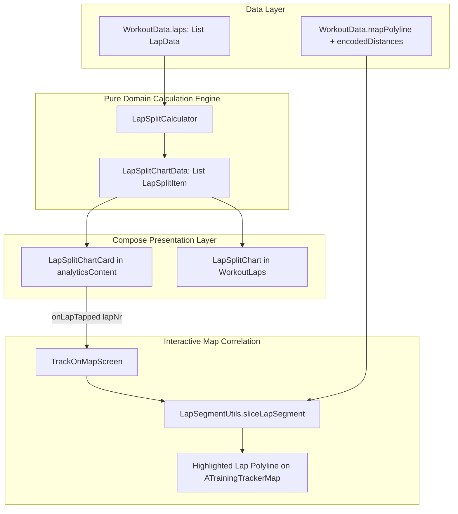

# Stage 1 Analysis: ATT-1392 - Aftermath: Compact Lap & Interval Split Chart

**Ticket**: [ATT-1392](https://atrainingtracker.atlassian.net/browse/ATT-1392)  
**Sub-task**: [ATT-1721](https://atrainingtracker.atlassian.net/browse/ATT-1721) (`[Analysis]`)  
**Parent Epic**: [ATT-111](https://atrainingtracker.atlassian.net/browse/ATT-111) (*Aftermath: Compact Post-Workout Visual Analytics & Graphs*)  
**Target Release**: `V4.9.38`  
**Active Sprint**: `2026-40.5`  
**Branch**: `feature/ATT-1392`  
**Author**: AI Agent 1 (Implementer)  
**Date**: 2026-09-30  

---

## 1. Problem Statement & Motivation

During interval workouts or longer endurance sessions with automatic or manual laps (e.g. 1km auto-laps, track repeats, or 5-minute threshold intervals), athletes want to quickly evaluate and compare their lap pace, duration, and intensity visually.

Currently:
1. **Numeric Table Only**: In Aftermath (`WorkoutSummary.kt`), laps are presented solely as a text-heavy table ([WorkoutLaps.kt](file:///home/rainer/AndroidStudioProjects/aTrainingTracker/app/src/main/java/com/atrainingtracker/trainingtracker/ui/components/workoutlaps/WorkoutLaps.kt)) showing Lap, Time, Distance, and Pace/Speed. While fastest (🐇) and slowest (🦔) badges exist, athletes cannot perceive split pacing trends, pacing decay, or interval consistency at a glance without reading through numeric rows.
2. **Missing Split Visualizer in Map Aftermath**: In the primary interactive map aftermath inspection view ([TrackOnMapScreen.kt](file:///home/rainer/AndroidStudioProjects/aTrainingTracker/app/src/main/java/com/atrainingtracker/trainingtracker/ui/aftermath/TrackOnMapScreen.kt) / [MapDetailLayout.kt](file:///home/rainer/AndroidStudioProjects/aTrainingTracker/app/src/main/java/com/atrainingtracker/trainingtracker/ui/map/MapDetailLayout.kt)), there is zero lap visibility in `analyticsContent`. Athletes see HR zones and Power zones, but have no way to inspect their split intervals or highlight individual laps on the map track.
3. **No Interactive Split-to-Track Correlation**: In the main map view, athletes cannot tap an interval bar to inspect where that interval occurred geographically on the route.

The goal of ATT-1392 is to deliver a compact, high-impact Lap & Interval Split Bar Chart component (`LapSplitChartCard.kt` / `LapSplitChart.kt`), complete with relative pace/speed scaling, 5-tier intensity color-coding, and interactive tap-to-highlight correlation on the map track.

---

## 2. Root Cause Analysis (Forensic Investigation & Architectural Gap Analysis)

### A. Data Availability & Schema Investigation
1. **Laps Table (`LapsDatabaseManager.java`)**:
   - `Laps.TABLE` records all valid workout laps:
     - `WORKOUT_ID`, `LAP_NR`, `TIME_START`, `TIME_TOTAL_s`, `DISTANCE_TOTAL_m`, `SPEED_AVERAGE_mps`, `NAME`, `DESCRIPTION`.
   - Data is pre-aggregated and batched in `WorkoutDataMapper.kt`: every `WorkoutData` instance already contains `laps: List<LapData>` ordered by `lapNr` ascending.
   - Zero database queries or migrations are required to access lap speed, time, distance, and custom names.

2. **Geographical Coordinate Slicing (`LapSegmentUtils.kt`)**:
   - `LapSegmentUtils.calculateLapDistanceRange(laps, targetLapNr)` calculates the exact cumulative start and end distance for any lap.
   - `LapSegmentUtils.sliceLapSegment(points, dists, startDistM, endDistM)` slices the workout polyline into the lap's geographical coordinates, including boundary anchor points for seamless rendering.
   - This utility is already battle-tested in `LapEditBottomSheet.kt`.

3. **Map DSL Integration (`MapContentScope.kt`)**:
   - `MapContentScope` provides `tracks(List<MapTrack>)` and `path(MappablePath)`.
   - `TrackOnMapScreen.kt` currently delegates map drawing via `mapContent = { tracks(filteredTracks); contextualPaths(segments); contextualPaths(routes); markers(markers) }`.
   - Adding a highlighted lap segment overlay (`selectedLapTrack: MapTrack`) when a lap is tapped can be accomplished with zero changes to the underlying map engine.

4. **Analytics Slot (`analyticsContent` in `MapDetailLayout.kt`)**:
   - `MapDetailLayout` exposes `analyticsContent: @Composable ColumnScope.() -> Unit = {}`.
   - `HeartRateZoneDistributionCard` and `PowerZoneDistributionCard` are stacked inside this slot.
   - Adding `LapSplitChartCard` to `analyticsContent` when `workoutData.laps.size >= 2` provides immediate visual closure directly below the zone bars.

---

## 3. User Scope Grounding (ATT-1250)

* **In-Scope Goals**:
  1. Define pure domain model `LapSplitItem` and `LapSplitChartData` in `ui/aftermath/splits/LapSplitModels.kt`.
  2. Implement pure calculation engine `LapSplitCalculator.kt` that normalizes relative split pace/speed across laps, identifies fastest/slowest splits, and computes 5-tier intensity color coding (`TTColor.Zone1`..`Zone5`).
  3. Create responsive, high-aesthetic Jetpack Compose component `LapSplitChart.kt` (horizontal proportional split bars with lap indices, distance/time, formatted speed/pace, and highlight states).
  4. Create `LapSplitChartCard.kt` featuring icon (`R.drawable.ic_lap_laps`), localized title (`R.string.aftermath_laps_splits_title`), lap count/distance summary, and interactive tap-to-select behavior.
  5. Integrate into `TrackOnMapScreen.kt`:
     - Render `LapSplitChartCard` in `analyticsContent` when `workoutData.laps.size >= 2`.
     - When a lap bar is tapped, highlight that lap's track segment on the map track with primary accent styling and start/stop markers. Tapping again clears the highlight.
  6. Integrate `LapSplitChart` into `WorkoutLaps.kt` above the numeric table rows when `laps.size >= 2`.
  7. Maintain 100% 9-language localization parity without placeholders.
  8. Full test coverage: unit tests for `LapSplitCalculatorTest.kt`, `LapSplitLocalizationTest.kt`, and clean-room full suite regression (`./gradlew testDebugUnitTest`).

* **Out-of-Scope Non-Goals (Scope Bounding)**:
  * No SQLite database schema migrations or additions to `Laps.db` or `WorkoutSamples.db`.
  * No editing of lap metrics or lap boundaries from this chart (existing `LapEditBottomSheet` handles lap renaming and notes).
  * No automated interval detection beyond recorded/imported laps.

---

## 4. Requirement Archaeology & Chesterton's Fence Audit

* **Requirement Status**: Net-new requirement only (`REQ-UI-204`).
* **Original Requirement ID & Target**: Net-new requirement `REQ-UI-204` (*Aftermath: Compact Lap & Interval Split Chart Architecture*), extending Epic `ATT-111` (*Compact Post-Workout Visual Analytics & Graphs*) and complementing `REQ-UI-202` (HR Zones) and `REQ-UI-203` (Power Zones).
* **Historical Origin & Commit Trace**: Ticket `ATT-1392`, Sprint `2026-40.5`.
* **Root Reason for Existing Formulation**: Previously, lap data was only available as a raw numeric table in `WorkoutSummary.kt`, with zero presence in `TrackOnMapScreen` / `MapDetailLayout` and zero interactive map track highlighting.
* **Preservation of Core Invariants**:
  - `MapDetailLayout` analytics slot contract remains completely unchanged.
  - Workouts with 0 or 1 lap cleanly evaluate to `null` and consume zero vertical space.
  - Slicing and bounds computation remain pure in-memory operations with zero disk IO.
  - Single-thread SQLite confinement and existing `WorkoutLaps` table behavior are fully preserved.

---

## 5. Architectural Strategy & High-Level Solution

### Technical Workflow:
1. **Mathematical Engine (`LapSplitCalculator.kt`)**:
   - Filters valid laps ($v > 0.001$ m/s).
   - Identifies $v_{\max}$ and $v_{\min}$.
   - For running (`bSportType == BSportType.RUN`), pace is formatted as $1.0/v$ (min/km or min/mi). For cycling/other, speed is formatted in km/h or mph.
   - Computes normalized ratio: $r_i = 0.25f + 0.75f \times \frac{v_i - v_{\min}}{v_{\max} - v_{\min}}$ (if $v_{\max} > v_{\min}$), else $1.0f$.
   - Maps normalized ratio to 5 intensity tiers matching `TTColor.Zone1` through `TTColor.Zone5`.
2. **Visual Components (`LapSplitChart.kt`, `LapSplitChartCard.kt`)**:
   - `LapSplitChart`: Horizontal bar visualizer. Each bar represents a lap with index badge, distance/time, filled bar with intensity color, and pace/speed text.
   - `LapSplitChartCard`: Material 3 card displaying header (`ic_lap_laps`, `aftermath_laps_splits_title`, lap count), the split chart, and selection state.
3. **Map Highlighting (`TrackOnMapScreen.kt`)**:
   - Holds `var selectedLapNr by rememberSaveable { mutableStateOf<Long?>(null) }`.
   - When `selectedLapNr != null`, slices the track points via `LapSegmentUtils` and adds a vibrant overlay track with start/stop markers.

---

## 6. System Invariants & Risk Assessment

* **Core Invariants**:
  1. Zero regression in existing workouts lacking laps ($N < 2$ laps $\implies$ card is hidden with zero layout impact).
  2. Single-thread database confinement: No queries on the UI thread.
  3. 100% 9-language localization parity across all supported locales without blank placeholders.
  4. Human Decision Gate governance: Subtask transitions strictly to `In Überprüfung` for independent auditor sign-off.
* **Risk Rating**: **LOW**. The underlying data (`WorkoutData.laps`) and map slicing utilities (`LapSegmentUtils`) are already verified and in active production use. The new component is self-contained and purely additive.
