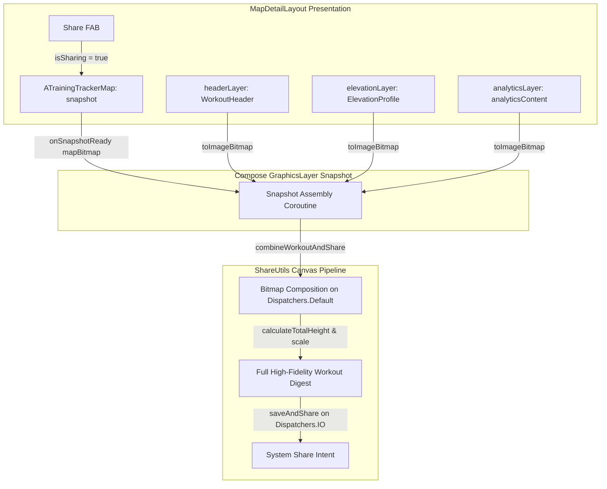

# Stage 1 Analysis: ATT-1393 - Aftermath: Enhanced Shareable Workout Snapshot with Zone Analytics

**Ticket**: [ATT-1393](https://atrainingtracker.atlassian.net/browse/ATT-1393)  
**Sub-task**: [ATT-1726](https://atrainingtracker.atlassian.net/browse/ATT-1726) (`[Analysis]`)  
**Parent Epic**: [ATT-111](https://atrainingtracker.atlassian.net/browse/ATT-111) (*Aftermath: Compact Post-Workout Visual Analytics & Graphs*)  
**Target Release**: `V4.9.38`  
**Active Sprint**: `2026-40.5`  
**Branch**: `feature/ATT-1393`  
**Author**: AI Agent 1 (Implementer)  
**Date**: 2026-09-30  

---

## 1. Problem Statement & Motivation

Athletes completing a workout frequently share their achievements with training partners, coaches, or social messaging groups. In `aTrainingTracker`, the sharing pipeline is handled by `combineWorkoutAndShare` in [ShareUtils.kt](file:///home/rainer/AndroidStudioProjects/aTrainingTracker/app/src/main/java/com/atrainingtracker/trainingtracker/helpers/ShareUtils.kt) and triggered via the Share FAB in [MapDetailLayout.kt](file:///home/rainer/AndroidStudioProjects/aTrainingTracker/app/src/main/java/com/atrainingtracker/trainingtracker/ui/map/MapDetailLayout.kt).

Currently, `combineWorkoutAndShare` stitches together:
1. `WorkoutHeader` (slotted header containing session title, date, duration, distance, and calories).
2. `ATrainingTrackerMap` (Google Map course polyline snapshot).
3. `ElevationProfile` (elevation profile graph with climb metrics).
4. `Branding Footer` (official app logo, name, and background styling).

With the successful completion of the Visual Analytics pillar in Epic ATT-111:
- `ATT-1389`: Heart Rate 5-Zone Distribution Bar (`HeartRateZoneDistributionCard`).
- `ATT-1390`: Cycling Power 5-Zone Distribution Bar (`PowerZoneDistributionCard`).
- `ATT-1392`: Compact Lap & Interval Split Chart (`LapSplitChartCard`).

These modern, informative cards are displayed within `analyticsContent` in [TrackOnMapScreen.kt](file:///home/rainer/AndroidStudioProjects/aTrainingTracker/app/src/main/java/com/atrainingtracker/trainingtracker/ui/aftermath/TrackOnMapScreen.kt) / [MapDetailLayout.kt](file:///home/rainer/AndroidStudioProjects/aTrainingTracker/app/src/main/java/com/atrainingtracker/trainingtracker/ui/map/MapDetailLayout.kt). However, when the athlete taps the Share button, `analyticsContent` is completely omitted from the generated snapshot. The resulting image misses the athlete's physiological effort (Heart Rate and Power training zones) and interval splits.

The goal of ATT-1393 is to capture the `analyticsContent` slot via Compose `GraphicsLayer` and integrate it into `combineWorkoutAndShare`, producing a comprehensive, professional workout digest in a single shareable image.

---

## 2. Root Cause Analysis (Forensic Investigation)

### Architectural Gap in Snapshot Assembly
1. **Graphics Layer Capture in `MapDetailLayout.kt`**:
   - `MapDetailLayout` records `headerLayer` around `header()` and `elevationLayer` around `ElevationProfile()`.
   - `analyticsContent` is rendered inside a `Surface` at the bottom of the layout, but is not wrapped in a `GraphicsLayer` and has no `rememberGraphicsLayer()` associated with it.
   - In `onSnapshotReady`, `MapDetailLayout` converts only `headerLayer` and `elevationLayer` to bitmaps:
     ```kotlin
     val hBmp = if (headerLayer.size.width > 0 && ...) headerLayer.toImageBitmap().asAndroidBitmap() else null
     val eBmp = if (elevationLayer.size.width > 0 && ...) elevationLayer.toImageBitmap().asAndroidBitmap() else null
     combineWorkoutAndShare(context, hBmp, mapBitmap, eBmp)
     ```
   - Consequently, `analyticsContent` is never converted to a bitmap.

2. **Bitmap Stitching in `ShareUtils.kt`**:
   - `combineWorkoutAndShare` accepts only `header: Bitmap?`, `map: Bitmap`, and `elevation: Bitmap?`.
   - The total canvas height is calculated strictly as:
     `totalHeight = (sHeader?.height ?: 0) + sMap.height + (sElevation?.height ?: 0) + footerHeight`
   - There is no parameter or canvas drawing routine to render analytics components beneath the elevation profile.

3. **Memory & Aspect Ratio Management**:
   - `totalWidth` is anchored to `map.width` (typically screen width, e.g. 1080px).
   - If the captured analytics layer has different horizontal padding or scaling, it must be proportionally scaled to match `totalWidth` so the card borders, typography, and zone bars align seamlessly with the header and elevation profile without pixel distortion or clipping.
   - Stacking 4 bitmaps (header + map + elevation + analytics + footer) in memory requires careful lifecycle handling and software bitmap conversion (`ensureSoftwareBitmap`) on `Dispatchers.Default` to avoid main-thread jank and OutOfMemory errors.

---

## 3. User Scope Grounding (ATT-1250)

* **In-Scope Goals**:
  1. Add `analyticsLayer` capture using Compose `GraphicsLayer` around `analyticsContent` in `MapDetailLayout.kt`.
  2. Extend `combineWorkoutAndShare` in `ShareUtils.kt` with an optional `analytics: Bitmap? = null` parameter (preserving 100% backward compatibility for other callers like `RouteOnMapScreen` and `SegmentOnMapScreen`).
  3. Proportionally scale and stack the analytics bitmap below the elevation profile and above the branding footer in the canvas drawing pipeline.
  4. Ensure graceful degradation: if `analyticsContent` is empty or null (e.g. sessions without HR/Power zones or laps), the snapshot height and layout seamlessly collapse without empty white space or placeholders.
  5. Provide pure mathematical layout calculation helpers (`WorkoutSnapshotLayoutCalculator`) to facilitate unit testing of canvas height, offsets, and scaling.

* **Out-of-Scope Non-Goals (Scope Bounding)**:
  1. Redesigning `WorkoutHeader` or `ATrainingTrackerMap` snapshot rendering.
  2. Direct social media API integration (e.g., automated Instagram Stories or Strava Activity uploaders).
  3. Modifying `RouteOnMapScreen` or `SegmentOnMapScreen` sharing flows (which do not have zone analytics).

---

## 4. Requirement Archaeology & Chesterton's Fence Audit

* **Original Requirement ID & Target**: Net-new requirement (`REQ-UI-205`), completing Epic `ATT-111` (*Compact Post-Workout Visual Analytics & Graphs*).
* **Historical Origin & Commit Trace**: Ticket `ATT-1393`, Sprint `2026-40.5`.
* **Root Reason for Existing Formulation**: `combineWorkoutAndShare` was originally designed in `ATT-1472` (`REQ-UI-177`) to stitch only Header, Map, and Elevation profile, as zone distribution bars and lap split charts did not yet exist.
* **Preservation of Core Invariants**:
  - Existing callers of `combineWorkoutAndShare` (such as `RouteOnMapScreen` and `SegmentOnMapScreen`) continue to function without changes via default argument `analytics: Bitmap? = null`.
  - Dark mode and light mode color token resolution (`ShareThemeResolver`) remains intact.
  - File saving and system sharing intent via `FileProvider` remain unchanged.
  - Zero memory leaks or main thread blocking: heavy bitmap allocation remains strictly on `Dispatchers.Default` and `Dispatchers.IO`.

---

## 5. Architectural Strategy & High-Level Solution



### Key Architectural Decisions:
1. **`rememberGraphicsLayer()` in `MapDetailLayout`**:
   - Instantiate `val analyticsLayer = rememberGraphicsLayer()`.
   - Wrap `Surface(analyticsContent)` with `Modifier.drawWithContent { analyticsLayer.record { this@drawWithContent.drawContent() }; drawLayer(analyticsLayer) }`.
2. **Safe Bitmap Extraction**:
   - In `onSnapshotReady`, check `if (analyticsLayer.size.width > 0 && analyticsLayer.size.height > 0)` before converting to Android Bitmap, handling empty or invisible analytics cleanly.
3. **Canvas Drawing & Scaling**:
   - `sAnalytics` is scaled to match `totalWidth` if necessary, maintaining aspect ratio.
   - Drawn at `currentY` immediately after `sElevation` and before `drawFooter`.
4. **Pure Layout Engine (`WorkoutSnapshotLayoutCalculator.kt`)**:
   - Computes total height, section offsets, and scale factors.
   - Enables exhaustive, fast JVM unit testing.

---

## 6. System Invariants & Risk Assessment

* **Core Invariants**:
  1. Backward compatibility: `combineWorkoutAndShare(context, hBmp, mapBitmap, eBmp)` continues to work for 4-argument callers.
  2. Memory efficiency: Bitmaps are hardware-to-software converted safely, canvas drawn, and saved directly to cache with zero leaks.
  3. Parent ticket Human Decision Gate strictly enforced.
* **Risk Rating**: **LOW**
  - The changes are strictly additive and decoupled from active workout recording and database transactions.
