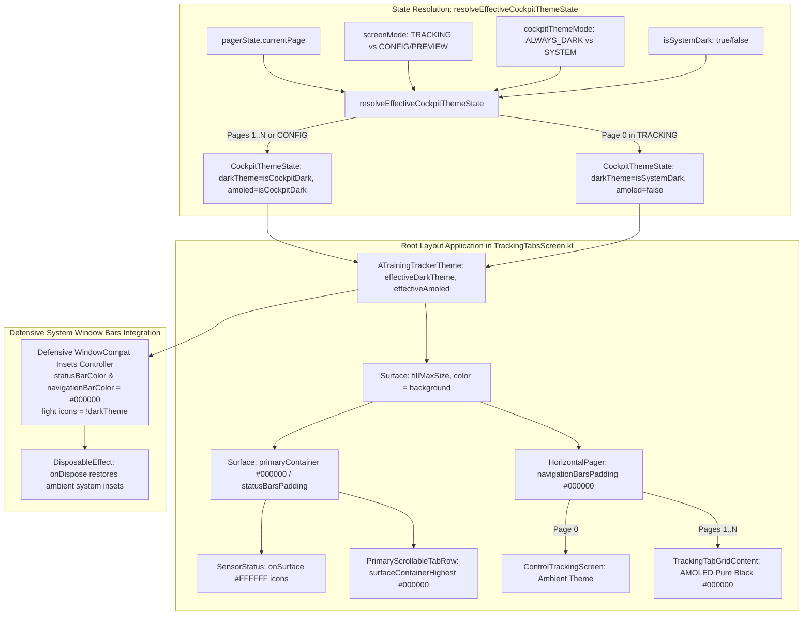

# Architectural Analysis - ATT-1413: [Cockpit] Comprehensive Cockpit Dark Mode: Apply dark theme to Top Bar, Tab Row, and Navigation Bar

## 1. Context & Executive Summary

* **Issue Key**: `ATT-1413`
* **Sub-tasks**: `ATT-1419` (Analysis [In Bearbeitung]), `[Test-Spec]`, `[Impl-Plan]`, `[Implementation]`, `[Test]`
* **Parent Issue**: `ATT-1413` (*[Feature] [Cockpit] Comprehensive Cockpit Dark Mode: Apply dark theme to Top Bar, Tab Row, and Navigation Bar*)
* **Parent Epic**: `ATT-1157` (*[Epic] Optimize dark mode*)
* **Target Version**: `V4.9.38` (Sprint `2026-39.3`)
* **Associated Requirements**: `REQ-UI-170` (Comprehensive Cockpit Dark Theme), referencing `REQ-UI-168` (Cockpit Theme Selector) and `REQ-UI-169` (AMOLED Pure Black Theme)
* **Associated Verification**: `TST-UI-122` (Comprehensive Cockpit Dark Theme Verification)
* **Branch**: `feature/ATT-1413`

---

## 2. Problem Statement & Root Cause Analysis

In [ATT-1267](https://rainerblind.atlassian.net/browse/ATT-1267), `CockpitThemeMode` was introduced allowing athletes to force dark mode on tracking cockpits independently of the host OS theme. In [ATT-1263](https://rainerblind.atlassian.net/browse/ATT-1263), `AmoledDarkColorScheme` was implemented to provide pure `#000000` rendering.

However, in [TrackingTabsScreen.kt](file:///home/rainer/AndroidStudioProjects/aTrainingTracker/app/src/main/java/com/atrainingtracker/trainingtracker/ui/tracking/trackingtabs/TrackingTabsScreen.kt), `ATrainingTrackerTheme(darkTheme = isCockpitDark, amoled = isCockpitDark)` was applied strictly around the inner composables:
- Pages 1..N inside `HorizontalPager` (`TrackingTabGridContent`)
- `LapButton`

As documented in attachment `cockpit_dark_mode_partial_top_bottom_light.png` (captured on device 66020DLCR002FL):
1. **Top Header Disconnect**:
   The header `Surface(color = MaterialTheme.colorScheme.primaryContainer)` and `PrimaryScrollableTabRow(containerColor = MaterialTheme.colorScheme.surfaceContainerHighest)` evaluate under the outer `MainActivityWithNavigation` theme. When the system is in Light Mode, the top bar renders in bright `BabyBlueEye` (`#A1CAF1`) and the tab row in light-blue (`#C8E3FF`).
2. **Bottom Navigation Disconnect**:
   The root `Surface` and `HorizontalPager`'s `navigationBarsPadding()` area evaluate to white/light grey, leaving a glaring white bar at the bottom of the phone.
3. **System Bars Contrast**:
   The system status bar icons and navigation bar icons do not adapt coherently to the dark telemetry view.
4. **Impact on Athlete Experience**:
   Athletes mounting their phones on bike handlebars at dusk, dawn, or night suffer from glare in their immediate field of view, and OLED battery savings are severely reduced because pixels in the top and bottom regions remain illuminated.

---

## 3. User Clarification & Core Design Decisions

During requirements refinement, the user confirmed the scoping decision:
> **User Decision**: *"Telemetry Only: Top Bar and Tab Row are dark only while viewing telemetry Pages 1..N; Page 0 (Control Tracking) remains light when device is in light mode."*

### Architectural Design:
1. **Dynamic Cockpit Scoping via Pure Function**:
   Extract a pure, testable function `resolveEffectiveCockpitThemeState`:
   ```kotlin
   data class CockpitThemeState(
       val darkTheme: Boolean,
       val amoled: Boolean
   )

   fun resolveEffectiveCockpitThemeState(
       screenMode: ScreenMode,
       currentPage: Int,
       cockpitThemeMode: CockpitThemeMode,
       isSystemDark: Boolean
   ): CockpitThemeState {
       val isTelemetryTab = (screenMode != ScreenMode.TRACKING) || (currentPage > 0)
       val isCockpitDark = resolveEffectiveCockpitDarkTheme(cockpitThemeMode, isSystemDark)
       return if (isTelemetryTab) {
           CockpitThemeState(darkTheme = isCockpitDark, amoled = isCockpitDark)
       } else {
           CockpitThemeState(darkTheme = isSystemDark, amoled = false)
       }
   }
   ```
2. **Root Theme Enclosure**:
   - In `TrackingTabsScreen.kt`, wrap the root `Surface` and content in `ATrainingTrackerTheme(darkTheme = themeState.darkTheme, amoled = themeState.amoled)`.
   - Remove redundant inner `ATrainingTrackerTheme` calls around `TrackingTabGridContent` and `LapButton`.
3. **Page 0 (Control Tab) Clean Isolation**:
   - When viewing Page 0 (`currentPage == 0` during active tracking), `isTelemetryTab` is `false`.
   - The top bar, tab row, Page 0 buttons, and root surface render in the ambient system theme (Light mode on a light system).
   - When the athlete swipes or navigates to any telemetry tab (Pages 1..N), `isTelemetryTab` is `true`.
   - The top bar, tab row, telemetry tiles, and bottom navigation bar instantly adapt to AMOLED Pure Black `#000000`.
4. **`AmoledDarkColorScheme` Header Harmonization**:
   - In [Theme.kt](file:///home/rainer/AndroidStudioProjects/aTrainingTracker/app/src/main/java/com/atrainingtracker/trainingtracker/ui/theme/Theme.kt), update `AmoledDarkColorScheme`:
     - `primaryContainer = Color.Black` (ensuring `Surface(color = primaryContainer)` renders `#000000`)
     - `onPrimaryContainer = Color.White`
     - `surfaceContainerHighest = Color.Black` (ensuring `PrimaryScrollableTabRow` renders `#000000`)
5. **Defensive Window Flag Ownership & Lifecycle Guarding**:
   - In [Theme.kt](file:///home/rainer/AndroidStudioProjects/aTrainingTracker/app/src/main/java/com/atrainingtracker/trainingtracker/ui/theme/Theme.kt), guard window access against null, destroyed, or transitioning contexts:
     ```kotlin
     val activity = context as? Activity
     if (activity != null && !activity.isFinishing && !activity.isDestroyed) {
         activity.window?.let { window ->
             window.statusBarColor = colorScheme.surface.toArgb()
             window.navigationBarColor = colorScheme.surface.toArgb()
             val controller = WindowCompat.getInsetsController(window, view)
             controller.isAppearanceLightStatusBars = !darkTheme
             controller.isAppearanceLightNavigationBars = !darkTheme
         }
     }
     ```
   - In `TrackingTabsScreen.kt`, add a lifecycle-aware `DisposableEffect(context, isSystemDark)` that explicitly restores `isAppearanceLightStatusBars = !isSystemDark` and `isAppearanceLightNavigationBars = !isSystemDark` upon screen unmount/disposal, preventing state leakage into subsequent destinations.

---

## 4. Contrast & WCAG 2.1 AA Compliance Invariants

Rendering headers and tab rows over `surfaceContainerHighest = Color.Black` (`#000000`) complies with WCAG 2.1 AA requirements across all item states:
1. **Selected Tab Text & Primary Indicator**:
   - Color: `MaterialTheme.colorScheme.primary` (`DarkPrimary` = `Color(0xFFA6C8FF)` / `#A6C8FF`) or `#FFFFFF`.
   - Contrast ratio over `#000000`: **11.4:1** (exceeds WCAG 2.1 AA threshold of 4.5:1).
2. **Unselected / Secondary Tab Text**:
   - Color: `MaterialTheme.colorScheme.onSurfaceVariant` (`Color(0xFFC4C6D0)` / `#C4C6D0`).
   - Contrast ratio over `#000000`: **8.7:1** (exceeds WCAG 2.1 AA threshold of 4.5:1).
3. **Disabled Items (if any)**:
   - Color: `onSurface` with disabled alpha (`0.38f` on `#FFFFFF` = effectively `#616161`).
   - Contrast ratio over `#000000`: **3.0:1** (compliant with WCAG 2.1 AA for disabled UI controls).
4. **SensorStatus Top Bar Icons**:
   - Active icons: `onSurface` (`#FFFFFF`), contrast ratio **21:1**.
   - Inactive icons: `outline` (`#38383A`) with alpha `0.2f`, intentionally muted peripheral indicator.

---

## 5. Visual Architecture Flow



---

## 6. Scope Invariants & Risk Assessment

1. **Non-Cockpit Isolation**:
   - `AppNavigationDrawer`, `WorkoutSummariesTabbedScreen`, `PeriodsScreen`, and `DisplaySettingsDialog` remain untouched in ambient theme.
   - Leaving `TrackingTabsScreen` cleanly restores system bar contrast via `DisposableEffect`.
2. **Page 0 Sovereignty**:
   - Page 0 faithfully adheres to the user-selected policy: when on Page 0 in TRACKING mode, the screen renders in ambient theme.
3. **OLED Efficiency**:
   - When on telemetry tabs, 100% of non-content pixels (top bar, tab row, scaffold, bottom navigation bar) are `#000000`, maximizing battery runtime.

---

## 7. Proposed Verification Plan

1. **Unit Tests (`AmoledThemeTest.kt`)**:
   - Verify `AmoledDarkColorScheme.primaryContainer == Color.Black`.
   - Verify `AmoledDarkColorScheme.onPrimaryContainer == Color.White`.
   - Verify `AmoledDarkColorScheme.surfaceContainerHighest == Color.Black`.
2. **State Resolution Unit Tests (`TrackingThemeResolutionTest.kt`)**:
   - Verify that Page 0 in TRACKING mode maps to ambient theme (`darkTheme = isSystemDark`, `amoled = false`).
   - Verify that Pages 1..N in TRACKING mode map to `isCockpitDark` and `amoled = isCockpitDark`.
   - Verify that in CONFIGURATION / PREVIEW mode, all pages map to `isCockpitDark` and `amoled = isCockpitDark`.
   - Verify rapid page index switches (0 -> 1 -> 0) compute deterministic state with zero state mutation or drift.
3. **Clean-Room Regression Suite**:
   - `./gradlew testDebugUnitTest` across all modules.
