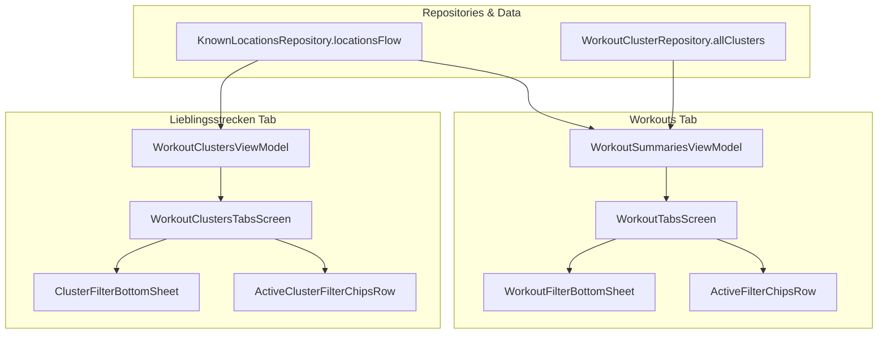

# Stage 1 Analysis: ATT-1593 - Selection of Lieblingsorte & Lieblingsstrecken in Filter Dialogs

**Ticket**: [ATT-1593](https://atrainingtracker.atlassian.net/browse/ATT-1593)  
**Sub-task**: [ATT-1601](https://atrainingtracker.atlassian.net/browse/ATT-1601) (`[Analysis]`)  
**Parent Epic**: [ATT-1396](https://atrainingtracker.atlassian.net/browse/ATT-1396) (*Lieblingsorte: Visible Value, Auto-Naming & Tracking Integration*)  
**Target Release**: `V4.9.38`  
**Active Sprint**: `2026-40.4`  
**Branch**: `feature/ATT-1593`  
**Author**: AI Agent 1 (Implementer)  
**Date**: 2026-09-29  

---

## 1. Problem Statement & Motivation

Athletes frequently need to filter their workouts and favorite tracks (clusters) by spatial context (where a session started, e.g. "Zuhause", "Büro", "Ferienhaus") and route identity (which recurring cluster family a workout belongs to).

Currently:
1. **Workouts Tab Filter Sheet (`WorkoutFilterBottomSheet.kt`)**:
   - While `WorkoutFilterCriteria` possesses spatial start location properties (`startLocationLat`, `startLocationLng`, `startLocationRadiusM`) introduced for 1-tap card drill-down in `ATT-1401`, the `WorkoutFilterBottomSheet` layout does not present a section to select favorite start locations (*Lieblingsorte*).
   - Athletes cannot filter workouts by favorite route (*Lieblingsstrecken* / clusters): `WorkoutFilterCriteria` lacks `clusterId` and `clusterName` filter dimensions, and the sheet provides no chip selection for available clusters.
   - When `WorkoutFilterBottomSheet` is applied, `startLocation` is not preserved in `onApply` or `onClearAll`.
2. **Lieblingsstrecken Tab Filter Sheet (`ClusterFilterBottomSheet.kt`)**:
   - While `ClusterFilterCriteria` supports spatial geofence matching via `startLocationLat`, `startLocationLng`, and `startLocationRadiusM` (introduced in `ATT-1402`), `ClusterFilterBottomSheet` provides no UI section or chips to select available *Lieblingsorte*.
   - `ActiveClusterFilterChipsRow.kt` lacks a chip representation for active start location filters, preventing visual feedback and 1-tap dismissal on the cluster list.

This creates an inconsistent experience where spatial and cluster filtering works when navigated via drill-down cards, but cannot be configured, viewed, or combined within the primary filter dialogs.

---

## 2. Root Cause Analysis (Forensic Investigation & Gap Analysis)

A forensic investigation of the filtering pipelines in `app/src/main/java/com/atrainingtracker/trainingtracker/` reveals the following architectural gaps:

### 2.1 Gap in Workout Filter Domain & Persistence (`WorkoutFilterCriteria.kt`)
* `WorkoutFilterCriteria` currently tracks: `query`, `year`, `month`, `startDateS`, `endDateS`, `sportTypeId`, `equipmentId`, `isCommute`, `isTrainer`, `hasGpsTrack`, `minDistanceMeters`, `maxDistanceMeters`, `minDurationSec`, `maxDurationSec`, and `startLocation*`.
* **Missing Dimension**: `clusterId: Long? = null` and `clusterName: String? = null`.
* Although `WorkoutData` contains `val clusterId: Long = -1` and `val clusterName: String? = null`, `WorkoutFilterCriteria.matches(workout: WorkoutData)` does not evaluate `clusterId`.
* `toJson()` and `fromJson()` do not serialize/deserialize `clusterId` or `clusterName`, preventing DataStore persistence of route cluster filtering.
* `activeFilterCount` does not count `clusterId`.

### 2.2 Gap in Workout Filter Bottom Sheet UI (`WorkoutFilterBottomSheet.kt`)
* `WorkoutFilterBottomSheet` takes `criteria`, `allWorkouts`, `onApplyCriteria`, `onClearAll`, `onDismissRequest`, and `activeBSportType`.
* It lacks access to `knownLocations: List<KnownLocationItem>` and `availableClusters: List<WorkoutCluster>`.
* It lacks local state variables for `localStartLocation` and `localClusterId`.
* In `onApply`, `updated = criteria.copy(...)` does not pass `startLocation*` or `cluster*`, inadvertently wiping any start location filter previously set by card drill-down!
* In `onClearAll`, local location and cluster states are not reset.

### 2.3 Gap in Cluster Filter Bottom Sheet UI (`ClusterFilterBottomSheet.kt`)
* `ClusterFilterCriteria` already possesses `startLocationName`, `startLocationLat`, `startLocationLng`, `startLocationRadiusM`, and evaluates geodetic distance in `matches(cluster: WorkoutCluster)`.
* However, `ClusterFilterBottomSheet` only exposes controls for `query`, `availableEquipment`, `minDistanceMeters`, and `minHitCount`.
* It lacks parameter `knownLocations: List<KnownLocationItem>`, lacks local state for `startLocation*`, and omits a "Lieblingsorte" selection section.

### 2.4 Gap in Active Filter Chips Presentation
* **Workout List (`ActiveFilterChipsRow.kt`)**: Displays `startLocation` chip (`"📍 ${name}"`), but does not support a cluster chip for `clusterId` / `clusterName`.
* **Cluster List (`ActiveClusterFilterChipsRow.kt`)**: Displays chips for query, equipment, distance, and hit count, but completely lacks a chip for `startLocationName` and lacks callback `onRemoveStartLocation`.

---

## 3. User Scope Grounding (ATT-1250)

* **In-Scope Goals**:
  1. **WorkoutFilterCriteria Extension**:
     - Add `clusterId: Long? = null` and `clusterName: String? = null`.
     - Update `matches(workout: WorkoutData)` to enforce `if (clusterId != null && workout.clusterId != clusterId) return false`.
     - Update `activeFilterCount` to include `clusterId`.
     - Update `toJson()` and `fromJson()` to losslessly persist `clusterId` and `clusterName`.
  2. **WorkoutFilterBottomSheet UI Enhancement**:
     - Add parameters `knownLocations: List<KnownLocationItem> = emptyList()` and `availableClusters: List<WorkoutCluster> = emptyList()`.
     - Render a "Lieblingsorte" (*Favorite Locations*) section with `FilterChip` items for available known locations (single-selection toggle).
     - Render a "Lieblingsstrecken" (*Favorite Routes / Clusters*) section with `FilterChip` items for available clusters (single-selection toggle).
     - Preserve and update `startLocation*` and `cluster*` criteria in `onApply` and reset in `onClearAll`.
  3. **ClusterFilterBottomSheet UI Enhancement**:
     - Add parameter `knownLocations: List<KnownLocationItem> = emptyList()`.
     - Render a "Lieblingsorte" (*Favorite Locations*) section with `FilterChip` items for available known locations (single-selection toggle).
     - Update `startLocation*` criteria in `onApply` and reset in `onClearAll`.
  4. **Active Filter Chips Rows**:
     - In `ActiveFilterChipsRow.kt` (workouts), add removable cluster chip (`"🗺️ ${clusterName}"`) with `onRemoveCluster` callback.
     - In `ActiveClusterFilterChipsRow.kt` (clusters), add removable location chip (`"📍 ${startLocationName}"`) with `onRemoveStartLocation` callback.
  5. **Screen & ViewModel Data Hoisting**:
     - Connect `KnownLocationsRepository.locationsFlow` and `WorkoutClusterRepository.allClusters` into `WorkoutSummariesViewModel` / `WorkoutSummariesTabbedScreen` / `WorkoutTabsScreen` and `WorkoutClustersViewModel` / `WorkoutClustersTabsScreen`.
  6. **100% 9-Language Localization Parity**:
     - Reuse established strings `known_locations_title` ("Lieblingsorte" / "Favorite Locations"), `my_locations` ("Lieblingsstrecken" / "Favorite Tracks"), and `filter_start_location` ("Startort" / "Start Location") across all 9 locales.

* **Out-of-Scope Non-Goals (Scope Bounding)**:
  1. Modifying clustering algorithms, epsilon parameters, or centroid calculations in `WorkoutClusterEngine.kt`.
  2. Modifying SQLite schemas in `KnownLocationsDatabaseManager.kt` or `WorkoutClusterDatabaseManager.kt`.
  3. Altering route list (`RouteFilterBottomSheet.kt`) or segment list (`SegmentFilterBottomSheet.kt`) filtering pipelines.

---

## 4. Requirement Archaeology & Chesterton's Fence Audit (REQ-PRO-022)

* **Original Requirement ID & Target**: `REQ-UI-187` (*Selection of Lieblingsorte and Lieblingsstrecken in Workout and Cluster Filter Dialogs*), enhancing and complementing `REQ-UI-185` (*Lieblingsorte: Drill-Down Filter to View Workouts by Starting Location*) and `REQ-UI-186` (*Lieblingsorte & Lieblingsstrecken Bridge*).
* **Historical Origin & Commit Trace**:
  - `REQ-UI-185` was introduced in `ATT-1401` (commit `6bfbcfc7`) to enable 1-tap navigation from `KnownLocationsScreen` cards to filtered workouts.
  - `REQ-UI-186` was introduced in `ATT-1402` (commit `91acde33`) to provide location seeding and associate route clusters with departure locations.
* **Root Reason for Existing Formulation**:
  - In `ATT-1401` and `ATT-1402`, the focus was establishing the underlying spatial distance matching predicates (`WorkoutFilterCriteria` and `ClusterFilterCriteria`) and card drill-down affordances. Direct interactive chip selection inside the modal bottom sheets was deferred to keep the initial bridge tickets atomic.
* **Preservation of Core Invariants**:
  - The geofence radius check (`WorkoutClusterEngine.distanceBetween(start, center) <= radius`) remains identical.
  - 1-tap drill-down navigation from `KnownLocationsScreen` cards continues to work seamlessly and will now also reflect properly if the user subsequently opens `WorkoutFilterBottomSheet`.
  - JSON backward compatibility is strictly maintained: new fields `clusterId` and `clusterName` default to `null`, ensuring older persisted filter JSON strings parse cleanly without crashes.
  - All existing filter dimensions (query, date, sport, equipment, commute, trainer, GPS, distance, duration) remain completely intact.

---

## 5. Architectural Strategy & High-Level Solution

1. **State Hoisting**:
   - `WorkoutSummariesViewModel` exposes `knownLocations: StateFlow<List<KnownLocationItem>>` and `availableClusters: StateFlow<List<WorkoutCluster>>`.
   - `WorkoutClustersViewModel` exposes `knownLocations: StateFlow<List<KnownLocationItem>>`.
2. **Sheet Controls**:
   - `WorkoutFilterBottomSheet` adds a `FlowRow` of `FilterChip`s for `knownLocations` and `availableClusters`. Selecting a chip sets the corresponding filter criteria; tapping an already selected chip deselects it.
   - `ClusterFilterBottomSheet` adds a `FlowRow` of `FilterChip`s for `knownLocations`. Selecting sets `startLocationLat`, `startLocationLng`, `startLocationName`, `startLocationRadiusM`.
3. **Chip Dismissal**:
   - In both screens, tapping the 'X' on a location or cluster chip clears the specific filter dimension via ViewModel `updateFilterCriteria`.

---

## 6. System Invariants & Risk Assessment

* **Core Invariants**:
  1. *Zero Regressions*: Existing multi-criteria filtering (query, year, sport, equipment, distance, duration) must maintain 100% test pass rate.
  2. *DataStore Backward Compatibility*: Deserialization of existing stored filter JSON strings must produce valid `WorkoutFilterCriteria` and `ClusterFilterCriteria` without exceptions.
  3. *Thread Safety*: All location and cluster queries remain on background dispatchers (`KnownLocationsDB-Thread` / `WorkoutClusterDB-Thread`).
  4. *Parent Gate Invariance*: Parent ticket `ATT-1593` completion remains reserved for the human user.
* **Risk Rating**: **LOW**
  - Justification: Additive Compose UI controls and domain criteria fields with default values; no SQLite schema mutations or background service modifications.
