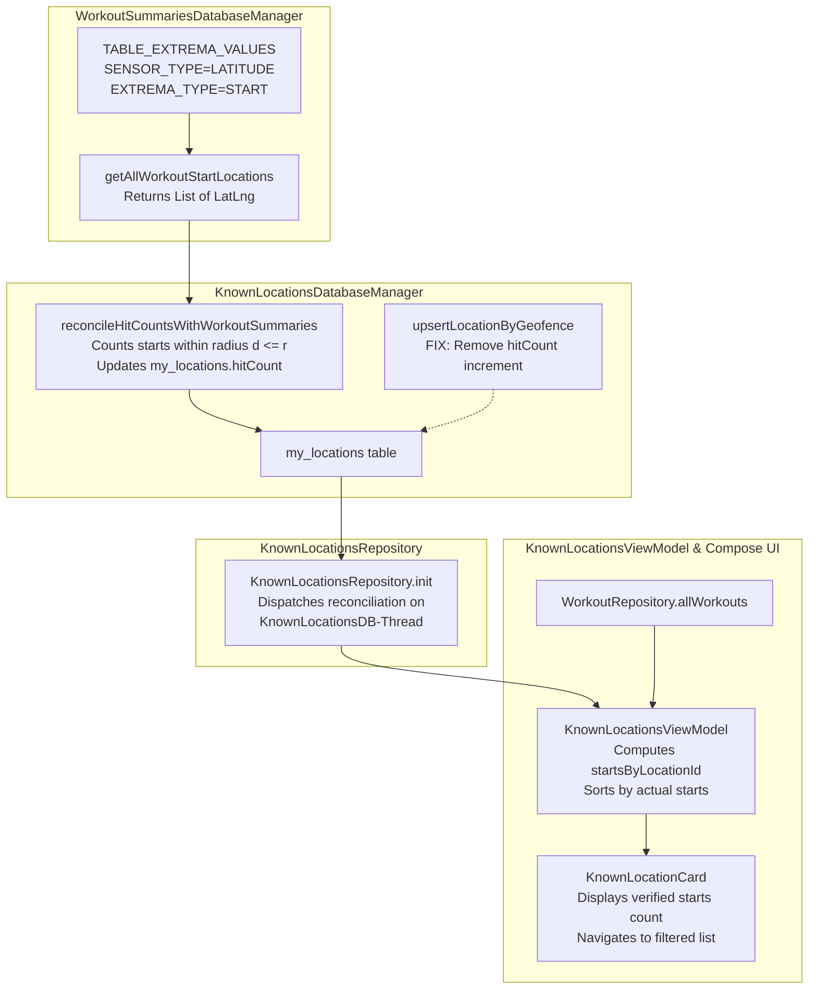

# Stage 1 Analysis: ATT-1734 - [Bug] [Lieblingsorte] Number of recorded starts on KnownLocationCard differs significantly from actual workout count

**Ticket**: [ATT-1734](https://rainerblind.atlassian.net/browse/ATT-1734)  
**Sub-task**: [ATT-1780](https://rainerblind.atlassian.net/browse/ATT-1780) (`[Analysis]`)  
**Parent Epic**: [ATT-1396](https://rainerblind.atlassian.net/browse/ATT-1396) (*Lieblingsorte: Visible Value, Auto-Naming & Tracking Integration*)  
**Target Release**: `V4.9.38`  
**Active Sprint**: `2026-40.6`  
**Branch**: `feature/ATT-1734`  
**Author**: AI Agent 1 (Implementer)  
**Date**: 2026-10-01  

---

## 1. Problem Statement & Motivation

During Sprint Review 2026-40.5 (ATT-1643), the athlete reviewed the "Lieblingsorte" management screen and observed a major semantic and numerical contradiction:
- The `KnownLocationCard` for "Zu Hause" displayed a badge indicating **625 Starts**.
- However, tapping on the Starts badge navigates to the Workout List filtered by `WorkoutFilterCriteria(startLocationLat, startLocationLng, radius)`, which displayed only the actual recorded workouts (e.g. 45 workouts).
- The athlete noted: *"The displayed count of starts on KnownLocationCard differs significantly from the actual/real number of recorded workouts that started at this location."*

The athlete relies on Lieblingsorte to review training frequency, inspect starting hubs, and navigate directly to matching workout records. A card badge showing 625 starts when only 45 workouts exist severely diminishes trust in the telemetry and data integrity of the application.

---

## 2. Root Cause Analysis (Forensic Investigation)

Forensic investigation of the codebase and commit history reveals a multi-layered root cause across historical data retention, asynchronous background updates, and reactive UI state decoupling:

### A. Historical Data Invariant & The ATT-1447 "Variante A" Legacy
1. In sprint `2026-39.3` (`ATT-1447` / `REQ-DAT-015`), the team identified that `AltitudeFromPressureDevice.java` called `knownLocationsDb.learnLocation(currentLatLng, ..., ExtremaType.START)` inside `initPressureSensor()`. This meant that every app cold start and cockpit opening near a known location incremented `hitCount`.
2. `ATT-1447` successfully decoupled altimeter calibration from `hitCount` increments for new sessions.
3. However, `ATT-1447` Section 4 explicitly adopted **"Historical Data Preservation (Variante A)"**:
   > *"All existing hitCount values in StartLocation2Altitude.db SHALL be preserved as-is without destructive database resets or migrations."*
4. Because `StartLocation2Altitude.db` was preserved without recalculation or reconciliation, all false counts accumulated over months/years prior to ATT-1447 (e.g. 625 cold starts at home) remained frozen in the SQLite database table `my_locations`.

### B. Stealth Increment in `upsertLocationByGeofence()` (`KnownLocationsDatabaseManager.java:403`)
In `KnownLocationsDatabaseManager.java`:
```java
public MyLocation upsertLocationByGeofence(@NonNull LatLng latLng, double altitude, @NonNull String name,
                                          @NonNull ExtremaType type, @NonNull ElevationSource source, boolean isLocked) {
    ...
    if (existing != null) {
        if (!existing.isLocked) {
            ContentValues values = new ContentValues();
            values.put(KnownLocationsDbHelper.ALTITUDE, altitude);
            values.put(KnownLocationsDbHelper.SOURCE, source.name());
            values.put(KnownLocationsDbHelper.IS_LOCKED, isLocked ? 1 : 0);
            values.put(KnownLocationsDbHelper.HIT_COUNT, existing.hitCount + 1); // <--- DEFECT
```
`upsertLocationByGeofence()` is invoked when asynchronous DEM elevation healing occurs (`fetchDemOrFallbackAsync()` or `refreshDem()`). Every time Open-Meteo DEM resolution completes for an unlocked location, `hitCount` was erroneously incremented by 1, even though no workout was started!

### C. Workout Lifecycle Disconnect (Deletions & Imports)
- **Workout Deletion**: When an athlete deletes a workout via `WorkoutDeletionHelper` or `WorkoutSummariesDatabaseManager.deleteWorkout()`, `KnownLocationsDatabaseManager` was never informed or updated. `hitCount` remained permanently elevated.
- **Workout Import**: When workouts were imported from GPX, FIT, or TCX files, `TrackerService.recordWorkoutStart()` was never triggered, leaving imported workouts uncounted in `hitCount`.

### D. UI & Navigation Asymmetry
In `KnownLocationsScreen.kt` (lines 375–407), the badge displays `item.hitCount` directly from `KnownLocationItem` (`my_locations.hitCount` in SQLite).
When clicked, `ATrainingTrackerApp.kt` builds:
```kotlin
val criteria = WorkoutFilterCriteria(
    startLocationName = locationItem.name,
    startLocationLat = locationItem.latLng.latitude,
    startLocationLng = locationItem.latLng.longitude,
    startLocationRadiusM = locationItem.radius.toDouble().takeIf { it > 0.0 } ?: 200.0
)
```
`WorkoutFilterCriteria.matches(workout)` counts actual workouts in `WorkoutRepository.allWorkouts`:
```kotlin
val start = workout.startLatLng ?: return false
val radius = startLocationRadiusM ?: 200.0
val dist = WorkoutClusterEngine.distanceBetween(start, LatLng(startLocationLat, startLocationLng))
if (dist > radius) return false
```
This causes an unavoidable discrepancy between the static, bloated badge number (625) and the dynamically filtered workout list (45).

---

## 3. User Scope Grounding (ATT-1250)

* **In-Scope Goals**:
  1. Eliminate the spurious `hitCount + 1` increment in `KnownLocationsDatabaseManager.upsertLocationByGeofence()` during elevation healing.
  2. Implement an automated, self-healing database reconciliation method `reconcileHitCountsWithWorkoutSummaries()` in `KnownLocationsDatabaseManager` that re-synchronizes `my_locations.hitCount` with authoritative workout start records from `WorkoutSummaries.TABLE_EXTREMA_VALUES`.
  3. Execute this reconciliation during repository initialization (`KnownLocationsRepository.kt`) to heal existing legacy bloated databases without data loss or user intervention.
  4. Augment `KnownLocationsViewModel` to compute real-time reactive `startsByLocationId: Map<Long, Int>` from `WorkoutRepository.allWorkouts` (matching the exact spatial geofencing criteria used by `WorkoutFilterCriteria`), ensuring that workout deletions, additions, and imports reflect immediately in the UI.
  5. Update `KnownLocationCard` and sort orders to use the reconciled/reactive starts count so the badge number matches the filtered workout list with 100% mathematical precision.

* **Out-of-Scope Non-Goals (Scope Bounding)**:
  * Badge visual styling, font sizes, or colors on `KnownLocationCard` (strictly isolated to parent ticket `ATT-1733`).
  * Modifying the 200m spatial clustering radius or geodetic distance formula (`WorkoutClusterEngine.distanceBetween`).
  * Changing `WorkoutFilterBottomSheet` layout or filter chips (isolated to `ATT-1732` and `ATT-1731`).

---

## 4. Requirement Archaeology & Chesterton's Fence Audit

* **Original Requirement ID & Target**: `REQ-DAT-015` (*Decoupled Barometric Altimeter Calibration and Authoritative Workout Start Counting*), specifically Section 4 (*Historical Data Preservation (Variante A)*), and `REQ-DAT-007` (*Known Location Hit Count Tracking*).
* **Historical Origin & Commit Trace**: Introduced in sprint `2026-39.3` (`ATT-1447`) via commit `bcfa9317`.
* **Root Reason for Existing Formulation**: `ATT-1447` preserved existing historical `hitCount` values out of caution to avoid destructive database migrations or resetting user statistics when it was unknown how far back historical data was affected.
* **Preservation of Core Invariants**: 
  - Altimeter calibration integrity (`AltitudeFromPressureDevice.setAltitudeCorrection`) remains 100% strictly intact.
  - The live workout recording trigger in `TrackerService.java` (`recordWorkoutStart()`) remains authoritative for active recording sessions.
  - The amendment alters Section 4 from static preservation to **Authoritative Self-Healing Reconciliation**: `hitCount` is dynamically reconciled against actual workout start records in `WorkoutSummariesDatabaseManager`. If an athlete has 45 recorded workouts starting at home, the start count is healed to 45.

---

## 5. Architectural Strategy & High-Level Solution



### Key Technical Enhancements:
1. **`WorkoutSummariesDatabaseManager.java`**:
   - Add `public List<LatLng> getAllWorkoutStartLocations()`:
     Queries `TABLE_EXTREMA_VALUES` where `SENSOR_TYPE == LATITUDE` and `EXTREMA_TYPE == START`, returning all valid non-null start coordinates across all completed workouts.
2. **`KnownLocationsDatabaseManager.java`**:
   - In `upsertLocationByGeofence()`: Delete line 403 (`values.put(HIT_COUNT, existing.hitCount + 1)`). DEM healing must never increment start frequency.
   - Add `public int reconcileHitCountsWithWorkoutSummaries()`:
     Queries `getAllWorkoutStartLocations()`. For each location in `allLocations`, evaluates `WorkoutClusterEngine.distanceBetween(loc.latLng, startPos) <= loc.radius`. Updates `my_locations.hitCount` to the exact count.
3. **`KnownLocationsRepository.kt`**:
   - In `init`: Launch reconciliation asynchronously on `dbDispatcher` (`KnownLocationsDB-Thread`), ensuring database self-healing on startup.
4. **`KnownLocationsViewModel.kt`**:
   - Inject `WorkoutRepository`.
   - Collect `workoutRepository.allWorkouts` and maintain `startsByLocationId: Map<Long, Int>`.
   - Update `applySort(STARTS)` to sort by `startsByLocationId[item.id] ?: item.hitCount`.
5. **`KnownLocationsScreen.kt`**:
   - Pass `startsCount = uiState.startsByLocationId[item.id] ?: item.hitCount` to `KnownLocationCard`.

---

## 6. System Invariants & Risk Assessment

* **Core Invariants**:
  1. Zero regression in existing features and unit tests.
  2. Single-thread SQLite confinement on `KnownLocationsDB-Thread`.
  3. Spatial geofencing calculation strictly mirrors `WorkoutFilterCriteria.matches()` and `WorkoutClusterEngine.distanceBetween()`.
  4. Parent ticket Human Decision Gate remains strictly enforced (`Final Review (Human)`).
* **Risk Rating**: **LOW**
  - Self-healing reconciliation is purely corrective and non-destructive.
  - Querying `TABLE_EXTREMA_VALUES` is fast and lightweight (indexes on `WORKOUT_ID`, `SENSOR_TYPE`, `EXTREMA_TYPE`).
  - Solves the user-reported defect cleanly and permanently.
