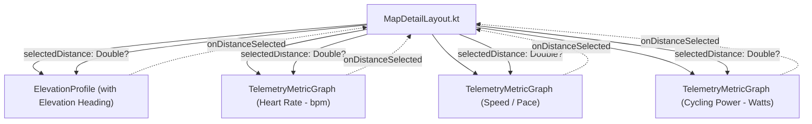

# Stage 1 Analysis: ATT-1740 - Continuous Metric Graphs with Headings for Heart Rate, Speed, and Power

**Ticket**: [ATT-1740](https://atrainingtracker.atlassian.net/browse/ATT-1740)  
**Sub-task**: [ATT-1775](https://atrainingtracker.atlassian.net/browse/ATT-1775) (`[Analysis]`)  
**Parent Epic**: [ATT-111](https://atrainingtracker.atlassian.net/browse/ATT-111) (*Aftermath: Compact Post-Workout Visual Analytics & Graphs*)  
**Target Release**: `V4.9.38`  
**Active Sprint**: `2026-40.6`  
**Branch**: `feature/ATT-1740`  
**Author**: AI Agent 1 (Implementer)  
**Date**: 2026-10-01  

---

## 1. Problem Statement & Motivation

During Sprint Review 2026-40.5 (review of ATT-1391), the user inspected the multi-metric scrubbing badge on the elevation profile and provided clear, direct feedback:
> *"I expected a graph for the heart rate. This graph is not there. Please create a ticket to add this graph. When we have several graphs, we also need a heading for each graph. Furthermore, I would like to have a graph for the heart-rate, speed, and power."*

Currently, the Aftermath inspection screen ([TrackOnMapScreen.kt](file:///home/rainer/AndroidStudioProjects/aTrainingTracker/app/src/main/java/com/atrainingtracker/trainingtracker/ui/aftermath/TrackOnMapScreen.kt) via [MapDetailLayout.kt](file:///home/rainer/AndroidStudioProjects/aTrainingTracker/app/src/main/java/com/atrainingtracker/trainingtracker/ui/map/MapDetailLayout.kt)) displays:
1. Header (workout metadata, title, edit action)
2. Interactive Map (GPS track, markers, route/segment overlays)
3. Elevation Profile ([ElevationProfile.kt](file:///home/rainer/AndroidStudioProjects/aTrainingTracker/app/src/main/java/com/atrainingtracker/trainingtracker/ui/map/ElevationProfile.kt)) — rendered without any section heading
4. Analytics content slot (5-zone HR & Power vertical column distributions from ATT-1739)

Although `PathPoint` in [MapModels.kt](file:///home/rainer/AndroidStudioProjects/aTrainingTracker/app/src/main/java/com/atrainingtracker/trainingtracker/ui/map/MapModels.kt) already contains synchronized telemetry extracted from SQLite sample tables (`hr`, `power`, `speedMps`, `timeSec`, `distance`, `altitude`, `slope`), no visual continuous curve graphs exist for Heart Rate, Speed/Pace, or Power. Furthermore, the elevation profile lacks a clear section heading, which causes visual ambiguity when multiple analytical graphs are displayed sequentially.

---

## 2. Root Cause Analysis & Architectural Gap Analysis

### 2.1 Telemetry Data Pipeline Status
- **Extraction**: In [WorkoutRepository.kt](file:///home/rainer/AndroidStudioProjects/aTrainingTracker/app/src/main/java/com/atrainingtracker/trainingtracker/ui/aftermath/WorkoutRepository.kt#L286-L354), `getWorkoutTrackPoints(workoutId, trackType)` already queries the workout samples table and extracts `HR`, `POWER`, `SPEED_mps`, `SLOPE`, `TIME_ACTIVE`/`TIME_TOTAL`, `DISTANCE_m`, and `ALTITUDE` on `Dispatchers.IO`.
- **ViewModel Propagation**: In [TrackOnMapAftermathViewModel.kt](file:///home/rainer/AndroidStudioProjects/aTrainingTracker/app/src/main/java/com/atrainingtracker/trainingtracker/ui/map/TrackOnMapAftermathViewModel.kt#L151-L200), `fullTracks` maps the extracted points into `MapTrack`, preserving all telemetry fields in each `PathPoint`.
- **Presentation Layer**: In `TrackOnMapScreen.kt`, `activeScrubPath = tracks.find { it.type == TrackType.BEST }?.path ?: tracks.firstOrNull()?.path` is passed into `MapDetailLayout`.

### 2.2 Architectural Gaps
1. **Missing Continuous Metric Graph Component**: While `ElevationProfile.kt` exists as a specialized composable with terrain gradient coloring and zoom controls, there is no lightweight, reusable continuous metric graph component capable of rendering scalar time-series or distance-series telemetry (HR, Speed/Pace, Power) with consistent Y-axis bounds, grid ticks, and synchronized scrubbing.
2. **Missing Section Headings**: `MapDetailLayout` renders `ElevationProfile` bare without any header text. With multiple graphs present, athletes require clear, localized section titles (e.g. *"Höhenprofil"*, *"Herzfrequenz"*, *"Geschwindigkeit"* / *"Tempo"*, *"Leistung"*).
3. **Synchronized Scrubbing**: Scrubbing on any graph or the map must synchronize the vertical cursor line and display the scrubbed instantaneous value across all displayed graphs simultaneously via `selectedDistance`.
4. **Conditional Graph Rendering**: Workouts vary widely in sensor availability (e.g. running with GPS and HR, cycling with Power meter, or simple walking with GPS only). The layout must dynamically detect which metrics are populated in `activeScrubPath` and render only those graphs with zero empty space or visual placeholders for missing metrics.

---

## 3. User Scope Grounding (ATT-1250)

* **In-Scope Goals**:
  1. Create a high-performance, aesthetic continuous telemetry graph composable (`TelemetryMetricGraph.kt` in `ui/map/`) that renders metric curves over distance or time matching `ProfileXAxisDomain`.
  2. Implement dedicated continuous graphs for:
     - **Heart Rate**: Instantaneous HR in `bpm` (Zone 4 Red / Coral accent).
     - **Speed / Pace**: Speed in `km/h` / `mph` (or Pace in `min/km` / `min/mi` for running sports) (Primary Blue accent).
     - **Cycling Power**: Instantaneous power in `Watts` (Zone 5 Purple / Amber accent).
  3. Provide distinct, localized section headings for all graphs in detailed inspection view (`Elevation Profile`, `Heart Rate`, `Speed`/`Pace`, `Power`).
  4. Ensure synchronized scrubbing across all displayed graphs and the map marker via shared `selectedDistance`.
  5. Conditionally render only graphs for which valid sensor data exists (`points.any { ... }`).
  6. 100% 9-language localization parity for all newly introduced graph headings.
  7. Maintain shareable snapshot integrity via `elevationLayer` in `MapDetailLayout`.

* **Out-of-Scope Non-Goals (Scope Bounding)**:
  1. Configurable sections in workout journal list cards (`WorkoutSummary.kt`): That is explicitly isolated to `ATT-1714`.
  2. Zone distribution column chart modifications: Already completed in `ATT-1739`.
  3. Reverting lap split chart: Already completed in `ATT-1741`.
  4. Complex analytical deep dives (quadrant analysis, critical power curves, W'bal): Explicitly out of scope per Epic `ATT-111`.

---

## 4. Requirement Archaeology & Chesterton's Fence Audit (REQ-PRO-022)

### Requirement Archaeology & Chesterton's Fence Audit
* **Original Requirement ID & Target**: Net-new requirement only (`REQ-UI-206`), extending Epic `ATT-111` (*Compact Post-Workout Visual Analytics & Graphs*), `REQ-UI-197` (*Elevation Profile Contextual Zoom Controls & Scrubber Layout*), and `REQ-UI-201` (*Multi-Metric Scrubbing & Configurable X-Axis Domain*).
* **Historical Origin & Commit Trace**: Ticket `ATT-1391` (Sprint `2026-40.5`) introduced multi-metric scrubbing on `ElevationProfile`. The user explicitly reviewed this feature and requested full graphical curves with headings for Heart Rate, Speed, and Power (ATT-1740).
* **Root Reason for Existing Formulation**: `ElevationProfile` previously served as the sole profile chart. Sensor telemetry was only displayed as text within the floating `ScrubbingTelemetryBadge` rather than plotted as continuous analytical curves.
* **Preservation of Core Invariants**: Viewport mathematics (`ElevationProfileZoomMath`), `ProfileXAxisDomain` preference handling, existing `ElevationProfile` zoom/pan controls, single-thread SQLite query confinement, and 9-language localization parity are 100% preserved.

---

## 5. Architectural Strategy & High-Level Solution

### 5.1 Component Architecture

### 5.2 Reusable Continuous Telemetry Graph (`TelemetryMetricGraph.kt`)
- **Container**: Compact vertical height (~110.dp), matching horizontal paddings (start: 50.dp, end: 25.dp, bottom: 24.dp) of `ElevationProfile` for pixel-perfect vertical alignment of the horizontal axes.
- **Header**: Section title (`titleMedium` / `labelLarge` bold) with instantaneous scrubbed value or peak/average summary.
- **Canvas Curve**:
  - Scales Y-axis dynamically based on metric min/max bounds (clamped defensively against single-point outliers).
  - Plots continuous curve with smooth connecting line and subtle area fill (vertical gradient with 0.15f alpha).
  - Draws X-axis grid lines and labels adapting to distance/time domain via `ElevationProfileZoomMath`.
  - When `currentDistance != null`: Renders vertical dashed cursor line at `canvasX` and a highlight dot at `(canvasX, canvasY)` on the curve.
- **Gesture Handling**: Touch/drag pointer input translates `pointer.position.x` into distance/time and invokes `onDistanceSelected(distance)`, enabling scrubbing directly on any graph.

### 5.3 Slotted Integration in `MapDetailLayout.kt`
- Wrap all graphs inside the existing `elevationLayer` box so that `combineWorkoutAndShare` automatically captures all displayed graphs in the workout snapshot without requiring modifications to the snapshot pipeline.
- Conditionally render:
  - Elevation Profile: Always rendered when `showElevationProfile == true` and `activeScrubPath != null`.
  - Heart Rate Graph: Rendered if `path.any { it.hr != null && it.hr > 0 }`.
  - Speed / Pace Graph: Rendered if `path.any { it.speedMps != null && it.speedMps > 0.0 }`.
  - Power Graph: Rendered if `path.any { it.power != null && it.power > 0 }`.

### 5.4 Localization Strategy
Define new string resources in all 9 supported locales:
- `graph_heading_elevation`: "Elevation Profile" / "Höhenprofil"
- `graph_heading_heart_rate`: "Heart Rate" / "Herzfrequenz"
- `graph_heading_speed`: "Speed" / "Geschwindigkeit"
- `graph_heading_pace`: "Pace" / "Tempo"
- `graph_heading_power`: "Power" / "Leistung"

---

## 6. System Invariants & Risk Assessment

* **Core Invariants**:
  1. **Zero Impact on List Previews**: List previews (`WorkoutSummary.kt`, `RouteItem.kt`, `SegmentItem.kt`) continue calling `ElevationProfile` directly with `showZoomControls = false` and do not instantiate continuous telemetry graphs.
  2. **Zero Impact on Ambient Cockpit**: `LIveSegmentSheet.kt` passes `showZoomControls = false` and has path data with null HR/Power/Speed, so it only displays the clean elevation profile without extra graphs.
  3. **Elevation Profile Invariants**: 3-layer vertical layout geometry (`REQ-UI-197`), zoom math, and pan clamping remain 100% intact.
  4. **Thread Safety**: All data loading remains on `Dispatchers.IO`, UI rendering on `Dispatchers.Main`.
  5. **Parent Gate Invariance**: AI agents do not transition parent tickets to `Erledigt`.
* **Risk Rating**: **LOW**. Pure UI presentation layer addition leveraging existing, thoroughly verified `PathPoint` telemetry models and drawing infrastructure.
