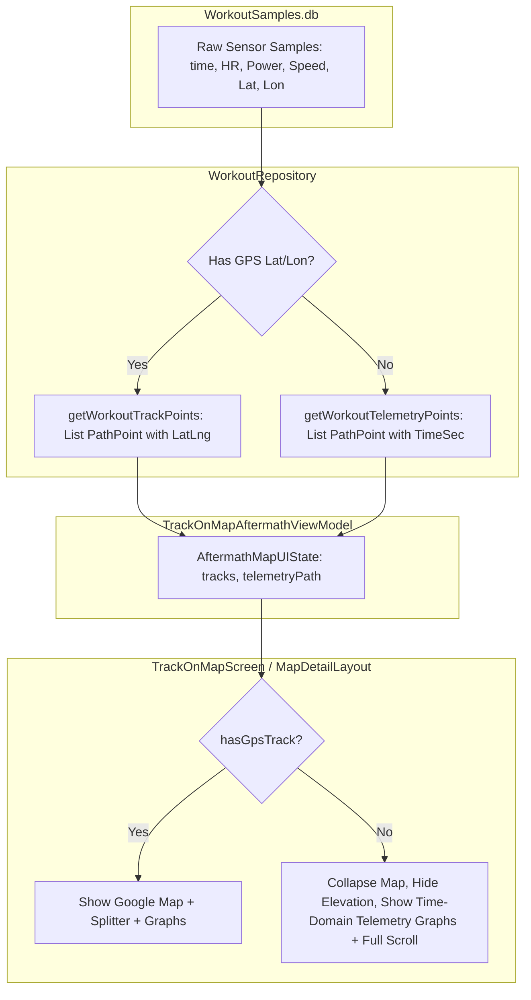

# Stage 1 Analysis: ATT-2006 - [Aftermath/Telemetry] Display Heart Rate Graph When HR Telemetry Exists Even Without GPS Track

**Ticket**: [ATT-2006](https://rainerblind.atlassian.net/browse/ATT-2006)  
**Sub-task**: [ATT-2017](https://rainerblind.atlassian.net/browse/ATT-2017) (`[Analysis]`)  
**Parent Epic**: [ATT-111](https://rainerblind.atlassian.net/browse/ATT-111) (*Aftermath: Compact Post-Workout Visual Analytics & Graphs*)  
**Target Release**: `V4.9.38`  
**Active Sprint**: `2026-40.11`  
**Branch**: `feature/ATT-2006`  
**Author**: AI Agent 1 (Implementer)  
**Date**: 2026-10-02  

---

## 1. Problem Statement & Motivation

During Ceremony 2 physical device testing on Google Pixel 10 hardware (Sprint 2026-40.10 Review), an indoor running workout (`'2014-10-11_134259'`, sport: Laufen, duration: 39:38) was inspected in the post-workout Aftermath detailed view (`TrackOnMapScreen` / `MapDetailLayout`). 

The session contained rich heart rate sensor telemetry recorded over 39 minutes:
- The Heart Rate Zone card (`HeartRateZoneDistributionCard`) rendered with 100% fidelity, displaying 39:38 active duration partitioned across Zone 1 (1:51), Zone 2 (15:31), and Zone 3 (22:16), along with a fully populated frequency histogram.
- However, **no continuous Heart Rate line graph was displayed**.
- Furthermore, the upper half of the screen displayed a Google Map zoomed out to the entire African continent / Gulf of Guinea (Null Island, latitude 0.0, longitude 0.0), because the session lacked GPS coordinates.

Athletes routinely record workouts indoors (treadmill runs, stationary bike trainers, rowing machines, gym workouts) or outdoors in areas with GPS signal acquisition failures. These workouts possess complete sensor telemetry (heart rate, cadence, power). Suppressing continuous graphs and displaying an irrelevant map of the Atlantic Ocean severely degrades the post-workout closure and analytical value of aTrainingTracker.

This ticket aims to:
1. Extract and ingest time-domain sensor telemetry even when GPS coordinates are null or absent.
2. Render continuous `TelemetryMetricGraph` components (Heart Rate and Cycling Power) along the Time domain across workout duration.
3. Support synchronized touch scrubbing across elapsed time (`0L..totalDurationSec`), displaying instantaneous values.
4. Cleanly collapse / isolate the Google Map viewport when no GPS coordinates exist, allowing telemetry graphs and analytics cards to utilize full vertical screen space with fluid scrolling.

---

## 2. Root Cause Analysis (Forensic Investigation)

Forensic examination of the post-workout data loading pipeline and composable hierarchy reveals three distinct architectural barriers:

### 2.1 GPS Coordinate Filter in `WorkoutRepository.kt`
In `WorkoutRepository.kt` lines 310–388 (`getWorkoutTrackPoints`):
```kotlin
while (cursor.moveToNext()) {
    ...
    if (latIdx != -1 && lonIdx != -1 && !cursor.isNull(latIdx) && !cursor.isNull(lonIdx)) {
        val dist = if (distIdx != -1 && !cursor.isNull(distIdx)) cursor.getDouble(distIdx) else 0.0
        val alt = if (altIdx != -1 && !cursor.isNull(altIdx)) cursor.getDouble(altIdx) else 0.0
        val hr = if (hrIdx != -1 && !cursor.isNull(hrIdx)) cursor.getInt(hrIdx) else null
        val power = if (powerIdx != -1 && !cursor.isNull(powerIdx)) cursor.getInt(powerIdx) else null
        val speed = if (speedIdx != -1 && !cursor.isNull(speedIdx)) cursor.getDouble(speedIdx) else null
        val slope = if (slopeIdx != -1 && !cursor.isNull(slopeIdx)) cursor.getDouble(slopeIdx) else null

        points.add(
            PathPoint(...)
        )
    }
    sampleIndex++
}
```
**Defect**: The condition `!cursor.isNull(latIdx) && !cursor.isNull(lonIdx)` unconditionally rejects any row that lacks GPS coordinates. For trackless sessions, `points` is returned as `emptyList()`, completely dropping all recorded heart rate and power samples from the pipeline.

In contrast, `getHeartRateZoneDistribution` in the same repository queries the exact same SQLite table and processes `hrIdx` and `timeSec` without requiring GPS coordinates:
```kotlin
if (!cursor.isNull(hrIdx)) {
    val hr = cursor.getInt(hrIdx)
    if (hr > 0) {
        samples.add(ZoneSample(timeActiveSec = timeSec, value = hr))
    }
}
```
This explains why the Zone Distribution Card was populated, while the continuous track points list was completely empty.

### 2.2 ViewModel & UI State Suppression
In `TrackOnMapAftermathViewModel.kt`:
1. Phase 2 (Fast Track) checks `if (workoutData.mapPolyline.isNotEmpty())`. For indoor workouts, `mapPolyline` is empty.
2. Phase 4 (High-Resolution Tracks) calls `workoutRepository.getWorkoutTrackPoints(workoutId, type)`. Because all points were filtered out by the GPS check, `fullTracks` is empty.
3. Result: `AftermathMapUIState.tracks` remains `emptyList()`.

In `TrackOnMapScreen.kt`:
```kotlin
activeScrubPath = tracks.find { it.type == TrackType.BEST }?.path ?: tracks.firstOrNull()?.path
```
Because `tracks` is empty, `activeScrubPath` evaluates to `null`.

In `MapDetailLayout.kt`:
```kotlin
val hasTelemetryGraphs = showZoomControls && activeScrubPath != null && (
    TelemetryMetricUtils.hasHeartRateData(activeScrubPath) ||
    TelemetryMetricUtils.hasSpeedData(activeScrubPath) ||
    TelemetryMetricUtils.hasPowerData(activeScrubPath)
)
```
And:
```kotlin
if (showElevationProfile) {
    activeScrubPath?.let { path ->
        ...
        if (TelemetryMetricUtils.hasHeartRateData(path)) {
            TelemetryMetricGraph(
                metricType = TelemetryMetricType.HEART_RATE,
                ...
            )
        }
    }
}
```
Because `activeScrubPath` is `null`, `hasTelemetryGraphs` evaluates to `false` and the entire block is omitted.

### 2.3 Unconditional Map Presentation & Null Island Framing
In `TrackOnMapScreen.kt`:
```kotlin
showMap: Boolean = true
```
When `tracks` is empty, `ATrainingTrackerMap` initializes with default bounds centered at `(0.0, 0.0)`. Google Maps renders the Gulf of Guinea / West Africa, consuming 50% of the display area for a non-existent route.

### 2.4 Scrubbing Cursor Round-Trip Mismatch for Trackless Data
In `TelemetryMetricGraph.kt`:
When scrubbing along the time domain, touch input computes `selectedVal` in seconds:
```kotlin
if (isTimeDomain) {
    val targetTimeSec = selectedVal.toLong()
    val nearest = pathPoints.minByOrNull { abs(it.timeSec - targetTimeSec) }
    currentOnDistanceSelectedState(nearest?.distance)
}
```
And when rendering the cursor:
```kotlin
val cursorDistSpan = if (isTimeDomain) {
    val nearestPt = pathPoints.minByOrNull { abs(it.distance - currentDistance) }
    (nearestPt?.timeSec ?: 0L).toDouble()
} else {
    currentDistance
}
```
**Defect**: If a workout lacks GPS coordinates, `it.distance == 0.0` for all points. When `nearest?.distance` (0.0) is dispatched, `minByOrNull { abs(it.distance - 0.0) }` matches index 0. The cursor line is locked at `0:00` and cannot be moved across the chart.

---

## 3. User Scope Grounding (ATT-1250)

### In-Scope Objectives:
1. **Repository Telemetry Extraction**:
   - Provide `WorkoutRepository.getWorkoutTelemetryPoints(workoutId: Long): List<PathPoint>` that extracts all valid sensor telemetry (HR, power, cadence, speed) paired with `timeSec` regardless of GPS coordinates.
   - For high sample counts ($> 800$), apply uniform stride decimation preserving first and last samples to guarantee 120fps rendering on the Pixel 10.
2. **UI State & Scrubber Pipeline**:
   - Expose `telemetryPath: List<PathPoint>` in `AftermathMapUIState`.
   - In `TrackOnMapScreen.kt`, derive `hasGpsTrack = tracks.any { it.path.isNotEmpty() && it.latLngs.any { p -> p.latitude != 0.0 || p.longitude != 0.0 } }`.
   - Bind `activeScrubPath = if (hasGpsTrack) (bestTrack?.path) else telemetryPath`.
3. **Map Isolation & Collapse**:
   - In `TrackOnMapScreen.kt`, pass `showMap = hasGpsTrack` and `showElevationProfile = hasGpsTrack && hasAltitudeData`.
   - In `MapDetailLayout.kt`, when `showMap == false`, remove the empty map and allow the lower content column to expand to `Modifier.fillMaxSize().verticalScroll(rememberScrollState())`.
4. **Time-Domain Enforcement & Synchronized Scrubbing**:
   - When a workout is trackless (`(path.lastOrNull()?.distance ?: 0.0) == 0.0 && (path.lastOrNull()?.timeSec ?: 0L) > 0L`), automatically enforce `ProfileXAxisDomain.TIME` for telemetry graphs.
   - In `TelemetryMetricGraph.kt`, support direct time-domain scrubbing when `distance == 0.0`, dispatching and rendering `selectedDistance` directly as elapsed time in seconds.
   - Display instantaneous metric readout (e.g. `148 bpm • Z3`) in the graph header row during scrubbing.

### Out-of-Scope Non-Goals (Scope Bounding):
- Synthesizing fake GPS coordinates or mock routes.
- Modifying TCX/GPX file export mechanisms.
- Altering the SQLite database schema (`WorkoutSamples.db`).
- Altering live workout tracking sensor collection loops in `TrackerService.java`.

---

## 4. Requirement Archaeology & Chesterton's Fence Audit (REQ-PRO-022)

* **Original Requirement ID & Target**: Net-new requirement `REQ-UI-235` (*Aftermath/Telemetry: Continuous Sensor Telemetry Graph Ingestion, Time-Domain Scrubbing, and Map Collapse for Trackless Workouts*), extending `REQ-UI-206` (*Continuous Telemetry Metric Graphs*) under Epic `ATT-111` (*Compact Post-Workout Visual Analytics & Graphs*).
* **Historical Origin & Commit Trace**:
  - `REQ-UI-206` introduced `TelemetryMetricGraph.kt` in Sprint 2026-40.5 (`ATT-1740`, commit `061a4b35`).
  - `REQ-UI-233` introduced independent X-axis domain configuration in Sprint 2026-40.10 (`ATT-1986`).
* **Root Reason for Existing Formulation**:
  - `TelemetryMetricGraph` was initially designed as an auxiliary companion stacked directly below `ElevationProfile` and `ATrainingTrackerMap`. It relied entirely on the geospatial `activeScrubPath` from GPS tracks for both data points and scrubbing distance synchrony. The edge case of non-GPS workouts with rich sensor telemetry was overlooked.
* **Preservation of Core Invariants**:
  - Standard GPS workouts continue to render `ATrainingTrackerMap`, `ElevationProfile`, and telemetry graphs with synchronized spatial scrubbing (`REQ-UI-201`, `REQ-UI-206`, `REQ-UI-233`).
  - SplitPaneDivider and persistent zoom toolbar (`REQ-UI-223`, `REQ-UI-225`) remain fully functional.
  - Multi-chart directional gesture disambiguation (`REQ-UI-226`) remains 100% preserved.
  - 100% 9-language localization parity is maintained.

---

## 5. Architectural Design & Proposed Solution



1. **`WorkoutRepository.kt`**:
   - Add `suspend fun getWorkoutTelemetryPoints(workoutId: Long): List<PathPoint>`.
   - Reads `tableName` in `WorkoutSamples.db`. If `hrIdx != -1` or `powerIdx != -1`, it extracts `timeSec`, `hr`, `power`, `speedMps`, with `distance = 0.0` and `latLng = LatLng(0.0, 0.0)`.
2. **`TrackOnMapAftermathViewModel.kt`**:
   - In `AftermathMapUIState`, add `val telemetryPath: List<PathPoint> = emptyList()`.
   - In `loadAftermathData`, if `fullTracks.isEmpty()`, query `getWorkoutTelemetryPoints` and populate `telemetryPath`.
3. **`TrackOnMapScreen.kt`**:
   - Evaluate `val hasGpsTrack = tracks.any { it.path.isNotEmpty() && it.latLngs.any { p -> p.latitude != 0.0 || p.longitude != 0.0 } }`.
   - Provide `activeScrubPath = if (hasGpsTrack) (bestTrack?.path) else aftermathUIState.telemetryPath.ifEmpty { null }`.
   - Set `showMap = hasGpsTrack` and `showElevationProfile = hasGpsTrack && ...`.
4. **`MapDetailLayout.kt`**:
   - When `showMap == false`, render the outer Column as `Modifier.fillMaxSize()`, and the lower container as `Modifier.fillMaxWidth().weight(1f).verticalScroll(rememberScrollState())`.
   - When `isTrackless` is true, enforce `ProfileXAxisDomain.TIME`.
   - Show instantaneous scrubbing readout next to graph headings when scrubbed.
5. **`TelemetryMetricGraph.kt`**:
   - In time domain, when `(pathPoints.lastOrNull()?.distance ?: 0.0) == 0.0`, dispatch and compare `currentDistance` directly as elapsed seconds.

---

## 6. Next Steps
Upon Gate 1 approval:
1. Advance to Stage 2 (`ATT-2018`) to formulate formal requirement `REQ-UI-235` and test specification `TST-UI-194`.
2. Proceed to Stage 3 (`ATT-2019`) for architecture and implementation planning.
3. Execute Stage 4 (`ATT-2020`) and Stage 5 (`ATT-2021`) verification.
