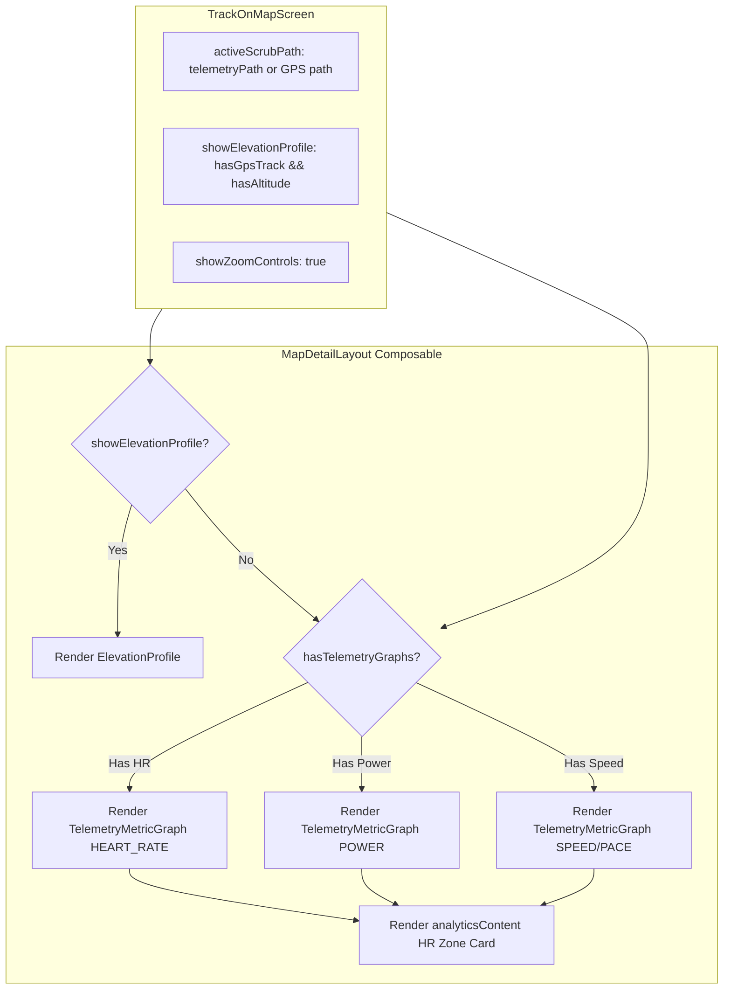

# Stage 1 Analysis: ATT-2006 - [Aftermath/Telemetry] Display Heart Rate Graph When HR Telemetry Exists Even Without GPS Track

**Ticket**: [ATT-2006](https://atrainingtracker.atlassian.net/browse/ATT-2006)  
**Sub-task**: [ATT-2060](https://atrainingtracker.atlassian.net/browse/ATT-2060) (`[Analysis]`)  
**Parent Epic**: [ATT-111](https://atrainingtracker.atlassian.net/browse/ATT-111) (*Aftermath: Compact Post-Workout Visual Analytics & Graphs*)  
**Target Release**: `V4.9.38`  
**Active Sprint**: `2026-40.12`  
**Branch**: `feature/ATT-2006`  
**Author**: AI Agent 1 (Implementer)  
**Date**: 2026-10-02  

---

## 1. Problem Statement & Physical Device Observation

During Ceremony 2 physical testing on Google Pixel 10 hardware (Sprint 2026-40.11 Review), indoor running workout `'2014-12-03_145500'` (duration: 39:38, sport: Laufen) was inspected in the post-workout Aftermath detailed view (`TrackOnMapScreen` / `MapDetailLayout`).

### Physical Findings:
- The Google Map cleanly collapsed and was hidden as expected for a trackless workout.
- The Heart Rate Zone distribution card (`HeartRateZoneDistributionCard`) rendered with 100% fidelity, displaying zone breakdown and frequency histogram.
- The sticky zoom toolbar (`GlobalTelemetryZoomToolbar`) rendered at the top of the scrollable section.
- **Defect**: The continuous Heart Rate line graph was completely missing between the zoom toolbar and the zone distribution card.

Athletes routinely record workouts indoors (treadmill runs, stationary bike trainers, rowing machines) or outdoors where GPS fixes are lost or disabled. When heart rate telemetry exists, the continuous heart rate graph must be displayed along the time domain even in the complete absence of GPS coordinates.

---

## 2. Root Cause Analysis (Forensic Investigation)

Forensic examination of `TrackOnMapScreen.kt` and `MapDetailLayout.kt` reveals the architectural cause of this omission:

### 2.1 The Gatekeeping Bug in `MapDetailLayout.kt`
In `MapDetailLayout.kt` lines 204–400:
```kotlin
val lowerColumn: @Composable (Modifier) -> Unit = { colModifier ->
    Column(modifier = colModifier) {
        if (showElevationProfile) {
            activeScrubPath?.let { path ->
                Surface(...) {
                    Column(modifier = Modifier.fillMaxWidth()) {
                        ...
                        ElevationProfile(...)

                        // Telemetry Metric Graphs in detailed inspection view
                        if (showZoomControls) {
                            if (TelemetryMetricUtils.hasSpeedData(path)) {
                                TelemetryMetricGraph(...)
                            }
                            if (TelemetryMetricUtils.hasHeartRateData(path)) {
                                TelemetryMetricGraph(
                                    metricType = TelemetryMetricType.HEART_RATE,
                                    ...
                                )
                            }
                            if (TelemetryMetricUtils.hasPowerData(path)) {
                                TelemetryMetricGraph(...)
                            }
                        }
                    }
                }
            }
        }
```
All `TelemetryMetricGraph` instances—Speed/Pace, Heart Rate, and Power—are nested directly inside `if (showElevationProfile) { ... }`.

### 2.2 Elevation Profile Suppression in `TrackOnMapScreen.kt`
In `TrackOnMapScreen.kt` line 133:
```kotlin
showElevationProfile = hasGpsTrack && (workoutData.minAltitude != null || (activeScrubPath?.any { it.altitude != 0.0 } == true)),
```
When a workout has no GPS track points (`hasGpsTrack == false`), `showElevationProfile` evaluates to `false`.

### 2.3 The Disconnect
Because `showElevationProfile` evaluates to `false`, `MapDetailLayout.kt` completely skips the entire `if (showElevationProfile)` block. Consequently:
1. The `ElevationProfile` is hidden (which is correct for a trackless workout without altitude data).
2. BUT all `TelemetryMetricGraph` components (including Heart Rate) are also bypassed and never composed!
3. The zoom toolbar still renders because it checks `hasZoomToolbar` (line 544), and the zone distribution card renders because it is in `analyticsContent` (line 405), leaving a vacant gap where the heart rate graph was expected.

---

## 3. User Scope Grounding (ATT-1250)

### In-Scope Objectives:
1. **Decouple Telemetry Metric Graphs from Elevation Profile in `MapDetailLayout.kt`**:
   - Refactor `lowerColumn` so that `ElevationProfile` is conditionally rendered when `showElevationProfile && activeScrubPath != null`, while `TelemetryMetricGraph` components (Pace/Speed, Heart Rate, Power) are rendered whenever `hasTelemetryGraphs` is true (`showZoomControls && activeScrubPath != null && TelemetryMetricUtils.has...Data(path)`), regardless of whether `showElevationProfile` is true or false.
2. **Unified Surface & Padding Management**:
   - Ensure the `Surface` wrapper enclosing the charts correctly handles elevation graphics layering, background color, and navigation bar insets when `ElevationProfile` is absent but telemetry graphs are present.
3. **Synchronized Time-Domain Scrubbing**:
   - Ensure scrubbing on the continuous Heart Rate graph functions seamlessly when `isTrackless` is true, displaying instantaneous BPM and zone tags in the header row.
4. **Preserve GPS Workouts**:
   - Maintain exact layout, zooming, panning, and scrubbing behavior for standard workouts with GPS tracks and elevation profiles.

### Out-of-Scope Non-Goals:
- Modifying SQLite database schemas or `WorkoutSamples.db`.
- Synthesizing fake GPS tracks or mock polylines.
- Altering live sensor collection loops in `TrackerService.java`.

---

## 4. Requirement Archaeology & Chesterton's Fence Audit (REQ-PRO-022)

* **Original Requirement ID & Target**: Net-new requirement `REQ-UI-235` (*Aftermath/Telemetry: Continuous Sensor Telemetry Graph Ingestion, Time-Domain Scrubbing, and Map Collapse for Trackless Workouts*), extending `REQ-UI-206` (*Continuous Telemetry Metric Graphs*) under Epic `ATT-111` (*Compact Post-Workout Visual Analytics & Graphs*).
* **Historical Origin & Commit Trace**:
  - `REQ-UI-206` introduced `TelemetryMetricGraph.kt` in Sprint 2026-40.5 (`ATT-1740`, commit `061a4b35`).
  - Sprint 2026-40.11 implemented repository extraction and time-domain scrubbing for trackless workouts, but left telemetry graphs nested under `showElevationProfile`.
* **Root Reason for Existing Formulation**:
  - `TelemetryMetricGraph` was initially constructed as an auxiliary extension stacked beneath `ElevationProfile` and shared the same container block. When `showElevationProfile` was made conditional on `hasGpsTrack`, the telemetry graphs were inadvertently suppressed.
* **Preservation of Core Invariants**:
  - Standard GPS workouts continue to render `ATrainingTrackerMap`, `ElevationProfile`, and telemetry graphs with synchronized spatial scrubbing (`REQ-UI-201`, `REQ-UI-206`, `REQ-UI-233`).
  - SplitPaneDivider and persistent zoom toolbar (`REQ-UI-223`, `REQ-UI-225`) remain fully functional.
  - Multi-chart directional gesture disambiguation (`REQ-UI-226`) remains 100% preserved.
  - 100% 9-language localization parity is maintained.

---

## 5. Architectural Design & Proposed Solution



### Key Technical Edits:
1. **`MapDetailLayout.kt`**:
   - Restructure `lowerColumn`:
     ```kotlin
     if (showElevationProfile || hasTelemetryGraphs) {
         activeScrubPath?.let { path ->
             Surface(...) {
                 Column(...) {
                     if (showElevationProfile) {
                         // Elevation header and ElevationProfile(...)
                     }
                     if (showZoomControls) {
                         // TelemetryMetricGraph for Speed, HR, Power
                     }
                 }
             }
         }
     }
     ```
   - This ensures that if `showElevationProfile` is false but `hasTelemetryGraphs` is true (the exact trackless HR workout case), the `Surface` and `TelemetryMetricGraph` instances are composed and rendered cleanly.

---

## 6. Next Steps
Upon Gate 1 approval:
1. Transition `ATT-2060` to `review` and run Gate 1 audit (`tools/review_agent.py audit ATT-2060`).
2. Move directly to Stage 2 (`[Test-Spec]`) to author formal specifications.
