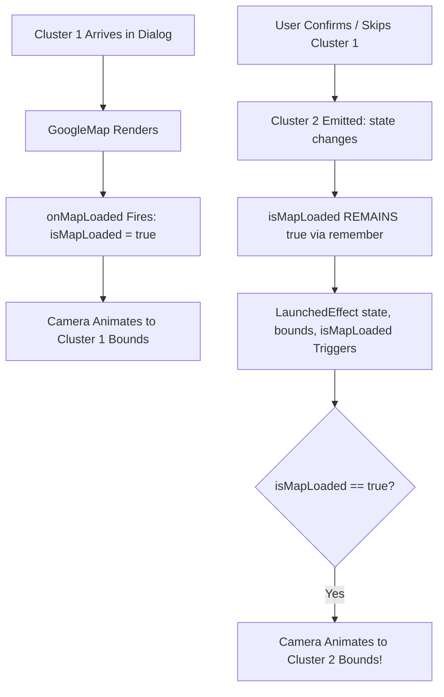

# Stage 1 Analysis: ATT-2022 - [Import/Clusters] Map Camera Does Not Re-Align or Update Zoom for Sequential Cluster Naming Dialogs During Import

**Ticket**: [ATT-2022](https://atrainingtracker.atlassian.net/browse/ATT-2022)  
**Sub-task**: [ATT-2070](https://atrainingtracker.atlassian.net/browse/ATT-2070) (`[Analysis]`)  
**Parent Epic**: [ATT-111](https://atrainingtracker.atlassian.net/browse/ATT-111) (*Aftermath: Compact Post-Workout Visual Analytics & Graphs*)  
**Target Release**: `V4.9.38`  
**Active Sprint**: `2026-40.12`  
**Branch**: `feature/ATT-2022`  
**Author**: AI Agent 1 (Implementer)  
**Date**: 2026-10-02  

---

## 1. Problem Statement & User Observation

When importing workout data files (e.g. TCX backups or bulk activity imports) containing multiple recurring route candidates, the system identifies cluster candidates and prompts the athlete to name or assign each cluster sequentially via `ClusterNamingDialog` in `ImportBackupTabsScreen.kt`.

Each cluster dialog presents an interactive map preview showing the candidate route polyline, start pin, end pin, and apex pin. When multiple clusters are in the interaction queue (`queueCount > 1`), confirming or dismissing the first dialog advances the queue to the next candidate.

### User Bug Report:
While the dialog text (workout date, sport type, and distance) correctly updates to reflect the next cluster, **the embedded Google Map camera does not re-align, center, or update its zoom bounds**. Instead, the camera remains frozen at the spatial coordinates and zoom level of the very first cluster. If the second cluster occurred in a different geographical region (or across town), its route is rendered completely off-screen, forcing the user to manually pan and search for the track.

---

## 2. Forensic Root Cause Analysis (RCA)

Forensic examination of `ClusterNamingDialog` in [ImportBackupTabsScreen.kt](file:///home/rainer/AndroidStudioProjects/aTrainingTracker/app/src/main/java/com/atrainingtracker/trainingtracker/migration/ImportBackupTabsScreen.kt) lines 500–536 reveals the exact sequence of events causing the camera lock:

### 2.1 The Faulty Lifecycle Guarding
In `ClusterNamingDialog`:
```kotlin
val decodedPoints = remember(state.polyline) { PolyUtil.decode(state.polyline) }
val bounds = remember(decodedPoints) {
    if (decodedPoints.isEmpty()) return@remember null
    val b = LatLngBounds.builder()
    decodedPoints.forEach { b.include(it) }
    b.build()
}
val cameraPositionState = rememberCameraPositionState {
    position = CameraPosition.fromLatLngZoom(bounds?.center ?: LatLng(0.0, 0.0), 12f)
}
var isMapLoaded by remember(state) { mutableStateOf(false) }

LaunchedEffect(bounds, isMapLoaded) {
    if (isMapLoaded && bounds != null) {
        try {
            cameraPositionState.animate(CameraUpdateFactory.newLatLngBounds(bounds, 50))
        } catch (e: Exception) {
            Log.w("ImportBackupTabsScreen", "CameraUpdateFactory animation failed, falling back to static bounds center: ${e.message}")
            cameraPositionState.position = CameraPosition.fromLatLngZoom(bounds.center, 12f)
        }
    }
}
```

And in the composable tree:
```kotlin
GoogleMap(
    modifier = Modifier.fillMaxSize().background(if (isDark) Color(0xFF121212) else Color.White),
    cameraPositionState = cameraPositionState,
    properties = mapProperties,
    onMapLoaded = { isMapLoaded = true },
    uiSettings = MapUiSettings(zoomControlsEnabled = false, myLocationButtonEnabled = false)
)
```

### 2.2 Forensic Breakdown of the Failure
1. **Dialog Retention in Composition**:
   In `ImportBackupTabsScreen.kt` lines 338–345:
   ```kotlin
   activeInteraction?.let { interaction ->
       ClusterNamingDialog(
           state = interaction,
           queueCount = queueCount,
           ...
       )
   }
   ```
   When the athlete confirms or dismisses cluster 1, `activeInteraction` immediately emits cluster 2 from `_interactionQueue`. The `ClusterNamingDialog` composable is **not removed from composition**; it merely recomposes with the new `state: ClusterInteraction`.
2. **`isMapLoaded` Reset to False**:
   Because `isMapLoaded` is declared as `var isMapLoaded by remember(state) { mutableStateOf(false) }`, recomposition with the new `state` resets `isMapLoaded` back to `false`!
3. **`onMapLoaded` Never Fires for Subsequent Clusters**:
   The underlying `GoogleMap` composable and its native Google Maps SDK `MapView` remain mounted in the view hierarchy. In the Google Maps SDK, `onMapLoaded` is an asynchronous callback fired **only once** when the map layout and tiles finish initial rendering. It **does NOT fire again** upon composable recomposition.
4. **Permanent Execution Deadlock**:
   Because `onMapLoaded` is not triggered again, `isMapLoaded` remains `false` for cluster 2, cluster 3, and all subsequent items in the queue.
5. **Camera Update Skipped**:
   In `LaunchedEffect(bounds, isMapLoaded)`:
   The guard `if (isMapLoaded && bounds != null)` evaluates to `false`! The camera update `cameraPositionState.animate(CameraUpdateFactory.newLatLngBounds(bounds, 50))` is completely skipped.
6. **`rememberCameraPositionState` Stagnation**:
   `val cameraPositionState = rememberCameraPositionState { position = ... }` retains the camera position from cluster 1 across recompositions. Consequently, the camera stays frozen on cluster 1's position and zoom level indefinitely.

---

## 3. User Scope Grounding (ATT-1250)

### In-Scope Objectives:
1. **Decouple `isMapLoaded` from `state`**:
   - Change `var isMapLoaded by remember(state) { mutableStateOf(false) }` to `var isMapLoaded by remember { mutableStateOf(false) }`.
   - Once the embedded map surface has initialized and loaded, `isMapLoaded` remains `true` throughout the interaction queue session.
2. **Key Camera Re-Framing to `state` & `bounds`**:
   - Update `LaunchedEffect(state, bounds, isMapLoaded)`: whenever a new cluster `state` arrives or `bounds` changes, if `isMapLoaded && bounds != null`, the camera animates smoothly to frame the new route with 50px padding.
3. **Defensive Bounds Calculation**:
   - Ensure `bounds` incorporates `decodedPoints` as well as `state.start`, `state.end`, and `state.apex` to guarantee all marker icons fit within the camera envelope.
4. **Synchronize Resilience Contract Tests**:
   - Update `ImportBackupMapResilienceTest.kt` to verify that `isMapLoaded` is remembered across queue items rather than reset per item, preventing regression.

### Out-of-Scope Non-Goals:
- Modifying the cluster matching or scoring algorithms (`WorkoutClusterEngine.kt`).
- Redesigning the `ClusterNamingDialog` layout or actions.
- Altering the TCX import parser (`TcxHighFidelityImport.kt`).

---

## 4. Requirement Archaeology & Chesterton's Fence Audit (REQ-PRO-022)

* **Original Requirement ID & Target**: Refining `REQ-MAP-022` (*Google Maps CameraUpdateFactory Initialization Resilience and Lifecycle Guarding in Import Route Preview*) under Epic `ATT-111` (*Aftermath: Compact Post-Workout Visual Analytics & Graphs*).
* **Historical Origin & Commit Trace**:
  - `REQ-MAP-022` was introduced in Sprint 2026-40.4 (`ATT-1579`, Commit `2aab3ef6`).
* **Root Reason for Existing Formulation**:
  - In ATT-1579, the author aimed to eliminate fatal `NullPointerException` crashes (Crashlytics `83f3e051082969efdb92a73faaf6ca2d`) when `CameraUpdateFactory.newLatLngBounds` was invoked before the Google Maps native engine was initialized.
  - The author added `var isMapLoaded by remember(state) { mutableStateOf(false) }` under the mistaken assumption that every cluster in the queue unmounts and remounts the map surface. In practice, the dialog stays active, leaving `isMapLoaded` trapped at `false` for all subsequent items.
* **Preservation of Core Invariants**:
  - Pre-load crash protection (never invoking `CameraUpdateFactory` before `isMapLoaded == true`), try-catch fallback to static center, polyline decoding, and 50px camera padding are 100% strictly preserved.

---

## 5. Architectural Design & Proposed Solution



### Proposed Code Changes in `ImportBackupTabsScreen.kt`:
```kotlin
// 1. Maintain map loaded state across cluster interaction transitions:
var isMapLoaded by remember { mutableStateOf(false) }

// 2. Comprehensive bounds envelope:
val decodedPoints = remember(state.polyline) { PolyUtil.decode(state.polyline) }
val bounds = remember(decodedPoints, state.start, state.end, state.apex) {
    val b = LatLngBounds.builder()
    if (decodedPoints.isNotEmpty()) {
        decodedPoints.forEach { b.include(it) }
    }
    b.include(state.start)
    b.include(state.end)
    b.include(state.apex)
    b.build()
}

// 3. Re-frame camera on every state / bounds change when map is ready:
LaunchedEffect(state, bounds, isMapLoaded) {
    if (isMapLoaded && bounds != null) {
        try {
            cameraPositionState.animate(CameraUpdateFactory.newLatLngBounds(bounds, 50))
        } catch (e: Exception) {
            Log.w("ImportBackupTabsScreen", "CameraUpdateFactory animation failed, falling back to static bounds center: ${e.message}")
            cameraPositionState.position = CameraPosition.fromLatLngZoom(bounds.center, 12f)
        }
    }
}
```

---

## 6. Next Steps
Upon Gate 1 approval:
1. Transition `ATT-2070` to `review` and run Gate 1 audit (`tools/review_agent.py audit ATT-2070`).
2. Move to Stage 2 (`[Test-Spec]`) to formulate test specification and update requirement `REQ-MAP-022`.
