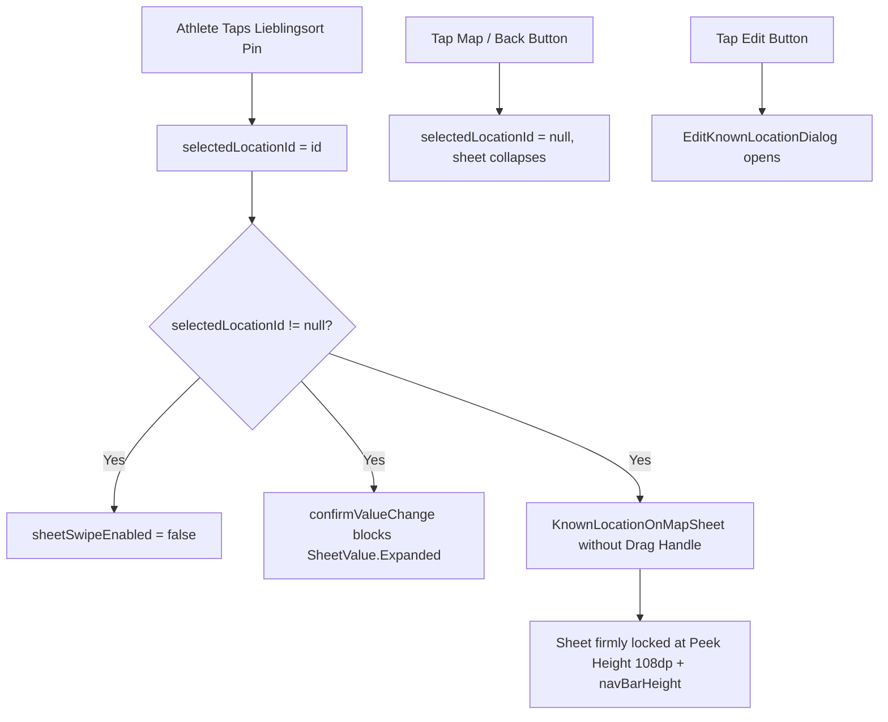

# Stage 1 Analysis: ATT-2042 - [Lieblingsorte/Map] Lock Favorite Location Bottom Sheet to Peek Height & Remove Misleading Drag Handle

**Ticket**: [ATT-2042](https://atrainingtracker.atlassian.net/browse/ATT-2042)  
**Sub-task**: [ATT-2065](https://atrainingtracker.atlassian.net/browse/ATT-2065) (`[Analysis]`)  
**Parent Epic**: [ATT-1396](https://atrainingtracker.atlassian.net/browse/ATT-1396) (*Lieblingsorte: Visible Value, Auto-Naming & Tracking Integration*)  
**Target Release**: `V4.9.38`  
**Active Sprint**: `2026-40.12`  
**Branch**: `feature/ATT-2042`  
**Author**: AI Agent 1 (Implementer)  
**Date**: 2026-10-02  

---

## 1. Problem Statement & Motivation

In the central navigation map ([MapScreenWithTrack.kt](file:///home/rainer/AndroidStudioProjects/aTrainingTracker/app/src/main/java/com/atrainingtracker/trainingtracker/ui/map/MapScreenWithTrack.kt)), tapping an athlete's favorite location (*Lieblingsort*) marker pin sets `selectedLocationId` and reveals an interactive bottom peek sheet rendered via `KnownLocationOnMapSheet`.

Unlike routes (`RouteOnMapScreen`) and segments (`SegmentOnMapScreen`)—which contain rich, multi-section scrollable content (elevation profile charts, lap split breakdowns, speed/HR/power telemetry graphs, Strava leaderboards) designed for full-screen expansion (`SheetValue.Expanded`)—the favorite location sheet consists exclusively of a compact 3-line summary card:
- Location Name & Edit Icon Button
- Calibrated Reference Altitude Metric
- Historical Starts Count Badge

### Current Deficiencies & Visual Inconsistencies:
1. **Misleading Drag Affordance**: `KnownLocationOnMapSheet` renders a `MinimumDragHandle()` at the top edge. In Material 3 design grammar, a drag handle signals that the container can and should be dragged upwards to reveal additional content.
2. **Empty Void on Upward Expansion**: Because `KnownLocationOnMapSheet` only has a compact ~80dp information footprint, dragging the sheet upwards expands `BottomSheetScaffold` to full screen height (`maxSheetHeight = maxHeight - statusBarHeight`), revealing a large, completely empty white/surface void below the card. This creates an awkward, unfinished user experience.

---

## 2. Root Cause Analysis (Forensic Investigation)

Forensic examination of `MapScreenWithTrack.kt` reveals why upward expansion and the drag handle exist:

### 2.1 Unconditional Gesture & Expansion Support in `BottomSheetScaffold`
In `MapScreenWithTrack.kt` lines 114–175:
```kotlin
val scaffoldState = rememberBottomSheetScaffoldState(
    bottomSheetState = rememberStandardBottomSheetState(skipHiddenState = false)
)

...

BottomSheetScaffold(
    scaffoldState = scaffoldState,
    sheetPeekHeight = when {
        ...
        selectedLocationId != null -> BottomSheetDesign.PeekHeightKnownLocation + navBarHeight
        else -> 0.dp
    },
    sheetDragHandle = null,
    sheetContent = {
        ...
    }
)
```
1. In `rememberStandardBottomSheetState`, `confirmValueChange` defaults to allowing transitions between all `SheetValue` states (`Hidden`, `PartiallyExpanded`, `Expanded`). No check restricts `SheetValue.Expanded` when `selectedLocationId != null`.
2. `BottomSheetScaffold` defaults `sheetSwipeEnabled = true`. Swiping up is enabled universally across segments, routes, and favorite locations.
3. In `KnownLocationOnMapSheet`:
   ```kotlin
   @Composable
   fun KnownLocationOnMapSheet(...) {
       Column(...) {
           MinimumDragHandle()
           Column(...) { ... }
       }
   }
   ```
   `MinimumDragHandle()` was explicitly placed in `KnownLocationOnMapSheet` under the mistaken assumption that all bottom sheets must present a drag pill, even when no expansion content exists.

---

## 3. User Scope Grounding (ATT-1250)

### In-Scope Objectives:
1. **Lock Upward Expansion for Favorite Locations**:
   - In `MapScreenWithTrack.kt`, set `sheetSwipeEnabled = (selectedLocationId == null)` on `BottomSheetScaffold`. When a favorite location is active, swiping/dragging the sheet is completely disabled.
   - In `rememberStandardBottomSheetState`, supply `confirmValueChange`: reject transition to `SheetValue.Expanded` if `selectedLocationId != null`.
   - Ensure the sheet remains firmly locked at `BottomSheetDesign.PeekHeightKnownLocation + navBarHeight`.
2. **Remove Misleading Drag Handle**:
   - In `KnownLocationOnMapSheet`, excise `MinimumDragHandle()`.
   - Adjust top padding to `top = 16.dp` so the card presents as a clean, polished bottom floating summary.
3. **Preserve Dismissal & Edit Interactions**:
   - Tapping on the map background, pressing the system back button (`BackHandler`), or selecting another map pin continues to collapse and dismiss the card cleanly (`selectedLocationId = null`).
   - Tapping the edit icon button continues to launch `EditKnownLocationDialog` with live geofence preview.
4. **Preserve Expansion for Routes and Segments**:
   - Upward dragging and full-screen expansion (`SheetValue.Expanded`) for `SegmentOnMapScreen` and `RouteOnMapScreen` remain 100% operational with dynamic self-measuring peek heights.

### Out-of-Scope Non-Goals:
- Adding secondary tabs or analytics graphs to favorite locations.
- Modifying the SQLite schema for known locations (`KnownLocations.db`).
- Altering the management list view in `KnownLocationsScreen.kt`.

---

## 4. Requirement Archaeology & Chesterton's Fence Audit (REQ-PRO-022)

* **Original Requirement ID & Target**: Net-new requirement `REQ-UI-236` (*Lieblingsorte/Map: Lock Favorite Location Bottom Sheet to Peek Height & Remove Misleading Drag Handle*), refining `REQ-UI-180` (*Display Favorite Locations on Central Navigation Map*) and `REQ-UI-221` (*Standardized Bottom Sheet Peek Height Baselines*) under Epic `ATT-1396` (*Lieblingsorte: Visible Value, Auto-Naming & Tracking Integration*).
* **Historical Origin & Commit Trace**:
  - `REQ-UI-180` was introduced in Sprint 2026-40.4 (`ATT-1449`, commit `191ba05d`), consolidating favorite location pins and peek sheets onto the central map.
  - `REQ-UI-221` calibrated `PeekHeightKnownLocation = 108.dp` in Sprint 2026-40.8 (`ATT-1645`, commit `9c3dd09e`).
* **Root Reason for Existing Formulation**:
  - `KnownLocationOnMapSheet` inherited `MinimumDragHandle()` from the initial bottom sheet template when the central map was unified. The absence of scrollable content in favorite locations makes upward expansion superfluous and visually undesirable.
* **Preservation of Core Invariants**:
  - Route and segment expansion (`REQ-UI-221`), map pin heart markers, geofence radius rendering, dismissal back handlers, edit dialog launches (`REQ-UI-061`), and 9-language localization parity are 100% strictly preserved.

---

## 5. Architectural Design & Proposed Solution



### Proposed Code Changes:
1. **`MapScreenWithTrack.kt`**:
   - Update `scaffoldState` initialization:
     ```kotlin
     val scaffoldState = rememberBottomSheetScaffoldState(
         bottomSheetState = rememberStandardBottomSheetState(
             skipHiddenState = false,
             confirmValueChange = { targetValue ->
                 if (selectedLocationId != null && targetValue == SheetValue.Expanded) {
                     false
                 } else {
                     true
                 }
             }
         )
     )
     ```
   - In `BottomSheetScaffold`:
     ```kotlin
     sheetSwipeEnabled = selectedLocationId == null,
     ```
2. **`KnownLocationOnMapSheet`** (in `MapScreenWithTrack.kt`):
   - Remove `MinimumDragHandle()`.
   - Update `Column` padding to `padding(start = 16.dp, end = 16.dp, top = 16.dp, bottom = 12.dp)`.

---

## 6. Next Steps
Upon Gate 1 approval:
1. Transition `ATT-2065` to `review` and run Gate 1 audit (`tools/review_agent.py audit ATT-2065`).
2. Move to Stage 2 (`[Test-Spec]`) to formulate formal requirement `REQ-UI-236` and test specification `TST-UI-195`.
