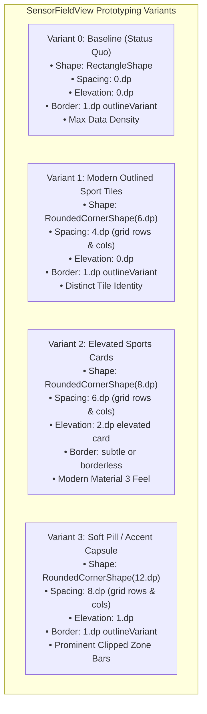

# Stage 1 Analysis: ATT-2058 - Visual Evaluation & Prototyping: Rounded Corners & Tile Spacing Variants for SensorFieldView

**Ticket**: [ATT-2058](https://rainerblind.atlassian.net/browse/ATT-2058)  
**Sub-task**: [ATT-2226](https://rainerblind.atlassian.net/browse/ATT-2226) (`[Analysis]`)  
**Parent Epic**: [ATT-355](https://rainerblind.atlassian.net/browse/ATT-355) (*Good and consistent UI*)  
**Target Release**: `V4.9.39`  
**Active Sprint**: `Sprint 2026-40.14`  
**Branch**: `feature/ATT-2058`  
**Author**: AI Agent 1 (Implementer)  
**Date**: 2026-10-03  

---

## 1. Problem Statement & Motivation

The live workout tracking cockpit (`SensorGridScreen.kt` and `SensorFieldView.kt`) is the central telemetry interface of **aTrainingTracker**. It presents real-time biometric and mechanical sensor metrics (Heart Rate, Cadence, Power, Speed, Pace, Altitude, Zones, Time, Distance) in a flexible, user-configured multi-row, multi-column grid.

Currently, each telemetry tile is rendered using a strict `RectangleShape` with a subtle 1dp border (`BorderStroke(1.dp, MaterialTheme.colorScheme.outlineVariant)`), seamlessly abutting adjacent tiles with zero inter-tile spacing (`Arrangement.spacedBy(0.dp)`). While this tabular structure maximizes available display area and mimics traditional digital LCD bike computers, the overall visual language feels somewhat rigid and dated compared to modern athletic wearables (such as Apple Fitness, Garmin Edge modern UI, and Wahoo Bolt).

Earlier informal experiments with rounded corners on `SensorFieldView` were abandoned because they appeared visually unconvincing and fragmented. Forensic investigation demonstrates why: when individual tiles in a multi-column, multi-row grid are rounded (e.g., `RoundedCornerShape(8.dp)`) without introducing synchronized inter-tile spacing, the tiles touch along their flat edges while creating awkward, hollow "diamond" gaps at four-corner intersections.

To evaluate whether modern rounded tiles can elevate the visual appeal and glanceability of the cockpit without degrading outdoor legibility or information density, this ticket establishes a structured prototyping framework and visual preview suite comparing distinct design variants for review and decision during the agile Sprint Review ceremony (Ceremony 2).

---

## 2. Forensic Investigation & Root Cause Analysis

### 2.1 The Current Cockpit Layout Architecture

Inspection of `SensorFieldView.kt` and `SensorGridScreen.kt` identifies the structural factors governing tile appearance:

1. **Hardcoded Shape & Border in `SensorFieldView.kt` (Lines 191–222)**:
   ```kotlin
   Card(
       modifier = modifier
           .fillMaxWidth()
           .combinedClickable(...),
       shape = RectangleShape,
       colors = CardDefaults.cardColors(
           containerColor = if (fieldState.zoneColor != Color.Transparent && fieldState.zoneDisplayOptions.showBackground) {
               fieldState.zoneColor.copy(alpha = 0.12f).compositeOver(MaterialTheme.colorScheme.surface)
           } else {
               MaterialTheme.colorScheme.surface
           }
       ),
       border = if (isSelectedForMove) {
           BorderStroke(2.dp, MaterialTheme.colorScheme.primary)
       } else {
           BorderStroke(1.dp, MaterialTheme.colorScheme.outlineVariant)
       }
   )
   ```
   - `shape = RectangleShape` is hardcoded directly on the Card.
   - `elevation` is defaulted to standard flat elevation (`CardDefaults.cardElevation()`).

2. **Zero-Spacing Grid Layout in `SensorGridScreen.kt` (Lines 207–235)**:
   ```kotlin
   Column(
       modifier = Modifier
           .fillMaxWidth()
           .verticalScroll(rememberScrollState()),
       horizontalAlignment = Alignment.CenterHorizontally
   ) {
       sortedRows.forEach { rowNr ->
           Row(
               verticalAlignment = Alignment.CenterVertically,
               modifier = Modifier.height(IntrinsicSize.Min)
           ) {
               fieldsInThisRow.forEach { fieldState ->
                   Box(modifier = Modifier.weight(1f)) {
                       SensorFieldView(...)
                   }
               }
           }
       }
   }
   ```
   - Neither the outer `Column` nor the inner `Row` composables apply `verticalArrangement = Arrangement.spacedBy(...)` or `horizontalArrangement = Arrangement.spacedBy(...)`.
   - Tiles are packed tightly with 0dp padding.

3. **Zone Indicator Strip Clipping in `SensorFieldView.kt` (Lines 223–232)**:
   ```kotlin
   Row(modifier = Modifier.fillMaxWidth().height(IntrinsicSize.Min)) {
       // 1. Left Indicator Strip
       if (fieldState.zoneColor != Color.Transparent && fieldState.zoneDisplayOptions.showLeftBar) {
           Spacer(
               modifier = Modifier
                   .width(6.dp)
                   .fillMaxHeight()
                   .background(fieldState.zoneColor)
           )
       }
   ...
   ```
   - In `SensorFieldView`, the 6dp left vertical zone bar sits flush against the left edge.
   - When the `Card` has rounded corners, Compose `Card` clips its inner contents to its shape. However, if outer tile margins are absent or if the card border overlaps the indicator strip, visual distortion occurs.

---

## 3. Visual Variant Definition for Evaluation

To enable rigorous human visual evaluation without disrupting active sprint execution, we define four distinct design variants:



### Variant Matrix
| Variant ID | Name | Corner Radius | Grid Spacing | Elevation | Border | Visual Character |
| :--- | :--- | :--- | :--- | :--- | :--- | :--- |
| **V0** | Baseline (Status Quo) | `0.dp` (`RectangleShape`) | `0.dp` | `0.dp` | `1.dp` (`outlineVariant`) | Traditional digital LCD bike computer, continuous grid, maximum telemetry density. |
| **V1** | Modern Outlined Tiles | `6.dp` (`RoundedCornerShape`) | `4.dp` | `0.dp` | `1.dp` (`outlineVariant`) | Crisp sports watch aesthetic; clean negative space prevents diamond intersection artifacts. |
| **V2** | Elevated Sports Cards | `8.dp` (`RoundedCornerShape`) | `6.dp` | `2.dp` | `None` / `0.5.dp` | Modern Material 3 depth; soft tactile surface separation. |
| **V3** | Soft Accent Capsule | `12.dp` (`RoundedCornerShape`) | `8.dp` | `1.dp` | `1.dp` (`outlineVariant`) | Expressive lifestyle sport HUD; rounded athletic pods with smoothly curved zone indicator strips. |

---

## 4. Requirements Archaeology & Chesterton's Fence (`REQ-PRO-022`)

1. **Original Requirement ID & Target**:
   - `REQ-UI-171` (*High-Contrast Cockpit Typography and Subtle Tile Grid for Sunlight Legibility*), targeting `SensorFieldView.kt` and `AmoledDarkColorScheme`.
   - `REQ-UI-169` (*AMOLED Pure Black Cockpit Theme #000000*).
   - `REQ-UI-200` (*Cockpit Sensor Grid Pick & Place Reordering & Swapping Architecture*).
2. **Historical Origin & Commit Trace**:
   - `REQ-UI-171` was introduced in `ATT-1264` (commit `6bfb0e35`), establishing the 1dp `outlineVariant` border to delineate seamless tiles on pure pitch-black AMOLED surfaces.
   - `REQ-UI-200` was introduced in `ATT-1629`, establishing the pick-and-place reordering mode with `BorderStroke(2.dp, MaterialTheme.colorScheme.primary)`.
3. **Root Reason for Existing Formulation**:
   - The seamless rectangular grid was selected because early rounded-corner attempts failed due to the lack of grid spacing. The priority was turning off OLED pixels (`#000000`) and maximizing display area for 6–8 simultaneous sensor metrics.
4. **Preservation of Core Invariants**:
   - **Production Default Immutability**: The default runtime behavior of `SensorFieldView` and `SensorGridScreen` MUST remain 100% identical to the baseline (Variant 0) unless explicitly configured or selected during Sprint Review.
   - **AMOLED Contrast**: Numeric values remain true white (`#FFFFFF`) with `FontWeight.SemiBold`; labels remain `#9E9E9E` per `REQ-UI-171`.
   - **Pick & Place Reordering (`REQ-UI-200`)**: Long-press selection, primary accent border (2dp), `ColAdder`, `RowAdder`, and swap mechanics MUST remain fully functional across all variants.
   - **LiveSegment Priority**: `LiveSegmentDisplay` atop the cockpit MUST NOT be compromised.

---

## 5. Scope Bounding & Invariants

### In Scope
1. Encapsulate tile styling parameters in `SensorFieldView` (allowing `shape`, `border`, `elevation` to be passed or derived cleanly with baseline defaults).
2. Encapsulate grid spacing in `SensorGridScreen` (allowing `rowSpacing`, `colSpacing`, `contentPadding` to be configured or derived).
3. Implement dedicated, high-fidelity Compose `@Preview` composables rendering 2x2 and 3x2 sensor cockpit grids for all 4 variants in both **AMOLED Dark Mode** and **Light Mode**.
4. Author unit/contract tests verifying default parameter invariance and shape/spacing resolution.

### Out of Scope
1. Changing the production runtime default before PO evaluation at Sprint Review.
2. Altering SQLite schema in `TrackingViewsDatabaseManager`.
3. Refactoring `EditSensorFieldDialog` or `LiveSegmentDisplay`.

---

## 6. Verification & Gate 1 Criteria

| Gate Check | Description | Status |
| :--- | :--- | :--- |
| **Problem Domain Closeness** | Root cause of rounded corner failure (zero-spacing intersection artifacts) forensics confirmed | **PASS** |
| **Variant Differentiation** | 4 actionable, distinct variants defined with concrete metrics | **PASS** |
| **Invariance Protection** | REQ-UI-171, REQ-UI-200, and production baseline preserved | **PASS** |
| **Sprint Alignment** | Previews enabled for Ceremony 2 review without sprint interruption | **PASS** |
