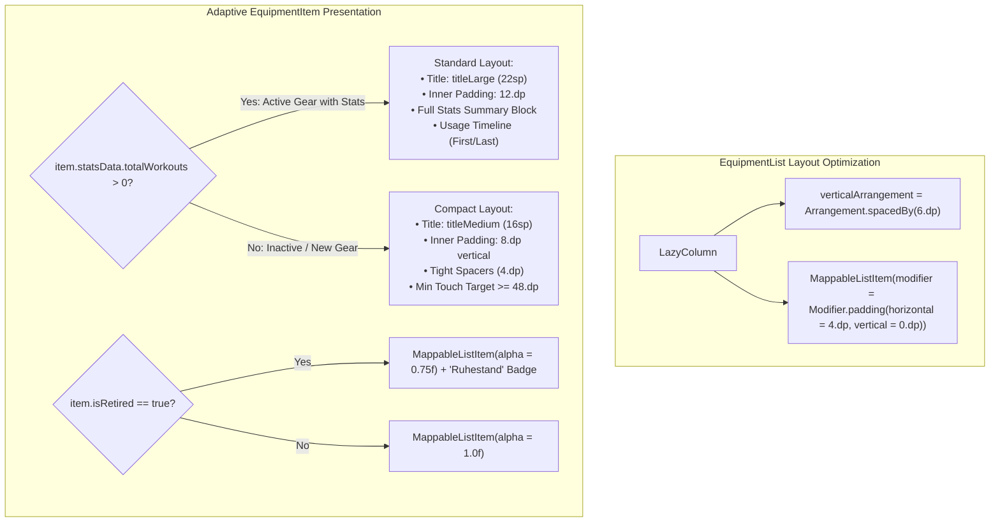

# Stage 1 Analysis: ATT-2059 - Reduce Card Spacing and Compact Inactive Items on Equipment Screen

**Ticket**: [ATT-2059](https://rainerblind.atlassian.net/browse/ATT-2059)  
**Sub-task**: [ATT-2220](https://rainerblind.atlassian.net/browse/ATT-2220) (`[Analysis]`)  
**Parent Epic**: [ATT-355](https://rainerblind.atlassian.net/browse/ATT-355) (*Good and consistent UI*)  
**Target Release**: `V4.9.39`  
**Active Sprint**: `Sprint 2026-40.14`  
**Branch**: `feature/ATT-2059`  
**Author**: AI Agent 1 (Implementer)  
**Date**: 2026-10-03  

---

## 1. Problem Statement & Motivation

On the Equipment management screen (`EquipmentTabsScreen.kt` across the "Bikes" and "Shoes" tabs), the vertical inter-card spacing is currently overly generous. Because `LazyColumn` specifies `verticalArrangement = Arrangement.spacedBy(12.dp)` and each card's container `MappableListItem` specifies `padding(horizontal = 4.dp, vertical = 4.dp)`, adjacent cards accumulate a total visual gap of **20.dp** (4.dp bottom padding + 12.dp item spacing + 4.dp top padding).

On typical Android mobile displays, this excessive vertical gap impairs information density. Athletes with several bicycles or pairs of shoes are forced to scroll extensively to view their gear.

Furthermore, equipment items without any recorded workouts (`item.statsData.totalWorkouts == 0`) and retired gear items (`item.isRetired == true`) currently occupy disproportionate vertical space. While items with zero workouts omit the stats block, their configuration block retains full generous padding (`12.dp`), large typography (`MaterialTheme.typography.titleLarge`), and loose line spacing, resulting in sparse, whitespace-heavy cards.

To improve information density and UX harmony:
1. The vertical gap between consecutive cards should be harmonized to a clean, cohesive 6.dp to 8.dp.
2. Inactive / zero-workout equipment items should be presented in a compact, elegant format with tighter padding and proportional typography, while fully preserving touch target usability (>= 48.dp) and readability.

---

## 2. Root Cause Analysis (Forensic Investigation)

Inspection of `app/src/main/java/com/atrainingtracker/trainingtracker/ui/equipment/EquipmentTabsScreen.kt` reveals:

1. **Compounding Spacing in `EquipmentList` (Lines 340–350)**:
   ```kotlin
   LazyColumn(
       state = scrollState,
       modifier = Modifier.fillMaxSize(),
       contentPadding = PaddingValues(
           top = topPadding + 16.dp,
           bottom = bottomPadding + 16.dp,
           start = 4.dp,
           end = 4.dp
       ),
       verticalArrangement = Arrangement.spacedBy(12.dp)
   )
   ```
2. **Double-Padding in `EquipmentItem` (Lines 415–424)**:
   ```kotlin
   MappableListItem(
       modifier = Modifier.padding(horizontal = 4.dp, vertical = 4.dp),
       onClick = { onConfigClick(item) },
       onLongClick = { showMenu = true }
   ) {
       Column(
           modifier = Modifier
               .fillMaxWidth()
               .padding(12.dp)
       ) { ... }
   ```
   - Each card applies `vertical = 4.dp`. Two adjacent cards contribute `4.dp + 4.dp = 8.dp`. Combined with `Arrangement.spacedBy(12.dp)`, the total gap between card elevation boundaries is `20.dp`.
   - Inside the card, line 481 contains an inadvertent width spacer inside a Column: `Spacer(modifier = Modifier.width(6.dp))`.

3. **Absence of Inactive / Zero-Workout Compact Mode**:
   - Whether an equipment item has 10,000 km across 500 workouts or 0 km with 0 workouts, the configuration header renders identically:
     - Name uses `MaterialTheme.typography.titleLarge` (22sp).
     - Vertical padding is uniformly `12.dp`.
     - Spacers between subtitle lines are `8.dp` and `6.dp`.
   - Retired items (`item.isRetired`) only show a small red pill badge without any visual subordination or height optimization.

---

## 3. User Scope Grounding (ATT-1250)

* **In-Scope Goals**:
  * Harmonize vertical card spacing in `EquipmentTabsScreen.kt` (`EquipmentList`) to a unified, compact gap between 6.dp and 8.dp.
  * Adjust `MappableListItem` vertical padding to `0.dp` and `LazyColumn.verticalArrangement` to `Arrangement.spacedBy(6.dp)` (or `8.dp`).
  * Implement an adaptive compact layout for inactive equipment (`statsData.totalWorkouts == 0` or `isRetired`):
    - Compact title typography (`titleMedium` for 0-workout items vs `titleLarge` for active items with workout statistics).
    - Streamlined internal vertical padding (`8.dp` when 0 workouts vs `12.dp` when rich stats exist).
    - Consistent row spacing (`4.dp`) between metadata rows (Strava, Sport types, Sensors).
    - Subdued alpha (`0.75f` or `0.8f`) on `MappableListItem` when `item.isRetired` to provide clear visual distinction.
  * Guarantee touch target accessibility: min card height >= 48.dp, single-tap to edit, long-press to delete (`REQ-UI-061`).
  * Author contract tests verifying layout metrics, compact state determination, and interactive touch invariants.

* **Out-of-Scope Non-Goals (Scope Bounding)**:
  * Do NOT modify `EquipmentSensorMatrixScreen` (Tab 3, recently realized under ATT-2126).
  * Do NOT alter database persistence or schema (`EquipmentDbHelper.java`, `EquipmentRepository.kt`).
  * Do NOT alter Strava synchronization or sport type links (`SportTypeEquipmentLinkManager.kt`).
  * Do NOT alter `EditEquipmentDialog` or `DeleteConfirmationDialog`.

---

## 4. Requirement Archaeology & Chesterton's Fence Audit

* **Original Requirement ID & Target**: Net-new requirement only: `REQ-UI-257` (*Compact Equipment Card Layout & Harmonized Inter-Card Spacing*). No existing requirements modified.
* **Chesterton's Fence Context**:
  - `REQ-UI-017` established `MappableListItem` as the standardized card container.
  - `REQ-UI-061` established universal delete-only long-press menus anchored at Top-Left (`Alignment.TopStart`).
  - `REQ-SET-002` established equipment management with odometers.
  - The changes strictly respect and preserve all three invariants.

---

## 5. Architectural Strategy & High-Level Solution



---

## 6. System Invariants & Risk Assessment

* **Core Invariants**:
  1. Accessibility: The clickable card container SHALL maintain a minimum vertical touch target height of at least 48.dp per WCAG guidelines.
  2. Interaction Contracts: Single tap (`onConfigClick`) SHALL launch `EditEquipmentDialog`; long-press SHALL open Top-Left `DropdownMenu` with delete action (`REQ-UI-061`).
  3. Clean-Room Regression: All 1500+ unit tests SHALL pass without failure (`./gradlew testDebugUnitTest`).
  4. Localization Parity: Zero missing strings across all 9 supported locales.

* **Risk Assessment**:
  - Risk: Reducing card spacing could make cards feel crowded.
  - Mitigation: `6.dp` to `8.dp` inter-card spacing combined with `MappableListItem`'s standard 16.dp rounded corners and 2.dp elevation provides a crisp, modern Material 3 list rhythm without crowding.
