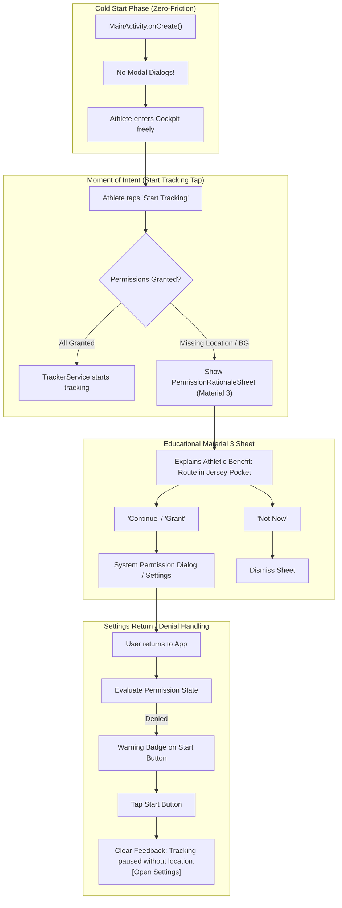

# Stage 1 Analysis: ATT-2075 - Modernize Permission Flow: Contextual Just-in-Time Prompts & Graceful Settings Return Handling

**Ticket**: [ATT-2075](https://rainerblind.atlassian.net/browse/ATT-2075)  
**Sub-task**: [ATT-2210](https://rainerblind.atlassian.net/browse/ATT-2210) (`[Analysis]`)  
**Parent Epic**: [ATT-355](https://rainerblind.atlassian.net/browse/ATT-355) (*Good and consistent UI*)  
**Target Release**: `V4.9.39`  
**Active Sprint**: `Sprint 2026-40.14`  
**Branch**: `feature/ATT-2075`  
**Author**: AI Agent 1 (Implementer)  
**Date**: 2026-10-03  

---

## 1. Problem Statement & Motivation

The permission handling in `MainActivityWithNavigation.kt` currently relies on legacy `AlertDialog.Builder` popup chains dispatched synchronously during cold start (`onCreate`). This presents several critical UX deficiencies:

1. **High Cold-Start Friction (The "Popup Wall")**:
   - New athletes opening the app for the first time to explore features (such as cockpit sensor grid, equipment management, workout history, or routes) are immediately bombarded with modal dialogs:
     - Location permission `AlertDialog` (`R.string.location_permission_required`)
     - Background location `AlertDialog` (`R.string.background_location_permission_title`) on Android 11+ (API 30+)
     - Battery optimization ignore request dialog (`R.string.battery_optimization_title`)
   - Athletes are forced to make high-stakes permission decisions before seeing or understanding what the app does.
2. **Outdated UI & Poor Athletic Messaging**:
   - Monolithic gray system `AlertDialog` dialogs containing dry legalistic text blocks instead of modern Material 3 surfaces.
   - Fails to clearly convey the sport-specific athletic necessity of background location (e.g. tracking route coordinates continuously while the phone is stowed in a cycling jersey pocket or running belt with screen locked).
3. **Dead-End Start Button on Permission Denial**:
   - In `ControlTrackingScreen.kt`, the primary action button (`ControlTrackingButton`) is simply disabled (`enabled = hasLocationPermission`).
   - If an athlete denies location or returns from system settings without granting permissions, the Start button is muted and non-responsive without any tooltip, toast, or feedback explaining why it cannot be tapped.
4. **No Graceful Settings Return Handling ("Bad Choice" Handling)**:
   - When returning from system settings after a permission denial, the app provides zero visual feedback or status indicator.

---

## 2. Forensic Root Cause & Gap Analysis

### Current Architecture State
1. **Cold-Start Call Chain in `MainActivityWithNavigation.kt`**:
   - Lines 384–392:
     ```kotlin
     // getPermissions
     getPermissions(true)
     checkBatteryOptimizations()
     ```
   - `getPermissions(popup = true)` checks `ACCESS_FINE_LOCATION`, `ACCESS_COARSE_LOCATION`, `ACCESS_BACKGROUND_LOCATION` (Android 10), `BLUETOOTH_CONNECT`, `BLUETOOTH_SCAN` (Android 12+), and `POST_NOTIFICATIONS` (Android 13+).
   - If missing, it immediately pops up `AlertDialog.Builder(this)`.
   - On Android R+ (API 30+), `onRequestPermissionsResult` automatically triggers another alert: `showBackgroundLocationDialog()`.
2. **Disabled Start Button in `ControlTrackingScreen.kt`**:
   - Lines 124–157:
     ```kotlin
     var hasLocationPermission by remember { ... }
     ControlTrackingButton(
         modifier = Modifier.fillMaxWidth(),
         mode = trackingMode,
         enabled = hasLocationPermission,
         onStart = onStart, ...
     )
     ```
   - The button is unresponsive if `hasLocationPermission` is false.
3. **Absence of Contextual Intent Interceptor**:
   - There is no central permission state holder or Just-in-Time coordinator that checks whether required permissions are satisfied before dispatching `onStartTracking()`.
   - There is no Material 3 BottomSheet or rationale dialog designed with sport-specific explanations and direct launch intents.

---

## 3. Chesterton's Fence Requirement Archaeology

* **Original Requirement ID & Target**: `REQ-PRI-001` (*Permission Transparency*), complemented by `REQ-STB-008` (*Resilient Permission-Gated Location Provider Access & Startup Crash Immunity*).
* **Historical Origin & Commit Trace**: Introduced in commit `ac493d2bdf` (June 2026) during initial ASPICE baseline establishment.
* **Root Reason for Existing Formulation**: `REQ-PRI-001` aimed to ensure transparency before requesting Android runtime permissions, especially background location. However, it was implemented as eager startup popups in `MainActivityWithNavigation.onCreate()`, violating the principle of Just-in-Time contextual requests (Material Design 3 and Android Human Interface Guidelines).
* **Preservation of Core Invariants**:
  - `REQ-STB-008` crash immunity: Invocations of `LocationManager.getProvider()` and `isProviderEnabled()` must remain permission-gated and shielded against `SecurityException`.
  - Android 14+ FGS restrictions (`REQ-STB-002`): Background location is still required for unattended pocket tracking.
  - Transparent rationale before requesting background location must be preserved and modernized per Google Play Location Policy.

---

## 4. Proposed Architectural Design



### Components Decomposition
1. **Zero-Friction Cold Start**:
   - Remove eager `getPermissions(true)` and `checkBatteryOptimizations()` popups from `MainActivityWithNavigation.onCreate()`.
   - Preserve passive permission checking so internal states remain accurate.
2. **Modern Just-in-Time Material 3 Permission Sheet (`PermissionRationaleSheet.kt`)**:
   - An elegant Compose `ModalBottomSheet` explaining the practical athletic value of:
     - **Location ("Allow all the time")**: Needed to log GPS route, speed, and distance while your smartphone stays in your cycling jersey or running pocket with the screen off.
     - **Bluetooth (Nearby Devices)**: Needed to pair and receive telemetry from heart rate straps, speed/cadence sensors, and power meters.
     - **Notifications**: Needed to show workout telemetry and status controls on the lock screen.
3. **Active Start Button with Warning Badge**:
   - `ControlTrackingButton` remains interactive (`enabled = true`).
   - If permissions are missing, an amber warning badge or warning icon is displayed on or next to the Start button.
   - Tapping Start when permissions are missing triggers the rationale sheet (or settings redirect if previously permanently denied).
4. **Graceful Settings Return Handling**:
   - Re-evaluates permission state on `onResume` without launching popups.
   - If the user returns from settings without granting permissions, an inline status card or snackbar provides helpful, respectful context.

---

## 5. Scope Bounding (In-Scope vs Out-of-Scope per ATT-1250)

### In-Scope
- Refactor `MainActivityWithNavigation.kt`: Eliminate eager `onCreate` popup chains.
- Create `PermissionRationaleSheet.kt` (Material 3 `ModalBottomSheet`).
- Update `ControlTrackingScreen.kt` & `ControlTrackingButton.kt`: Support click-to-request when ungranted, warning badge indicator, and non-blocking intent dispatch.
- Update `ControlTrackingViewModel.kt`: Permission state flow, Just-in-Time request handling, settings navigation intent.
- 9-Language Localization Parity for all rationale explanations and badges.
- Unit and contract test suite verifying zero-popup cold start, JIT request trigger, and settings return handling.

### Out-of-Scope
- Refactoring `TrackerService` internal GPS collection logic (handled in `REQ-STB-002` / `REQ-STB-008`).
- Modifying ANT+ service installation checks (retained as non-blocking warning when needed).
- Changing SQLite schema or database models.

---

## 6. ASPICE Traceability & Verification Plan

- **Requirement**: `REQ-PRI-002` (*Contextual Just-in-Time Permission Flow, Zero-Friction Cold Start & Graceful Settings Return Handling*), refining `REQ-PRI-001`.
- **Test Spec**: `TST-PRI-002` (*Contextual Just-in-Time Permission Flow Verification*).
- **Target Deliverables**:
  - Stage 1: `docs/engineering/analysis/ATT-2075_analysis.md` (this document).
  - Stage 2: `docs/engineering/test_specs/ATT-2075_test_spec.md`, update `docs/requirements.md` and `docs/tests.md`.
  - Stage 3: `docs/engineering/plans/ATT-2075_plan.md`.
  - Stage 4: Implementation and contract test suite.
  - Stage 5: Clean-room regression and walkthrough report.
