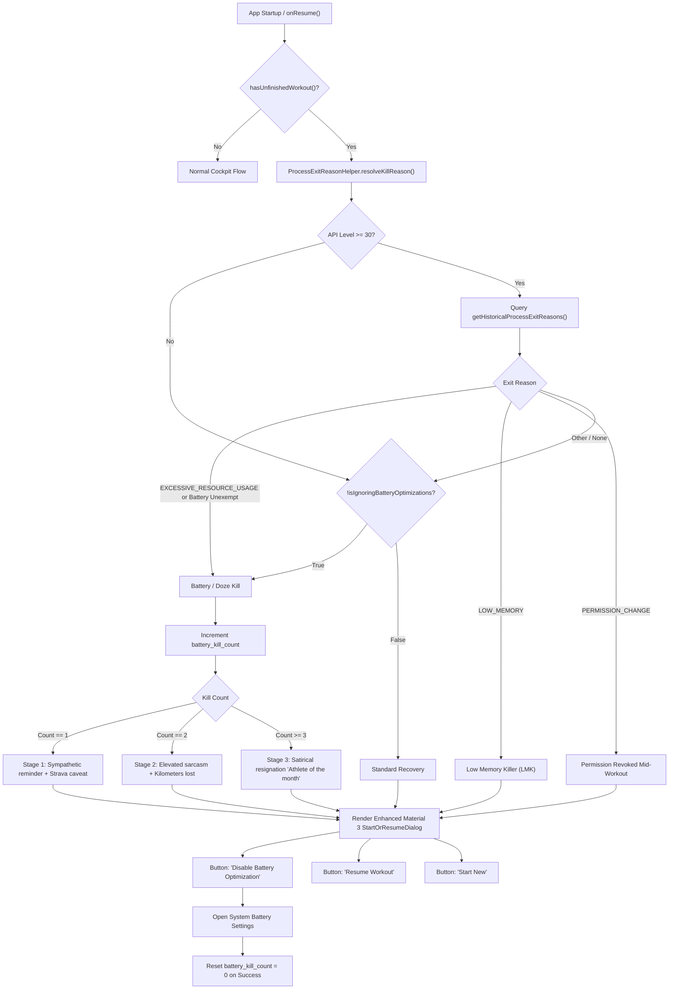

# Stage 1 Analysis: ATT-2079 - Inform Athlete on Process Kill Reasons (Battery Saver, LMK, Permission Revocation) via ApplicationExitInfo

**Ticket**: [ATT-2079](https://rainerblind.atlassian.net/browse/ATT-2079)  
**Sub-task**: [ATT-2215](https://rainerblind.atlassian.net/browse/ATT-2215) (`[Analysis]`)  
**Parent Epic**: [ATT-355](https://rainerblind.atlassian.net/browse/ATT-355) (*Good and consistent UI*)  
**Target Release**: `V4.9.39`  
**Active Sprint**: `Sprint 2026-40.14`  
**Branch**: `feature/ATT-2079`  
**Author**: AI Agent 1 (Implementer)  
**Date**: 2026-10-03  

---

## 1. Problem Statement & Motivation

During active sports tracking (cycling, long-distance running), the Android operating system may terminate the background tracking process (`TrackerService`) unexpectedly due to aggressive platform resource management. Common termination triggers include:
1. **Aggressive Battery Optimizations / Doze Mode**: OEM firmware (e.g. Samsung, Xiaomi, Huawei) and Android standard battery management killing background services holding partial wakelocks.
2. **Low Memory Killer (LMK)**: When the athlete opens resource-intensive foreground applications during their workout (e.g., high-resolution camera to take landscape photos, 3D navigation, streaming music).
3. **Runtime Permission Revocation**: The operating system or user revoking location or notification permissions while tracking is running.

### The Current User Experience Deficiency
When an athlete re-opens the app following such an unexpected process kill, `MainActivityWithNavigation.checkUnfinishedWorkout()` detects the unfinalized workout in SQLite (`hasUnfinishedWorkout() == true`) and launches `StartOrResumeDialog.java`.

However, the existing dialog displays a generic, uninformative prompt:
> *"The previous workout was not finished properly. Do you want to start a new workout or resume the previous one?"*

This causes severe user frustration:
- **Misattributed App Bugs**: The athlete assumes aTrainingTracker is buggy and crashed, even though the Android operating system intentionally terminated the process.
- **Zero Preventative Action**: The athlete is not advised how to prevent future occurrences (e.g. exempting the app from battery optimization in Android settings).
- **Missed Opportunity for Athletic Empathy**: Process kills during high-effort workouts are deeply disappointing (loss of GPS distance, speed telemetry, elevation). Transparent, human, and humorous communication turns a frustrating platform limitation into trust and user empowerment.

---

## 2. Forensic Investigation & Current Call Hierarchy

### Current Call Sequence in `MainActivityWithNavigation.kt`
1. **`onResume()`**:
   - `checkUnfinishedWorkout()` is executed on every activity resume (unless resuming directly from the interrupted notification pending intent).
2. **`checkUnfinishedWorkout()`**:
   ```kotlin
   if (!TrainingApplication.isTracking()) {
       if (WorkoutSummariesDatabaseManager.getInstance(this).hasUnfinishedWorkout()) {
           if (supportFragmentManager.findFragmentByTag(StartOrResumeDialog.TAG) == null) {
               showStartOrResumeDialog()
           }
       }
   }
   ```
3. **`StartOrResumeDialog.java`**:
   - Simple legacy `DialogFragment` showing `R.string.start_or_resume_dialog_message`.
   - Offers only two buttons:
     - `R.string.resume_workout` -> `mStartOrResumeInterface.chooseResume()`
     - `R.string.start_new_workout` -> `mStartOrResumeInterface.chooseStart()`
   - No diagnostic context, no kill reason, no settings shortcut.

---

## 3. Android Platform Forensics: `ApplicationExitInfo` & `PowerManager`

### 1. `ApplicationExitInfo` API (Android 11+ / API 30+)
Android 11 introduced `ActivityManager.getHistoricalProcessExitReasons(packageName, pid, maxNum)`:
```kotlin
if (Build.VERSION.SDK_INT >= Build.VERSION_CODES.R) {
    val am = context.getSystemService(Context.ACTIVITY_SERVICE) as ActivityManager
    val exitInfos = am.getHistoricalProcessExitReasons(context.packageName, 0, 1)
    val exitInfo = exitInfos.firstOrNull()
    // Evaluates exitInfo.reason, exitInfo.status, exitInfo.description, exitInfo.timestamp
}
```

Key exit reason codes relevant to workout tracking:
- `ApplicationExitInfo.REASON_EXCESSIVE_RESOURCE_USAGE`:
  - Process killed due to exceeding system resource limits (e.g. CPU, Wakelock timeout).
  - Sub-reasons include `SUBREASON_WAKELOCK_TIMEOUT`, `SUBREASON_EXCESSIVE_CPU`.
- `ApplicationExitInfo.REASON_LOW_MEMORY`:
  - Process killed by the Linux Low Memory Killer daemon (`lmkd`) because system-wide RAM was exhausted.
- `ApplicationExitInfo.REASON_PERMISSION_CHANGE`:
  - Process killed because runtime permissions were modified while running.
- `ApplicationExitInfo.REASON_USER_REQUESTED` / `REASON_USER_ACTION`:
  - User explicitly swiped app from Recents or stopped it via Task Manager.
- `ApplicationExitInfo.REASON_CRASH` / `REASON_CRASH_NATIVE`:
  - Uncaught exception or native signal (SIGSEGV, SIGABRT).

### 2. `PowerManager.isIgnoringBatteryOptimizations` (Android 6+ / API 23+)
```kotlin
val pm = context.getSystemService(Context.POWER_SERVICE) as PowerManager
val isIgnoring = pm.isIgnoringBatteryOptimizations(context.packageName)
```
- If an unfinished workout is found and `!isIgnoring`, aggressive battery saving / Doze is a primary kill suspect.
- When `isIgnoring == false`, the app can launch an action intent to allow the user to exempt aTrainingTracker:
  ```kotlin
  Intent(Settings.ACTION_IGNORE_BATTERY_OPTIMIZATION_SETTINGS)
  ```
  or directly prompt via `Settings.ACTION_REQUEST_IGNORE_BATTERY_OPTIMIZATIONS` with `data = Uri.parse("package:$packageName")`.

---

## 4. Chesterton's Fence Requirement Archaeology

* **Original Requirement ID & Target**: `REQ-STB-003` (*Interrupted Workout Resumption & Unfinished Workout Recovery*).
* **Historical Origin & Commit Trace**: Established in commit `5a47e7bc` for `ATT-635`.
* **Root Reason for Existing Formulation**: `REQ-STB-003` ensures that workouts interrupted by process crashes or restarts can be recovered from SQLite without data loss (`FINISHED == 0`) and prompts `StartOrResumeDialog`.
* **Preservation of Core Invariants**:
  - The resumption contract (`chooseResume()` and `chooseStart()`) must remain 100% intact.
  - Recovery of unfinalized workout metrics (`WorkoutSummariesDatabaseManager.discardOrFinishUnfinishedWorkout()`, `TrackerService.StartType.RESUME_BY_USER`) must NOT be corrupted.
  - Resumption from the interrupted notification extra (`EXTRA_RESUME_INTERRUPTED_WORKOUT`) continues to bypass the dialog and immediately resume.
  - New requirement `REQ-STB-012` enriches the recovery dialog with forensic diagnosis and escalation without breaking backward compatibility or crash recovery.

---

## 5. Architectural Design: Progressive Escalation Ladder & Forensics



### The Progressive Escalation Counter
- **Storage**: Key `PREF_BATTERY_KILL_COUNT` stored persistently.
- **Escalation Rules**:
  1. **Stage 1 (`count == 1`)**:
     - *Tone*: Sportliches Mitgefühl & augenzwinkernde Rüge.
     - *Strava Addition* (if `TrainingApplication.uploadToStrava()`): *"Und du weißt ja: 'If it's not on Strava, it didn't happen'... doppelt bitter! 🙈"*
  2. **Stage 2 (`count == 2`)**:
     - *Tone*: Gesteigerte Fassungslosigkeit & sportlicher Sarkasmus (*"Nicht schon wieder... Schon der 2. Kill! Wie viele verlorene Kilometer brauchst du noch als Beweis?"*).
  3. **Stage 3+ (`count >= 3`)**:
     - *Tone*: Satirische Resignation (*"Aller schlechten Dinge sind drei... Beratungsresistenter Athlet des Monats 🏆"*).
- **Reset Logic**:
  - Whenever `isIgnoringBatteryOptimizations` evaluates to `true` (either on resume or after returning from settings), `battery_kill_count` is reset to `0`.

---

## 6. Scope Bounding (In-Scope vs Out-of-Scope per ATT-1250)

### In-Scope
1. **`ProcessExitReasonHelper.kt`**:
   - Encapsulates `ApplicationExitInfo` query, `PowerManager` check, and exit categorization.
   - Computes structured `ProcessKillDiagnosis` (type: `BATTERY_KILL`, `LOW_MEMORY`, `PERMISSION_REVOKED`, `GENERIC_UNFINISHED`).
2. **Persistent Counter & Reset Handling**:
   - `battery_kill_count` tracking and reset on battery optimization exemption.
3. **Enhanced `StartOrResumeDialog`**:
   - Modernized styling with diagnostic header, reason-specific explanation, progressive escalation text, and shortcut button to battery optimization settings when applicable.
4. **9-Language Parity (`REQ-LOC-001`)**:
   - Full translation coverage across EN, DE, ES, FR, IT, JA, NL, PL, PT for all escalation stages and LMK/permission messages.
5. **Unit & Contract Tests**:
   - Verification of exit reason classification, escalation counter increment/reset, Strava conditional formatting, and backward compatibility fallback on API < 30.

### Out-of-Scope
- Changing SQLite database schemas or `WorkoutSummariesDatabaseManager`.
- Modifying `TrackerService` internal GPS collection or notification logic.
- Automated system settings manipulation (Android security disallows toggling battery optimization without user intent).

---

## 7. ASPICE Traceability & Verification Plan

- **Requirement ID**: `REQ-STB-012` (*Forensic Process Kill Diagnosis, Progressive Escalation & Battery Optimization Guidance*).
- **Test Spec ID**: `TST-STB-012` (*Forensic Process Kill Diagnosis & Progressive Escalation Verification*).
- **Deliverables Roadmap**:
  - Stage 1: `docs/engineering/analysis/ATT-2079_analysis.md` (this document).
  - Stage 2: `docs/engineering/test_specs/ATT-2079_test_spec.md`, update `docs/requirements.md` and `docs/tests.md`.
  - Stage 3: `docs/engineering/plans/ATT-2079_plan.md`.
  - Stage 4: Implementation in `ProcessExitReasonHelper.kt`, `StartOrResumeDialog.kt`, string parity, and unit test suites.
  - Stage 5: Full regression suite execution and walkthrough deliverable.
