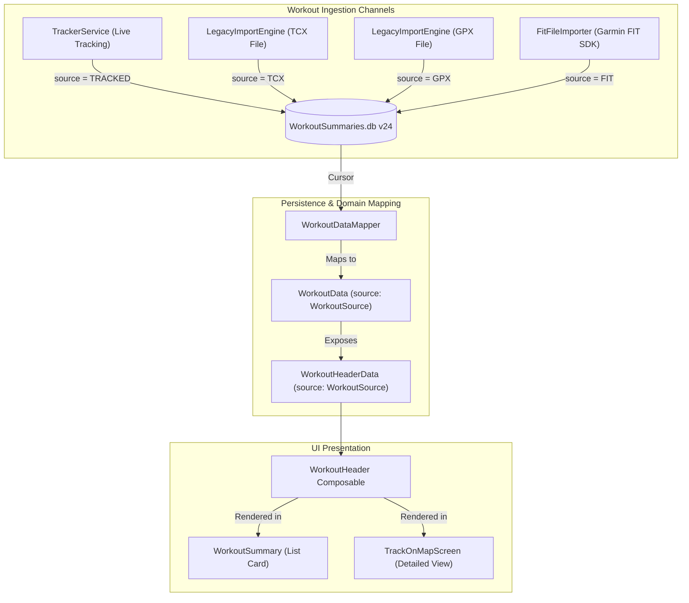

# Stage 1 Analysis: ATT-2186 - Add Origin Source Attribute (Tracked, TCX, GPX, FIT) to Workouts

**Ticket**: [[ATT-2186]](https://atrainingtracker.atlassian.net/browse/ATT-2186)  
**Sub-task**: [[ATT-2187]](https://atrainingtracker.atlassian.net/browse/ATT-2187) (`[Analysis]`)  
**Parent Epic**: [[ATT-281]](https://atrainingtracker.atlassian.net/browse/ATT-281) (*Data Sovereignty & Migration*)  
**Target Release**: `V4.9.39`  
**Active Sprint**: `2026-40.14`  
**Branch**: `feature/ATT-2186`  
**Author**: AI Agent 1 (Implementer)  
**Date**: 2026-10-03  

---

## 1. Problem Statement & Motivation

As `aTrainingTracker` evolves into a comprehensive, self-contained endurance sports ecosystem, workouts can originate through multiple distinct entry channels:
1. **Live Sensor Tracking**: Workouts recorded in real time on the device via `TrackerService` / `LiveWorkoutSession` with GPS, BLE, and ANT+ telemetry.
2. **Garmin TCX Imports**: Activities imported from local files or Dropbox sync via `LegacyImportEngine.importTcxFile`.
3. **GPX Activity Imports**: Workouts parsed and imported via `LegacyImportEngine.importGpxWorkoutStream`.
4. **Garmin FIT Binary Imports**: Upcoming native FIT file importer ([ATT-1828](https://atrainingtracker.atlassian.net/browse/ATT-1828)) using the official Garmin FIT SDK.

Currently, `WorkoutSummaries.TABLE` stores high-level session metadata such as sport, equipment, timing, distance, extrema, and flags like commute, trainer, and race. However, **workouts lack a dedicated origin provenance attribute**. 

Once an activity is stored in SQLite, there is no attribute explicitly indicating whether the workout was recorded live on the phone or imported from an external source (TCX, GPX, or FIT). Athletes viewing their workout journal or inspecting workout details cannot discern the recording origin of their sessions. Furthermore, downstream analytical components and cloud synchronization cannot tailor behavior based on origin provenance.

This improvement introduces an explicit, persistent **Workout Origin Source** attribute (`WorkoutSource`: `TRACKED`, `TCX`, `GPX`, `FIT`) across the database schema, domain models, mapping layer, import engines, tracking services, and UI presentation components.

---

## 2. Root Cause Analysis (Forensic Investigation & Architectural Gap Analysis)

A forensic audit of the data persistence and presentation layers reveals the exact gaps across the application:

### 2.1 SQLite Schema & Migration Layer (`WorkoutSummariesDatabaseManager.java`)
* The `WorkoutSummaries.TABLE` currently sits at schema revision 23 (`DB_VERSION = 23`), having recently added the `race` column in ATT-2005.
* The table schema definition in `WorkoutSummariesDbHelper.CREATE_TABLE` defines columns for identity, sport, timing, extrema, spatial bounds, and flags, but contains no column representing source origin.
* **Architectural Gap**:
  * Increment `DB_VERSION` from `23` to `24`.
  * Add constant `WorkoutSummaries.SOURCE = "source"`.
  * Update `CREATE_TABLE` to include `+ WorkoutSummaries.SOURCE + " text DEFAULT 'TRACKED',"` (or `DEFAULT 'TRACKED'`).
  * In `onUpgrade(SQLiteDatabase db, int oldVersion, int newVersion)`:
    ```java
    if (oldVersion < 24) {
        Log.i(TAG, "upgrading to DB version 24 (Adding workout source column)");
        addColumnIfNotExists(db, WorkoutSummaries.TABLE, WorkoutSummaries.SOURCE, "text", "'TRACKED'");
    }
    ```
  * In `updateWorkoutData(WorkoutData workoutData)`: persist `values.put(WorkoutSummaries.SOURCE, workoutData.getSource().name());` to preserve provenance across edits.

### 2.2 Domain Enum & Model Architecture
* Currently, no domain enum represents workout provenance.
* Introduce an immutable enum in `com.atrainingtracker.trainingtracker.database.WorkoutSource` (or `ui.aftermath`):
  ```kotlin
  enum class WorkoutSource {
      TRACKED, // Live sensor recording on device
      TCX,     // Imported Garmin TCX file
      GPX,     // Imported GPX workout file
      FIT;     // Imported Garmin FIT SDK binary file

      companion object {
          fun fromString(value: String?): WorkoutSource {
              if (value.isNullOrBlank()) return TRACKED
              return try {
                  valueOf(value.trim().uppercase())
              } catch (e: Exception) {
                  TRACKED
              }
          }
      }
  }
  ```
* In `WorkoutData.kt`:
  * Add `val source: WorkoutSource = WorkoutSource.TRACKED` to `WorkoutData`.
  * Update `val headerData: WorkoutHeaderData` getter to pass `source = source`.
* In `WorkoutHeaderData.kt`:
  * Add `val source: WorkoutSource = WorkoutSource.TRACKED` to `WorkoutHeaderData`.

### 2.3 Data Mapping Layer (`WorkoutDataMapper.kt`)
* In `WorkoutDataMapper.fromCursor(cursor: Cursor)`:
  * Extract `source` column safely with backwards-compatible fallback:
    ```kotlin
    source = cursor.getColumnIndex(WorkoutSummaries.SOURCE).takeIf { it >= 0 }?.let {
        WorkoutSource.fromString(cursor.getString(it))
    } ?: WorkoutSource.TRACKED,
    ```
* In `WorkoutRepository.kt`:
  * In `saveWorkout(userEditedWorkout: WorkoutData?)`, ensure `source = current.source` is preserved in the in-memory cache update block.

### 2.4 Ingestion & Creation Pipeline Points
1. **Live Tracking Service (`TrackerService.java`)**:
   * In `createNewWorkout()` (lines 761–789), populate `values.put(WorkoutSummaries.SOURCE, WorkoutSource.TRACKED.name());`.
2. **TCX File Importer (`LegacyImportEngine.kt`)**:
   * In `importTcxStream()` (lines 695–708), populate `put(WorkoutSummaries.SOURCE, WorkoutSource.TCX.name)`.
3. **GPX Workout Importer (`LegacyImportEngine.kt`)**:
   * In `importGpxWorkoutStream()` (lines 1103–1117), populate `put(WorkoutSummaries.SOURCE, WorkoutSource.GPX.name)`.
4. **FIT Workout Importer (`FitFileImporter.kt` / ATT-1828)**:
   * When creating workout entities from decoded FIT records, populate `WorkoutSummaries.SOURCE` with `WorkoutSource.FIT.name`.
5. **Database Backup Restore (`ImportEngine.kt`)**:
   * The database restore engine iterates dynamically over `cursor.columnCount` copying existing columns by name into the target SQLite database, automatically copying `SOURCE` when present and safely defaulting to `'TRACKED'` when restoring pre-v24 archives.

### 2.5 UI Presentation Layer (`WorkoutHeader.kt`)
* `WorkoutHeader.kt` is the shared header composable consumed by both:
  - `WorkoutSummary.kt` (the card rendered in `WorkoutList` / `WorkoutTabsScreen`).
  - `TrackOnMapScreen.kt` (the detailed full-screen workout view).
* In `WorkoutHeader.kt` (Row A: Sport specific info row), alongside the sport name, equipment, commute/trainer labels, and the Race badge (ATT-2005):
  - When `data.source != WorkoutSource.TRACKED`: Render a subtle Material 3 provenance badge (e.g. `Surface` with `colorScheme.surfaceVariant` / `onSurfaceVariant` or `secondaryContainer`, displaying a localized origin tag or badge icon + text, e.g. "TCX", "GPX", "FIT").
  - This immediately highlights imported activities while keeping live-recorded (`TRACKED`) workouts clean and uncluttered.

---

## 3. User Scope Grounding (ATT-1250)

* **In-Scope Goals**:
  1. Define `WorkoutSource` enum (`TRACKED`, `TCX`, `GPX`, `FIT`) with safe string parsing and default fallbacks.
  2. Upgrade `WorkoutSummaries.db` schema version from 23 to 24 with `SOURCE` column (`text DEFAULT 'TRACKED'`).
  3. Safe migration logic in `onUpgrade` defaulting all existing historical workouts to `TRACKED`.
  4. Tag live recordings with `TRACKED` in `TrackerService.createNewWorkout`.
  5. Tag TCX imports with `TCX` in `LegacyImportEngine.importTcxStream`.
  6. Tag GPX imports with `GPX` in `LegacyImportEngine.importGpxWorkoutStream`.
  7. Map `source` through `WorkoutData`, `WorkoutHeaderData`, and `WorkoutDataMapper`.
  8. Render distinct origin badge in `WorkoutHeader.kt` for imported workouts visible in both list cards and detailed view.
  9. Comprehensive unit tests covering DB migration, entity mapping, import tagging, and UI visual contracts.
* **Out-of-Scope Non-Goals (Scope Bounding)**:
  * Editing origin source manually in `EditWorkoutScreen` (origin is an immutable physical provenance, not a mutable user preference).
  * Backfill / guessing historical origins (all historical pre-v24 workouts are safely defaulted to `TRACKED`).
  * Creating the FIT importer (FIT importing logic is isolated to [ATT-1828](https://atrainingtracker.atlassian.net/browse/ATT-1828); ATT-2186 establishes the `FIT` enum constant and DB column readiness).

---

## 4. Requirement Archaeology & Chesterton's Fence Audit

* **Original Requirement ID & Target**: Net-new requirement only (`REQ-DAT-024` - *Workout Origin Source Provenance Attribute*). No existing requirements modified.
* **Historical Origin & Commit Trace**: N/A (Net-new feature).
* **Root Reason for Existing Formulation**: N/A.
* **Preservation of Core Invariants**: Existing SQLite tables, indices, and historical data remain 100% intact. Zero data loss during schema migration.

---

## 5. Architectural Strategy & High-Level Solution



### Affected Classes & Modules
1. `com.atrainingtracker.trainingtracker.database.WorkoutSource.kt` *(New)*
2. `com.atrainingtracker.trainingtracker.database.WorkoutSummariesDatabaseManager.java` *(DB_VERSION 24, SOURCE column, onUpgrade, updateWorkoutData)*
3. `com.atrainingtracker.trainingtracker.ui.aftermath.WorkoutData.kt` *(source property, headerData getter)*
4. `com.atrainingtracker.trainingtracker.ui.components.workoutheader.WorkoutHeaderData.kt` *(source property)*
5. `com.atrainingtracker.trainingtracker.ui.aftermath.WorkoutDataMapper.kt` *(fromCursor mapping)*
6. `com.atrainingtracker.trainingtracker.ui.aftermath.WorkoutRepository.kt` *(saveWorkout in-memory copy)*
7. `com.atrainingtracker.trainingtracker.tracker.TrackerService.java` *(source = TRACKED)*
8. `com.atrainingtracker.trainingtracker.migration.LegacyImportEngine.kt` *(source = TCX, source = GPX)*
9. `com.atrainingtracker.trainingtracker.ui.components.workoutheader.WorkoutHeader.kt` *(origin badge rendering)*

---

## 6. System Invariants & Risk Assessment

* **Core Invariants**:
  1. Zero regression in existing features, tests, and database operations.
  2. Safe SQLite migration: existing historical workouts default to `TRACKED` with zero data loss.
  3. Single-source UI rendering via `WorkoutHeader.kt` ensures visual consistency across both summary cards and detailed views.
  4. Parent ticket Human Decision Gate remains strictly guarded.
* **Risk Rating**: **LOW**
  - Schema extension uses standard `addColumnIfNotExists` pattern proven across 23 preceding migrations.
  - Adding `source` to domain models uses default parameter `WorkoutSource.TRACKED`, guaranteeing backwards compatibility across all existing unit test fixtures.
