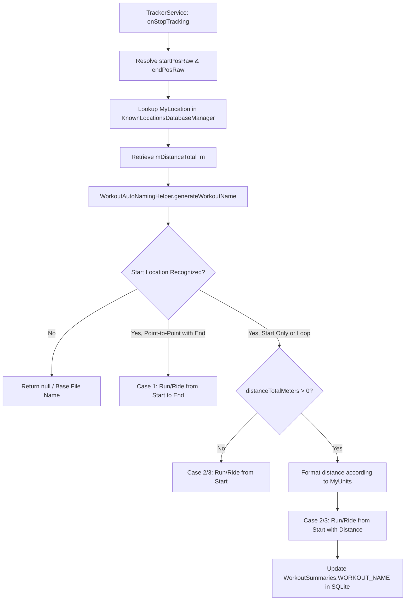

# Stage 1: Analysis Deliverable - ATT-2247: Append Distance to Auto-Generated Workout Names for Start-Location Sessions

**Ticket**: [ATT-2247](https://rainerblind.atlassian.net/browse/ATT-2247)  
**Sub-task**: [ATT-2441](https://rainerblind.atlassian.net/browse/ATT-2441) (`[Analysis] Append Distance to Auto-Generated Workout Names for Start-Location Sessions`)  
**Parent Epic**: [ATT-1396](https://rainerblind.atlassian.net/browse/ATT-1396) (*[Epic] Lieblingsorte: Visible Value, Auto-Naming & Tracking Integration*)  
**Target Release**: `V4.9.39`  
**Active Sprint**: `Sprint 2026-40.16`  
**Requirement Mapping**: `REQ-TRK-012` (Extending `REQ-TRK-011`)  
**Test Mapping**: `TST-TRK-004`  
**Branch**: `feature/ATT-2247`  
**Author**: AI Agent 1 (Implementer)  
**Date**: 2026-10-04  

---

## 1. Problem Statement & User Impact

### 1.1 Observable Defect & Limitation
When a workout finishes without matching an established recurring Route Cluster, `TrackerService.java` invokes `WorkoutAutoNamingHelper.generateWorkoutName()` to derive an automated session title based on recognized favorite locations (*Lieblingsorte*, `REQ-TRK-011`).

If only the starting location is recognized (or during round trips returning to the same start location), the generated titles are derived exclusively from the start location and sport type:
- **German**: *"Radfahrt ab Zuhause"* / *"Lauf ab Büro"* / *"Runde ab Zuhause"*
- **English**: *"Ride from Home"* / *"Run from Office"* / *"Loop from Home"*

Because dedicated athletes frequently depart from their primary residence or workplace, their workout history, calendars, and exported Strava feeds become cluttered with dozens of identical, indistinguishable session names. A 15 km recovery spin and a 120 km gran fondo cannot be distinguished in lists, search results, or notifications without tapping into the detail screen.

### 1.2 User Impact
1. **Lack of Immediate Glanceability**: Athletes scanning historical workouts or feed cards cannot identify the scope or magnitude of an activity at a glance.
2. **Ambiguity in External Feeds**: Uploads to Strava or Google Drive export files share identical titles (`Ride from Home`), degrading the journaling experience.
3. **Lost Context**: While point-to-point activities ("Fahrt von Zuhause nach Büro") naturally provide distinct endpoint context, single-location activities lack distinguishing attributes.

---

## 2. Forensic Root Cause & Architecture Analysis

### 2.1 Current Implementation Anatomy
In `WorkoutAutoNamingHelper.kt`:
```kotlin
fun generateWorkoutName(
    context: Context,
    sportType: BSportType?,
    startLocation: MyLocation?,
    endLocation: MyLocation?,
    distanceBetweenEndpoints: Float = Float.MAX_VALUE
): String?
```
- **Case 1 (Point-to-Point)**: Both start and destination locations are recognized and distinct (`startLocation.id != endLocation.id`). Produces `"Ride from %1$s to %2$s"`.
- **Case 2 (Round Trip / Loop)**: Start and destination are the same location or within geofence radius. Produces `"Ride from %1$s"` or `"Loop from %1$s"`.
- **Case 3 (Start Location Only)**: Only start location is recognized. Produces `"Ride from %1$s"`.
- **Case 4 (Destination Only)**: Only destination is recognized. Produces `"Ride to %1$s"`.

Notice that `generateWorkoutName` currently receives `distanceBetweenEndpoints` (the straight-line spatial distance between start and end coordinates, used to detect loops), but has **no knowledge of the total session distance traversed** (`distanceTotalMeters`).

### 2.2 Caller Investigation in `TrackerService.java`
In `TrackerService.java:1341`:
```java
String autoName = WorkoutAutoNamingHelper.generateWorkoutName(
    this,
    resolvedSport,
    startLoc,
    endLoc,
    endpointDist
);
```
At this exact execution point in `TrackerService.onStopTracking()`, the service has already accumulated and recorded `mDistanceTotal_m`:
- `mDistanceTotal_m` is the total distance recorded throughout the workout session (odometer in meters), used for `WorkoutSummaries.DISTANCE_TOTAL_m` and `engine.suggestCluster(..., mDistanceTotal_m, ...)`.
- Therefore, `mDistanceTotal_m` is readily available to be passed into `WorkoutAutoNamingHelper.generateWorkoutName()`.

### 2.3 Distance Formatting & Unit Preferences
- The application stores unit system preferences in `TrainingApplication.getUnit()` (`MyUnits.METRIC` vs `MyUnits.IMPERIAL`).
- In metric mode, distance is represented in kilometers (`km = meters / 1000.0`).
- In imperial mode, distance is represented in miles (`mi = meters / BANALService.METER_PER_MILE`).
- Formatting precision rules:
  - $< 10\text{ km/mi}$: 1 decimal place (e.g. `8.2 km`, `5.1 mi`).
  - $\ge 10\text{ km/mi}$: 0 decimal places if effectively a whole number (e.g. `42 km`), or 1 decimal place if fractional (e.g. `42.5 km`).

---

## 3. Scope Bounding

### 3.1 In-Scope Objectives
1. **Extend `WorkoutAutoNamingHelper.generateWorkoutName`**:
   - Add parameter `distanceTotalMeters: Double = 0.0` with `@JvmOverloads` to preserve backward compatibility for existing callers and tests.
   - When `distanceTotalMeters > 0.0` and Case 2 (Round Trip / Loop) or Case 3 (Start Location Only) triggers:
     - Format total distance according to `TrainingApplication.getUnit()`.
     - Select distance-enriched format string resources (e.g. `workout_name_ride_from_with_distance`).
2. **Format Strings & 9-Language Localization**:
   - Introduce localized format strings with positional placeholders:
     - `workout_name_run_from_with_distance`: e.g. `"Run from %1$s (%2$s)"` / `"Lauf ab %1$s (%2$s)"`
     - `workout_name_ride_from_with_distance`: e.g. `"Ride from %1$s (%2$s)"` / `"Radfahrt ab %1$s (%2$s)"`
     - `workout_name_activity_from_with_distance`: e.g. `"Activity from %1$s (%2$s)"` / `"Aktivität ab %1$s (%2$s)"`
     - `workout_name_round_trip_with_distance`: e.g. `"Loop from %1$s (%2$s)"` / `"Runde ab %1$s (%2$s)"`
   - Implement 100% translation parity across all 9 supported locales: EN, DE, ES, FR, IT, JA, NL, PL, PT.
3. **Wire Distance in `TrackerService.java`**:
   - Update `TrackerService.java:1341` to pass `mDistanceTotal_m` to `generateWorkoutName`.
4. **Preserve Point-to-Point & Destination-Only Invariants**:
   - Case 1 (Point-to-Point: "Fahrt von Zuhause nach Büro") remains without distance to avoid title clutter.
   - Case 4 (Destination Only: "Lauf nach Büro") remains without distance.
   - When `distanceTotalMeters <= 0.0`, retain existing formatting without distance.
5. **Unit & Contract Testing**:
   - Comprehensive test coverage in `WorkoutAutoNamingHelperTest.kt` verifying metric and imperial formatting, decimal rounding (<10 vs >=10), sport type mapping, and backward compatibility.

### 3.2 Out-of-Scope (To Prevent Scope Creep)
- Modifying Route Cluster naming (`WorkoutClusterEngine.generateClusterSeedName`).
- Altering manual workout name editing in `WorkoutRepository.kt`.
- Retroactively renaming historical workouts in the database (this applies only to newly finalized sessions).

---

## 4. Chesterton's Fence Archaeology (`REQ-TRK-011`)

| Field | Content |
| :--- | :--- |
| **Original Requirement ID & Target** | `REQ-TRK-011`: *Intelligent Workout Auto-Naming based on Recognized Start and Destination Lieblingsorte* (ATT-1398). |
| **Historical Origin & Commit Trace** | Ticket `ATT-1398`, Epic `ATT-1396`, commit `69ef997b` (Sprint 2026-38.14). |
| **Root Reason for Existing Formulation** | Initial implementation focused on basic start and destination geofence matching to eliminate generic timestamp names (`Workout at 2026-10-04 10:00`). At the time, distance enrichment was omitted to keep the naming parser simple. Real-world physical device usage revealed the repetition problem for home-departed sessions. |
| **Preservation of Core Invariants** | Cluster suggestion priority (`suggestion != null`), user manual rename immutability (`WorkoutRepository.setWorkoutName`), single-thread database serialization (`KnownLocationsDB-Thread`), and 100% 9-language translation parity MUST NOT be broken. Existing callers omitting distance must continue to receive standard titles via `@JvmOverloads`. |

---

## 5. Architectural Remediation & Design Plan



### 5.1 Distance Formatting Algorithm
```kotlin
fun formatSessionDistance(context: Context, distanceMeters: Double): String {
    val unit = TrainingApplication.getUnit()
    val isImperial = unit == MyUnits.IMPERIAL
    val dist = if (isImperial) distanceMeters / BANALService.METER_PER_MILE else distanceMeters / 1000.0
    val unitStr = if (isImperial) "mi" else "km"
    
    return if (dist < 10.0) {
        String.format(Locale.getDefault(), "%.1f %s", dist, unitStr)
    } else {
        val rounded = Math.round(dist)
        if (Math.abs(dist - rounded) < 0.05) {
            String.format(Locale.getDefault(), "%d %s", rounded, unitStr)
        } else {
            String.format(Locale.getDefault(), "%.1f %s", dist, unitStr)
        }
    }
}
```

---

## 6. Risk Analysis & Mitigation Strategy

| Risk | Severity | Mitigation Strategy |
| :--- | :--- | :--- |
| **Breaking existing callers / tests without distance** | Medium | Use `@JvmOverloads` and default parameter `distanceTotalMeters: Double = 0.0`. When `distanceTotalMeters <= 0.0`, fallback to original format strings. |
| **Locale number formatting discrepancies (comma vs dot)** | Low | Use `Locale.getDefault()` with standard format strings so German renders `42 km` / `8,2 km` and English renders `42 km` / `8.2 km`. |
| **Missing translations in 9 locales** | High | Add explicit string keys across all 9 `res/values-*/strings.xml` files and verify via automated `TranslationParityTest`. |
