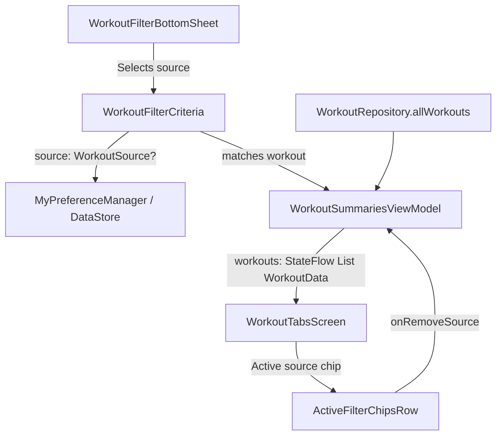

# Stage 1: Problem Domain & Root Cause Analysis - ATT-2303: Filter Workouts by Origin Source Attribute (Tracked, TCX, GPX, FIT)

**Ticket**: [ATT-2303](https://rainerblind.atlassian.net/browse/ATT-2303)  
**Sub-task**: [ATT-2333](https://rainerblind.atlassian.net/browse/ATT-2333) (`[Analysis]`)  
**Parent Epic**: [ATT-355](https://rainerblind.atlassian.net/browse/ATT-355) (*Good and consistent UI*)  
**Target Release**: `V4.9.40`  
**Active Sprint**: `2026-40.15`  
**Requirement Mapping**: `REQ-UI-265` (*Workout List Filtering by Origin Source Attribute*)  
**Test Spec ID**: `TST-UI-224`  
**Branch**: `feature/ATT-2303`  
**Author**: AI Agent 1 (Implementer)  
**Date**: 2026-10-04  

---

## 1. Problem Description & Forensic Analysis

### 1.1 Context & Motivation
With the implementation of [ATT-2186](https://rainerblind.atlassian.net/browse/ATT-2186) (`REQ-DAT-017`), aTrainingTracker introduced full provenance tracking for workout sessions via the `WorkoutSource` domain enum:
* `TRACKED`: Live sensor recording executed directly on the Android device via `TrackerService`.
* `TCX`: Garmin Training Center XML imported activity.
* `GPX`: GPS Exchange Format imported activity.
* `FIT`: Garmin Flexible and Interoperable Data Transfer binary imported activity.

This provenance attribute is stored in SQLite (`WorkoutSummaries.SOURCE`), propagated to `WorkoutData.source`, and displayed in the workout aftermath header badge when an activity was imported (`data.source != WorkoutSource.TRACKED`).

However, within the workout journal (`WorkoutTabsScreen` / `WorkoutFilterBottomSheet`), athletes currently have no affordance to filter their workout history by origin source. Athletes who manage extensive training logs with mixed recordings (e.g. live cycling recordings combined with historical TCX/GPX/FIT imports from external head units or platforms) cannot:
1. Quickly isolate imported workouts to inspect import fidelity, verify lap data, or check FIT developer metrics.
2. Filter the journal strictly to live recorded sessions to review on-device telemetry and battery performance.
3. Combine origin source filtering with existing dimensions (e.g. FIT workouts in 2025, or Tracked cycling sessions on a specific bike).

### 1.2 Forensic Architecture & Gap Analysis
1. **`WorkoutFilterCriteria.kt` (Domain Model)**:
   - Encapsulates all filter dimensions: `query`, `year`, `month`, `startDateS`, `endDateS`, `sportTypeId`, `equipmentId`, `isCommute`, `isTrainer`, `isRace`, `hasGpsTrack`, `minDistanceMeters`, `maxDistanceMeters`, `minDurationSec`, `maxDurationSec`, `startLocation*`, `cluster*`.
   - **Gap**: Lacks a `source: WorkoutSource? = null` field.
   - **Predicate Gap**: `matches(workout: WorkoutData)` does not inspect `workout.source`.
   - **Counter Gap**: `activeFilterCount` does not increment when a source filter is active.
   - **Serialization Gap**: `toJson()` and `fromJson()` do not serialize or restore the `source` field from DataStore preferences.

2. **`WorkoutFilterBottomSheet.kt` (Filter UI)**:
   - Houses sections for: Search text, Time & Period, Sport Sub-Types, Categorized Equipment, Workout Attributes (Commute, Trainer, Race, Has GPS), Distance intervals, Duration intervals, Favorite Locations, and Route Clusters.
   - **Gap**: Lacks an "Origin Source" section.
   - **Ergonomics**: Adding an Origin Source section with single-selectable `FilterChip` items (`TRACKED`, `TCX`, `GPX`, `FIT`) with toggle-off behavior allows athletes to slice activities cleanly.

3. **`ActiveFilterChipsRow.kt` (Active Filter Strip)**:
   - Renders removable chips directly above the workout list for each active filter dimension.
   - **Gap**: Lacks an active chip for `criteria.source != null` and corresponding `onRemoveSource` callback.

4. **`WorkoutTabsScreen.kt` & `WorkoutSummariesViewModel.kt`**:
   - `WorkoutSummariesViewModel.workouts` reactively filters in-memory via `criteria.matches(it)` over `workoutRepo.allWorkouts`.
   - Updating `WorkoutFilterCriteria.matches` to evaluate `source == null || workout.source == source` will automatically filter the reactive pipeline with zero database query refactoring needed.

---

## 2. Chesterton's Fence Archaeology (`REQ-PRO-022`)

* **Target Requirements**:
  * `REQ-DAT-017` (*Workout Provenance & Origin Source Tracking* - ATT-2186): Established `WorkoutSource` enum, SQLite migration, and header badge.
  * `REQ-UI-132` (*Multi-Dimensional Workout Filtering, Modal Filter Sheet & Persistent Filter State*): Defined the multi-dimensional filter architecture and reactive ViewModel combining pipeline.
  * `REQ-UI-194` (*Filter Dialogs: Clean Chip Formatting and Prioritized Section Ordering* - ATT-1642): Mandated clean chip labels without emoji prefixes and established the prioritized section order placing heavy location/route lists at the bottom.
* **Historical Origin**:
  * `ATT-2186` introduced the data foundation and origin badges, but intentionally deferred filter integration to a dedicated UI backlog item (`ATT-2303`).
  * `REQ-UI-194` placed Favorite Locations (*Lieblingsorte*) and Route Clusters (*Lieblingsstrecken*) at the bottom of `WorkoutFilterBottomSheet` because they are dynamically populated lists that can contain dozens of items.
* **Root Reason for Existing Formulation**:
  * `WorkoutFilterCriteria` was designed as an immutable data class with short-circuiting predicate logic to ensure ultra-low CPU overhead during live search and list scrolling.
* **Preservation of Core Invariants**:
  * Placing the new "Origin Source" section adjacent to "Workout Attributes" (before numerical threshold intervals and extensive location/cluster lists) preserves the exact ergonomic hierarchy of `REQ-UI-194`.
  * `WorkoutSource.TRACKED` remains the default fallback when `WorkoutData.source` is unspecified.
  * In-memory predicate evaluation (`criteria.matches(workout)`) preserves instantaneous reactive filtering without blocking SQLite queries.
  * 9-language localization parity and DataStore backward compatibility (missing `source` key in JSON deserializes safely to `null`) remain strictly intact.

---

## 3. Scope Bounding & Anti-Scope (`ATT-1250`)

### 3.1 In-Scope Objectives
1. **Domain Model**: Extend `WorkoutFilterCriteria` with `val source: WorkoutSource? = null`, update `activeFilterCount`, `matches(workout: WorkoutData)`, `toJson()`, and `fromJson()`.
2. **Localization**: Define `filter_section_origin_source` ("Origin Source" / "Datenquelle" / etc.) across all 9 application locales (`strings.xml` for `values`, `values-de`, `values-es`, `values-fr`, `values-it`, `values-ja`, `values-nl`, `values-pl`, `values-pt`). Note: individual source strings (`workout_source_tracked`, `workout_source_tcx`, `workout_source_gpx`, `workout_source_fit`) already exist in all 9 locales.
3. **Filter Sheet UI**: Add an "Origin Source" section to `WorkoutFilterBottomSheet.kt` with filter chips for Tracked, TCX, GPX, and FIT, supporting single-select toggle, Apply, and Clear All.
4. **Active Filter Strip**: Add a removable chip in `ActiveFilterChipsRow.kt` for `criteria.source` with single-tap dismissal, and wire `onRemoveSource` in `WorkoutTabsScreen.kt`.
5. **Automated Testing**: Extend `WorkoutFilterCriteriaTest.kt` (predicate matching, count, JSON round-trip) and `WorkoutSummariesViewModelFilterTest.kt` (reactive ViewModel filtering with mixed sources).

### 3.2 Out-of-Scope (Forbidden Scope Creep)
* Modifying `WorkoutSource` enum values or database schema columns.
* Multi-source OR-combinations (e.g. TCX OR GPX); a workout has exactly one origin source, and single-choice toggle matches the existing design pattern of sport and equipment selectors.
* Modifying importer implementations (TCX, GPX, FIT) or tracking service persistence logic.

---

## 4. Software Architecture & Invariant Enforcement (SWE.1 / SWE.2)

### 4.1 Invariant Checklist
* [x] **DataStore Backward Compatibility**: Existing stored criteria JSON without `"source"` must deserialize to `source = null`.
* [x] **Reactive In-Memory Filter**: Zero extra database read operations on filter change; list updates via Kotlin StateFlow `combine`.
* [x] **Reset Invariants**: `clearFilterCriteria()` and `onClearAll` must reset `source` to `null`.
* [x] **Localization Parity**: 100% translation coverage across all 9 supported locales.
* [x] **File Size Boundaries**: Modified files must remain strictly within maintainable limits.
