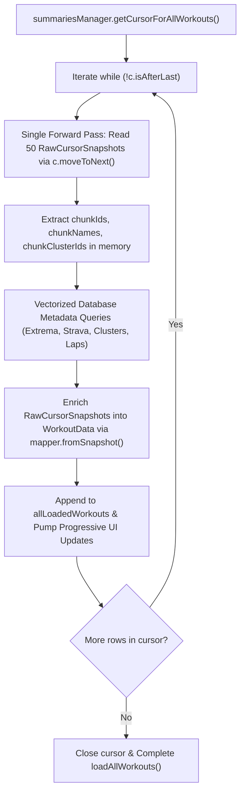

# Stage 1: Analysis Deliverable - ATT-2309: CursorWindow IllegalStateException in WorkoutRepository.loadAllWorkouts on Large Databases

**Ticket**: [ATT-2309](https://rainerblind.atlassian.net/browse/ATT-2309)  
**Sub-task**: [ATT-2436](https://rainerblind.atlassian.net/browse/ATT-2436) (`[Analysis] CursorWindow IllegalStateException in WorkoutRepository.loadAllWorkouts on Large Databases`)  
**Parent Epic**: [ATT-68](https://rainerblind.atlassian.net/browse/ATT-68) (*[Epic] Improve WorkoutSummaries*)  
**Target Release**: `V4.9.39`  
**Active Sprint**: `Sprint 2026-40.16`  
**Requirement Mapping**: `REQ-STB-006` (Net-new stability requirement)  
**Test Mapping**: `TST-STB-006`  
**Branch**: `feature/ATT-2309`  
**Author**: AI Agent 1 (Implementer)  
**Date**: 2026-10-04  

---

## 1. Problem Statement & User Impact

### 1.1 Defect Description
During testing on physical Android devices containing large workout databases (>1,600 recorded workouts), the application crashes with a fatal unhandled exception during background workout history loading in `WorkoutRepository.loadAllWorkouts`:

```text
java.lang.IllegalStateException: Couldn't read row 60, col 0 from CursorWindow. Make sure the Cursor is initialized correctly before accessing data from it.
    at android.database.CursorWindow.nativeGetLong(Native Method)
    at android.database.CursorWindow.getLong(CursorWindow.java:579)
    at android.database.AbstractWindowedCursor.getLong(AbstractWindowedCursor.java:78)
    at com.atrainingtracker.trainingtracker.ui.aftermath.WorkoutRepository$loadAllWorkouts$2.invokeSuspend(WorkoutRepository.kt:790)
```

### 1.2 User Impact
Athletes with extensive historical workout archives (e.g. hundreds of rides, runs, and multi-year training datasets) experience an immediate crash when opening the workouts list, aftermath views, or period summaries. Because `loadAllWorkouts()` executes automatically during startup and view initialization, the crash prevents users from accessing their workout logs.

---

## 2. Forensic Root Cause Analysis (RCA)

### 2.1 Code Path & Traversal Anatomy
In `WorkoutRepository.kt` lines 781–835:
```kotlin
while (!c.isAfterLast) {
    // 1. Gather IDs, names, and cluster IDs for the next chunk
    val chunkIds = mutableListOf<Long>()
    val chunkNames = mutableListOf<String>()
    val chunkClusterIds = mutableSetOf<Long>()
    val currentChunkStartPos = c.position
    
    var i = 0
    while (i < batchSize && !c.isAfterLast) {
        chunkIds.add(c.getLong(c.getColumnIndexOrThrow(WorkoutSummaries.C_ID)))
        c.getString(...)
        val clusterId = c.getLong(...)
        c.moveToNext()
        i++
    }

    // 2. Fetch Metadata for the chunk in vectorized queries
    val extremaList = summariesManager.getExtremaForWorkouts(chunkIds)
    ...

    // 3. Map the chunk
    c.moveToPosition(currentChunkStartPos) // <-- FATAL SEEK BACKWARD!
    var j = 0
    while (j < batchSize && !c.isAfterLast) {
        val workoutData = mapper.fromCursor(c, batchMetadata)
        ...
        c.moveToNext()
        j++
    }
}
```

### 2.2 Mechanism of Failure
1. **Android `CursorWindow` Architecture**:
   - Android's SQLite cursor implementation uses a shared memory buffer (`CursorWindow`), typically bounded at 2MB per window.
   - For rows containing large polyline strings, encoded altitude/distance streams, and 34+ columns, a single 2MB `CursorWindow` can accommodate approximately 60 rows before page filling terminates.
2. **Window Discard & Thrashing via Backward Seeking**:
   - In loop 1, the cursor advances forward 50 rows (`c.moveToNext()`), reading row headers.
   - When traversing across a 60-row boundary, the native `CursorWindow` fills with the next window (e.g. rows 60 to 119) and evicts the previous window (rows 0 to 59).
   - In step 3, `c.moveToPosition(currentChunkStartPos)` seeks **backwards** across the window boundary.
   - This backward seek forces the underlying SQLite driver to discard the current memory window and dispatch a synchronous native query to refill the window starting from `currentChunkStartPos`.
3. **Desynchronization & Fatal Crash**:
   - On large datasets (>1,600 rows) or under concurrent database operations (e.g. background import or period rollups), the backward refill fails to retain the target row index, causing `AbstractWindowedCursor` to access an unmapped native slot: `Couldn't read row 60, col 0 from CursorWindow`.
   - The native error is thrown as an unchecked `IllegalStateException`, which is not caught by `WorkoutRepository.loadAllWorkouts()`, fatally terminating the application.

---

## 3. Scope Bounding

### 3.1 In-Scope Objectives
1. **Single-Pass Sequential Cursor Processing**:
   - Refactor `WorkoutRepository.loadAllWorkouts()` to iterate over the cursor in a strictly forward, monotonic direction (`c.moveToNext()`).
   - Eliminate all calls to `c.moveToPosition(currentChunkStartPos)` and backward seeking.
2. **Row Extraction & Batch Enrichment Separation**:
   - Read cursor column values into an in-memory row snapshot (`RawCursorSnapshot`) during the single forward pass.
   - Query vectorized batch metadata (`extrema`, `stravaData`, `clusterNames`, `laps`) in chunks of 50.
   - Enrich the in-memory snapshots with batch metadata into `WorkoutData` without touching the cursor again.
3. **Cursor Exception Resilience**:
   - Encapsulate cursor reads in robust try/catch blocks to log corrupt or failing rows without terminating the process.
4. **Stress & Stability Verification**:
   - Create automated JVM stress tests simulating a cursor with 2,000 synthetic rows to verify seamless single-pass streaming without `IllegalStateException`.

### 3.2 Out-of-Scope (Non-Goals)
- Modifying SQLite table schemas for `WorkoutSummaries.db` or auxiliary databases.
- Modifying `PeriodsRepository` or `WorkoutClusterEngine` (both already use pure monotonic forward cursor loops).
- Modifying UI layouts or aftermath presentation cards.

---

## 4. Proposed Architectural Remediation

### 4.1 Single-Pass Pipeline Flow


### 4.2 Decoupled Data Extraction (`WorkoutDataMapper.kt`)
1. Introduce `data class RawCursorSnapshot`: Captures primitive column values from the active cursor row.
2. `mapper.readCursorSnapshot(cursor)`: Pure column extraction method.
3. `mapper.fromSnapshot(snapshot, batchMetadata)`: Constructs the complete domain `WorkoutData` instance incorporating apex resolution, altitude extrema, laps, and Strava metadata.

---

## 5. Invariant Preservation & Chesterton's Fence

- **Chesterton's Fence Audit**: Net-new stability requirement `REQ-STB-006`. No existing requirements modified.
- **SQLite Database Invariants**: Table schemas and sorting order (`TIME_START DESC`) remain untouched.
- **Vectorized Performance**: Batch querying (ATT-359) is fully preserved; zero N+1 queries introduced.
- **Single-Thread & Thread Safety**: All cursor and database operations run on `Dispatchers.IO` within `withContext`.
