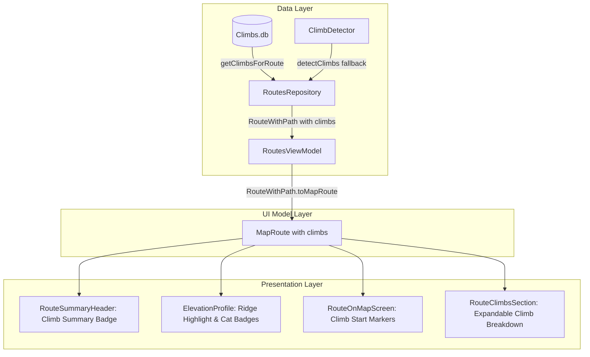

# Stage 1 Analysis: ATT-2388 - Increase Visibility and Visual Prominence of Climbs on Routes

**Ticket**: [ATT-2388](https://atrainingtracker.atlassian.net/browse/ATT-2388)  
**Sub-task**: [ATT-2499](https://atrainingtracker.atlassian.net/browse/ATT-2499) (`[Analysis]`)  
**Parent Epic**: [ATT-66](https://atrainingtracker.atlassian.net/browse/ATT-66) (*Improve Routes*)  
**Target Release**: `V4.9.40`  
**Active Sprint**: `2026-41.1`  
**Branch**: `feature/ATT-2388`  
**Author**: AI Agent 1 (Implementer)  
**Date**: 2026-10-05  

---

## 1. Problem Statement & Motivation

During the Sprint 2026-40.15 review of ClimbPro (`ATT-1281` / `REQ-MAP-027`), automated climb detection, SQLite persistence in `Climbs.db`, and the real-time Cockpit bottom sheet (`LiveClimbSheet.kt`) during live tracking were verified and approved.

However, athletes inspecting routes *prior to* or *during* outdoor workouts currently experience near-zero visibility into the climbs that comprise a route:
1. **Elevation Profile Blindness**: In `ElevationProfile.kt`, the elevation profile is rendered strictly as micro-gradient segments. The profile contains zero indication of where recognized, sustained ascents begin, peak, or end, and displays no category ratings (e.g., Cat 4, Cat 3, Cat 2, Cat 1, HC).
2. **Route Map Polyline Uniformity**: On the route map (`RouteOnMapScreen` / `ATrainingTrackerMap`), the entire route polyline is rendered as a uniform single-color stroke (`TTColor.RouteSelected` or `RouteUnselected`). There are no climb category badges, start markers, or accent polylines identifying where challenging ascents occur.
3. **Route Cards & Overview Header Absence**: In `RouteSummaryHeader.kt` and `RouteItem.kt`, the summary metrics row displays only total distance and cumulative elevation gain. It provides no climb counter, category summary pill (e.g., *"3 Anstiege (1x Cat 2, 2x Cat 3)"*), or difficulty indicator.
4. **Missing Climb Breakdown**: In route details (`RouteOnMapScreen.kt`), there is no dedicated, interactive breakdown of individual climbs displaying starting kilometer, length, average grade, vertical gain, and category.

Athletes planning training rides or pacing efforts cannot easily assess the climbing difficulty or spatial distribution of hills along their chosen routes.

---

## 2. Root Cause Analysis (Forensic Investigation & Architecture Gaps)

1. **ClimbPro Infrastructure Exists but is Confined to Live Tracking**:
   - `ClimbDetector.kt` reliably detects sustained ascents from sequential `PathPoint` trackpoints conforming to thresholds: length $\ge 500\text{ m}$, average gradient $\ge 3.0\%$, and vertical gain $\ge 20\text{ m}$, categorizing them according to UCI score formulas (`HC`, `CAT_1`, `CAT_2`, `CAT_3`, `CAT_4`, `UNCATEGORIZED`).
   - `ClimbsDatabaseManager.kt` persists detected climbs into `Climbs.db` with associated `route_id`.
   - `RoutesRepository.kt` detects and persists climbs when routes are imported or synchronized from Strava.
   - However, `LiveClimbsRepository.kt` and `LiveClimbSheet.kt` were designed exclusively for the Cockpit HUD during active GPS tracking. Route inspection screens were never connected to the climbs repository.
2. **Decoupled Data Models in Route UI**:
   - `RouteWithPath` contains only `summary: RouteSummary`, `path: List<PathPoint>`, and `waypoints: List<RouteWaypoint>`. It has no property or association for `climbs: List<Climb>`.
   - Similarly, `MapRoute` contains no climb references.
   - As a consequence, `RoutesViewModel`, `RouteItem`, `RouteSummaryHeader`, and `RouteOnMapScreen` operate with complete blindness to climbs.
3. **`ElevationProfile.kt` Lacks Climb Domain Awareness**:
   - `ElevationProfile` accepts only raw altitude streams (`encodedAltitudes`, `encodedDistances`, or `pathPoints: List<PathPoint>`).
   - The canvas rendering loop iterates point-by-point to draw micro-segments. It lacks any parameter, layout slot, or drawing routine for climb intervals, category badges, or summit tags.
4. **Backward Compatibility Gap for Pre-Existing Routes**:
   - Routes imported prior to `ATT-1281` may have an entry in `Routes.db` but zero rows in `Climbs.db`. Any solution must gracefully detect climbs on-the-fly via `ClimbDetector.detectClimbs` if `Climbs.db` yields no cached climbs for a given route.

---

## 3. User Scope Grounding (ATT-1250)

### In-Scope Objectives
1. **Data Model & Repository Enrichment**:
   - Extend `RouteWithPath` and `MapRoute` with `val climbs: List<Climb> = emptyList()`.
   - Update `RoutesRepository` to populate `climbs` when loading routes via `getAllRoutes()` and `getRouteById(routeId)`, leveraging `ClimbsDatabaseManager.getClimbsForRoute(routeId)` with seamless on-the-fly detection fallback via `ClimbDetector.detectClimbs(path, routeId = routeId)`.
   - Update `toMapRoute()` extension to propagate `climbs`.
2. **Route Summary Header & Card Prominence**:
   - In `RouteSummaryHeader.kt`, add an optional Climb Metric Pill in the metrics row when `climbs.isNotEmpty()` (e.g. mountain icon with localized climb count and prominent category pills, e.g. *"2 Anstiege (Cat 2, Cat 3)"*).
3. **Elevation Profile Climb Accentuation & Category Badges**:
   - Extend `ElevationProfile.kt` with parameter `climbs: List<Climb> = emptyList()`.
   - Highlight the interval of each climb along the profile ridge with an accented stroke line (3.5 dp) using the climb category's distinct color.
   - Render a high-contrast category badge pill (e.g. "Cat 2", "Cat 3", "Cat 4", "HC") directly above each climb peak on the profile canvas.
4. **Map Polyline Accents & Climb Markers**:
   - In `RouteOnMapScreen.kt`, render prominent climb start markers (with category label and mountain icon) at `climb.startLatLng` so athletes see exactly where each ascent begins on the map.
5. **Interactive Climb List Breakdown**:
   - In `RouteOnMapScreen.kt`, add an expandable/dedicated Climb Section below the route header or elevation profile, displaying each climb with:
     - Climb Category Chip (`ClimbCategoryChip`)
     - Climb Name / Order Index (*"Anstieg 1 von 3"*)
     - Starting Kilometer along route (*"bei km 14,2"*)
     - Length, Average Gradient, and Vertical Gain (*"2,4 km @ 6,8% (+163 m)"*)
     - Tapping a climb seeks the map and elevation profile scrubber to the climb's start point.
6. **9-Language Localization Parity**:
   - All newly introduced labels and string resources maintained with 100% parity across EN, DE, ES, FR, IT, JA, NL, PL, PT.

### Out-of-Scope Non-Goals (Scope Bounding)
* Modifying the mathematical climb detection algorithm (`ClimbDetector.kt`) or changing UCI category scoring formulas.
* Altering the persistent schema of `Climbs.db` or `Routes.db`.
* Altering `LiveClimbSheet.kt` or live tracking Cockpit HUD behavior (`ATT-1281`).
* Modifying Strava segment integration or live segment priority.

---

## 4. Requirement Archaeology & Chesterton's Fence Audit (REQ-PRO-022)

1. **Original Requirement ID & Target**:
   - Refines and extends `REQ-MAP-027` (*Persistent Climbs Database & Live ClimbPro Cockpit Sheet*) and `REQ-UI-267` / `REQ-UI-273` (*Routes & Segments Elevation Profile and Map Detail Layout*).
2. **Historical Origin & Commit Trace**:
   - `ATT-1281` (Sprint `2026-40.14`, commit `d5c90d81`): Introduced `REQ-MAP-027`, establishing `ClimbDetector`, `ClimbsDatabaseManager`, `Climbs.db` SQLite schema, and `LiveClimbSheet.kt`.
   - `ATT-2386` (Sprint `2026-41.1`, commit `5e07f332`): Optimized `MapDetailLayout.kt` for routes and segments to dynamically expand the map viewport while anchoring the elevation profile to the navigation bar.
3. **Root Reason for Existing Formulation**:
   - `REQ-MAP-027` focused primarily on in-ride pacing awareness (summit countdown, real-time grade, and live HUD during tracking).
   - Pre-ride route inspection screens (`RouteOnMapScreen`, `RouteItem`, `ElevationProfile`) were intentionally left with basic profile rendering to bound the scope of `ATT-1281`.
4. **Preservation of Core Invariants**:
   - Mathematical thresholds in `ClimbDetector` (500m min distance, 3% min grade, 20m min gain) and UCI score category tiers (`HC`, `CAT_1`–`CAT_4`) remain unchanged.
   - `LiveClimbsRepository` state machine and Strava Live Segment precedence in the cockpit are preserved.
   - `ElevationProfileZoomMath` zooming, panning, and distance scrubbing mechanics are preserved with zero regression.

---

## 5. Architectural Strategy & High-Level Solution

### Key Implementation Steps
1. **Model Propagation**:
   - `RouteWithPath(summary, path, waypoints, climbs)`.
   - `MapRoute(..., climbs)`.
   - `RouteWithPath.toMapRoute()`.
2. **Repository Enrichment**:
   - In `RoutesRepository`: Cache/load climbs alongside routes, with fallback on-the-fly detection for historical routes.
3. **Elevation Profile Enhancement (`ElevationProfile.kt`)**:
   - In `CachedProfileData`, precalculate canvas X coordinates for climb start, summit, and peak elevation.
   - In `Canvas`, draw category pills above peak altitude and accented stroke along climb ridges.
4. **Route Details & Map Integration (`RouteOnMapScreen.kt`)**:
   - Render climb start markers with category chips on the map.
   - Provide an expandable climb list section below the header, allowing athletes to tap any climb to seek both the profile seeker and map position.
5. **Route Card Summary Badge (`RouteSummaryHeader.kt`)**:
   - Display a compact climb chip in the metrics row when climbs are present.
