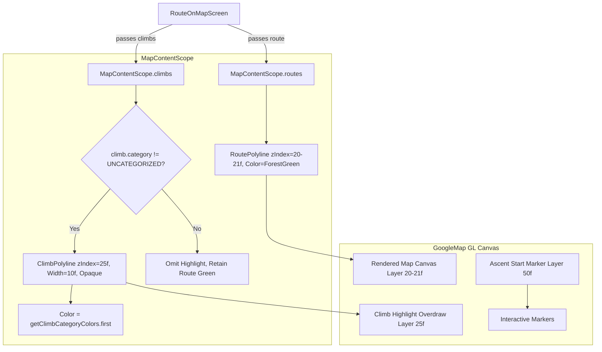

# Stage 1 Analysis - ATT-2509

**Ticket**: [ATT-2509](https://atrainingtracker.atlassian.net/browse/ATT-2509)  
**Summary**: Color Climb Polylines on Route Map to Highlight Climb Spans  
**Active Sprint**: `2026-41.3`  
**Requirement Mapping**: `REQ-UI-298` (refining `REQ-UI-274`, `REQ-MAP-027`)  
**Test Mapping**: `TST-UI-258`  
**Author**: Antigravity  
**Date**: 2026-10-08  

---

## 1. Problem Domain & Root Cause Analysis

### 1.1 Problem Statement & User Observation
In `RouteOnMapScreen.kt`, cycling climbs identified along a route are currently marked solely by a start marker pin (`ic_ascent` with category background color) at `climb.startLatLng`. While this informs the athlete where a climb starts, the athlete cannot visually distinguish where the climb extends to, how long the ascent continues, or where it crests along the curving route polyline. The entire route remains rendered in uniform forest green (`RouteSelected`), obscuring significant topographical features on the 2D map.

### 1.2 Forensic Root Cause
1. **Single-Polyline Map Route Architecture**:
   `MapContentScope.routes()` takes `MapRoute` and renders the entire path using `XRayPolyline` in a single uniform color (`route.color`, typically `TTColor.RouteSelected`).
2. **Missing In-Flight / Exploration Climb Span Visualization**:
   `MapContentScope` includes support for tracks, segments, routes, waypoints, live tracks, and `lapHighlight`, but provides no declarative primitive to highlight climb spans (`List<Climb>`).
3. **Climb Spatial Coordinates Already Available**:
   Each `Climb` produced by `ClimbDetector.kt` already encapsulates `val pathPoints: List<PathPoint>`, where each `PathPoint` contains `latLng: LatLng` spanning the full climb from `startIdx` to `peakIdx`. However, `RouteOnMapScreen.kt:135-177` maps only `climb.startLatLng` to a `LocationMarker`, completely discarding the climb's polyline coordinates for map drawing.

---

## 2. Chesterton's Fence & Requirement Archaeology

### 2.1 Historical Context
- **`REQ-UI-274` (Climb Categorization & Accent Highlights)**:
  Sprint 2026-41.2 introduced climb categorization (`ClimbCategory`: `CAT_4`, `CAT_3`, `CAT_2`, `CAT_1`, `HC`, `UNCATEGORIZED`) using UCI scoring formulas ($score = \Delta H \times \text{grade}$) and category color chips (`getClimbCategoryColors`).
- **`REQ-MAP-027` (Climb In-Flight Tracking & Proximity Engine)**:
  Established data models (`Climb`, `LiveClimbData`, `ClimbDetector`) and map pins for climb inceptions.
- **Why was polyline coloring deferred?**
  Initial climb detection work focused on algorithmic detection accuracy, elevation gain calculation, and start-pin placement. Colored polyline spans were intentionally deferred to prevent layer clutter before the core detection engine stabilized.

### 2.2 Traceability Confirmation
`REQ-UI-298` and `TST-UI-258` have been formally committed to the living documentation repository in commit `4db09acf`:
- **`docs/requirements.md`**: Registered `REQ-UI-298` (Route Map Climb Span Polyline Highlighting by Climb Category Classification) in status *Specified*.
- **`docs/tests.md`**: Registered `TST-UI-258` (Route Map Climb Polyline Highlighting Verification) in status *Specified*.
- Governance verification via `python3 tools/verify_requirement_governance.py --base-ref sprint/2026-41.3` confirmed clean pass (exit code 0).

---

## 3. Geometric & Architectural Rendering Strategy: Additive Overdraw vs. Subtractive Splitting

### 3.1 Architectural Trade-Off Analysis
We evaluated two competing approaches for rendering climb segments along a route:

1. **Subtractive Splitting (Segmented Multi-Polyline)**:
   Splitting the master route polyline into fragmented sub-polylines (Route Part 1 -> Climb 1 -> Route Part 2 -> Climb 2...).
   *Evaluation*: **Rejected**. Splitting causes severe edge gaps at joints on varying map zoom levels, complicates route click detection (`onRouteClick`), breaks uniform X-Ray pattern animations, and incurs heavy list mutation overhead during route parsing.
2. **Additive Layered Overdraw (Recommended & Selected)**:
   The master route polyline is rendered completely unbroken at `zIndex = 20.0f` (base) and `21.0f` (overlay). The climb spans are drawn as dedicated opaque overlay polylines at `zIndex = 25.0f`.
   *Evaluation*: **Selected**. Highly robust, mathematically clean, zero route fragmentation, and perfectly decoupled.

### 3.2 Vertex Alignment & Anti-Aliasing Bleed Elimination
- **Exact Coordinate Identity**: `ClimbDetector.kt:106` constructs climbs via `points.subList(startIdx, peakIdx + 1)`. The `PathPoint` instances in `climb.pathPoints` share the exact identical `LatLng` floating point vertices as `route.path`. There is zero geometric drift or coordinate interpolation error.
- **Z-Index Separation**: 
  - Base route: `zIndex = 20.0f`
  - Climb highlights: `zIndex = 25.0f`
  - Location markers (Start, End, Climb Pin): `zIndex = 50.0f`
  Because `25.0f > 21.0f`, Google Maps GL pipeline guarantees strict depth sorting, eliminating z-fighting.
- **Bleed Prevention & Cap Ergonomics**:
  - The climb polyline is rendered fully opaque (`alpha = 1.0f`), completely covering the base green route underneath.
  - Polyline width is set to `width = 10f` (matching `MapVisualization.ROUTE_WIDTH`) or `11f` to guarantee full coverage of the underlying stroke.
  - Joint styling uses `jointType = JointType.ROUND`, ensuring smooth transitions across corners.

---

## 4. Scope Bounding & Affected Components

| Component | Nature of Modification | Rationale |
| :--- | :--- | :--- |
| `MapContentScope.kt` | Extension | Add declarative `fun climbs(climbs: List<Climb>)` and internal `ClimbHighlightData` rendering in `Render()`. |
| `RouteOnMapScreen.kt` | Integration | Invoke `climbs(climbs)` within `mapContent` right after `routes(listOf(route))`. |
| `ClimbPolylineContractTest.kt` | New Test File | Unit/contract tests validating climb highlight creation, category filtering, coordinates, and zIndex. |
| `RouteOnMapScreenClimbContractTest.kt` | New Test File | Contract test verifying `RouteOnMapScreen.kt` delegates climb rendering to `climbs(climbs)`. |
| `docs/requirements.md` | Living Doc Update | Registered formal specification `REQ-UI-298` (Commit `4db09acf`). |
| `docs/tests.md` | Living Doc Update | Registered formal verification `TST-UI-258` (Commit `4db09acf`). |

---

## 5. Technical Architecture & Component Flow

### 5.1 Color Mapping Alignment
Color assignment strictly uses canonical `getClimbCategoryColors(climb.category).first`:
- `ClimbCategory.CAT_4` -> `0xFF2E7D32` (Material Green 800)
- `ClimbCategory.CAT_3` -> `0xFFF9A825` (Amber / Yellow)
- `ClimbCategory.CAT_2` -> `0xFFEF6C00` (Orange)
- `ClimbCategory.CAT_1` -> `0xFFC62828` (Red)
- `ClimbCategory.HC` -> `0xFF880E4F` (Dark Magenta / Violet)
- `ClimbCategory.UNCATEGORIZED` -> Omitted from highlight layer (displays default route green).

This ensures 100% color synchronization between the climb map polyline, the climb start pin badge, and the `ClimbCategoryChip` in `RouteClimbsBreakdownSection`.

---

## 6. Verification Strategy & Invariants

1. **Targeted Unit & Contract Tests**:
   - `ClimbPolylineContractTest`: Asserts that `climbs(climbs)` produces polylines for `CAT_4`..`HC`, excludes `UNCATEGORIZED`, preserves coordinates, sets color to `getClimbCategoryColors(category).first`, and uses `zIndex = 25f`.
   - `RouteOnMapScreenClimbContractTest`: Asserts that `RouteOnMapScreen.kt` invokes `climbs(climbs)`.
2. **Clean-Room Regression**:
   - Full `./gradlew testDebugUnitTest` run with zero test regressions.
3. **Preservation of Invariants**:
   - Route clickability, gesture handling, and zoom bounds remain 100% intact.
   - Zero modifications to SQLite databases, Strava sync, or telemetry recording.
