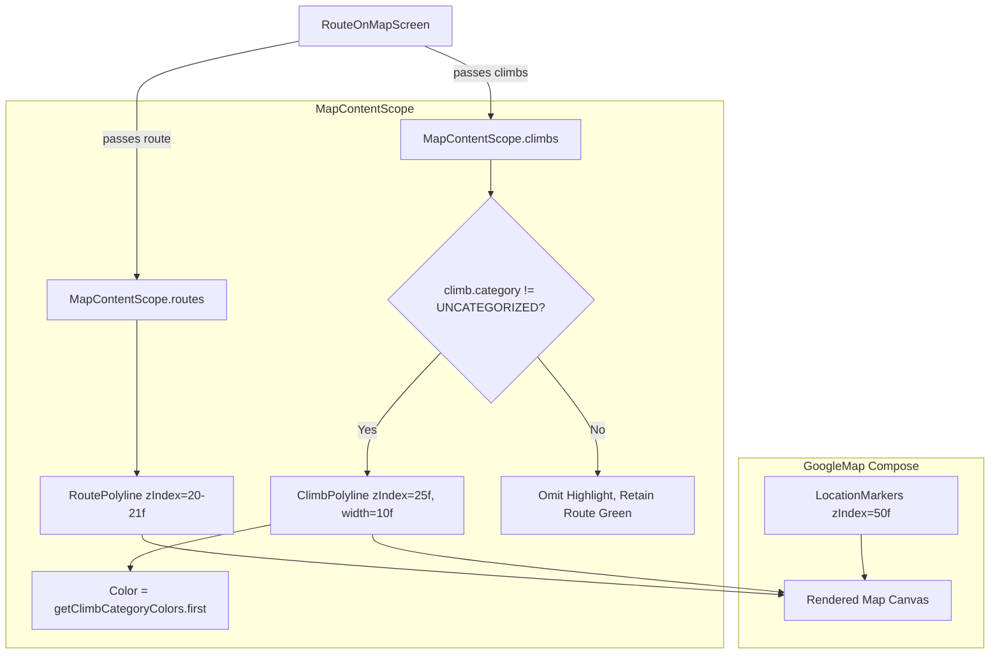

# Stage 1 Analysis - ATT-2509

**Ticket**: [ATT-2509](https://atrainingtracker.atlassian.net/browse/ATT-2509)  
**Summary**: Color Climb Polylines on Route Map to Highlight Climb Spans  
**Active Sprint**: `2026-41.3`  
**Requirement Mapping**: `REQ-UI-298` (refining `REQ-UI-274`, `REQ-MAP-027`)  
**Test Mapping**: `TST-UI-258`  
**Author**: Antigravity  
**Date**: 2026-10-08  

---

## 1. Problem Domain & Root Cause Analysis

### 1.1 Problem Statement & User Observation
In `RouteOnMapScreen.kt`, cycling climbs identified along a route are currently marked solely by a start marker pin (`ic_ascent` with category background color) at `climb.startLatLng`. While this informs the athlete where a climb starts, the athlete cannot visually distinguish where the climb extends to, how long the ascent continues, or where it crests along the curving route polyline. The entire route remains rendered in uniform forest green (`RouteSelected`), obscuring significant topographical features on the 2D map.

### 1.2 Forensic Root Cause
1. **Single-Polyline Map Route Architecture**:
   `MapContentScope.routes()` takes `MapRoute` and renders the entire path using `XRayPolyline` in a single uniform color (`route.color`, typically `TTColor.RouteSelected`).
2. **Missing In-Flight / Exploration Climb Span Visualization**:
   `MapContentScope` includes support for tracks, segments, routes, waypoints, live tracks, and `lapHighlight`, but provides no declarative primitive to highlight climb spans (`List<Climb>`).
3. **Climb Spatial Coordinates Already Available**:
   Each `Climb` produced by `ClimbDetector.kt` already encapsulates `val pathPoints: List<PathPoint>`, where each `PathPoint` contains `latLng: LatLng` spanning the full climb from `startIdx` to `peakIdx`. However, `RouteOnMapScreen.kt:135-177` maps only `climb.startLatLng` to a `LocationMarker`, completely discarding the climb's polyline coordinates for map drawing.

---

## 2. Chesterton's Fence & Requirement Archaeology

### 2.1 Historical Context
- **`REQ-UI-274` (Climb Categorization & Accent Highlights)**:
  Sprint 2026-41.2 introduced climb categorization (`ClimbCategory`: `CAT_4`, `CAT_3`, `CAT_2`, `CAT_1`, `HC`, `UNCATEGORIZED`) using UCI scoring formulas ($score = \Delta H \times \text{grade}$) and category color chips (`getClimbCategoryColors`).
- **`REQ-MAP-027` (Climb In-Flight Tracking & Proximity Engine)**:
  Established data models (`Climb`, `LiveClimbData`, `ClimbDetector`) and map pins for climb inceptions.
- **Why was polyline coloring deferred?**
  Initial climb detection work focused on algorithmic detection accuracy, elevation gain calculation, and start-pin placement. Colored polyline spans were intentionally deferred to prevent layer clutter before the core detection engine stabilized.

### 2.2 Invariant Preservation
1. **Base Route Clickability & Selection**:
   Base route polylines remain clickable and retain their standard color on flat/downhill sections.
2. **Color Palette Harmony**:
   Climb polyline colors MUST strictly align with the established category tokens in `getClimbCategoryColors(climb.category).first`:
   - `CAT_4`: `0xFF2E7D32` (Green 800)
   - `CAT_3`: `0xFFF9A825` (Amber)
   - `CAT_2`: `0xFFEF6C00` (Orange)
   - `CAT_1`: `0xFFC62828` (Red)
   - `HC`: `0xFF880E4F` (Dark Magenta / Violet)
   - `UNCATEGORIZED`: Not highlighted (retains standard route color).
3. **Layer Z-Index Hierarchy**:
   Base route sits at `zIndex = 20-21f`. Climb highlight polylines SHALL sit at `zIndex = 25f` (above route, below markers at `50f`).
   Climb start markers (`ic_ascent`) remain at `zIndex = 50f` to clearly designate the exact point of ascent inception.

---

## 3. Scope Bounding & Affected Components

| Component | Nature of Modification | Rationale |
| :--- | :--- | :--- |
| `MapContentScope.kt` | Extension | Add declarative `fun climbs(climbs: List<Climb>)` and internal `ClimbHighlightData` rendering in `Render()`. |
| `RouteOnMapScreen.kt` | Integration | Invoke `climbs(climbs)` within `mapContent` right after `routes(listOf(route))`. |
| `ClimbPolylineContractTest.kt` | New Test File | Unit/contract tests validating climb highlight creation, category filtering, coordinates, and zIndex. |
| `RouteOnMapScreenClimbContractTest.kt` | New Test File | Contract test verifying `RouteOnMapScreen.kt` delegates climb rendering to `climbs(climbs)`. |
| `docs/requirements.md` | Living Doc Update | Register formal specification `REQ-UI-298`. |
| `docs/tests.md` | Living Doc Update | Register formal verification `TST-UI-258`. |

---

## 4. Proposed Technical Architecture



### 4.1 Declarative API in `MapContentScope`
```kotlin
interface MapContentScope {
    ...
    /**
     * Renders climb highlights along a route or track color-coded by climb category (REQ-UI-298 / ATT-2509).
     */
    fun climbs(climbs: List<Climb>)
}
```

### 4.2 Layer Rendering in `MapContentScopeImpl`
```kotlin
// 6c. Climb Span Highlights (REQ-UI-298 / ATT-2509)
climbHighlights.forEach { highlight ->
    Polyline(
        points = highlight.path,
        color = highlight.color,
        width = highlight.width,
        zIndex = highlight.zIndex,
        jointType = JointType.ROUND
    )
}
```

---

## 5. Verification Strategy & Invariants

1. **Targeted Unit & Contract Tests**:
   - `ClimbPolylineContractTest`: Asserts that `climbs(climbs)` produces polylines for `CAT_4`..`HC`, excludes `UNCATEGORIZED`, preserves coordinates, sets color to `getClimbCategoryColors(category).first`, and uses `zIndex = 25f`.
   - `RouteOnMapScreenClimbContractTest`: Asserts that `RouteOnMapScreen.kt` invokes `climbs(climbs)`.
2. **Clean-Room Regression**:
   - Full `./gradlew testDebugUnitTest` run with zero test regressions.
3. **No Database or API Changes**:
   - Zero modifications to SQLite databases, Strava sync, or telemetry recording.

---

## 6. Review Gates & Human Preconditions

- **Gate 1**: Problem domain and root cause verified. Subtask `ATT-2730` audited and transitioned to `Erledigt`.
- **Human Preconditions**: None. Purely frontend Compose route visualization refinement.
