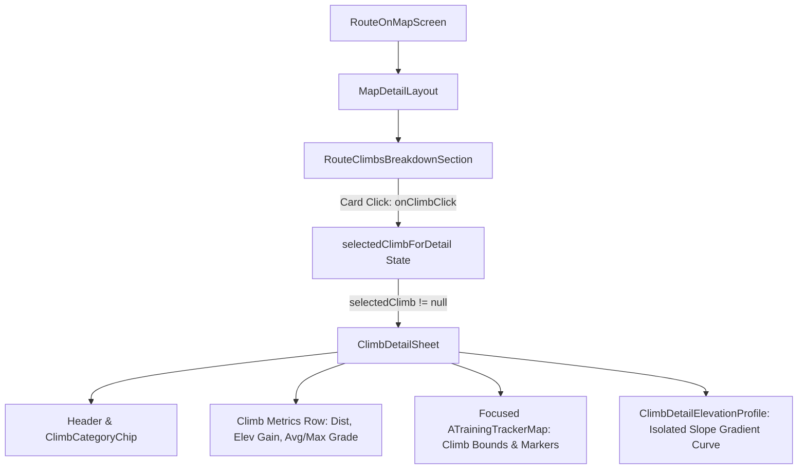

# Stage 1 Analysis: ATT-2511

## 1. Ticket Reference & Problem Statement
- **Ticket**: [ATT-2511](https://atrainingtracker.atlassian.net/browse/ATT-2511) — *[Verbesserung] Display Dedicated Climb Detail View with Focused Map and Zoomed Elevation Profile on Climb Item Tap*
- **Parent Epic**: `ATT-2582` (*[Epic] Segments: Live Tracking, Exploration & Route Integration*)
- **Target Release**: `V4.9.39`
- **Subtask**: `ATT-2741` (`[Analysis]`)

### Problem Statement & Forensic Findings
In `RouteOnMapScreen.kt`, route climbs are summarized in `RouteClimbsBreakdownSection(climbs = climbs)`.
Each recognized climb is displayed in an `ElevatedCard` listing the climb name, category chip, start distance, elevation gain, and average gradient.
However, tapping a climb item currently has no interactive effect (`ElevatedCard` has no `onClick` handler). Athletes viewing a multi-climb route cannot inspect a specific climb in isolation to evaluate its topography, hairpin turns, steepest pitches, or exact geographic layout.

### Desired Behavior
1. Tapping any climb card in `RouteClimbsBreakdownSection` SHALL present a dedicated climb detail view (`ClimbDetailSheet`).
2. The climb detail view SHALL present:
   - **Header**: Climb name, category badge (`ClimbCategoryChip`), route index counter (e.g. "Climb 1 of 4"), and dismiss button.
   - **Key Climb Metrics**: Distance (km/mi), Elevation Gain (+m/+ft), Average Gradient (%), Maximum Gradient (%), and Start Location / Route Offset.
   - **Focused Map Viewport**: Interactive/bounded map focused exclusively on the climb's geographical bounds, highlighting the climb path with its category color, start marker (`R.drawable.control_start` / `ic_ascent`), and summit marker (`R.drawable.control_stop`).
   - **Zoomed Elevation Profile**: Isolated elevation profile isolating the climb from start to summit, rendering slope gradient colored segments (`Zone1`..`Zone5`), elevation fill, start altitude, and summit altitude.
3. Dismissing the detail view returns seamlessly to the route map overview without resetting route selection or scroll state.

---

## 2. Chesterton's Fence & Architecture Archaeology
1. **Original Requirement ID & Target**:
   - Refines `REQ-UI-274` (*Climb Categorization & Accent Highlights*), `REQ-MAP-027` (*Climb In-Flight Tracking & Proximity Engine*), and `REQ-UI-298` (*Route Map Climb Polyline Highlighting*).
2. **Historical Origin & Commit Trace**:
   - Sprint 2026-41.2 introduced `RouteClimbsBreakdownSection` in `RouteOnMapScreen.kt` to present a breakdown summary of climbs detected along a route.
   - Cards were rendered as static informational cards without click listeners because the climb detail view architecture was scoped as a subsequent enhancement (`ATT-2511`).
3. **Root Reason for Existing Formulation**:
   - `RouteOnMapScreen` was structured around the full route view via `MapDetailLayout`. An embedded sub-drilldown directly into `MapDetailLayout` would interfere with the route's overall map bounds and route scrubbing.
   - Presenting the climb drill-down via an overlay / bottom sheet (`AppModalBottomSheet`) offers an intuitive, self-contained interaction model that preserves the parent route state completely.
4. **Preservation of Core Invariants**:
   - `RouteOnMapScreen` route toggle selection, route polyline rendering, and full route elevation profile scrubbing remain untouched.
   - `RouteClimbsBreakdownSection` continues to render all climb cards in the route's analytics section.
   - 9-language localization parity and design system standards (`AppModalBottomSheet`, `ClimbCategoryChip`, `TTColor`) strictly maintained.

---

## 3. Scope Bounding & Invariants
- **In Scope**:
  - Add `onClimbClick: (Climb) -> Unit` callback parameter to `RouteClimbsBreakdownSection`.
  - Wire `onClick = { onClimbClick(climb) }` to each `ElevatedCard` in `RouteClimbsBreakdownSection`.
  - Author `ClimbDetailSheet.kt` in `com.atrainingtracker.trainingtracker.ui.climbs`:
    - Material 3 `AppModalBottomSheet` with drag handle and close button.
    - Header with `ClimbCategoryChip`, climb title, and route climb counter (`stringResource(R.string.climb_route_counter, index + 1, totalCount)`).
    - Metrics row: Distance, Elevation gain, Avg grade, Max grade.
    - Focused `ATrainingTrackerMap` with `MapZoomFocus.EXPLICIT_BOUNDS` matching the climb's `pathPoints` LatLngBounds, rendering climb polyline in category color with start and summit markers.
    - Zoomed `ClimbDetailElevationProfile` canvas rendering the isolated climb altitude profile with slope grade coloring and start/summit altitude tags.
  - State management in `RouteOnMapScreen.kt`: `var selectedClimbForDetail by remember { mutableStateOf<Climb?>(null) }`.
  - Add string resource for `routes_climb_max_grade` with 100% 9-language parity across EN, DE, ES, FR, IT, JA, NL, PL, PT.
  - Unit and UI contract tests verifying click accessibility, state propagation, and detail view contract.
- **Out of Scope**:
  - Modifying live climb tracking in `LiveClimbsRepository` or `SensorGridScreen`.
  - Modifying route database persistence or GPX export.
  - Changing `MapDetailLayout` global split pane mathematics.

---

## 4. Component & Integration Architecture

### Data Flow & State Isolation
1. `RouteOnMapScreen` holds `var selectedClimb by remember { mutableStateOf<Climb?>(null) }`.
2. When the user taps a card, `selectedClimb = climb`.
3. `selectedClimb?.let { climb -> ClimbDetailSheet(climb = climb, onDismiss = { selectedClimb = null }) }`.
4. When dismissed, `selectedClimb = null`, seamlessly returning to the route list without any parent recomposition glitches.

---

## 5. Risk Assessment & Mitigations
| Risk | Severity | Mitigation |
|---|---|---|
| Map viewport in bottom sheet gesture conflicts | Low | `ATrainingTrackerMap` handles pinch/pan, while `AppModalBottomSheet` drag handle allows sheet expansion/collapse. |
| Missing `pathPoints` on legacy climbs | Low | Fallback to `listOf(climb.startLatLng, climb.endLatLng)` for bounds and placeholder ramp for profile if points < 2. |
| Incomplete localization on new strings | Medium | Add `routes_climb_max_grade` across all 9 `strings.xml` files and verify via automated localization unit test. |
