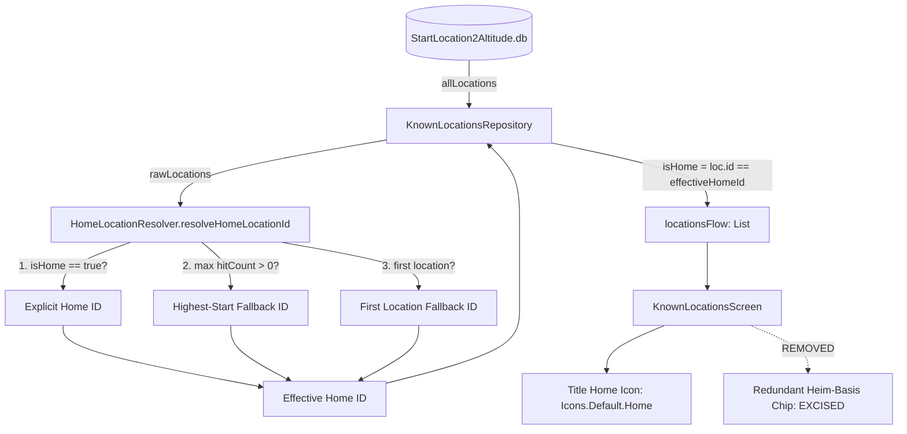

# Stage 1 Analysis: ATT-2629 - Remove redundant Heim-Basis badge and default to location with most starts when no home-base set

**Ticket**: [ATT-2629](https://atrainingtracker.atlassian.net/browse/ATT-2629)  
**Sub-task**: [ATT-2670](https://atrainingtracker.atlassian.net/browse/ATT-2670) (`[Analysis]`)  
**Parent Epic**: [ATT-2564](https://atrainingtracker.atlassian.net/browse/ATT-2564) (*Navigation: Turn-by-Turn Guidance & Cockpit Prompts*)  
**Target Release**: `V4.9.39`  
**Active Sprint**: `2026-41.3`  
**Branch**: `feature/ATT-2629`  
**Author**: AI Agent 1 (Implementer)  
**Date**: 2026-10-08  

---

## 1. Problem Statement & Motivation

During on-device physical testing on a Pixel 10 (Sprint 2026-41.1 review), explicit home-base selection in Lieblingsorte (Known Locations, ATT-2472) was successfully verified. However, two ergonomic and architectural shortcomings were observed:
1. **Redundant Badge Duplication**: In `KnownLocationCard.kt`, when a location is designated as the home-base, a Home icon (`Icons.Default.Home`) is rendered directly adjacent to the location title, while simultaneously a separate Material 3 `Surface` badge chip labeled "Heim-Basis" (`known_locations_home_badge`) is rendered in the metadata `FlowRow` below the title. This duplicate signaling adds visual noise, consumes vertical card padding, and clutters the metadata container alongside the start frequency and route count chips.
2. **UI Disconnect with Return Navigation Defaults**: When no location is explicitly designated in SQLite (`is_home = 0` for all rows in `StartLocation2Altitude.db`), the UI currently does not render any Home indicator on any location. However, the return navigation engine (`HomeLocationResolver.resolveHomeLocation()`) automatically treats the location with the highest number of workout starts (`hitCount > 0`) as the effective home-base for "Take Me Home" route guidance. This produces a state mismatch: the navigation system has an active home destination, but the athlete cannot see which location is acting as their home-base in the UI.

Expected behavior:
* Remove the redundant "Heim-Basis" text badge chip from the card's badge container, relying exclusively on the clean, prominent Home icon beside the title.
* When no location is explicitly designated by the athlete, automatically resolve the location with the maximum workout starts (`hitCount > 0`, with graceful fallback to the first location) as the effective home-base and display the Home icon on it in the UI.
* Explicit user designation in SQLite strictly overrides the default start-count resolution.

---

## 2. Root Cause Analysis (Forensic Investigation)

### 2.1 UI Redundancy in `KnownLocationsScreen.kt`
In `KnownLocationsScreen.kt`:
* Lines 506–516 render the title row indicator:
  ```kotlin
  if (item.isHome) {
      Spacer(modifier = Modifier.width(6.dp))
      Icon(
          imageVector = Icons.Default.Home,
          contentDescription = stringResource(R.string.known_locations_home_base),
          modifier = Modifier.size(20.dp).testTag("location_home_icon_${item.id}"),
          tint = MaterialTheme.colorScheme.primary
      )
  }
  ```
* Lines 552–579 redundantly duplicate this inside the metadata `FlowRow`:
  ```kotlin
  if (item.isHome) {
      Surface(
          shape = RoundedCornerShape(8.dp),
          color = MaterialTheme.colorScheme.primaryContainer,
          ...
      ) {
          Row(...) {
              Icon(Icons.Default.Home, ...)
              Text(text = stringResource(R.string.known_locations_home_badge), ...)
          }
      }
  }
  ```
Because the title row icon already provides unambiguous, prominent visual indication of home-base identity, the chip in `FlowRow` is redundant and should be excised.

### 2.2 Repository / Resolver State Decoupling
In `KnownLocationsRepository.kt`:
* In `loadLocations()` (lines 127–144), `KnownLocationItem` mapping currently assigns `isHome = loc.isHome` directly from raw SQLite rows:
  ```kotlin
  val items = rawLocations.map { loc ->
      KnownLocationItem(
          ...
          isHome = loc.isHome
      )
  }
  ```
* In `HomeLocationResolver.kt` (lines 46–71), `resolveHomeLocation()` implements a 3-tier hierarchy:
  1. Explicit user designation in SQLite (`it.isHome`).
  2. Highest `hitCount` among all locations (`it.hitCount > 0`).
  3. Fallback to the first location if any exists.
Because `loadLocations()` only checked tier 1, tier 2 and tier 3 were completely omitted from `KnownLocationItem.isHome`. Consequently, the UI showed no home location when tier 1 was unassigned, creating a disconnect with `ReturnNavigationRepository` which was actively routing to tier 2.

---

## 3. User Scope Grounding (ATT-1250)

### In-Scope Goals
1. **Excise Redundant Badge Chip**: Remove `location_home_badge_${item.id}` from `KnownLocationsScreen.kt` (`KnownLocationCard`), preserving the title icon `location_home_icon_${item.id}`.
2. **Unified Home Resolution Engine**: Enhance `HomeLocationResolver` to expose a shared, deterministic helper `resolveHomeLocationId(locations: List<MyLocation>): Long?` implementing the 3-tier priority hierarchy.
3. **Repository Reactive State Alignment**: In `KnownLocationsRepository.loadLocations()`, evaluate `effectiveHomeId = HomeLocationResolver.resolveHomeLocationId(rawLocations)` and map `isHome = (loc.id == effectiveHomeId)`.
4. **Context Menu & Edit Dialog Consistency**: Ensure that explicit user actions (`setHomeLocation`, `clearHomeLocation`, and `EditKnownLocationDialog` toggle) continue to operate with transactional single-home exclusivity, and clearing an explicit home seamlessly reverts the UI to the highest-start default.
5. **Comprehensive Unit & Contract Verification**: Update `KnownLocationsScreenTest.kt`, `KnownLocationsRepositoryTest.kt`, and `HomeLocationResolverTest.kt` to assert the badge removal and effective home resolution across explicit, implicit, zero-start, and empty datasets.

### Out-of-Scope Non-Goals (Scope Bounding)
* **No Database Schema Alterations**: `StartLocation2Altitude.db` schema version 6 and column `is_home integer default 0` remain completely unchanged.
* **No Changes to Return Navigation Math**: Geodesic calculation (`GeoUtils.kt`), fork decision snapping, and elevation-aware ETA algorithms are strictly preserved.
* **No Changes to Geofence Radius Slider or DEM Altitude Logic**: Editing radius, map preview circles, and DEM fetch operations remain untouched.

---

## 4. Requirement Archaeology & Chesterton's Fence Audit

### Requirement Archaeology
* **Original Requirement ID & Target**: `REQ-MAP-034` Clause 3 (*Designated Home-Base Selection for Return Navigation & Substring Disambiguation*).
* **Historical Origin & Commit Trace**: Ticket `ATT-2472`, Sprint `2026-41.1`, commit `0994f794`.
* **Root Reason for Existing Formulation**: In ATT-2472, explicit home designation was introduced to eliminate ambiguous substring matching ("haus", "home") in return navigation. During the initial sprint implementation, both a title-adjacent icon and a metadata badge chip were added to maximize visibility. At the time, `KnownLocationsRepository` directly forwarded raw SQLite column `loc.isHome` without integrating `HomeLocationResolver`'s fallback logic into the UI state model.
* **Preservation of Core Invariants**:
  * Transactional single-home exclusivity in SQLite (`setHomeLocation(id)` clears all other rows atomically).
  * Explicit user designation strictly overrides start-count heuristics.
  * Thread confinement to `KnownLocationsDB-Thread`.
  * Return navigation continues to route deterministically to the identical home coordinates.
  * 100% full-suite unit test pass rate preserved.

---

## 5. Architectural Strategy & High-Level Solution

### 5.1 Architecture Diagram



### 5.2 Component Modifications
1. **`HomeLocationResolver.kt`**:
   Extract core resolution logic into `resolveHomeLocationId(locations: List<MyLocation>): Long?`:
   - If any location has `isHome == true`, return its `id`.
   - Else if any location has `hitCount > 0`, return the `id` of the location with `maxByOrNull { it.hitCount }`.
   - Else if locations is non-empty, return `locations.first().id`.
   - Else return `null`.
   `resolveHomeLocation(knownLocationsManager)` delegates directly to this helper.
2. **`KnownLocationsRepository.kt`**:
   In `loadLocations()`, call `val effectiveHomeId = HomeLocationResolver.resolveHomeLocationId(rawLocations)`.
   Construct each `KnownLocationItem` with `isHome = (loc.id == effectiveHomeId)`.
3. **`KnownLocationsScreen.kt`**:
   Remove lines 551–579 in `KnownLocationCard` containing the `location_home_badge_${item.id}` Surface.
   The title icon `location_home_icon_${item.id}` remains unchanged.

---

## 6. System Invariants & Risk Assessment

* **Core Invariants**:
  1. Single-home exclusivity: Exactly one or zero locations will have `isHome == true` at any given time.
  2. Backward compatibility: When an explicit home is set in SQLite, it takes 100% precedence over start count.
  3. Reversible user override: Setting and clearing explicit home via context menu or edit dialog works idempotently.
  4. Thread safety: All SQLite reads/writes remain confined to `KnownLocationsDB-Thread`.
* **Risk Rating**: **LOW**
  * Justification: Changes are isolated to presentation rendering in `KnownLocationsScreen.kt` and state mapping in `KnownLocationsRepository.kt` / `HomeLocationResolver.kt`. No database migrations, background service lifecycles, or network dependencies are touched.
