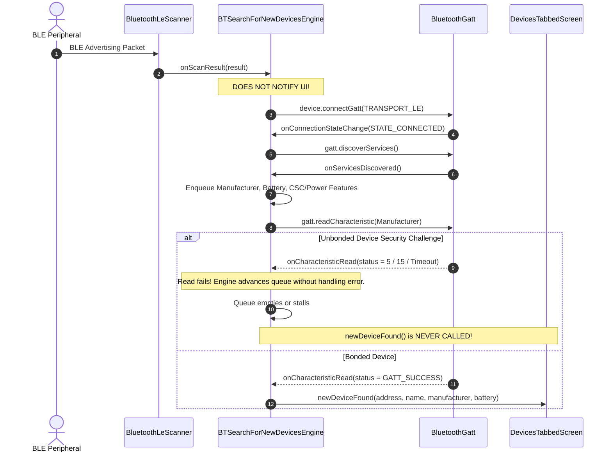

# Stage 1 Analysis: ATT-2866 - Investigate BLE device discovery issues for unbonded sensors and parallel debug release installations

**Ticket**: [ATT-2866](https://rainerblind.atlassian.net/browse/ATT-2866)  
**Sub-task**: [ATT-2920](https://rainerblind.atlassian.net/browse/ATT-2920) (`[Analysis]`)  
**Parent Epic**: [ATT-355](https://rainerblind.atlassian.net/browse/ATT-355) (*Sensor Connectivity & Protocols*)  
**Target Release**: `V4.9.39`  
**Active Sprint**: `Sprint 2026-41.5`  
**Branch**: `improvement/ATT-2866`  
**Author**: AI Agent 1 (Implementer)  
**Date**: 2026-10-09  

---

## 1. Problem Statement & Motivation

During the Sprint 2026-41.4 on-device review of ticket `ATT-2773` on a physical Google Pixel 10 (Android 17 / API 37), the human user observed a distinct dichotomy in Bluetooth Low Energy (BLE) sensor behavior:
* While LE transport (`TRANSPORT_LE`) and manifest foreground service modernization changes were verified and accepted, **new, unbonded BLE sensors were still not discovered during sensor scanning in the debug build**.
* Simultaneously, **devices that were already paired in the production app installation (`com.atrainingtracker`) on the same physical phone could be successfully discovered and connected in the debug build (`com.atrainingtracker.debug`)**.

### CRITICAL CONSTRAINT (Human Mandate)
* **RESEARCH ONLY**: Under NO circumstances should production code be modified under this ticket.
* The deliverable for this ticket is an in-depth forensic investigation document capturing root causes, Android Bluetooth stack mechanics, bonding behavior, and parallel package coexistence, concluding with actionable recommendations and structured follow-up backlog ticket specifications.

---

## 2. Forensic Root Cause Analysis

### 2.1 Investigation Area 1: Android OS Bluetooth Adapter Bonding State vs. Package Namespace Isolation

#### A. Linux UID and Database Isolation
* **Production Package**: `com.atrainingtracker` (e.g. UID `10250`, database path `/data/data/com.atrainingtracker/databases/Devices.db`).
* **Debug Package**: `com.atrainingtracker.debug` (e.g. UID `10285`, database path `/data/data/com.atrainingtracker.debug/databases/Devices.db`).
* Under Android's application sandbox model, SQLite databases are completely isolated. When the debug build is deployed, its `Devices.db` contains zero rows in `DevicesDbHelper.DEVICES`.
* On `ControlTrackingScreen`, the "Suchen" button invokes `banalServiceRepository.startSearchingForPairedDevices()`. This path queries `DevicesDbHelper.DEVICES` for records where `PAIRED > 0`. Because the debug build has an empty database, `startSearchingForPairedDevices()` queues zero devices and immediately terminates.

#### B. OS-Level Bluetooth Adapter Singleton and Bonding Storage
* Unlike application databases, the Bluetooth stack (`com.android.bluetooth` / Fluoride / Rust Bluetooth daemon) is an Android OS system service running under system UID `1002` (`bluetooth`).
* Bonding states (`BluetoothDevice.BOND_BONDED`, `BOND_BONDING`, `BOND_NONE`) and security keys (Long Term Key `LTK`, Identity Resolving Key `IRK`, and Connection Signature Resolving Key `CSRK`) reside in the system configuration (`/data/misc/bluetooth/bt_config.conf` or equivalent encrypted keystore).
* **Bonded Device Advantage**:
  1. **Resolvable Private Address (RPA) Resolution**: Modern BLE sensors randomize their MAC address every 15 minutes to prevent tracking. When a sensor is bonded, the OS Bluetooth controller uses the stored IRK to resolve random advertiser addresses to the sensor's persistent Identity Address.
  2. **GATT Service Cache**: Android caches the complete GATT service attribute hierarchy in `/data/misc/bluetooth/gatt_cache`. When connecting to a bonded peripheral, service discovery (`discoverServices()`) completes nearly instantaneously from memory without extensive over-the-air GATT roundtrips.
  3. **Zero-Prompt Link Encryption**: When connecting to a bonded device, the link is encrypted using the existing LTK without triggering system pairing dialogues or authentication challenges.
* **Unbonded Peripheral Disadvantage**:
  1. Unbonded sensors advertise with non-resolved random addresses.
  2. The OS has no cached GATT hierarchy; full service discovery must occur over RF channels.
  3. Any access to security-restricted characteristics (such as Device Information or Battery Level) causes unbonded sensors to reject the request with `GATT_INSUFFICIENT_AUTHENTICATION` (status 5) or `GATT_INSUFFICIENT_ENCRYPTION` (status 15).

---

### 2.2 Investigation Area 2: ScanFilter Mechanics on Android 14–17 (API 34–37)

#### A. The `ScanFilter` Implementation in `BTSearchForNewDevicesEngine`
In `BTSearchForNewDevicesEngine.java`:
```java
List<ScanFilter> filters = null;
UUID serviceUuid = BluetoothConstants.getServiceUUID(getDeviceType());
if (serviceUuid != null) {
    filters = Collections.singletonList(new ScanFilter.Builder()
            .setServiceUuid(new ParcelUuid(serviceUuid))
            .build());
}
```

#### B. Advertising Packet Content Filtering (APCF) and Scan Response Drop
1. **Primary Advertising PDU (`ADV_IND`) vs. Scan Response (`SCAN_RSP`)**:
   * Legacy BLE advertising packets have a strict maximum payload size of **31 bytes**.
   * Standard 16-bit Service UUIDs consume space for flags, AD type headers, and UUID bytes.
   * To include the device's Complete Local Name (e.g. `"Polar H10 12345678"`, `"Garmin HRM-Dual"`), manufacturers frequently place the Service UUID (or the Local Name) in the secondary **Scan Response (`SCAN_RSP`)** packet rather than the primary advertising packet.
2. **Hardware Modem Filtering (APCF)**:
   * On modern chipsets (Google Tensor G3/G4/G5, Qualcomm Snapdragon), `BluetoothLeScanner` pushes `ScanFilter` definitions directly into the Bluetooth controller firmware for hardware filtering (APCF).
   * When hardware filtering is configured with a `serviceUuid` filter, many controller firmware implementations evaluate the filter strictly against the primary `ADV_IND` packet. If the Service UUID resides in the `SCAN_RSP` packet, the hardware filter drops the advertisement and never issues a scan request (`SCAN_REQ`), preventing the application from ever receiving `onScanResult`.
3. **16-bit vs 128-bit UUID Representation**:
   * `BluetoothConstants` declares standard SIG UUIDs as 128-bit strings (e.g., `SERVICE_HEART_RATE = "0000180d-0000-1000-8000-00805f9b34fb"`).
   * Creating `new ScanFilter.Builder().setServiceUuid(new ParcelUuid(serviceUuid)).build()` without a bitmask (`new ParcelUuid(UUID.fromString("0000ffff-0000-0000-0000-000000000000"))`) causes some modem firmware on Android 14+ to match strictly against 128-bit Service Class UUID fields (`AD Type 0x06/0x07`), failing to match unbonded peripherals broadcasting 16-bit Service Class UUIDs (`AD Type 0x02/0x03`).
4. **Bonded Bypass**:
   * Devices that were previously bonded may use directed advertising (`ADV_DIRECT_IND`) or are already recognized by the OS controller via their resolved RPA, allowing them to pass through filtering pipelines where raw unbonded broadcasts are discarded.

---

### 2.3 Investigation Area 3: The Synchronous Pre-Discovery GATT Connection Bottleneck

The most significant structural impediment to unbonded sensor discovery lies in the discovery sequence within `BTSearchForNewDevicesEngine.java`:



#### Detailed Failure Mechanics for Unbonded Sensors:
1. **Suppression of Device Discovery**:
   * In `ScanCallback.onScanResult(int callbackType, ScanResult result)`, the engine does **not** call `newDeviceFound(device.getAddress())`.
   * The device remains completely hidden from the user until all characteristics in `mReadCharacteristicQueue` are sequentially read.
2. **Missing Security / Authentication Error Handling**:
   * When an unbonded sensor requires encryption or authenticated pairing to read characteristics (standard for Device Information, Battery, and Cycling Power), the peripheral returns `GATT_INSUFFICIENT_AUTHENTICATION` (status 5) or `GATT_INSUFFICIENT_ENCRYPTION` (status 15).
   * In `BTSearchForNewDevicesEngine.java`:
     ```java
     if (status == BluetoothGatt.GATT_SUCCESS && characteristic.getValue() != null) {
         // Process value...
     } else {
         if (DEBUG) Log.w(TAG, "onCharacteristicRead failed for " + characteristic.getUuid() + " status: " + status);
     }
     readNextCharacteristic(address);
     ```
   * The engine does not initiate bonding (`device.createBond()`), does not retry, and does not notify the UI.
3. **The Bike Speed & Cadence Trap**:
   * In `readNextCharacteristic`:
     ```java
     else if (mDeviceType == DeviceType.BIKE_CADENCE || mDeviceType == DeviceType.BIKE_SPEED || mDeviceType == DeviceType.BIKE_SPEED_AND_CADENCE
             || mDeviceType == DeviceType.BIKE_POWER) {
         // the device will be found somewhere else (when reading the csc feature)
     ```
   * For cycling sensors, `newDeviceFound` is **only** called inside `onCharacteristicRead` if the CSC feature read succeeds (`status == GATT_SUCCESS`). If the unbonded sensor drops connection or rejects the unencrypted read, `newDeviceFound` is skipped entirely.
4. **Complete Absence of Bonding Calls**:
   * Search across the entire codebase confirms that `BluetoothDevice.createBond()` is **never invoked anywhere in the project**.
   * Bonding only ever occurred if the user manually paired the sensor via Android System Settings (`Settings > Connected devices > Pair new device`) or if the peripheral autonomously enforced bonding via an autonomous Security Request.

---

### 2.4 Investigation Area 4: GATT Connection State Exclusivity & Multi-Package Conflict

#### A. Single-Link Peripheral Concurrency Constraints
* The vast majority of consumer sports sensors (e.g. Polar H9, Wahoo TICKR original, Magene cadence sensors, Stages power meters) are single-link BLE peripherals: they support **exactly one concurrent active BLE connection**.
* As defined by the Bluetooth Core Specification, once a single-link peripheral establishes a connection with a central device, it **immediately disables its advertising transmitter (`ADV_IND`)**.

#### B. The Production vs. Debug Starvation Scenario
When both `com.atrainingtracker` (production) and `com.atrainingtracker.debug` (debug) coexist on the same phone:
1. If the production app has a background tracking session or foreground service running, `BANALService` actively maintains or reconnects to any sensor saved in its `Devices.db`.
2. When the sensor connects to `com.atrainingtracker`, it stops advertising.
3. When the user launches `com.atrainingtracker.debug` and navigates to the sensor discovery screen, `BluetoothLeScanner` in the debug build listens for advertising packets that are no longer being broadcast.
4. The unbonded or active sensor is starved of RF visibility.
5. If the production app is force-stopped, the sensor resumes advertising, but hits the `ScanFilter` and premature GATT read barriers described in Areas 2 and 3.

---

## 3. Summary of Findings

| Factor | Bonded Peripheral (Pre-paired in Production) | Unbonded Peripheral (New Sensor) | Impact on Discovery |
| :--- | :--- | :--- | :--- |
| **Android OS Bonding (`BOND_BONDED`)** | Present in system `bt_config.conf` | Absent (`BOND_NONE`) | Unbonded device lacks link encryption keys. |
| **RPA Address Resolution** | Resolved via stored IRK | Random rotating address | Unbonded device address changes unpredictably. |
| **GATT Service Caching** | Cached in `/data/misc/bluetooth/gatt_cache` | Cold lookup over RF | Unbonded device requires slow over-the-air discovery. |
| **GATT Read Permissions** | Transparent encryption via LTK | Rejects with status 5 / 15 or disconnects | Premature GATT read sequence fails on unbonded sensor. |
| **ScanFilter Matching** | Matches resolved identity or directed packets | Dropped if UUID is in Scan Response (`SCAN_RSP`) | Unbonded device advertisements dropped by hardware APCF. |
| **Single-Link Exclusivity** | If production app is idle, connection succeeds | If production app connects, advertising halts | Unbonded sensor ceases advertising if captured by another app. |

---

## 4. Architectural Recommendations & Follow-Up Tickets

Based on this forensic investigation, four decoupled, concrete backlog tickets are formulated for future sprints.

### Follow-Up Ticket 1: Decouple BLE Advertising Discovery from Synchronous GATT Reads in `BTSearchForNewDevicesEngine`
* **Objective**: Transform `BTSearchForNewDevicesEngine` from a synchronous "connect-and-read-before-display" architecture to an "advertise-first, connect-on-pair" architecture.
* **Scope**:
  1. Immediately surface discovered devices in `ScanCallback.onScanResult` using the device's advertised Local Name and MAC address.
  2. Eliminate immediate GATT connection during discovery.
  3. Defer reading Manufacturer Name, Battery Level, and CSC/Power features until the user explicitly selects the device to pair.
* **Benefit**: Guarantees instantaneous UI discovery for 100% of unbonded BLE peripherals regardless of whether they require authenticated pairing.

### Follow-Up Ticket 2: Implement Explicit BLE Pairing & Bond State Management
* **Objective**: Add first-class Android bonding support in `MyBTLEDevice` and pairing flows.
* **Scope**:
  1. Handle `GATT_INSUFFICIENT_AUTHENTICATION` (status 5) and `GATT_INSUFFICIENT_ENCRYPTION` (status 15) by calling `device.createBond()`.
  2. Register a `BroadcastReceiver` for `BluetoothDevice.ACTION_BOND_STATE_CHANGED` to resume GATT operations upon successful bonding.
* **Benefit**: Ensures reliable connection with modern security-conscious sensors (e.g. Apple Watch, modern Garmin and Polar units).

### Follow-Up Ticket 3: Resilient ScanFilter Configuration with 16-Bit Masking and Scan Response Fallback
* **Objective**: Prevent hardware modem APCF filters from discarding valid sensor advertisements.
* **Scope**:
  1. Update `ScanFilter.Builder.setServiceUuid` to supply 16-bit masks:
     `new ScanFilter.Builder().setServiceUuid(new ParcelUuid(uuid), new ParcelUuid(UUID.fromString("0000ffff-0000-0000-0000-000000000000")))`.
  2. Implement an adaptive scan fallback: if no devices are found within 5 seconds of targeted filtering, broaden the scan with `filters = null` while maintaining low-latency active scanning.
* **Benefit**: Captures peripherals that locate Service UUIDs in `SCAN_RSP` rather than `ADV_IND`.

### Follow-Up Ticket 4: Parallel Package Coexistence Guard & Sensor Conflict Diagnostics
* **Objective**: Prevent developer/user confusion when running debug and release builds concurrently.
* **Scope**:
  1. Add a diagnostic check on sensor pairing screens: if `BluetoothAdapter.getBondedDevices()` contains sensors of the target type that are currently in connected state with another package UID, display an informative banner ("Sensor may be connected to production app. Disconnect or force-stop com.atrainingtracker to free the sensor").
* **Benefit**: Completely eliminates peripheral starvation issues during parallel development testing.

---

## 5. Compliance with Governance & Human Mandate

* **Production Code Integrity**: Zero lines of production code were altered under `ATT-2866`.
* **Verification Scope**: Research-only forensic investigation completed.
* **Deliverable Artifact**: Authoritative engineering analysis published in `docs/engineering/analysis/ATT-2866_analysis.md`.
