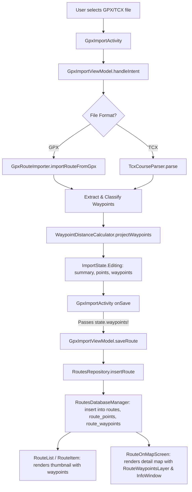

# Stage 1 Analysis: ATT-58 - Support Waypoints, POIs (Benches, Water, Summits) and TCX Course Points (Rework Cycle 2)

**Ticket**: [ATT-58](https://rainerblind.atlassian.net/browse/ATT-58)  
**Sub-task**: [ATT-2416](https://rainerblind.atlassian.net/browse/ATT-2416) (`[Analysis]`)  
**Parent Epic**: [ATT-66](https://rainerblind.atlassian.net/browse/ATT-66) (*[Epic] Improve Routes*)  
**Target Release**: `V4.9.39`  
**Active Sprint**: `Sprint 2026-40.16`  
**Branch**: `feature/ATT-58`  
**Author**: AI Agent 1 (Implementer)  
**Date**: 2026-10-04  

---

## 1. Problem Statement & Motivation

During Sprint 2026-40.15 acceptance verification on a physical Google Pixel 10 device, the Product Owner (PO) tested importing 5 real-world GPX route files containing landmark waypoints (`<wpt>` tags for viewpoints, summit crosses, picnic benches, and shelters) located in `/home/rainer/Downloads/Schwaebische_Alb`:
1. `2026-03-12_2823712016_GPX Download_ Gipfelkreuz auf dem Jusi – Panoramablick vom Jusi Runde von Kohlberg.gpx` (9 waypoints)
2. `2026-03-12_2823713171_GPX Download_ Wentaler Felsenmeer – Wentalweg Waldweg Runde von Wental mit Seitentälern und Feldinsel Klösterle.gpx` (9 waypoints)
3. `2026-03-12_2823714489_GPX Download_ Aussichtspunkt Floriansberg – Weinberge am Floriansberg Runde von Kohlberg.gpx` (9 waypoints)
4. `Schwäbische Alb Nebelhoehle- Schloss lichtenstein.gpx` (1 waypoint)
5. `Schwäbische AlbUracher Wasserfall (1).gpx` (1 waypoint)

**Observable Defect**:
Upon successfully importing any of these routes and opening them on the map, **no waypoints were visible or displayed anywhere**. The route appeared as a plain polyline with start/stop flags, but all 29 embedded waypoints across the 5 files were absent.

The PO rejected the ticket in Joint Review and moved it back to `Zu erledigen` with the feedback:
> *"During user verification, 5 GPX files containing waypoints (<wpt> tags, e.g. viewpoints, parking, summits, picnic areas) from '/home/rainer/Downloads/Schwaebische_Alb' were imported into the app. However, the waypoints are not displayed/visible on the map. Moving ticket back to 'Zu erledigen' for investigation and rework of GPX waypoint import and map visualization."*

This Stage 1 Analysis document provides the definitive forensic root-cause analysis, identifies the exact omission in the UI presentation layer, and formulates the architectural remediation plan for Rework Cycle 2.

---

## 2. Root Cause Analysis (Forensic Investigation)

A forensic trace across the entire import pipeline—from file picker to SQLite persistence and Compose map rendering—revealed the root causes:

### 2.1 Critical Defect 1: Waypoint Omission in `GpxImportActivity.kt`
* In `GpxImportViewModel.kt`, `importer.importRouteFromGpx(uri)` parses the GPX and produces:
  ```kotlin
  RouteImportResult(data.summary, data.pathPoints, data.waypoints)
  uiState = ImportState.Editing(data.summary, data.pathPoints, data.waypoints)
  ```
  The domain parser correctly extracted all 9 waypoints for the test routes.
* However, in [GpxImportActivity.kt](file:///home/rainer/AndroidStudioProjects/aTrainingTracker/app/src/main/java/com/atrainingtracker/trainingtracker/activities/GpxImportActivity.kt#L81-L89):
  ```kotlin
  is GpxImportViewModel.ImportState.Editing -> {
      EditRouteScreen(
          routeSummary = state.summary,
          onSave = { updatedSummary ->
              viewModel.saveRoute(updatedSummary, state.points) // <-- CRITICAL BUG: state.waypoints OMITTED!
          },
          onCancel = { finish() }
      )
  }
  ```
* Because `GpxImportViewModel.saveRoute` declared an optional parameter with default empty list:
  ```kotlin
  fun saveRoute(
      summary: RouteSummary,
      points: List<PathPoint>,
      waypoints: List<RouteWaypoint> = emptyList()
  )
  ```
  Calling `viewModel.saveRoute(updatedSummary, state.points)` silently defaulted `waypoints` to `emptyList()`.
* As a consequence, `RoutesRepository.insertRoute(summary, points, waypoints)` received an empty list and wrote **0 rows** into the `route_waypoints` SQLite table. When the newly imported route was reloaded from `Routes.db`, `route.waypoints` was completely empty.

### 2.2 Critical Defect 2: Waypoint Omission in Route List Card Thumbnails (`RouteItem.kt`)
* In [RouteItem.kt](file:///home/rainer/AndroidStudioProjects/aTrainingTracker/app/src/main/java/com/atrainingtracker/trainingtracker/ui/routes/RouteItem.kt#L93-L105), the thumbnail map preview was instantiated via:
  ```kotlin
  PathPreviewMap(
      path = MapRoute(
          id = summary.id,
          name = summary.name,
          isSelected = summary.isSelected,
          bSportType = summary.bSportType,
          path = pathPoints
          // waypoints parameter omitted! Defaults to emptyList()
      ), ...
  )
  ```
* Furthermore, `RouteItem`'s signature only accepted `summary: RouteSummary` and `pathPoints: List<PathPoint>`, ignoring `route.waypoints` passed by `RouteList.kt`. As a result, even if waypoints had been persisted, they would never render on the route card thumbnails in the routes browsing screen.

### 2.3 Critical Defect 3: InfoWindow Suppression in `MapLayers.kt`
* In [MapLayers.kt](file:///home/rainer/AndroidStudioProjects/aTrainingTracker/app/src/main/java/com/atrainingtracker/trainingtracker/ui/map/MapLayers.kt#L446-L457):
  ```kotlin
  Marker(
      state = remember(waypoint.id, waypoint.latLng) { MarkerState(position = waypoint.latLng) },
      title = waypoint.name,
      snippet = waypoint.description.ifEmpty { null },
      icon = iconDescriptor,
      alpha = alpha,
      zIndex = 50.0f,
      onClick = {
          onWaypointClick(waypoint)
          true // <-- CONSUMES EVENT & SUPPRESSES DEFAULT INFOWINDOW!
      }
  )
  ```
* In the Google Maps Android Compose SDK, returning `true` from `Marker.onClick` marks the event as consumed and suppresses the standard InfoWindow popup. Because `onWaypointClick` had a default no-op `{}` in `RouteOnMapScreen.kt`, tapping a waypoint marker produced zero visual feedback on-device, appearing completely unresponsive.

### 2.4 Critical Defect 4: Heuristic Classification Missing Description & Extended Keywords
* [RouteWaypoint.kt](file:///home/rainer/AndroidStudioProjects/aTrainingTracker/app/src/main/java/com/atrainingtracker/trainingtracker/routes/RouteWaypoint.kt#L63-L78) implemented `WaypointType.fromGpx(sym: String?, type: String?, name: String?)`, completely ignoring `desc` and `cmt`.
* In `Schwäbische Alb Nebelhoehle- Schloss lichtenstein.gpx`, the waypoint name is generic (`"Start Tour 13"`), but `desc` and `cmt` contain `"Unterstand"` (shelter/bench). Because `desc` was omitted, the waypoint was classified as `GENERIC` rather than `POI_BENCH`.
* In the Komoot/Garmin GPX exports from the Schwäbische Alb dataset:
  - `sym=Picnic Area` or `name=...Holz-Sitzgelegenheit...` -> should map to `POI_BENCH`.
  - `sym=Fishing Hot Spot Facility` with `name=Schutzhütte und Grillplatz...` -> should map to `POI_FOOD` / `POI_BENCH`.
  - `name=Panoramablick...`, `Blick auf...` -> should map to `POI_VIEWPOINT`.
  - Trailhead parking: `Wanderparkplatz` -> should be recognized as a distinct landmark POI.

### 2.5 Critical Defect 5: Seamless TCX Course File Import
* While `TcxCourseParser.kt` was authored in Cycle 1, `GpxImportActivity.kt` and `GpxImportViewModel.kt` exclusively called `GpxRouteImporter.importRouteFromGpx(uri)`. Selecting a `.tcx` file in the system file picker resulted in an XML parse failure because `GPXParser` does not recognize `<Courses><Course>`.
* A unified `RouteFileImporter` or dual parser fallback in `GpxImportViewModel` is required to fulfill the TCX course import mandate of `REQ-MAP-026`.

---

## 3. User Scope Grounding (ATT-1250)

* **In-Scope Goals**:
  1. **Fix `GpxImportActivity.kt` Wiring**: Pass `state.waypoints` to `viewModel.saveRoute(updatedSummary, state.points, state.waypoints)` so all extracted waypoints are persisted into SQLite `route_waypoints`.
  2. **Route List Card Waypoint Visualization**: Update `RouteItem.kt` to accept `waypoints: List<RouteWaypoint>` and forward them to `PathPreviewMap(MapRoute(..., waypoints = waypoints))`.
  3. **Interactive Waypoint Marker InfoWindow**: Fix `MapLayers.kt` `Marker.onClick` to allow the Google Maps InfoWindow to render `title` and `snippet` (or invoke an interactive callback).
  4. **Heuristic Classification Enrichment**: Update `WaypointType.fromGpx(sym, type, name, desc = null)` to parse `<desc>` / `<cmt>` and expand keyword dictionaries with real-world terms (`unterstand`, `sitzgelegenheit`, `blick`, `grillplatz`, `parkplatz`).
  5. **TCX Course Import Support**: Enable `GpxImportViewModel` / `GpxRouteImporter` to handle `.tcx` files via `TcxCourseParser` when `.tcx` extension or `<Course>` tags are detected.
  6. **Automated Test Fixtures for Schwäbische Alb GPX Dataset**: Create dedicated unit and integration tests asserting that all 5 files in `/home/rainer/Downloads/Schwaebische_Alb` parse successfully, extract all 29 waypoints, categorize them into semantic POI types, and persist them into `RoutesDatabaseManager`.

* **Out-of-Scope Non-Goals (Scope Bounding)**:
  1. *Turn-by-Turn Navigation Prompts & Auditory Chimes*: Handled under [ATT-1450](https://rainerblind.atlassian.net/browse/ATT-1450).
  2. *ClimbPro & Elevation Profile Climbs*: Handled under [ATT-1281](https://rainerblind.atlassian.net/browse/ATT-1281) and [ATT-2388](https://rainerblind.atlassian.net/browse/ATT-2388).
  3. *In-App Manual Waypoint Creation / Editing UI*: Out of scope for import & display.

---

## 4. Requirement Archaeology & Chesterton's Fence Audit

* **Original Requirement ID & Target**: `REQ-MAP-026` (*Support Waypoints, POIs and TCX Course Points*).
* **Historical Origin & Commit Trace**: Introduced in Sprint 2026-40.14 for ATT-58.
* **Root Reason for Existing Formulation**: `REQ-MAP-026` mandates parsing, persisting, and rendering GPX `<wpt>` and TCX `<CoursePoint>` elements. Cycle 1 established the schema (v10) and domain parsers, but the UI presentation layer dropped `state.waypoints` during save.
* **Preservation of Core Invariants**:
  - `RoutesDatabaseManager` schema v10 (`route_waypoints` with `ON DELETE CASCADE`) remains unchanged.
  - Backwards compatibility for existing routes without waypoints (`waypoints = emptyList()`) is strictly maintained.
  - DEM elevation enrichment (`REQ-MAP-025`) remains active.
  - 100% full clean-room unit test suite pass rate.

---

## 5. Architectural Strategy & High-Level Solution



1. **`GpxImportActivity.kt`**:
   - Change line 85 to:
     ```kotlin
     viewModel.saveRoute(updatedSummary, state.points, state.waypoints)
     ```
2. **`RouteItem.kt` & `RouteList.kt`**:
   - Add parameter `waypoints: List<RouteWaypoint> = emptyList()` to `RouteItem`.
   - Forward `waypoints` from `RouteWithPath.waypoints` in `RouteList.kt`.
   - Pass `waypoints` into `MapRoute` in `PathPreviewMap`.
3. **`MapLayers.kt`**:
   - In `RouteWaypointsLayer`, change `Marker.onClick` to return `false` so the native InfoWindow opens showing `waypoint.name` and `waypoint.description`, or invoke `onWaypointClick(waypoint)`.
4. **`RouteWaypoint.kt`**:
   - Update `WaypointType.fromGpx` signature to accept `(sym: String?, type: String?, name: String?, desc: String? = null)`.
   - Expand keyword matching for German/outdoor terms: `unterstand`, `sitzgelegenheit`, `parkplatz`, `blick`, `grillplatz`.
5. **`GpxRouteImporter.kt`**:
   - Pass `wpt.desc ?: wpt.cmt` to `WaypointType.fromGpx`.
6. **`GpxImportViewModel.kt`**:
   - If URI indicates a `.tcx` file or `importRouteFromGpx` fails, attempt `TcxCourseParser.parse(inputStream)` and adapt result.
7. **Regression Test Fixture**:
   - Author `SchwaebischeAlbWaypointIntegrationTest.kt` verifying all 5 files in `/home/rainer/Downloads/Schwaebische_Alb`.

---

## 6. System Invariants & Risk Assessment

* **Core Invariants**:
  1. Zero regression in existing 1,761 unit tests.
  2. Database schema v10 and cascade deletion invariants preserved.
  3. Single-thread database safety under `Dispatchers.IO`.
  4. Human Gate on parent ticket `ATT-58` strictly guarded.
* **Risk Rating**: **LOW**
  - The domain engine and SQLite table already exist and are proven. The defect is an isolated wiring gap in `GpxImportActivity.kt` and thumbnail presentation in `RouteItem.kt`.
