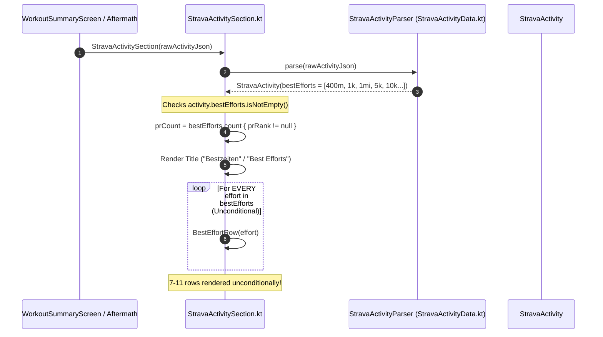

# Forensic Analysis: Reduce Number of 'Bestzeiten' in Workout Summary (ATT-883)

## 1. Executive Summary & Problem Context
* **Ticket Key**: `ATT-883`
* **Summary**: `[Verbesserung] Reduce the number of 'Bestzeiten' in the Workout Summary`
* **Epic**: `ATT-597` (`Strava Support`)
* **Target Version**: `V4.9.36`
* **Target Branch**: `feature/ATT-883`

### Problem Description
In the Strava Results section of the Workout Summary card (`StravaActivitySection.kt`), running activities currently render every single distance interval returned in Strava's `best_efforts` JSON array unconditionally and linearly.

For typical running activities, the Strava API computes best efforts across a large array of fixed standard benchmark distances:
* 400 m
* 1/2 mile (805 m)
* 1 km (1,000 m)
* 1 mile (1,609 m)
* 2 miles (3,219 m)
* 5 km (5,000 m)
* 10 km (10,000 m)
* 15 km (15,000 m)
* 10 miles (16,093 m)
* 20 km (20,000 m)
* Half-Marathon (21,097 m)
* Marathon (42,195 m)

A moderate 10k run generates 7 distinct best effort entries; a half-marathon generates 11 distinct best effort entries. Because `StravaActivitySection.kt` iterates through `activity.bestEfforts` with a simple `forEach { BestEffortRow(effort) }`, all 7 to 11 rows are rendered continuously on screen.

### Athlete Pain Points
1. **Severe Summary Card Bloat**: 7–11 rows of best efforts consume excessive vertical screen real estate, pushing segment efforts, heart rate zones, map snapshots, and other crucial workout statistics far off-screen.
2. **Dilution of Genuine Achievements (PRs)**: An athlete running at a steady training pace might set zero Personal Records (PRs), or only one PR at a specific distance. Rendering 10 ordinary interval times under the prominent German header "Bestzeiten" ("Best Efforts") is misleading and dilutes the visual impact of genuine personal bests.
3. **Inconsistent UX with Segment Efforts**: In `ATT-813` / `REQ-UI-131`, segment efforts were upgraded with a smart, collapsible accordion that defaults to highlights (PRs, KOMs, and starred segments) when the list exceeds 4 items. In contrast, Best Efforts currently lacks any accordion or filtering mechanism, creating an inconsistent and cluttered presentation.

---

## 2. Forensic Call-Chain & Component Investigation

### 2.1 Current Execution Flow


### 2.2 Source Code Audit (`StravaActivitySection.kt`)
Lines 104–120:
```kotlin
// --- Best Efforts (e.g. for runs) ---
if (activity.bestEfforts.isNotEmpty()) {
    val prCount = activity.bestEfforts.count { it.prRank != null }
    val bestEffortsTitle = if (prCount > 0) {
        pluralStringResource(R.plurals.strava_best_efforts_with_prs_format, prCount, prCount)
    } else {
        stringResource(R.string.strava_best_efforts)
    }
    Text(
        text = bestEffortsTitle,
        style = MaterialTheme.typography.labelMedium,
        color = MaterialTheme.colorScheme.secondary
    )
    activity.bestEfforts.forEach { effort ->
        BestEffortRow(effort)
    }
}
```

### 2.3 Data Model Audit (`StravaActivityData.kt`)
Lines 41–45:
```kotlin
data class StravaBestEffort(
    val name: String,
    val elapsedTimeSec: Int,
    val prRank: Int?
)
```
Unlike `StravaSegmentEffort` which features `val isHighlight: Boolean get() = isStarred || prRank != null || komRank != null`, `StravaBestEffort` has no highlight classifier extension or helper.

### 2.4 Existing Segment Effort Pattern (Precedent)
Lines 136–189 of `StravaActivitySection.kt` already establish the project standard for list reduction in workout summaries:
* Threshold $K = 4$.
* Highlight filtering: `highlightEfforts = efforts.filter { it.isHighlight }`.
* Collapsible eligibility: `total > 4 && total > highlightEfforts.size`.
* Collapsed state: Only highlights displayed, or `@string/strava_no_highlights` if no highlights exist.
* Toggle action button with dynamic counts (`totalCount` and `hiddenCount`).
* State retention via `rememberSaveable { mutableStateOf(false) }`.

---

## 3. Proposed Architectural Solution & Design

### 3.1 Highlight Classification for Best Efforts
A best effort is classified as a **Highlight** if and only if it represents a Personal Record:
```kotlin
val StravaBestEffort.isHighlight: Boolean
    get() = prRank != null
```
Where `prRank` is an integer value ($\in \{1, 2, 3\}$) representing 1st, 2nd, or 3rd personal best time recorded on Strava.

### 3.2 Collapsible Accordion Logic
* **Threshold $K = 3$**:
  * If $N \le 3$: The list is already compact (maximum 3 rows); all efforts are rendered directly without collapse controls.
  * If $N == N_{\text{highlight}}$: All best efforts achieved PR status; all efforts are rendered directly without collapse controls (celebrating the accomplishment).
  * If $N > 3$ and $N > N_{\text{highlight}}$: The section is **collapsible**.
* **Collapsed View (`isExpanded == false`, Default)**:
  * If $N_{\text{highlight}} > 0$: Only the $N_{\text{highlight}}$ PR efforts are rendered via `BestEffortRow(effort)`.
  * If $N_{\text{highlight}} == 0$: A single subtle informational text is displayed: `@string/strava_no_best_effort_prs` (*"No personal records"* / *"Keine persönlichen Bestleistungen"*), taking up zero list rows.
  * Below the content, an expand button is rendered:
    * Label: `@string/strava_show_all_best_efforts_format` (`"▼ Show all %1$d best efforts (+%2$d more)"`).
* **Expanded View (`isExpanded == true`)**:
  * All $N$ best efforts are displayed in full via `BestEffortRow(effort)`.
  * Below the content, the button toggles to collapse:
    * If $N_{\text{highlight}} > 0$: `@string/strava_show_less_best_efforts_format` (`"▲ Show only PRs (%1$d)"`).
    * If $N_{\text{highlight}} == 0$: `@string/strava_show_less_best_efforts` (`"▲ Show less"`).
* **State Retention**:
  * Controlled via `rememberSaveable { mutableStateOf(false) }` to prevent collapse state resets during LazyColumn scrolling or device rotation.

```mermaid
graph TD
    A[activity.bestEfforts.isNotEmpty()] --> B{totalCount > 3 AND totalCount > highlightCount?}
    B -- No --> C[Render All BestEffortRow directly]
    B -- Yes (Collapsible) --> D{isExpanded?}
    D -- False (Collapsed Default) --> E{highlightCount > 0?}
    E -- Yes --> F[Render Highlight BestEffortRows only]
    E -- No --> G[Render 'No personal records' Text]
    F --> H[Render '▼ Show all N (+M more)' Button]
    G --> H
    D -- True (Expanded) --> I[Render All BestEffortRows]
    I --> J{highlightCount > 0?}
    J -- Yes --> K[Render '▲ Show only PRs (N)' Button]
    J -- No --> L[Render '▲ Show less' Button]
```

---

## 4. Resource & Localization Analysis (9 Locales)

Pursuant to `REQ-LOC-001` and verified by `TranslationParityTest.kt`, all new string resources must maintain exact format specifier parity across all 9 supported locales:

| Resource Key | EN | DE | ES | FR | IT | JA | NL | PL | PT |
| :--- | :--- | :--- | :--- | :--- | :--- | :--- | :--- | :--- | :--- |
| `strava_show_all_best_efforts_format` | `▼ Show all %1$d best efforts (+%2$d more)` | `▼ Alle %1$d Bestzeiten anzeigen (+%2$d weitere)` | `▼ Mostrar los %1$d mejores tiempos (+%2$d más)` | `▼ Afficher les %1$d meilleurs temps (+%2$d de plus)` | `▼ Mostra tutti i %1$d migliori tempi (+%2$d altri)` | `▼ すべての%1$d件の自己ベストを表示（他%2$d件）` | `▼ Toon alle %1$d beste prestaties (+%2$d meer)` | `▼ Pokaż wszystkie %1$d najlepsze czasy (+%2$d więcej)` | `▼ Mostrar todos os %1$d melhores tempos (+%2$d mais)` |
| `strava_show_less_best_efforts_format` | `▲ Show only PRs (%1$d)` | `▲ Nur Bestzeiten/PRs anzeigen (%1$d)` | `▲ Mostrar solo récords (%1$d)` | `▲ Afficher uniquement les records (%1$d)` | `▲ Mostra solo record personali (%1$d)` | `▲ 自己ベストのみ表示（%1$d）` | `▲ Toon alleen records (%1$d)` | `▲ Pokaż tylko rekordy (%1$d)` | `▲ Mostrar apenas recordes (%1$d)` |
| `strava_show_less_best_efforts` | `▲ Show less` | `▲ Weniger anzeigen` | `▲ Mostrar menos` | `▲ Afficher moins` | `▲ Mostra meno` | `▲ 折りたたむ` | `▲ Minder tonen` | `▲ Pokaż mniej` | `▲ Mostrar menos` |
| `strava_no_best_effort_prs` | `No personal records` | `Keine persönlichen Bestleistungen` | `Sin récords personales` | `Aucun record personnel` | `Nessun record personale` | `自己ベストはありません` | `Geen persoonlijke records` | `Brak rekordów życiowych` | `Sem recordes pessoais` |

---

## 5. Impact Analysis & System Invariants

### 5.1 System Invariants
1. **Segment Efforts Integrity**: Segment efforts rendering (`SegmentEffortRow`, starred queries, segment accordion logic) remains 100% untouched.
2. **Data Parsing Integrity**: `StravaActivityParser` logic remains fully backward and forward compatible.
3. **Strava Branding Compliance**: The `PoweredByStrava` logo and Strava branding guidelines remain strictly intact at the footer of `StravaActivitySection`.
4. **External Navigation**: Tapping the Strava header or segments still invokes `StravaHelper.openActivity()` without interference.
5. **No Visual Clipping**: Best effort rows retain full layout constraints, badge tinting (`RankBadge`), and time formatting (`TimeFormatter`).

### 5.2 Mapped Requirements Cross-Check
* `REQ-UI-131` (*Compact Strava Segment Efforts Presentation*): Segment logic remains intact.
* `REQ-LOC-001` (*Multilingual Localization & 9-Locale Parity*): Full parity maintained across all resource files.

---

## 6. Verification & Testing Strategy

### 6.1 Automated Unit Tests (`StravaActivitySectionTest.kt`)
1. **Highlight Classification**:
   * `StravaBestEffort` with `prRank = 1, 2, 3` -> `isHighlight == true`.
   * `StravaBestEffort` with `prRank = null` -> `isHighlight == false`.
2. **Accordion Eligibility**:
   * $\le 3$ efforts -> `isCollapsible == false`.
   * $> 3$ efforts where all are PRs -> `isCollapsible == false`.
   * $> 3$ efforts with at least 1 non-PR -> `isCollapsible == true`.
3. **Filtering Behavior**:
   * Collapsed state with PRs: displays only PR efforts.
   * Collapsed state with 0 PRs: displays 0 efforts (`displayedEfforts.isEmpty()`).
   * Expanded state: displays all efforts.
4. **String Resource Parity (`TranslationParityTest.kt`)**:
   * All 4 new keys validated across all 9 locales for format specifier consistency (`%1$d`, `%2$d`).
