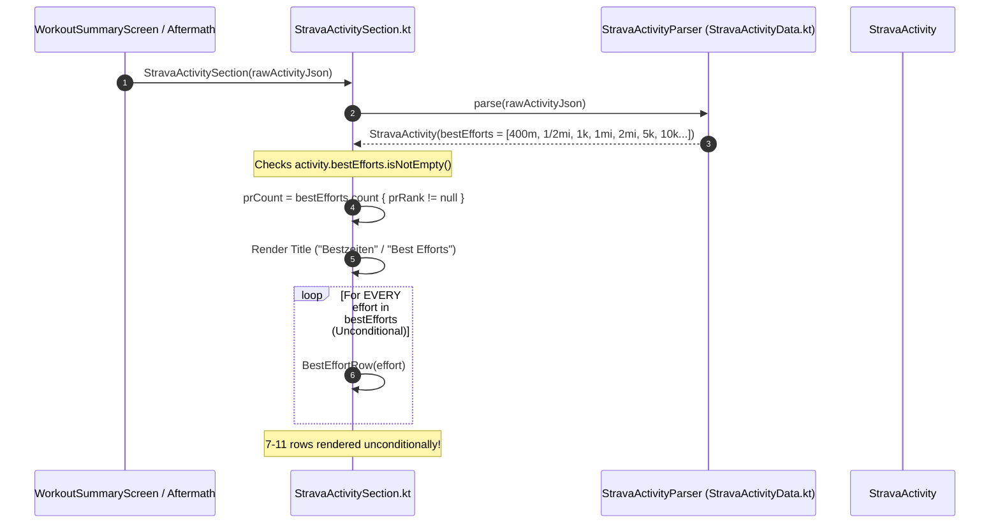

# Forensic Analysis: Reduce Number of 'Bestzeiten' in Workout Summary (ATT-883)

## 1. Executive Summary & Problem Context
* **Ticket Key**: `ATT-883`
* **Summary**: `[Verbesserung] Reduce the number of 'Bestzeiten' in the Workout Summary`
* **Epic**: `ATT-597` (`Strava Support`)
* **Target Version**: `V4.9.36`
* **Target Branch**: `feature/ATT-883`

### Problem Description
In the Strava Results section of the Workout Summary card (`StravaActivitySection.kt`), running activities currently render every single distance interval returned in Strava's `best_efforts` JSON array unconditionally and linearly.

For typical running activities, the Strava API computes best efforts across a large array of fixed standard benchmark distances:
* 400 m
* 1/2 mile (805 m)
* 1 km (1,000 m)
* 1 mile (1,609 m)
* 2 miles (3,219 m)
* 5 km (5,000 m)
* 10 km (10,000 m)
* 15 km (15,000 m)
* 10 miles (16,093 m)
* 20 km (20,000 m)
* Half-Marathon (21,097 m)
* Marathon (42,195 m)

A moderate 10k run generates 7 distinct best effort entries; a half-marathon generates 11 distinct best effort entries. Because `StravaActivitySection.kt` iterates through `activity.bestEfforts` with a simple `forEach { BestEffortRow(effort) }`, all 7 to 11 rows are rendered continuously on screen.

### Athlete Pain Points & Requirements
1. **Severe Summary Card Bloat**: 7–11 rows of best efforts consume excessive vertical screen real estate, pushing segment efforts, heart rate zones, map snapshots, and other crucial workout statistics far off-screen.
2. **Dilution of Genuine Achievements (PRs)**: An athlete running at a steady training pace might set zero Personal Records (PRs), or only one PR at a specific distance. Rendering 10 ordinary interval times under the prominent German header "Bestzeiten" ("Best Efforts") is misleading and dilutes the visual impact of genuine personal bests.
3. **Unit Irrelevance in Collapsed View (User Requirement)**: When the user has selected metric units (`MyUnits.METRIC`), imperial distances (such as "1/2 mile", "1 mile", "2 miles", "10 miles") clutter the collapsed view with irrelevant measurements. When units are metric, mile intervals must not be shown in the collapsed view.
4. **Visibility of the Primary/Longest Effort (User Requirement)**: When the number of best efforts is reduced in the collapsed view, the time of the **longest** distance must be shown. For example, in a 10k run, the 10k time is the definitive benchmark for the activity; showing the longest effort ensures the athlete immediately sees their primary time even if no PR was broken.

---

## 2. Forensic Call-Chain & Component Investigation

### 2.1 Current Execution Flow


### 2.2 Source Code Audit (`StravaActivitySection.kt`)
Lines 104–120:
```kotlin
// --- Best Efforts (e.g. for runs) ---
if (activity.bestEfforts.isNotEmpty()) {
    val prCount = activity.bestEfforts.count { it.prRank != null }
    val bestEffortsTitle = if (prCount > 0) {
        pluralStringResource(R.plurals.strava_best_efforts_with_prs_format, prCount, prCount)
    } else {
        stringResource(R.string.strava_best_efforts)
    }
    Text(
        text = bestEffortsTitle,
        style = MaterialTheme.typography.labelMedium,
        color = MaterialTheme.colorScheme.secondary
    )
    activity.bestEfforts.forEach { effort ->
        BestEffortRow(effort)
    }
}
```

### 2.3 Data Model Audit (`StravaActivityData.kt`)
Lines 41–45:
```kotlin
data class StravaBestEffort(
    val name: String,
    val elapsedTimeSec: Int,
    val prRank: Int?
)
```
Currently, `StravaBestEffort` stores `name`, `elapsedTimeSec`, and `prRank`, but does not parse `distance` in meters or identify mile efforts.

### 2.4 Unit System Retrieval (`TrainingApplication.java`)
```java
@NonNull
public static MyUnits getUnit() {
    return MyUnits.valueOf(cSharedPreferences.getString(SP_UNITS, MyUnits.METRIC.name()));
}
```
`MyUnits` is either `METRIC` or `IMPERIAL`.

---

## 3. Proposed Architectural Solution & Design

### 3.1 Model Enhancements in `StravaActivityData.kt`
* Add optional `distanceMeters: Double = 0.0` to `StravaBestEffort`.
* In `StravaActivityParser`, parse `item.optDouble("distance", 0.0)`.
* Provide helper properties:
  ```kotlin
  val StravaBestEffort.isHighlight: Boolean
      get() = prRank != null

  val StravaBestEffort.isMileEffort: Boolean
      get() = name.contains("mile", ignoreCase = true) || name.contains(" mi", ignoreCase = true)

  val StravaBestEffort.effectiveDistanceMeters: Double
      get() {
          if (distanceMeters > 0.0) return distanceMeters
          val lower = name.trim().lowercase()
          return when {
              lower == "400m" -> 400.0
              lower.contains("1/2") && lower.contains("mile") -> 804.672
              lower == "1k" -> 1000.0
              lower == "1 mile" || lower == "1 mi" -> 1609.344
              lower == "2 miles" || lower == "2 mi" -> 3218.688
              lower == "5k" -> 5000.0
              lower == "10k" -> 10000.0
              lower == "15k" -> 15000.0
              lower == "10 miles" || lower == "10 mi" -> 16093.44
              lower == "20k" -> 20000.0
              lower.contains("half") && lower.contains("marathon") -> 21097.5
              lower.contains("marathon") -> 42195.0
              else -> 0.0
          }
      }
  ```

### 3.2 Reduced (Collapsed) View Selection Algorithm
When computing the reduced/collapsed list:
1. **Unit Filtering**:
   * Retrieve active unit: `val isMetric = try { TrainingApplication.getUnit() == MyUnits.METRIC } catch (e: Exception) { true }`.
   * If `isMetric`: Exclude all mile efforts: `val eligibleEfforts = if (isMetric) allEfforts.filter { !it.isMileEffort } else allEfforts`.
   * Defensive fallback: If `eligibleEfforts.isEmpty()`, fall back to `allEfforts`.
2. **Longest Effort Identification**:
   * Identify the longest eligible effort: `val longestEffort = eligibleEfforts.maxByOrNull { it.effectiveDistanceMeters } ?: eligibleEfforts.lastOrNull()`.
3. **Highlight (PR) Identification**:
   * Find all PRs among eligible efforts: `val prEfforts = eligibleEfforts.filter { it.isHighlight }`.
4. **Assembly of Reduced List**:
   * Combine PRs and the longest effort without duplication:
     ```kotlin
     val reducedEfforts = allEfforts.filter { effort ->
         (prEfforts.contains(effort) || effort == longestEffort)
     }
     ```
   * *Ordering*: Maintain the natural ascending distance order of `activity.bestEfforts`.
5. **Collapse Eligibility**:
   * `val isCollapsible = allEfforts.size > reducedEfforts.size`.
   * If `isCollapsible == false`: All best efforts are already shown (e.g. 1 effort, or all efforts are highlights/longest); no accordion controls are rendered.
   * If `isCollapsible == true`: Accordion controls are activated.

### 3.3 Accordion UI Interaction Flow
```mermaid
graph TD
    A[activity.bestEfforts.isNotEmpty()] --> B[Compute reducedEfforts<br/>PRs + Longest, no miles if metric]
    B --> C{allEfforts.size > reducedEfforts.size?}
    C -- No --> D[Render allEfforts directly with NO buttons]
    C -- Yes (Collapsible) --> E{isExpanded?}
    E -- False (Collapsed Default) --> F[Render reducedEfforts via BestEffortRow]
    F --> G[Render '▼ Show all %1$d best efforts (+%2$d more)' Button]
    E -- True (Expanded) --> H[Render allEfforts via BestEffortRow]
    H --> I[Render '▲ Show less (%1$d)' Button]
```

* **Collapsed State (`isExpanded == false`, Default)**:
  * Renders `reducedEfforts`.
  * If `isMetric`: No mile intervals are visible.
  * The longest distance time (e.g. 10k) is guaranteed to be visible.
  * Action Button: `@string/strava_show_all_best_efforts_format` (`"▼ Show all %1$d best efforts (+%2$d more)"`).
* **Expanded State (`isExpanded == true`)**:
  * Renders `activity.bestEfforts` in full (including all mile distances).
  * Action Button: `@string/strava_show_less_best_efforts_format` (`"▲ Show less (%1$d)"`) or `@string/strava_show_less_best_efforts` (`"▲ Show less"`).
* **State Preservation**:
  * `var isExpanded by rememberSaveable { mutableStateOf(false) }`.

---

## 4. Resource & Localization Analysis (9 Locales)

Pursuant to `REQ-LOC-001` and verified by `TranslationParityTest.kt`, all new string resources maintain exact format specifier parity across all 9 supported locales:

| Resource Key | EN | DE | ES | FR | IT | JA | NL | PL | PT |
| :--- | :--- | :--- | :--- | :--- | :--- | :--- | :--- | :--- | :--- |
| `strava_show_all_best_efforts_format` | `▼ Show all %1$d best efforts (+%2$d more)` | `▼ Alle %1$d Bestzeiten anzeigen (+%2$d weitere)` | `▼ Mostrar los %1$d mejores tiempos (+%2$d más)` | `▼ Afficher les %1$d meilleurs temps (+%2$d de plus)` | `▼ Mostra tutti i %1$d migliori tempi (+%2$d altri)` | `▼ すべての%1$d件の自己ベストを表示（他%2$d件）` | `▼ Toon alle %1$d beste prestaties (+%2$d meer)` | `▼ Pokaż wszystkie %1$d najlepsze czasy (+%2$d więcej)` | `▼ Mostrar todos os %1$d melhores tempos (+%2$d mais)` |
| `strava_show_less_best_efforts_format` | `▲ Show less (%1$d)` | `▲ Weniger anzeigen (%1$d)` | `▲ Mostrar menos (%1$d)` | `▲ Afficher moins (%1$d)` | `▲ Mostra meno (%1$d)` | `▲ 折りたたむ（%1$d）` | `▲ Minder tonen (%1$d)` | `▲ Pokaż mniej (%1$d)` | `▲ Mostrar menos (%1$d)` |
| `strava_show_less_best_efforts` | `▲ Show less` | `▲ Weniger anzeigen` | `▲ Mostrar menos` | `▲ Afficher moins` | `▲ Mostra meno` | `▲ 折りたたむ` | `▲ Minder tonen` | `▲ Pokaż mniej` | `▲ Mostrar menos` |

---

## 5. Impact Analysis & System Invariants

### 5.1 System Invariants
1. **Segment Efforts Integrity**: Segment efforts rendering (`SegmentEffortRow`, starred queries, segment accordion logic) remains 100% untouched.
2. **Data Parsing Integrity**: `StravaActivityParser` logic remains fully backward and forward compatible. Existing JSON objects without `distance` field parse safely with default `0.0`.
3. **Strava Branding Compliance**: The `PoweredByStrava` logo and Strava branding guidelines remain strictly intact at the footer of `StravaActivitySection`.
4. **External Navigation**: Tapping the Strava header or segments still invokes `StravaHelper.openActivity()` without interference.
5. **No Visual Clipping**: Best effort rows retain full layout constraints, badge tinting (`RankBadge`), and time formatting (`TimeFormatter`).

### 5.2 Mapped Requirements Cross-Check
* `REQ-UI-131` (*Compact Strava Segment Efforts Presentation*): Segment logic remains intact.
* `REQ-LOC-001` (*Multilingual Localization & 9-Locale Parity*): Full parity maintained across all resource files.

---

## 6. Verification & Testing Strategy

### 6.1 Automated Unit Tests (`StravaActivitySectionTest.kt`)
1. **Metric Unit Filtering in Collapsed View**:
   * Given metric units and an activity with 400m, 1/2 mile, 1k, 1 mile, 5k, 10k:
   * Verify that in collapsed view, "1/2 mile" and "1 mile" are NOT present in the displayed list.
2. **Longest Effort Always Shown**:
   * Given an activity with 400m, 1k, 5k, 10k with 0 PRs:
   * Verify that in collapsed view, "10k" (the longest) IS displayed.
   * Given an activity where 1k is a PR and 10k is not:
   * Verify that in collapsed view, both 1k (PR) and 10k (longest) are displayed.
   * Given an activity where 10k is a PR:
   * Verify that 10k is displayed once (no duplicates).
3. **Expanded View Full Display**:
   * In expanded view, all distances (including miles) are displayed.
4. **Accordion Eligibility**:
   * When `allEfforts.size == reducedEfforts.size`, accordion is not activated.
   * When `allEfforts.size > reducedEfforts.size`, accordion is activated with accurate `+M more` count.
5. **String Resource Parity (`TranslationParityTest.kt`)**:
   * All new keys validated across all 9 locales for format specifier consistency.
