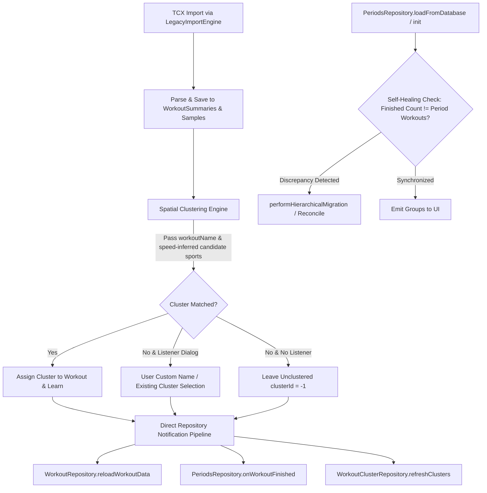

# ASPICE Stage 1: Problem & System Analysis (SWE.1 / SYS.2)
## ATT-909: Workouts that were imported from TCX were not added to the cluster & missing in Workout Periods

**Parent Epic**: ATT-529 (Import TCX Files)  
**Target Release**: V4.9.36  
**Issue Type**: Bug (Fehler)  
**Status**: In Bearbeitung  
**Sub-task**: ATT-951  

---

### 1. Executive Summary & Problem Statement

Athletes importing historical TCX workout files (either via single file import or bulk recovery from Dropbox) reported two critical systemic regressions:
1. **Workouts Not Added to Clusters (ATT-909)**:
   Workouts successfully parsed and saved into the database were not matched with existing route clusters, were not assigned to newly created clusters, or left `WorkoutClustersViewModel` in a stale state where imported workouts did not appear in clusters or the unclustered list.
2. **Workouts Missing in Workout Periods (User Observation)**:
   Imported historical workouts did not appear in the Workout Periods screens (Days, Weeks, Months, Years), rendering historical analytics and heatmaps incomplete despite the workouts being visible in the main workout list.

---

### 2. Root Cause Analysis (SWE.1.BP.1 / SWE.1.BP.3)

A systematic investigation across `LegacyImportEngine.kt`, `PeriodsRepository.kt`, `WorkoutClusterEngine.kt`, and `WorkoutRepository.kt` revealed five interrelated failure points:

#### 2.1 Issue 1: Why Imported Workouts Do Not Appear in Workout Periods

##### A. Asynchronous Broadcast Disconnection (`LocalBroadcastManager` vs. Lazy Singletons)
* In `LegacyImportEngine.kt` (lines 978–982), after calculating workout statistics and extrema, the engine attempts to notify the system solely via `LocalBroadcastManager`:
  ```kotlin
  val intent = Intent(TrackerService.WORKOUT_UPDATED_INTENT)
  intent.putExtra(TrackerService.WORKOUT_ID, workoutId)
  LocalBroadcastManager.getInstance(context).sendBroadcast(intent)
  ```
* In `WorkoutRepository.kt`, the receiver `workoutUpdateReceiver` is registered **only** during `WorkoutRepository.init`.
* `WorkoutRepository` is a lazily initialized singleton (`WorkoutRepository.getInstance(application)`).
* When an athlete opens the app and navigates to the Backup & Restore / Import screen (`ImportBackupTabsScreen`), `WorkoutRepository` has **never been instantiated**.
* `LocalBroadcastManager` is an in-memory pub-sub bus that does not buffer events. When `sendBroadcast()` is called with zero registered receivers, the event is immediately discarded.
* Consequently, `reloadWorkoutData(workoutId)` is never called, and `PeriodsRepository.getInstance(application).onWorkoutFinished(freshWorkoutData)` is **never invoked**.

##### B. Lack of Self-Healing Reconciliation in `PeriodsRepository`
* In `PeriodsRepository.kt`, hierarchical period aggregation (`performHierarchicalMigration()`) only runs if `!dbManager.isSyncFinished()`.
* Once an athlete has opened the app previously, `isSyncFinished()` is set to `true`.
* When the athlete navigates to Workout Periods after importing TCX files:
  1. `performHierarchicalMigration()` does not execute because `isSyncFinished() == true`.
  2. `loadFromDatabase()` reads raw period summaries directly from `PeriodSummaries.db` (`period_summaries` table).
  3. Because `onWorkoutFinished()` was never called during import, no `DAY`, `WEEK`, `MONTH`, or `YEAR` period summary rows exist in `PeriodSummaries.db` for the dates of the imported workouts.
  4. `enrichAndEmit()` maps only over the existing rows returned by `PeriodSummaries.db`.
  5. Any workout whose date has no row in `period_summaries` is completely omitted from the UI state (`_groupedPeriods`), making it completely invisible in Workout Periods.

---

#### 2.2 Issue 2: Why Imported Workouts Are Not Added to Clusters (ATT-909)

##### A. Multi-Sport / Unknown Sport Penalty in `WorkoutClusterEngine.suggestCluster`
* In `LegacyImportEngine.kt` (line 930):
  ```kotlin
  val matchingCluster = clusterEngine.suggestCluster(
      start, end, apex, totalDistance, null, setOf(bSportType), minAltPos, maxAltPos
  )
  ```
* If a TCX file has a missing, non-standard, or unmapped sport tag, `bSportType` resolves to `BSportType.UNKNOWN`.
* Passing `setOf(BSportType.UNKNOWN)` causes `WorkoutClusterEngine.calculateSimilarity` (line 839) to evaluate:
  ```kotlin
  if (cluster.bSportType in candidateSportTypes) { ... }
  else if (candidateSportTypes.isEmpty()) { ... }
  else {
      val penalty = if (cluster.bSportType != BSportType.UNKNOWN) 5.0 else 2.0
      totalScore += penalty
  }
  ```
* Because `setOf(UNKNOWN)` is not empty and does not match the cluster's sport (`BIKE` or `RUN`), a massive penalty of `+5.0` is added to the score.
* The threshold for a match is `score < 1.0`. Thus, matching is mathematically impossible for any workout with `bSportType == UNKNOWN`.
* Unlike `TrackerService.java` (which uses `discoveryManager.getCandidateBSportTypes(...)` based on speed if sport is unknown), `LegacyImportEngine` did not apply speed-based candidate sport inference.

##### B. Workout Name Heuristic Discarded
* In `LegacyImportEngine.kt` (line 930), `workoutName` is passed as `null` to `suggestCluster`, despite having been extracted from the TCX file (e.g. from notes or activity extensions).
* `WorkoutClusterEngine.calculateSimilarity` provides a 50% score reduction (`totalScore *= 0.5`) when the workout name matches the cluster name. Omitting `workoutName` discards this heuristic.

##### C. Missing `WorkoutSummaries.B_SPORT` Persistence
* `LegacyImportEngine.kt` updates `WorkoutSummaries.SPORT_ID`, but never sets `WorkoutSummaries.B_SPORT`.
* When `WorkoutClusterEngine.assignClusterToWorkout` runs (line 659), it attempts to read `WorkoutSummaries.B_SPORT`. Finding it blank, it falls back to `BSportType.UNKNOWN`, causing hardware and cluster identity inference to degrade.

##### D. Stale In-Memory Cluster Cache (`WorkoutClusterRepository`)
* When `LegacyImportEngine` assigns or creates a cluster in the database via `clusterEngine.assignClusterToWorkout`, it never notifies `WorkoutClusterRepository.getInstance(context).refreshClusters()`.
* Nor does `WorkoutClusterRepository` listen to broadcasts.
* As a result, in-memory `allClusters`, `clusterStats`, and `unclusteredWorkouts` in `WorkoutClustersViewModel` remain stale. Even if the workout was assigned in SQLite, the UI does not show the updated hit counts or previews until a force restart.

---

### 3. System Architecture & Proposed Remedy (SWE.1.BP.4 / SWE.1.BP.5)



#### 3.1 Direct Repository Notification Pipeline (`LegacyImportEngine.kt`)
* Eliminate sole reliance on `LocalBroadcastManager` for essential database-to-repository state transitions.
* Upon completing `recalculateStats`:
  1. Retrieve `val app = context.applicationContext as Application`.
  2. Explicitly invoke `WorkoutRepository.getInstance(app).reloadWorkoutData(workoutId)`.
  3. Ensure `PeriodsRepository.getInstance(app).onWorkoutFinished(freshWorkoutData)` is called.
  4. Invoke `WorkoutClusterRepository.getInstance(app).refreshClusters()`.

#### 3.2 Robust Cluster Matching in `LegacyImportEngine.kt`
1. **Speed-Inferred Candidate Sports**:
   If `bSportType == BSportType.UNKNOWN`, infer candidate sports using `EquipmentAndSportTypeDiscoveryManager.getInstance(context).getCandidateBSportTypes(bSportType, avgSpeed)` or pass `emptySet()` to avoid the catastrophic `+5.0` penalty.
2. **Pass Authoritative `workoutName`**:
   Pass `workoutName` into `suggestCluster` to enable the 50% name-match similarity discount.
3. **Persist `WorkoutSummaries.B_SPORT`**:
   Ensure `WorkoutSummaries.B_SPORT` is populated with `bSportType.name()` during TCX import.

#### 3.3 Self-Healing Period Reconciliation (`PeriodsRepository.kt`)
* Implement a lightweight, O(1) integrity check in `PeriodsRepository`:
  - Query `SELECT COUNT(*) FROM WorkoutSummaries WHERE finished = 1`.
  - Query `SELECT SUM(total_workouts) FROM period_summaries WHERE period_type = 'DAY'`.
  - If the counts do not match (meaning workouts were imported outside the active session or a broadcast was missed), automatically trigger `performHierarchicalMigration()` to reconcile all day, week, month, and year periods.
* In `BackupRestoreViewModel.kt`, after single or bulk TCX import completes, explicitly trigger:
  - `PeriodsRepository.getInstance(app).resyncAllPeriods()` (or `onWorkoutFinished`)
  - `WorkoutClusterRepository.getInstance(app).refreshClusters()`
  - `WorkoutRepository.getInstance(app).loadAllWorkouts()`

---

### 4. Impact Analysis & Invariants (SWE.1.BP.5)

| Component | Nature of Impact | Risk / Invariant Guard |
| :--- | :--- | :--- |
| `LegacyImportEngine.kt` | Direct repository pipeline notification & cluster tolerance passing | **Low**. Restores intended notification pattern; eliminates silent broadcast drop. |
| `WorkoutClusterEngine.kt` | Candidate sport evaluation & similarity calculation | **Zero**. Enhances clustering accuracy for unknown sports without altering existing cluster thresholds. |
| `PeriodsRepository.kt` | Self-healing count comparison & reactive sync | **Low**. O(1) fast SQL count check; only triggers hierarchical migration when actual unsynced workouts exist. |
| `WorkoutSummariesDatabaseManager.java` | Count query helper | **Zero**. Read-only standard SQL query helper. |
| `PeriodSummariesDatabaseManager.kt` | Sum of day workouts helper | **Zero**. Read-only SQL query helper. |

---

### 5. Verification & Test Strategy

1. **TCX Import Periods Verification**:
   - Unit test simulating TCX import when `WorkoutRepository` is not pre-instantiated.
   - Verify `PeriodsRepository` updates day/month periods and reflects the imported workout.
2. **Clustering with Unknown / Inferred Sport**:
   - Unit test verifying a TCX workout with missing or non-standard sport matches a known cluster based on speed and geometry.
   - Verify workout name matching bonus is applied.
   - Verify `WorkoutClusterRepository.refreshClusters()` updates in-memory clusters.
3. **Self-Healing Period Integrity**:
   - Insert dummy workout directly into `WorkoutSummaries` and verify `PeriodsRepository` detects the discrepancy and restores period visibility.
4. **Clean-Room Regression**:
   - Execute `./gradlew testDebugUnitTest` across the entire project.
