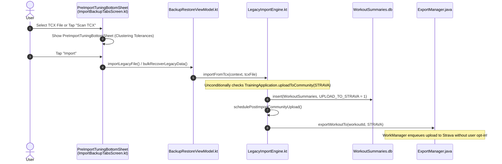
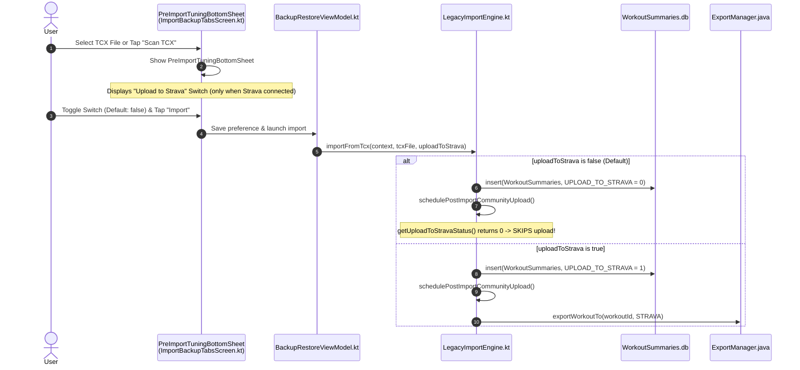

# Forensic Analysis: TCX-Import - Make Strava Upload Optional (ATT-911)

## 1. Executive Summary & Problem Context
* **Ticket Key**: `ATT-911`
* **Summary**: `[Feature] TCX-Import: Make Strava upload optional`
* **Epic**: `ATT-529` (`Import TCX Files`)
* **Target Version**: `V4.9.36`
* **Target Branch**: `feature/ATT-911`

### Problem Description
Currently, when a user imports historical or external workout sessions from TCX files (either via single file picker or bulk cloud recovery from Dropbox via `LegacyImportEngine.importFromTcx()`), the engine automatically and unconditionally marks the workout for Strava upload (`put(WorkoutSummaries.UPLOAD_TO_STRAVA, 1)`) and enqueues an asynchronous upload task via `ExportManager` whenever Strava is connected (`TrainingApplication.uploadToCommunity(FileFormat.STRAVA) == true`).

This automatic behavior (introduced in `ATT-602` / `REQ-EXT-008`) causes significant drawbacks for athletes:
1. **Unwanted Strava Feed Flooding**: Athletes importing tens or hundreds of historical workouts (e.g. from an old phone or prior tracking platform) have their Strava feeds flooded with historical activities from months or years ago.
2. **Duplicate Activities on Strava**: If the imported workouts were originally recorded with or already synced to Strava, auto-uploading them creates duplicate activities.
3. **Strava API Rate Limit Exhaustion**: Strava strictly enforces rate limits (e.g., 100 requests per 15 minutes, 1,000 per day). Bulk uploading dozens of historical files can rapidly burn the daily quota, causing rate-limit errors (HTTP 429) that block uploads of newly tracked live workouts.
4. **Lack of User Agency**: Users have no choice during the import workflow to decline Strava upload without disconnecting their entire Strava account.

---

## 2. Forensic Call-Chain & Component Investigation

### 2.1 Current Execution Flow


### 2.2 Root Cause Analysis
1. **Hard-Coded Auto-Opt-In**: In `LegacyImportEngine.kt` (lines 618–620):
   ```kotlin
   if (TrainingApplication.uploadToCommunity(FileFormat.STRAVA)) {
       put(WorkoutSummaries.UPLOAD_TO_STRAVA, 1)
   }
   ```
   There is no conditional check for user intent or import-specific preferences.
2. **Engine Parameter Gap**: `LegacyImportEngine.importFromTcx()` and `LegacyImportEngine.bulkRecoverFromDropbox()` have no parameter representing the user's upload preference.
3. **Missing Configuration Entity**: No preference key exists in `TrainingApplication.java` or `SharedPreferences` to persist whether imported workouts should be uploaded to Strava.
4. **Missing UI Control**: `PreImportTuningBottomSheet` in `ImportBackupTabsScreen.kt` lets athletes configure clustering parameters, but exposes no toggle for post-import cloud actions.

---

## 3. Proposed Architectural Solution & Design

### 3.1 Target Execution Flow


### 3.2 Configuration Layer (`TrainingApplication.java`)
* Declare persistent preference key:
  ```java
  public static final String SP_IMPORT_TCX_UPLOAD_TO_STRAVA = "import_tcx_upload_to_strava";
  ```
* Implement accessor methods with default value `false`:
  ```java
  public static boolean uploadImportedWorkoutsToStrava() {
      return cSharedPreferences.getBoolean(SP_IMPORT_TCX_UPLOAD_TO_STRAVA, false);
  }

  public static void setUploadImportedWorkoutsToStrava(boolean value) {
      cSharedPreferences.edit().putBoolean(SP_IMPORT_TCX_UPLOAD_TO_STRAVA, value).apply();
  }
  ```
* *Rationale for Default `false`*: Defaulting to `false` provides defense against accidental mass-upload of historical activities and duplicate generation, while remembering the user's explicit choice once toggled.

### 3.3 Engine Layer (`LegacyImportEngine.kt`)
* Parameterize `importFromTcx`:
  ```kotlin
  suspend fun importFromTcx(
      context: Context,
      tcxFile: File,
      listener: ProgressListener? = null,
      uploadToStrava: Boolean = TrainingApplication.uploadImportedWorkoutsToStrava()
  ): Boolean
  ```
* Set `WorkoutSummaries.UPLOAD_TO_STRAVA`:
  ```kotlin
  if (uploadToStrava && TrainingApplication.uploadToCommunity(FileFormat.STRAVA)) {
      put(WorkoutSummaries.UPLOAD_TO_STRAVA, 1)
  } else {
      put(WorkoutSummaries.UPLOAD_TO_STRAVA, 0)
  }
  ```
* Parameterize `bulkRecoverFromDropbox`:
  ```kotlin
  suspend fun bulkRecoverFromDropbox(
      context: Context,
      format: String,
      listener: ProgressListener? = null,
      uploadToStrava: Boolean = TrainingApplication.uploadImportedWorkoutsToStrava()
  ): RecoveryResult
  ```
  Forward `uploadToStrava` to each `importFromTcx(...)` invocation.
* Existing bypass guard in `schedulePostImportCommunityUpload()`:
  ```kotlin
  val uploadToStrava = getUploadToStravaStatus(summaryDb, workoutId)
  if (uploadToStrava == 0) {
      if (TrainingApplication.getDebug(true)) {
          Log.d(TAG, "Skipping Strava upload for workout $workoutId: Explicitly opted out.")
      }
      continue
  }
  ```
  Because `UPLOAD_TO_STRAVA` is `0`, `schedulePostImportCommunityUpload()` cleanly bypasses Strava export without changes to the scheduler!

### 3.4 ViewModel Layer (`BackupRestoreViewModel.kt`)
* Add observable state for upload preference:
  ```kotlin
  var uploadToStravaOnImport by mutableStateOf(TrainingApplication.uploadImportedWorkoutsToStrava())

  fun updateUploadToStravaOnImport(enabled: Boolean) {
      uploadToStravaOnImport = enabled
      TrainingApplication.setUploadImportedWorkoutsToStrava(enabled)
  }
  ```
* In `importLegacyFile(...)`: Pass `uploadToStravaOnImport` to `LegacyImportEngine.importFromTcx`.
* In `bulkRecoverLegacyData(...)`: Pass `uploadToStravaOnImport` to `LegacyImportEngine.bulkRecoverFromDropbox`.

### 3.5 UI Presentation Layer (`ImportBackupTabsScreen.kt`)
* In `PreImportTuningBottomSheet`:
  * Check whether Strava is currently connected (`TrainingApplication.uploadToStrava() == true`).
  * If connected, render a clean Material 3 `Row` with:
    * Column: Title (`@string/import_upload_to_strava_label`) and subtitle (`@string/import_upload_to_strava_summary`).
    * Switch: Bound to `viewModel.uploadToStravaOnImport` with `onCheckedChange = { viewModel.updateUploadToStravaOnImport(it) }`.
  * If Strava is not connected, omit the switch to avoid confusing the athlete with irrelevant third-party settings.

### 3.6 Localization (9 Locales)
Add the following keys to all 9 supported locale files (`values`, `values-de`, `values-es`, `values-fr`, `values-it`, `values-ja`, `values-nl`, `values-pl`, `values-pt`):
* `import_upload_to_strava_label`:
  * EN: "Upload to Strava"
  * DE: "Zu Strava hochladen"
  * ES: "Subir a Strava"
  * FR: "Télécharger vers Strava"
  * IT: "Carica su Strava"
  * JA: "Stravaにアップロード"
  * NL: "Uploaden naar Strava"
  * PL: "Prześlij do Strava"
  * PT: "Carregar para o Strava"
* `import_upload_to_strava_summary`:
  * EN: "Automatically upload imported workouts to Strava."
  * DE: "Importierte Trainings automatisch zu Strava hochladen."
  * ES: "Subir automáticamente los entrenamientos importados a Strava."
  * FR: "Télécharger automatiquement les entraînements importés vers Strava."
  * IT: "Carica automaticamente gli allenamenti importati su Strava."
  * JA: "インポートしたワークアウトを自動的にStravaにアップロードします。"
  * NL: "Geïmporteerde trainingen automatisch uploaden naar Strava."
  * PL: "Automatycznie przesyłaj zaimportowane treningi do Strava."
  * PT: "Carregar automaticamente treinos importados para o Strava."

---

## 4. Invariants & Non-Functional Requirements
1. **Manual Upload Retention**: When a workout is imported with Strava upload disabled (`UPLOAD_TO_STRAVA = 0`), the user can still manually tap upload in `WorkoutSummary` or enable Strava in `EditWorkoutScreen` at any future time.
2. **Zero Overhead for Live Tracking**: Live tracking sessions (`TrackerService`) remain unaffected; their Strava upload lifecycle is governed by global preferences and sport-specific configurations.
3. **TCX Parse & Cluster Integrity**: File parsing, sample insertion, altitude shift, and cluster candidate detection continue to operate identically regardless of the upload flag.
4. **Rate Limit Preservation**: Bypassing Strava upload for historical batches prevents hitting Strava's 15-minute and daily rate limits.

---

## 5. Verification Strategy (SWE.4 / SWE.5)
1. **Unit Tests (`TcxImportCommunityUploadTest.kt`)**:
   * Verify that calling `importFromTcx()` with `uploadToStrava = false` sets `UPLOAD_TO_STRAVA = 0` in `WorkoutSummaries` and schedules 0 uploads to Strava.
   * Verify that calling `importFromTcx()` with `uploadToStrava = true` sets `UPLOAD_TO_STRAVA = 1` and schedules upload via `ExportManager`.
   * Verify that calling `bulkRecoverFromDropbox()` forwards `uploadToStrava` flag to individual imports.
2. **Localization Parity Test (`TranslationParityTest.kt`)**:
   * Verify that all 9 string resource files declare `import_upload_to_strava_label` and `import_upload_to_strava_summary`.
3. **Full Clean-Room Regression**:
   * Execute `./gradlew testDebugUnitTest` to ensure zero regressions across all modules.
