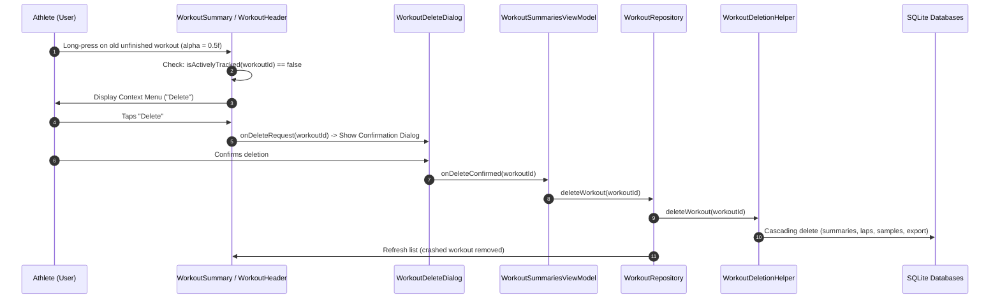
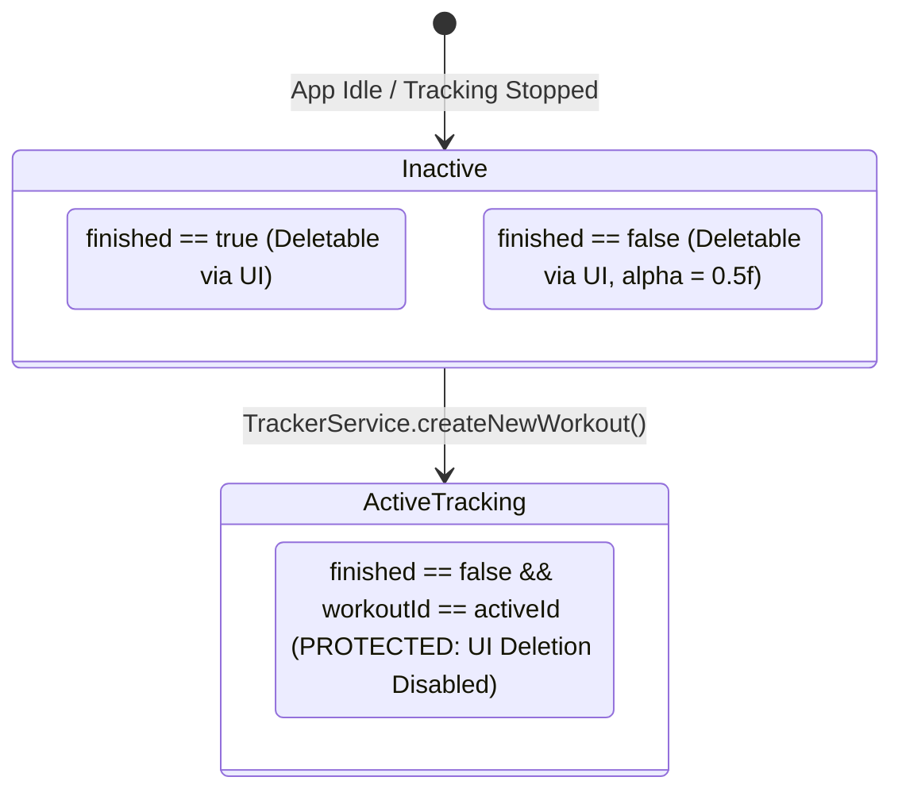

# Forensic Analysis: UI Deletion of Old Unfinished / Crashed Workouts (ATT-917)

## 1. Executive Summary & Problem Context
* **Ticket Key**: `ATT-917`
* **Summary**: `[Verbesserung] Delete crashed workouts (when it is not the one that is currently tracked)`
* **Target Version**: `V4.9.36`
* **Target Branch**: `feature/ATT-917`
* **Sub-Tasks**:
  * `ATT-978`: `[SWE.1] System & Software Requirements Analysis` (Active)
  * `ATT-979`: `[SWE.4] Verification Specification`
  * `ATT-980`: `[SWE.2 / SWE.3] Architecture, Detailed Design & Implementation Plan`
  * `ATT-981`: `[SWE.3 / SWE.4] Implementation`
  * `ATT-982`: `[SWE.5] Test Execution & Quality Gate Verification`

### Problem Description & User Directives
1. **Retention Invariant**: Crashed / unfinished workouts (`finished == false` / SQLite column `FINISHED == 0`) **MUST remain in the database**. They are **not** to be automatically deleted or purged by background jobs or upon starting new workouts.
2. **Visual Feedback**: In the workout history summary (`WorkoutSummary` and `WorkoutSummaryCompact`), unfinished workouts are rendered with visual transparency (`alpha = 0.5f`), signaling to the athlete that the activity was interrupted or incomplete.
3. **The Root Defect in UI Deletion**:
   - In `WorkoutSummary.kt` (line 105):
     ```kotlin
     WorkoutHeader(
         ...
         menuEnabled = workoutData.headerData.finished,
         ...
     )
     ```
   - In `WorkoutHeader.kt` (lines 88–99):
     ```kotlin
     Surface(
         modifier = if (menuEnabled) {
             modifier.fillMaxWidth()
                 .combinedClickable(
                     onClick = { onClicked?.invoke() },
                     onLongClick = { showContextMenu = true }
                 )
         } else if (onClicked != null) {
             modifier.fillMaxWidth()
                 .clickable(onClick = onClicked)
         } else {
             modifier.fillMaxWidth()
         },
         color = Color.Transparent
     )
     ```
   - Because `menuEnabled` was coupled to `workoutData.headerData.finished` (originally introduced to disable export actions and editing on unfinished sessions), `menuEnabled` evaluated to `false` for any unfinished/crashed workout.
   - Consequently, the `combinedClickable` modifier with `onLongClick = { showContextMenu = true }` was **completely bypassed**.
   - As a result, **the user could not open the context menu to delete an unfinished workout in the UI**.
4. **Active Tracking Protection Invariant**:
   - An unfinished workout that is **currently being tracked** by `TrackerService` (`TrainingApplication.isTracking() && workoutId == activeWorkoutId`) **MUST NOT be deletable** via the UI.
   - Only **old** (non-actively tracked) unfinished workouts may be deleted by the user via the UI.
   - When in compact view (`WorkoutSummaryCompact.kt`), the Delete context menu option must likewise be protected so the actively recorded workout cannot be deleted while tracking is active.

---

## 2. Component Architecture & Forensic Flow

### 2.1 UI Interaction Flow for Deleting an Old Unfinished Workout


### 2.2 Active Tracking Guard State Diagram


---

## 3. Required Enhancements by Component

### 3.1 `TrainingApplication.java`
* Maintain static awareness of the active workout ID:
  ```java
  private static long sActiveWorkoutId = -1;

  public void setWorkoutID(long workoutID) {
      mWorkoutID = workoutID;
      sActiveWorkoutId = workoutID;
  }

  public static long getActiveWorkoutID() {
      return sActiveWorkoutId;
  }

  public static boolean isActivelyTracked(long workoutId) {
      return isTracking() && workoutId > 0 && workoutId == sActiveWorkoutId;
  }
  ```
* Reset `sActiveWorkoutId = -1` when tracking stops in `stopTracking()`.
* Provide testing helper `setActiveWorkoutIdForTesting(long id)`.

### 3.2 `WorkoutHeader.kt` & `WorkoutSummary.kt`
* **Decouple Deletion from Export Menu**:
  - Introduce `canDelete: Boolean = true` (or calculate `canDelete = !isActivelyTracked(workoutData.id)`).
  - In `WorkoutHeader.kt`:
    - Ensure `combinedClickable` is attached whenever `canDelete` is true or `onClicked != null`:
      ```kotlin
      Surface(
          modifier = if (canDelete || onClicked != null) {
              modifier.fillMaxWidth()
                  .combinedClickable(
                      onClick = { onClicked?.invoke() },
                      onLongClick = if (canDelete) { { showContextMenu = true } } else null
                  )
          } else {
              modifier.fillMaxWidth()
          },
          color = Color.Transparent
      )
      ```
  - In `WorkoutSummary.kt`:
    - Pass `canDelete = !TrainingApplication.isActivelyTracked(workoutData.id)`.
    - Keep `menuEnabled = workoutData.headerData.finished` for the 3-dots export menu (since incomplete/crashed workouts should not be exported to TCX/GPX/Strava).
    - Ensure `onDeleteRequest` remains properly wired to show the deletion confirmation dialog.

### 3.3 `WorkoutSummaryCompact.kt`
* Check `val canDelete = !TrainingApplication.isActivelyTracked(workoutData.id)`:
  - If `canDelete` is false, hide or disable the "Delete" option in `DropdownMenu`.
  - Ensure old unfinished workouts (`finished == false` and not actively tracked) allow deletion.

### 3.4 Deletion Execution Pipeline
* Deletion continues to use the existing, verified `WorkoutDeletionHelper.deleteWorkout(workoutId)`:
  - Drops high-frequency sample tables (`workout_samples_<baseFileName>`).
  - Cleans up export status.
  - Deletes lap records and summaries.
  - No background auto-purging is performed; deletion is strictly user-initiated.

---

## 4. Invariants & Safety Constraints
1. **DB Retention Invariant**: Crashed workouts must not be deleted automatically. They remain in SQLite until explicitly deleted by the user via the UI.
2. **Visual Differentiation**: Unfinished workouts display with `alpha = 0.5f`.
3. **Active Workout Protection**: The workout currently being tracked by `TrackerService` must NEVER be deletable via the UI.
4. **Cascading Table Cleanliness (ATT-296 Compliance)**: When the user confirms deletion of an old unfinished workout, all related SQLite records and dynamic tables (`workout_samples_*`) must be completely purged.
