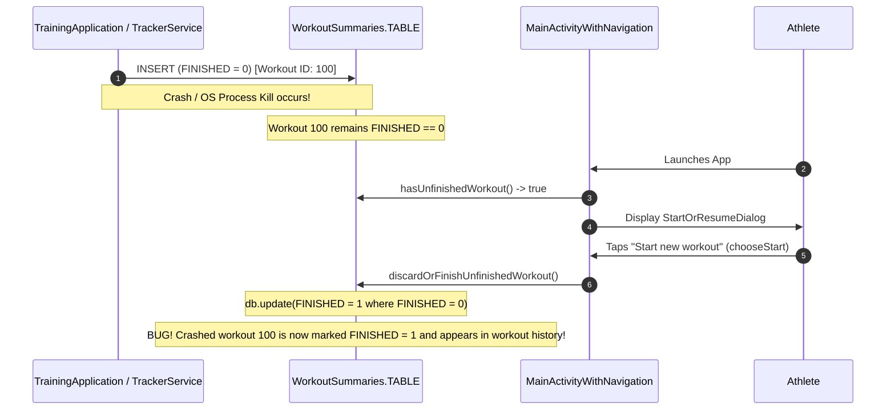
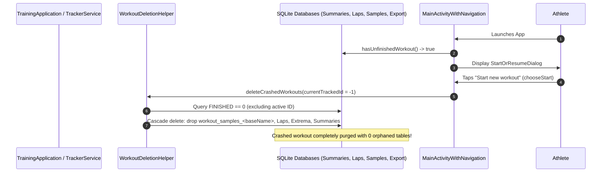

# Forensic Analysis: Delete Crashed Workouts (ATT-917)

## 1. Executive Summary & Problem Context
* **Ticket Key**: `ATT-917`
* **Summary**: `[Verbesserung] Delete crashed workouts (when it is not the one that is currently tracked)`
* **Target Version**: `V4.9.36`
* **Target Branch**: `feature/ATT-917`
* **Sub-Tasks**:
  * `ATT-978`: `[SWE.1] System & Software Requirements Analysis` (Active)
  * `ATT-979`: `[SWE.4] Verification Specification`
  * `ATT-980`: `[SWE.2 / SWE.3] Architecture, Detailed Design & Implementation Plan`
  * `ATT-981`: `[SWE.3 / SWE.4] Implementation`
  * `ATT-982`: `[SWE.5] Test Execution & Quality Gate Verification`

### Problem Description
In `TrackerService.java`, when tracking begins (`createNewWorkout()`), a new record is inserted into SQLite table `WorkoutSummaries.TABLE` with the column `FINISHED` defaulting to `0`. Under normal operating conditions, when the athlete completes their activity and stops tracking (`endWorkout()`), `TrackerService` performs analytical aggregation, sets `FINISHED = 1`, and updates the database row.

However, when an abnormal termination occurs (e.g. process kill by Android OS low-memory killer, power loss, or unhandled runtime crash during tracking):
1. **Unfinished Row Persistence**: The workout remains in `WorkoutSummaries.TABLE` with `FINISHED == 0`.
2. **Defect in Discard Logic (ATT-635 Regression/Omission)**: In `ATT-635`, interrupted workout resumption was introduced: on app launch, `MainActivityWithNavigation.checkUnfinishedWorkout()` detects `hasUnfinishedWorkout()` and displays `StartOrResumeDialog` offering two choices:
   - *"Resume workout"* (`chooseResume()`) -> resumes active tracking of the session.
   - *"Start new workout"* (`chooseStart()`) -> user explicitly chooses **not** to resume and to discard the interrupted session.
   However, in `chooseStart()`, `MainActivityWithNavigation` invokes:
   ```kotlin
   WorkoutSummariesDatabaseManager.getInstance(this).discardOrFinishUnfinishedWorkout()
   ```
   And `discardOrFinishUnfinishedWorkout()` was implemented as:
   ```java
   ContentValues values = new ContentValues();
   values.put(WorkoutSummaries.FINISHED, 1);
   db.update(WorkoutSummaries.TABLE, values, WorkoutSummaries.FINISHED + " = 0", null);
   ```
   **CRITICAL DEFECT**: Instead of discarding/deleting the crashed workout, the system merely set `FINISHED = 1`! This permanently converted an incomplete, crashed, or corrupted session (e.g. 5 seconds of tracking, 0 distance, corrupted GPS track, or no sensor values) into a "completed" workout. It remains forever in the user's workout list, distorts period statistics (weekly/monthly totals, personal records, cluster counters), and wastes SQLite disk space.
3. **Ghost Workout Accumulation**: If the user starts tracking a new workout without going through `chooseResume()`, or if multiple crashes occurred historically, multiple rows with `FINISHED == 0` can linger in SQLite.
4. **Active Tracking Safety Invariant**: When deleting crashed workouts, the system must **strictly guarantee** that the workout currently being tracked (which also possesses `FINISHED == 0` during active recording) is **NEVER** deleted.

---

## 2. Forensic Architecture & Data Flow

### 2.1 Current State Lifecycle


### 2.2 Desired Target Lifecycle


---

## 3. Component Analysis & Impacted Modules

### 3.1 `WorkoutDeletionHelper.java`
* **Current State**: Provides `deleteWorkout(long workoutId)` which queries `fileBaseName` first (ATT-296 sequencing fix), drops high-frequency sample tables (`workout_samples_<fileBaseName>`), removes export status, and deletes laps and summaries.
* **Required Enhancement**:
  - Implement `public int deleteCrashedWorkouts(long currentTrackedWorkoutId)`:
    1. Query all workout IDs from `WorkoutSummariesDatabaseManager` where `FINISHED == 0` and `_id != currentTrackedWorkoutId`.
    2. For each crashed ID, execute full cascading deletion via `deleteWorkout(id)`.
    3. Return the number of deleted crashed sessions.
  - Implement convenience overload `public int deleteCrashedWorkouts()`:
    - Resolves `currentTrackedWorkoutId` dynamically: if `TrainingApplication.isTracking()` is true, pass `TrainingApplication.getWorkoutID()`; otherwise pass `-1L`.

### 3.2 `WorkoutSummariesDatabaseManager.java`
* **Current State**:
  - `hasUnfinishedWorkout()` checks if the latest workout has `FINISHED == 0`.
  - `discardOrFinishUnfinishedWorkout()` updates `FINISHED = 1` where `FINISHED = 0`.
* **Required Enhancement**:
  - Add `public List<Long> getCrashedWorkoutIds(long currentTrackedWorkoutId)`:
    - Queries `SELECT _id FROM workout_summaries WHERE finished = 0` (and `_id != currentTrackedWorkoutId` when `currentTrackedWorkoutId > 0`).
  - Deprecate/refactor `discardOrFinishUnfinishedWorkout()` to delegate to `WorkoutDeletionHelper.deleteCrashedWorkouts()`, or replace its call sites.

### 3.3 `MainActivityWithNavigation.kt`
* **Current State**:
  - In `chooseStart()`: calls `discardOrFinishUnfinishedWorkout()`.
* **Required Enhancement**:
  - Replace call with `WorkoutDeletionHelper(this).deleteCrashedWorkouts(-1)`.
  - Notify `WorkoutRepository.getInstance(application).reloadWorkoutData()` to ensure any cached in-memory lists are synchronized.

### 3.4 `TrackerService.java`
* **Current State**:
  - In `createNewWorkout()`: inserts new summary row with `FINISHED = 0`.
* **Required Enhancement**:
  - When initiating a standard fresh tracking session (`StartType.START_NORMAL`):
    - Ensure any lingering crashed workouts from prior sessions (`FINISHED == 0`) are purged before allocating the new workout session.
    - Safety guard: pass `-1` because the new workout row has not yet been inserted.

### 3.5 Active Workout Guard (`TrainingApplication.java`)
* `TrainingApplication` maintains:
  - `isTracking()`: returns `cTrackingMode == TrackingMode.TRACKING || cTrackingMode == TrackingMode.PAUSED`.
  - `getWorkoutID()`: returns `mWorkoutID` (set when `TrackerService` broadcasts `WORKOUT_ID`).
* This provides a reliable, centralized mechanism to identify the actively tracked workout and protect it from deletion.

---

## 4. Invariants & Safety Constraints
1. **Never Delete Active Tracking Session**: If tracking is in progress (`TRACKING` or `PAUSED`), the active workout with ID `mWorkoutID` MUST NEVER be deleted.
2. **Preserve User Resumption Opportunity**: When an unfinished session exists and tracking is idle, the user MUST be presented with the option to resume via `StartOrResumeDialog` or notification. Deletion only occurs when the user chooses "Start new workout", or when a new tracking session is explicitly launched without resumption.
3. **Zero Orphaned Tables (ATT-296 Compliance)**: Deleting a crashed workout must drop its `workout_samples_<fileBaseName>` table and purge laps, extrema, and export status records.
4. **Thread Safety & Non-Blocking Execution**: Database operations should be executed on background I/O threads where appropriate, with defensive exception handling.

---

## 5. Next Steps
* Advance sub-task **`ATT-978`** to `In Überprüfung`.
* Agent 2 automated Gate 1 audit -> advance to `Freigabe (Human)` for user review and approval.
