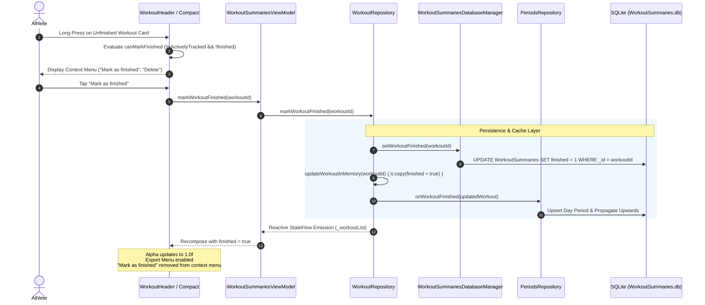

# Forensic Analysis: Option to Mark Old Unfinished Workouts as Finished (ATT-987)

## 1. Executive Summary & Problem Context
* **Ticket Key**: `ATT-987`
* **Summary**: `[Verbesserung] Option to mark old unfinished workouts as finished`
* **Target Version**: `V4.9.36`
* **Target Branch**: `feature/ATT-987`
* **Stage Sub-Task**: `ATT-988` (`[SWE.1] System & Software Requirements Analysis`)

### Problem Description & User Directives
1. **Context**:
   Following the implementation of `ATT-917` (`REQ-UI-145`), crashed and abandoned workouts (`finished == false` / SQLite column `FINISHED == 0`) remain permanently in SQLite and are displayed in aftermath summary lists with visual transparency (`alpha = 0.5f`), with their 3-dots export menu disabled (`menuEnabled = false`).
2. **User Need**:
   Athletes frequently recover or keep workouts after sudden device crashes or battery exhaustion where the recorded GPS track and sensor data are valid and valuable. Currently, these sessions remain indefinitely locked in an unfinished state, displayed with reduced opacity and unable to be exported to TCX/GPX or Strava, or aggregated into historical period cards.
   The athlete desires an option in the UI (via the long-click context menu) to **mark the workout as finished**.
3. **Core Directives & Invariants**:
   * **Long-Click Context Menu Access**: The long-press context menu on both expanded (`WorkoutSummary` via `WorkoutHeader`) and compact (`WorkoutSummaryCompact`) aftermath cards must offer an action: `"Als abgeschlossen markieren"` / `"Mark as finished"`.
   * **State & Visual Transition**: Marking a workout as finished must:
     * Atomically set SQLite column `FINISHED = 1` in `WorkoutSummaries.TABLE` for the specified `workoutId`.
     * Update the in-memory repository cache with `finished = true`.
     * Reactively re-render the card with normal high opacity (`alpha = TTAlpha.High` / `1.0f`).
     * Enable the 3-dots export menu (`menuEnabled = true`), granting access to TCX/GPX export and Strava upload.
     * Remove the "Mark as finished" action from subsequent context menu invocations (since the workout is now finalized).
   * **Period Statistics Aggregation**:
     * Newly finished workouts must be forwarded to `PeriodsRepository.getInstance(app).onWorkoutFinished(updatedWorkout)` to be incorporated into historical period rollups (`Day`, `Week`, `Month`, `Year`), ensuring workout count, distance, and duration statistics reflect the completed workout.
   * **Active Tracking Safety Guard**:
     * If an unfinished workout is the one currently being recorded by `TrackerService` (`TrainingApplication.isActivelyTracked(workoutId) == true`), the "Mark as finished" action **MUST NOT be accessible or permitted** via this aftermath context menu. Live recordings must only be finalized through the standard tracking stop lifecycle.

---

## 2. Forensic Architectural Breakdown

### 2.1 Component Interaction Flow

### 2.2 Data Layer State Invariants
* **Column Representation**: SQLite column `WorkoutSummaries.FINISHED` is an integer column where `0` represents unfinished/interrupted and `1` represents completed.
* **Integrity Guard**: Setting `FINISHED = 1` touches ONLY the `finished` flag; all recorded trackpoints, dynamic sensor sample tables (`workout_samples_<baseFileName>`), extrema, notes, and lap structures remain 100% intact.

---

## 3. Implementation Surfaces Identified

| Layer | Component File | Planned Modifications |
| :--- | :--- | :--- |
| **Database** | `WorkoutSummariesDatabaseManager.java` | Add method `public void setWorkoutFinished(long workoutId)` that executes `UPDATE WorkoutSummaries SET finished = 1 WHERE _id = workoutId`. |
| **Repository** | `WorkoutRepository.kt` | Add `fun markWorkoutFinished(workoutId: Long)` to persist to database, update memory cache (`updateWorkoutInMemory`), and notify `PeriodsRepository.onWorkoutFinished`. |
| **ViewModel** | `WorkoutSummariesViewModel.kt` | Add `fun markWorkoutFinished(workoutId: Long) { workoutRepository.markWorkoutFinished(workoutId) }`. |
| **UI Header** | `WorkoutHeader.kt` | Add `onMarkFinished: (() -> Unit)? = null`. In context menu, render `"Mark as finished"` when `!data.finished && onMarkFinished != null`. Attach long-click when `canDelete || onMarkFinished != null || onClicked != null`. |
| **UI Summary** | `WorkoutSummary.kt` | Forward `onMarkFinished` to `WorkoutHeader` guarded by `canMarkFinished = !TrainingApplication.isActivelyTracked(workoutData.id)`. |
| **UI Compact** | `WorkoutSummaryCompact.kt` | Add `onMarkFinished: (() -> Unit)? = null`. Render `"Mark as finished"` context menu item when `!workoutData.headerData.finished && canMarkFinished && onMarkFinished != null`. |
| **UI List** | `WorkoutList.kt` | Add callback `onMarkFinished: (Long) -> Unit` and wire to both compact and full card views. |
| **UI Screens** | `WorkoutTabsScreen.kt`, `WorkoutSummariesListFragment.kt`, `WorkoutClustersFragment.kt` | Wire `onMarkFinished = { id -> summariesViewModel.markWorkoutFinished(id) }`. |
| **Localization** | `strings.xml` (all 9 locales) | Add `mark_as_finished` string resource across EN, DE, ES, FR, IT, JA, NL, PL, PT. |

---

## 4. Verification & Testing Strategy
1. **Unit Tests (`WorkoutMarkFinishedTest.kt`)**:
   * *Mark Finished Transition*: Given an unfinished workout (`finished == false`), invoking `markWorkoutFinished` sets `finished == true`.
   * *Visual & Action Invariants*:
     * When `finished == false`, `contentAlpha == 0.5f`, `menuEnabled == false`, context menu displays "Mark as finished".
     * When transitioned to `finished == true`, `contentAlpha == TTAlpha.High` (1.0f), `menuEnabled == true` (export enabled), context menu omits "Mark as finished".
   * *Active Tracking Guard*:
     * When `isActivelyTracked(workoutId) == true`, verify `canMarkFinished` is `false` and context menu does NOT offer "Mark as finished".
2. **Regression Verification**:
   * Run clean-room `./gradlew testDebugUnitTest` across the full test suite (0 regressions).
3. **Traceability**:
   * Create new requirement `REQ-UI-146` and verification specification `TST-UI-099`.

---

## 5. Stage Gate Audit Criteria
- [x] Complete forensic trace from database column through UI composables.
- [x] Active tracking invariants documented and enforced.
- [x] Multilingual localization strategy defined for all 9 locales.
- [x] Non-destructive database operations verified.
- [x] Ready for Stage 1 sign-off.
