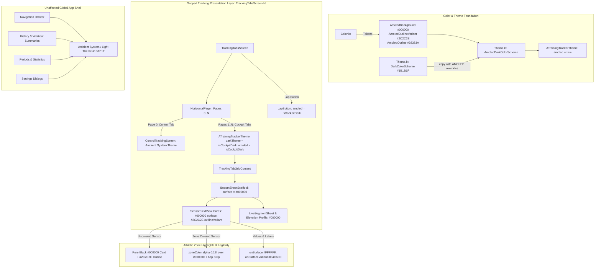

# Architectural Implementation Plan - ATT-1263: [Cockpit] Implement AMOLED Pure Black (#000000) Theme for Tracking Views

**Ticket**: [ATT-1263](https://rainerblind.atlassian.net/browse/ATT-1263)  
**Sub-tasks**: [ATT-1414](https://rainerblind.atlassian.net/browse/ATT-1414) (Analysis [Erledigt]), [ATT-1415](https://rainerblind.atlassian.net/browse/ATT-1415) (Test Spec [Erledigt]), `ATT-1416` (Impl-Plan [In Bearbeitung]), `[Implementation]`, `[Test]`  
**Target Release**: `V4.9.38`  
**Active Sprint**: `2026-39.3`  
**Requirements**: `REQ-UI-169` (*AMOLED Pure Black Cockpit Theme*), referencing `REQ-UI-168` (*Workout Cockpit Independent Theme Selector*) and `REQ-UI-101` (*Neutral Backgrounds*)  
**Test Spec ID**: `TST-UI-121`  
**Branch**: `feature/ATT-1263`  

---

## 1. Technical Architecture & Component Flow

The implementation introduces dedicated AMOLED Pure Black tokens and color scheme definition for the workout tracking cockpit. When cockpit dark mode is active (either via `CockpitThemeMode.ALWAYS_DARK` or `SYSTEM` dark mode), the telemetry screens render in pure pitch black (`#000000`), turning off OLED pixels completely while preserving high-contrast white metrics, subtle separation outlines, and athletic zone highlights:



---

## 2. Detailed Technical Components

### 2.1 Color Tokens: `Color.kt`
In [Color.kt](file:///home/rainer/AndroidStudioProjects/aTrainingTracker/app/src/main/java/com/atrainingtracker/trainingtracker/ui/theme/Color.kt), define explicit AMOLED color tokens:
```kotlin
// AMOLED Pure Black Cockpit Theme Colors (ATT-1263 / REQ-UI-169)
val AmoledBackground = Color(0xFF000000)
val AmoledSurface = Color(0xFF000000)
val AmoledOutlineVariant = Color(0xFF2C2C2E)
val AmoledOutline = Color(0xFF38383A)
```

### 2.2 AMOLED Color Scheme & Composable Parameterization: `Theme.kt`
In [Theme.kt](file:///home/rainer/AndroidStudioProjects/aTrainingTracker/app/src/main/java/com/atrainingtracker/trainingtracker/ui/theme/Theme.kt):
1. Define `AmoledDarkColorScheme`:
```kotlin
val AmoledDarkColorScheme = DarkColorScheme.copy(
    background = AmoledBackground,
    surface = AmoledSurface,
    surfaceVariant = AmoledSurface,
    surfaceDim = AmoledSurface,
    surfaceBright = Color(0xFF1A1A1A),
    surfaceContainerLowest = AmoledSurface,
    surfaceContainerLow = AmoledSurface,
    surfaceContainer = AmoledSurface,
    surfaceContainerHigh = Color(0xFF121212),
    surfaceContainerHighest = Color(0xFF1E1E1E),
    outline = AmoledOutline,
    outlineVariant = AmoledOutlineVariant,
    onSurface = Color.White,
    onBackground = Color.White,
    onSurfaceVariant = Color(0xFFC4C6D0)
)
```
2. Extend `ATrainingTrackerTheme` with `amoled: Boolean = false`:
```kotlin
@Composable
fun ATrainingTrackerTheme(
    darkTheme: Boolean = isSystemInDarkTheme(),
    // Dynamic color is available on Android 12+
    dynamicColor: Boolean = false,
    amoled: Boolean = false,
    content: @Composable () -> Unit
) {
    val colorScheme = when {
        dynamicColor && Build.VERSION.SDK_INT >= Build.VERSION_CODES.S -> {
            val context = LocalContext.current
            if (darkTheme) dynamicDarkColorScheme(context) else dynamicLightColorScheme(context)
        }
        darkTheme && amoled -> AmoledDarkColorScheme
        darkTheme -> DarkColorScheme
        else -> LightColorScheme
    }
    ...
```

### 2.3 Presentation Layer Scope Wiring: `TrackingTabsScreen.kt`
In [TrackingTabsScreen.kt](file:///home/rainer/AndroidStudioProjects/aTrainingTracker/app/src/main/java/com/atrainingtracker/trainingtracker/ui/tracking/trackingtabs/TrackingTabsScreen.kt):
1. Line 441 (Cockpit pages 1..N):
```kotlin
ATrainingTrackerTheme(darkTheme = isCockpitDark, amoled = isCockpitDark) {
    TrackingTabGridContent(
        viewInfo.tabViewId,
        screenMode,
    )
}
```
2. Line 465 (LapButton):
```kotlin
ATrainingTrackerTheme(darkTheme = isCockpitDark, amoled = isCockpitDark) {
    LapButton(
        modifier = Modifier
            .wrapContentSize()
            .padding(horizontal = 16.dp),
        trackingMode = trackingMode,
        onClick = { trackingTabsViewModel.onLapButtonClick() }
    )
}
```
3. Scope Invariants Preserved:
   - Line 414: `ControlTrackingScreen` (Page 0) is rendered outside the cockpit theme wrapper, preserving the standard ambient system theme.
   - Global application navigation, menus, dialogs, and activity containers retain the standard `DarkColorScheme` / `LightColorScheme` without modification.

### 2.4 Automatic Sensor Tile & Bottom Sheet Harmonization
Because existing components utilize semantic `MaterialTheme.colorScheme` tokens:
- **`SensorFieldView.kt`**:
  - Container color for uncolored fields: `MaterialTheme.colorScheme.surface` -> automatically resolves to `#000000`.
  - Tile borders: `MaterialTheme.colorScheme.outlineVariant` -> automatically resolves to `#2C2C2E`.
  - Metric values and labels: `MaterialTheme.colorScheme.onSurface` -> automatically resolves to `#FFFFFF`.
  - Muted filter info / units: `MaterialTheme.colorScheme.onSurfaceVariant` -> automatically resolves to `#C4C6D0`.
  - Active zone tints: `fieldState.zoneColor.copy(alpha = 0.12f)` blends smoothly over `#000000` with the 6dp vertical strip providing prominent visual cues.
- **`SensorGridScreen.kt`**:
  - `BottomSheetScaffold` uses `surface` container color -> resolves to `#000000`.
  - Live segments sheet, elevation profile card, and scrollable grid background render in pitch black.

---

## 3. Unit Test Specification: `AmoledThemeTest.kt`

Create `app/src/test/java/com/atrainingtracker/trainingtracker/ui/theme/AmoledThemeTest.kt`:
```kotlin
package com.atrainingtracker.trainingtracker.ui.theme

import androidx.compose.ui.graphics.Color
import org.junit.Assert.assertEquals
import org.junit.Assert.assertNotEquals
import org.junit.Test

class AmoledThemeTest {

    @Test
    fun testAmoledDarkColorSchemeTokens() {
        assertEquals(Color(0xFF000000), AmoledDarkColorScheme.background)
        assertEquals(Color(0xFF000000), AmoledDarkColorScheme.surface)
        assertEquals(Color(0xFF000000), AmoledDarkColorScheme.surfaceVariant)
        assertEquals(Color(0xFF000000), AmoledDarkColorScheme.surfaceContainer)
        assertEquals(Color(0xFF000000), AmoledDarkColorScheme.surfaceContainerLowest)
        assertEquals(Color(0xFF000000), AmoledDarkColorScheme.surfaceContainerLow)
        assertEquals(Color(0xFF2C2C2E), AmoledDarkColorScheme.outlineVariant)
        assertEquals(Color(0xFF38383A), AmoledDarkColorScheme.outline)
        assertEquals(Color(0xFFFFFFFF), AmoledDarkColorScheme.onSurface)
        assertEquals(Color(0xFFFFFFFF), AmoledDarkColorScheme.onBackground)
        assertEquals(Color(0xFFC4C6D0), AmoledDarkColorScheme.onSurfaceVariant)
    }

    @Test
    fun testStandardDarkColorSchemeIsolation() {
        // Ensure standard app dark mode is unchanged (charcoal grey #1B1B1F)
        assertEquals(Color(0xFF1B1B1F), DarkBackground)
        assertEquals(Color(0xFF1B1B1F), DarkSurface)
        assertNotEquals(DarkColorScheme.background, AmoledDarkColorScheme.background)
        assertNotEquals(DarkColorScheme.surface, AmoledDarkColorScheme.surface)
    }
}
```

---

## 4. Verification Matrix & Quality Gates

| Verification Step | Target / Command | Success Criteria |
|---|---|---|
| **1. Unit Test Suite** | `./gradlew testDebugUnitTest --tests com.atrainingtracker.trainingtracker.ui.theme.*` | `AmoledThemeTest` and `CockpitThemeModeTest` pass 100%. |
| **2. Requirement Governance** | `python3 tools/verify_requirement_governance.py --text-file docs/engineering/test_specs/ATT-1263_test_spec.md` | Exits with code 0 (`PASS`). |
| **3. Full Suite Clean-Room Regression** | `./gradlew testDebugUnitTest` | Zero failures, zero broken tests across entire project. |
| **4. Independent Auditor Review** | `python3 tools/review_agent.py audit ATT-1416` | Gate 3 audit passed. |
