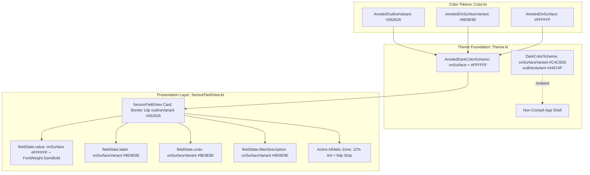

# Architectural Implementation Plan - ATT-1264: [Cockpit] High-contrast typography and subtle tile grid for sunlight legibility

**Ticket**: [ATT-1264](https://rainerblind.atlassian.net/browse/ATT-1264)  
**Sub-tasks**: [ATT-1424](https://rainerblind.atlassian.net/browse/ATT-1424) (Analysis [Erledigt]), [ATT-1425](https://rainerblind.atlassian.net/browse/ATT-1425) (Test Spec [Erledigt]), `ATT-1426` (Impl-Plan [In Bearbeitung]), `[Implementation]`, `[Test]`  
**Target Release**: `V4.9.38`  
**Active Sprint**: `2026-39.3`  
**Requirements**: `REQ-UI-171` (*High-Contrast Cockpit Typography and Subtle Tile Grid for Sunlight Legibility*), referencing `REQ-UI-169` (*AMOLED Pure Black Cockpit Theme*) and `REQ-UI-170` (*Comprehensive Cockpit Dark Theme*)  
**Test Spec ID**: `TST-UI-123`  
**Branch**: `feature/ATT-1264`  

---

## 1. Technical Architecture & Component Flow

The implementation enhances typography hierarchy, contrast ratios, and tile boundaries across the workout tracking cockpit:



---

### Requirement Archaeology & Chesterton's Fence Audit

1. **Original Requirement ID & Target**: `REQ-UI-169` (*AMOLED Pure Black Cockpit Theme*) and `REQ-UI-101` (*Neutral Backgrounds*).
2. **Historical Origin & Commit Trace**: `ATT-1263` introduced `AmoledDarkColorScheme` (#000000) and initialized `AmoledOutlineVariant` to `#2C2C2E` and `onSurfaceVariant` to `#C4C6D0`. In `SensorFieldView.kt`, text colors were using `onSurface` for values, units, and labels, while font weights used default typography (`Normal`).
3. **Root Reason for Existing Formulation**: During the initial pure-black pass (`ATT-1263`), the priority was turning off OLED background pixels (`#000000`). Typography and subtle tile demarcation were left at default token mappings. However, in outdoor sunlight and when wearing tinted cycling sunglasses, normal-weight numerals and white unit/label text produce visual clutter with low contrast distinction between metric values and metadata, while borders at `#2C2C2E` can be overly noticeable or insufficiently subtle compared to `#262626`.
4. **Preservation of Core Invariants**:
   - Primary readings remain true white `#FFFFFF` (`onSurface`).
   - Standard app dark mode (`DarkColorScheme`, `DarkOnSurfaceVariant` `#C4C6D0`, `outlineVariant` `#44474F`) remains completely unchanged for non-cockpit views.
   - Contrast standards: `#9E9E9E` over `#000000` provides a contrast ratio of ~7.6:1, exceeding WCAG AAA (7.0:1) and AA (4.5:1). `#FFFFFF` over `#000000` provides 21:1 contrast.
   - Athletic zone color overlays (12% tint + 6dp vertical strip) remain fully visible and distinct.

---

## 2. Harmonized Requirement Specification (`REQ-UI-171`)

---

## 3. Detailed Component Plan & File-by-File Changes

### 3.1 Color Tokens: `Color.kt`
* **File**: [Color.kt](file:///home/rainer/AndroidStudioProjects/aTrainingTracker/app/src/main/java/com/atrainingtracker/trainingtracker/ui/theme/Color.kt)
* **Changes**:
  1. Update `AmoledOutlineVariant`:
     ```kotlin
     val AmoledOutlineVariant = Color(0xFF262626) // Subtle tile divider border (ATT-1264 / REQ-UI-171)
     ```
  2. Add `AmoledOnSurfaceVariant`:
     ```kotlin
     val AmoledOnSurfaceVariant = Color(0xFF9E9E9E) // Muted grey for labels and units (ATT-1264 / REQ-UI-171)
     ```

### 3.2 Color Scheme Definition: `Theme.kt`
* **File**: [Theme.kt](file:///home/rainer/AndroidStudioProjects/aTrainingTracker/app/src/main/java/com/atrainingtracker/trainingtracker/ui/theme/Theme.kt)
* **Changes**:
  Update `AmoledDarkColorScheme`:
  ```kotlin
  internal val AmoledDarkColorScheme = DarkColorScheme.copy(
      primaryContainer = Color(0xFF000000),
      onPrimaryContainer = Color(0xFFFFFFFF),
      background = AmoledBackground,
      surface = AmoledSurface,
      surfaceVariant = AmoledSurface,
      surfaceDim = AmoledSurface,
      surfaceBright = Color(0xFF1A1A1A),
      surfaceContainerLowest = AmoledSurface,
      surfaceContainerLow = AmoledSurface,
      surfaceContainer = AmoledSurface,
      surfaceContainerHigh = Color(0xFF121212),
      surfaceContainerHighest = Color(0xFF000000),
      outline = AmoledOutline,
      outlineVariant = AmoledOutlineVariant,
      onSurface = Color.White,
      onBackground = Color.White,
      onSurfaceVariant = AmoledOnSurfaceVariant
  )
  ```

### 3.3 Sensor Field Typography & Hierarchy: `SensorFieldView.kt`
* **File**: [SensorFieldView.kt](file:///home/rainer/AndroidStudioProjects/aTrainingTracker/app/src/main/java/com/atrainingtracker/trainingtracker/ui/tracking/SensorFieldView.kt)
* **Changes**:
  1. Extract pure, unit-testable typography helper functions:
     ```kotlin
     fun getSensorValueTextStyle(viewSize: ViewSize, typography: androidx.compose.material3.Typography): TextStyle {
         val base = when (viewSize) {
             ViewSize.XSMALL -> typography.headlineSmall.copy(fontSize = 20.sp)
             ViewSize.SMALL -> typography.headlineMedium
             ViewSize.NORMAL -> typography.displaySmall
             ViewSize.LARGE -> typography.displayMedium
             ViewSize.XLARGE -> typography.displayLarge.copy(fontSize = 50.sp)
             ViewSize.HUGE -> typography.displayLarge.copy(fontSize = 76.sp)
             ViewSize.XHUGE -> typography.displayLarge.copy(fontSize = 100.sp)
         }
         return base.copy(fontWeight = androidx.compose.ui.text.font.FontWeight.SemiBold)
     }

     fun getSensorUnitTextStyle(viewSize: ViewSize, typography: androidx.compose.material3.Typography): TextStyle {
         return when (viewSize) {
             ViewSize.XSMALL -> typography.bodySmall.copy(fontSize = 10.sp)
             ViewSize.SMALL -> typography.bodySmall
             ViewSize.NORMAL -> typography.bodyLarge
             ViewSize.LARGE -> typography.headlineSmall
             ViewSize.XLARGE -> typography.headlineMedium.copy(fontSize = 32.sp)
             ViewSize.HUGE -> typography.headlineMedium.copy(fontSize = 40.sp)
             ViewSize.XHUGE -> typography.headlineLarge.copy(fontSize = 48.sp)
         }
     }
     ```
  2. Use helper functions in `SensorFieldView`:
     ```kotlin
     val valueStyle = getSensorValueTextStyle(fieldState.viewSize, MaterialTheme.typography)
     val unitStyle = getSensorUnitTextStyle(fieldState.viewSize, MaterialTheme.typography)
     ```
  3. Bind `fieldState.label` and `fieldState.units` to `MaterialTheme.colorScheme.onSurfaceVariant`:
     ```kotlin
     // Label
     Text(
         text = fieldState.label,
         style = labelStyle,
         color = MaterialTheme.colorScheme.onSurfaceVariant
     )
     // Units
     Text(
         text = fieldState.units,
         style = unitStyle,
         modifier = Modifier.padding(start = 4.dp, bottom = 4.dp),
         color = MaterialTheme.colorScheme.onSurfaceVariant
     )
     ```

---

## 4. Verification & Testing Strategy

### 4.1 Unit Test Suites
1. **`AmoledThemeTest.kt`** (Updated in `app/src/test/java/com/atrainingtracker/trainingtracker/ui/theme/`):
   - Assert `AmoledDarkColorScheme.outlineVariant == Color(0xFF262626)`.
   - Assert `AmoledDarkColorScheme.onSurfaceVariant == Color(0xFF9E9E9E)`.
   - Assert `AmoledDarkColorScheme.onSurface == Color(0xFFFFFFFF)`.
   - Assert `DarkColorScheme.outlineVariant == DarkOutlineVariant` (`Color(0xFF44474F)`).
   - Assert `DarkColorScheme.onSurfaceVariant == DarkOnSurfaceVariant` (`Color(0xFFC4C6D0)`).
2. **`SensorFieldTypographyTest.kt`** (New in `app/src/test/java/com/atrainingtracker/trainingtracker/ui/tracking/`):
   - Assert `getSensorValueTextStyle(viewSize, typography).fontWeight == FontWeight.SemiBold` across all 7 sizes (`XSMALL`, `SMALL`, `NORMAL`, `LARGE`, `XLARGE`, `HUGE`, `XHUGE`).
   - Assert `getSensorUnitTextStyle(viewSize, typography).fontWeight != FontWeight.Bold` across all 7 sizes.

### 4.2 Clean-Room Regression Suite
- Execute `./gradlew testDebugUnitTest` ensuring 100% pass rate across all modules.

---

## 5. Rollback & Contingency Plan
All changes are localized to Compose rendering parameters and theme color scheme tokens. Reverting these token definitions has zero data persistence risk and can be done instantaneously without impacting database schemas or saved workout sessions.
