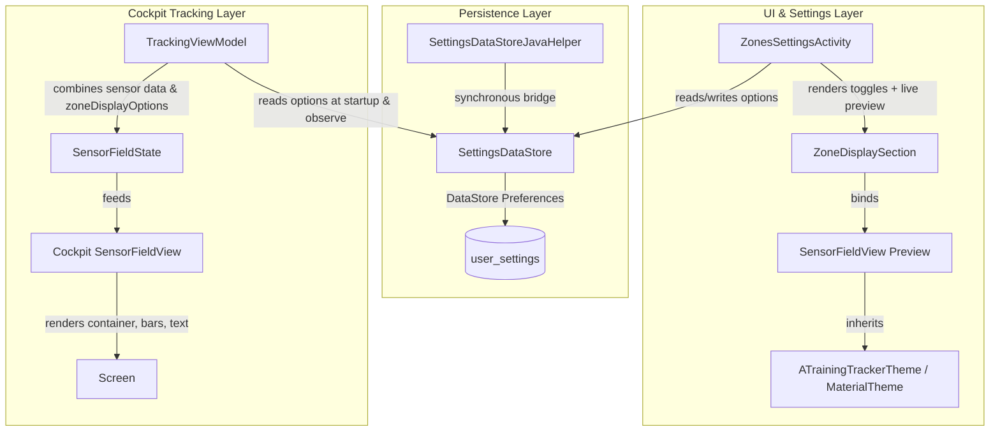

# Implementation Plan - ATT-1265: [Cockpit] Dynamic zone-based color accenting for Heart Rate and Power metrics

**Parent Ticket**: [ATT-1265](https://rainerblind.atlassian.net/browse/ATT-1265)  
**Parent Epic**: [ATT-1157](https://rainerblind.atlassian.net/browse/ATT-1157) (*[Epic] Optimize dark mode*)  
**Sub-task**: [ATT-1438](https://rainerblind.atlassian.net/browse/ATT-1438) (`[Impl-Plan]`)  
**Target Release**: `V4.9.38` (Sprint `2026-39.3`)  
**Requirement ID**: `REQ-UI-172`  
**Test ID**: `TST-UI-124`  
**Analysis Reference**: [docs/engineering/analysis/ATT-1265_analysis.md](file:///home/rainer/AndroidStudioProjects/aTrainingTracker/docs/engineering/analysis/ATT-1265_analysis.md)  
**Test Spec Reference**: [docs/engineering/test_specs/ATT-1265_test_spec.md](file:///home/rainer/AndroidStudioProjects/aTrainingTracker/docs/engineering/test_specs/ATT-1265_test_spec.md)  

---

## 1. Executive Summary & Architectural Scope

The goal of ATT-1265 is to provide athletes with full sovereignty over how athletic training zones (Heart Rate for Run and Bike, and Cycling Power) are visually presented in the tracking cockpit. Rather than enforcing a static presentation, athletes can configure four independent multi-selectable visual cues per profile (`HR_RUN`, `HR_BIKE`, `PWR_BIKE`):
1. **Light background** (`showBackground`: Boolean) - tinted card background at 12% alpha.
2. **Left bar** (`showLeftBar`: Boolean) - 6dp solid accent strip on the left edge.
3. **Right bar** (`showRightBar`: Boolean) - 6dp solid accent strip on the right edge.
4. **Text color** (`showTextColor`: Boolean) - metric value rendered in the zone color.

The configuration interface is placed directly below the zone threshold cards in `ZonesSettingsActivity.kt` and features an interactive, live, theme-aware preview tile (`SensorFieldView`) that strictly respects the active dark or light mode theme. The default configuration ensures 100% backward compatibility (`showBackground = true`, `showLeftBar = true`, `showRightBar = false`, `showTextColor = false`), and the established zone color palette (`#7FFF00`, `#008000`, `#FFA500`, `#FF0000`, `#9400D3`) is preserved without alteration.

---

## 2. Component Architecture & Data Flow



---

## 3. Step-by-Step Implementation Strategy

### Phase 1: Data Model & Persistence Layer
1. **Define `ZoneDisplayOptions`**:
   - Location: `app/src/main/java/com/atrainingtracker/trainingtracker/settings/ZoneDisplayOptions.kt`
   - Fields:
     ```kotlin
     data class ZoneDisplayOptions(
         val showBackground: Boolean = true,
         val showLeftBar: Boolean = true,
         val showRightBar: Boolean = false,
         val showTextColor: Boolean = false
     )
     ```
2. **Update `SettingsDataStore.kt`**:
   - Define boolean preference keys for each `ZoneType`:
     - `hr_run_zone_show_background`, `hr_run_zone_show_left_bar`, `hr_run_zone_show_right_bar`, `hr_run_zone_show_text_color`
     - `hr_bike_zone_show_background`, `hr_bike_zone_show_left_bar`, `hr_bike_zone_show_right_bar`, `hr_bike_zone_show_text_color`
     - `pwr_bike_zone_show_background`, `pwr_bike_zone_show_left_bar`, `pwr_bike_zone_show_right_bar`, `pwr_bike_zone_show_text_color`
   - Implement `getZoneDisplayOptionsFlow(zoneType: ZoneType): Flow<ZoneDisplayOptions>`.
   - Implement `suspend fun saveZoneDisplayOptions(zoneType: ZoneType, options: ZoneDisplayOptions)`.
3. **Update `SettingsDataStoreJavaHelper.kt`**:
   - Add `@JvmStatic fun getZoneDisplayOptions(context: Context, zoneType: SettingsDataStore.ZoneType): ZoneDisplayOptions`.
   - **Thread Safety & Dispatcher Boundary Strategy**:
     To eliminate strict-mode violations or ANRs on the Android main thread, `getZoneDisplayOptions` executes with `runBlocking(Dispatchers.IO)` with an in-memory cached fallback. If called repeatedly by legacy Java components, it returns the cached instance populated during application startup or initial read, isolating legacy Java callers from blocking the UI thread.

### Phase 2: Cockpit Sensor Tile Rendering Layer
1. **Update `SensorFieldState.kt`**:
   - Add property: `val zoneDisplayOptions: ZoneDisplayOptions = ZoneDisplayOptions()`.
   - Ensure default value preserves existing instantiation callers without breaking any existing tests.
2. **Update `SensorFieldView.kt`**:
   - **Container Color**:
     ```kotlin
     containerColor = if (fieldState.zoneColor != Color.Transparent && fieldState.zoneDisplayOptions.showBackground) {
         fieldState.zoneColor.copy(alpha = 0.12f)
     } else {
         MaterialTheme.colorScheme.surface
     }
     ```
   - **Left Indicator Strip**:
     ```kotlin
     if (fieldState.zoneColor != Color.Transparent && fieldState.zoneDisplayOptions.showLeftBar) {
         Spacer(
             modifier = Modifier
                 .width(6.dp)
                 .fillMaxHeight()
                 .background(fieldState.zoneColor)
         )
     }
     ```
   - **Content Column Weight**:
     Make the middle `Column` take `Modifier.weight(1f)` so that left and right bars frame the content symmetrically.
   - **Right Indicator Strip**:
     ```kotlin
     if (fieldState.zoneColor != Color.Transparent && fieldState.zoneDisplayOptions.showRightBar) {
         Spacer(
             modifier = Modifier
                 .width(6.dp)
                 .fillMaxHeight()
                 .background(fieldState.zoneColor)
         )
     }
     ```
   - **Primary Metric Text Color**:
     ```kotlin
     color = if (fieldState.zoneColor != Color.Transparent && fieldState.zoneDisplayOptions.showTextColor) {
         fieldState.zoneColor
     } else {
         MaterialTheme.colorScheme.onSurface
     }
     ```

### Phase 3: Telemetry Stream Integration (`TrackingViewModel.kt`)
1. In `TrackingViewModel`:
   - **Reactive Hot-Reload Mechanism**:
     `TrackingViewModel` actively collects `SettingsDataStore.getZoneDisplayOptionsFlow(zoneType)` for all 3 profiles (`HR_RUN`, `HR_BIKE`, `PWR_BIKE`) within `viewModelScope`.
     These flows are combined into an in-memory `StateFlow<Map<ZoneType, ZoneDisplayOptions>>`.
   - When an athlete modifies zone display options in `ZonesSettingsActivity` during a paused or ongoing session, the updated preferences are reactively emitted, updating the in-memory map.
   - When building `baseFields` and updating `updatedFields`, `TrackingViewModel` reads the in-memory `zoneDisplayOptions` corresponding to each field's `zoneType`.
   - When `zoneDisplayOptions` change, `TrackingViewModel` triggers a lightweight update of the impacted sensor fields without requiring a workout restart.
   - **Strict Zero-Disk-I/O Invariant**:
     1Hz sensor ticks read strictly from the in-memory state. Zero disk reads or DataStore operations take place in `applySensorData()` or `calculateZoneColor()`.

### Phase 4: Settings UI & Theme-Aware Live Preview (`ZonesSettingsActivity.kt`)
1. Extend `ZoneProfileState` with `val displayOptions: ZoneDisplayOptions = ZoneDisplayOptions()`.
2. Update initial DataStore load in `ZonesSettingsActivity` to fetch `getZoneDisplayOptionsFlow(type).first()`.
3. Update `saveProfile` to call `dataStore.saveZoneDisplayOptions(profile.type, profile.displayOptions)`.
4. In `SettingsScreenContent`:
   - Accept `displayOptions: ZoneDisplayOptions`, `onUpdateDisplayOptions: (ZoneDisplayOptions) -> Unit`, and `zoneType: ZoneType`.
   - Below the Zone 5 card, insert a divider and a section header "Zonendarstellung" (`R.string.zone_display_title`).
   - Render 4 toggle rows with clear labels:
     - "Heller Hintergrund" / "Light background" (`R.string.zone_display_background`)
     - "Balken links" / "Left bar" (`R.string.zone_display_left_bar`)
     - "Balken rechts" / "Right bar" (`R.string.zone_display_right_bar`)
     - "Textfarbe" / "Text color" (`R.string.zone_display_text_color`)
   - Render a live preview section:
     - Header "Vorschau" (`R.string.zone_display_preview_title`).
     - Interactive zone selection chips (Z1 to Z5) allowing the athlete to inspect how each zone color looks.
     - Live `SensorFieldView` instance bound to a `SensorFieldState` containing the current `displayOptions`, selected zone color, and contextual metric (e.g. 145 bpm for HR, 240 W for Power).
     - Because `ZonesSettingsActivity` is wrapped in `ATrainingTrackerTheme`, the preview automatically inherits the active theme (system dark mode or light mode).

### Phase 5: 9-Language Localization
1. Define the following string keys across all 9 localized `strings.xml` files:
   - `zone_display_title`
   - `zone_display_background`
   - `zone_display_left_bar`
   - `zone_display_right_bar`
   - `zone_display_text_color`
   - `zone_display_preview_title`
2. Target files:
   - `values/strings.xml` (EN)
   - `values-de/strings.xml` (DE)
   - `values-es/strings.xml` (ES)
   - `values-fr/strings.xml` (FR)
   - `values-it/strings.xml` (IT)
   - `values-ja/strings.xml` (JA)
   - `values-nl/strings.xml` (NL)
   - `values-pl/strings.xml` (PL)
   - `values-pt/strings.xml` (PT)

### Phase 6: Unit Testing & Verification
1. **`ZoneDisplayOptionsTest.kt`**:
   - Default values verification (`true, true, false, false`).
   - Copy mutation verification across combinations.
   - Equality and hashcode parity.
2. **`SettingsDataStoreZoneDisplayTest.kt`**:
   - Uninitialized defaults verification across all 3 zone types.
   - Read/write persistence and profile isolation.
   - `SettingsDataStoreJavaHelper` parity test with `Dispatchers.IO` safety.
3. **`SensorFieldZoneRenderingTest.kt`**:
   - Container color resolution logic under all permutations of `showBackground` and `zoneColor`.
   - Left and right bar visibility predicates.
   - Metric text color resolution logic under `showTextColor`.
   - Empty selection guard (all false -> clean neutral telemetry).
   - Theme-aware preview reactivity: verify container resolves to pure black/dark surface in dark theme and light surface in light theme when background tint is off.
4. **`ZoneDisplayLocalizationTest.kt`**:
   - Translation parity across all 9 locales.
5. **Full Regression Execution**:
   - Run `./gradlew testDebugUnitTest` to guarantee 100% pass rate.

---

## 4. Preserved Invariants & Boundary Verification

1. **Zone Color Palette Immutability**:
   - The five established zone color constants (`#7FFF00`, `#008000`, `#FFA500`, `#FF0000`, `#9400D3`) defined in `res/values/colors.xml` and `TTColor` must never be modified.
2. **Zero Sensor Tick Disk I/O**:
   - `ZoneDisplayOptions` is held in-memory on `SensorFieldState` and cached in `TrackingViewModel`. Zero disk reads or writes occur during 1Hz sensor ticks.
3. **Non-Zone Sensor Isolation**:
   - Any sensor field with `zoneColor == Color.Transparent` ignores `ZoneDisplayOptions` and remains strictly neutral.
4. **Theme Invariance**:
   - When background tint is disabled, the tile container resolves to `MaterialTheme.colorScheme.surface` (pure `#000000` under AMOLED dark mode), eliminating light bleeding.

---

## 5. Deliverables & Affected Files

| Component | File Path | Nature of Change |
|---|---|---|
| Data Model | `app/src/main/java/com/atrainingtracker/trainingtracker/settings/ZoneDisplayOptions.kt` | Net-new data class |
| DataStore | `app/src/main/java/com/atrainingtracker/trainingtracker/settings/SettingsDataStore.kt` | Keys, getter flows, save methods |
| Java Helper | `app/src/main/java/com/atrainingtracker/trainingtracker/settings/SettingsDataStoreJavaHelper.kt` | Synchronous getter helper |
| Sensor State | `app/src/main/java/com/atrainingtracker/trainingtracker/ui/tracking/SensorFieldState.kt` | Add `zoneDisplayOptions` field |
| Sensor View | `app/src/main/java/com/atrainingtracker/trainingtracker/ui/tracking/SensorFieldView.kt` | Update container, bars, text color |
| ViewModel | `app/src/main/java/com/atrainingtracker/trainingtracker/ui/tracking/tracking/TrackingViewModel.kt` | Bind options to `SensorFieldState` |
| Settings Activity | `app/src/main/java/com/atrainingtracker/trainingtracker/activities/ZonesSettingsActivity.kt` | Add Zonendarstellung section & preview |
| Localization | `app/src/main/res/values*/strings.xml` (9 locales) | Add 6 localized string resources |
| Unit Tests | `app/src/test/java/com/atrainingtracker/trainingtracker/settings/ZoneDisplayOptionsTest.kt` | Net-new unit test |
| Unit Tests | `app/src/test/java/com/atrainingtracker/trainingtracker/settings/SettingsDataStoreZoneDisplayTest.kt` | Net-new unit test |
| Unit Tests | `app/src/test/java/com/atrainingtracker/trainingtracker/ui/tracking/SensorFieldZoneRenderingTest.kt` | Net-new unit test |
| Unit Tests | `app/src/test/java/com/atrainingtracker/trainingtracker/localization/ZoneDisplayLocalizationTest.kt` | Net-new unit test |
