# Architectural Implementation Plan - ATT-1267: [Settings] Independent Theme Selector for Workout Cockpit (Always Dark, System)

**Ticket**: [ATT-1267](https://rainerblind.atlassian.net/browse/ATT-1267)  
**Sub-tasks**: [ATT-1408](https://rainerblind.atlassian.net/browse/ATT-1408) (Analysis [Erledigt]), [ATT-1409](https://rainerblind.atlassian.net/browse/ATT-1409) (Test Spec [Erledigt]), `[Impl-Plan]` (In Bearbeitung), `[Implementation]`, `[Test]`  
**Target Release**: `V4.9.38`  
**Active Sprint**: `2026-39.3`  
**Requirement**: `REQ-UI-168` (*Workout Cockpit Independent Theme Selector*), referencing `REQ-UI-106`, `REQ-UI-149`, and `REQ-UI-150`  
**Test Spec ID**: `TST-UI-120`  
**Branch**: `feature/ATT-1267`  

---

## 1. Technical Architecture & Component Flow

The implementation introduces an independent, localized theme selection architecture dedicated exclusively to the live workout tracking cockpit, decoupling cockpit rendering from the global Android system theme while isolating the rest of the application:

```mermaid
graph TD
    subgraph UI Layer: DisplaySettingsDialog.kt
        DSD[DisplaySettingsDialog: AppModalBottomSheet] --> SEC[Cockpit-Design Section Header & Explanatory Subtitle]
        SEC --> SBR[SingleChoiceSegmentedButtonRow: Systemstandard vs Immer Dunkel]
        DSD --> ACT[AppDialogActions.SaveCancel]
        ACT -->|Save| TA_SET[TrainingApplication.setCockpitThemeMode]
        ACT -->|Cancel| DISMISS[Dismiss without mutating SharedPreferences]
    end

    subgraph State & Persistence Layer
        TA[TrainingApplication.java] -->|SharedPreferences: KEY_COCKPIT_THEME_MODE| CTM[CockpitThemeMode Enum]
        CTM --> RES[resolveEffectiveCockpitDarkTheme]
    end

    subgraph Scoped Tracking Presentation Layer: TrackingTabsScreen.kt
        TTS[TrackingTabsScreen] --> PAGER[HorizontalPager: Pages 0..N]
        PAGER -->|Page 0: Control Tab| CTS[ControlTrackingScreen: Ambient System Theme]
        PAGER -->|Pages 1..N: Cockpit Tabs| CTHEME[ATrainingTrackerTheme: darkTheme = isCockpitDark]
        CTHEME --> TTGC[TrackingTabGridContent: Pure Black AMOLED #000000 Telemetry]
    end

    subgraph Unaffected Global App Shell
        DRAWER[Navigation Drawer] --> AMB[Ambient System / Light Theme]
        HIST[History & Workout Summaries] --> AMB
        PERIODS[Periods & Statistics] --> AMB
        DIALOGS[Settings Dialogs] --> AMB
    end
```



---

## 2. Detailed Technical Components

### 2.1 Domain Model: `CockpitThemeMode.kt`
Create `com.atrainingtracker.trainingtracker.ui.theme.CockpitThemeMode.kt`:
```kotlin
package com.atrainingtracker.trainingtracker.ui.theme

enum class CockpitThemeMode(val id: String) {
    SYSTEM("system"),
    ALWAYS_DARK("always_dark");

    companion object {
        fun fromId(id: String?): CockpitThemeMode =
            entries.find { it.id == id } ?: SYSTEM
    }
}

/**
 * Resolves the effective dark theme state for the workout cockpit.
 *
 * @param mode The user-selected cockpit theme mode.
 * @param isSystemDark Whether the host Android operating system is currently in Dark Mode.
 * @return True if the cockpit should render in Dark Mode (AMOLED Pure Black), false for Light Mode.
 */
fun resolveEffectiveCockpitDarkTheme(
    mode: CockpitThemeMode,
    isSystemDark: Boolean
): Boolean {
    return when (mode) {
        CockpitThemeMode.SYSTEM -> isSystemDark
        CockpitThemeMode.ALWAYS_DARK -> true
    }
}
```

### 2.2 Persistence Layer: `TrainingApplication.java`
Add persistent SharedPreferences accessors to `TrainingApplication.java`:
```java
public static final String SP_COCKPIT_THEME_MODE = "cockpit_theme_mode";
public static final String DEFAULT_COCKPIT_THEME_MODE = "system";

@NonNull
public static CockpitThemeMode getCockpitThemeMode() {
    String modeId = cSharedPreferences.getString(SP_COCKPIT_THEME_MODE, DEFAULT_COCKPIT_THEME_MODE);
    return CockpitThemeMode.Companion.fromId(modeId);
}

public static void setCockpitThemeMode(@NonNull CockpitThemeMode mode) {
    cSharedPreferences.edit().putString(SP_COCKPIT_THEME_MODE, mode.getId()).apply();
}
```

### 2.3 UI Presentation Layer: `DisplaySettingsDialog.kt`
In `DisplaySettingsDialog.kt`:
1. **Local State Staging**:
   ```kotlin
   var currentThemeMode by remember {
       mutableStateOf(TrainingApplication.getCockpitThemeMode())
   }
   ```
2. **Section Header & Guidance Subtitle**:
   ```kotlin
   Text(
       text = stringResource(R.string.cockpit_theme_title),
       style = MaterialTheme.typography.titleMedium,
       color = MaterialTheme.colorScheme.onSurface
   )
   Text(
       text = stringResource(R.string.cockpit_theme_description),
       style = MaterialTheme.typography.bodySmall,
       color = MaterialTheme.colorScheme.onSurfaceVariant
   )
   ```
3. **Material 3 `SingleChoiceSegmentedButtonRow`**:
   ```kotlin
   SingleChoiceSegmentedButtonRow(
       modifier = Modifier.fillMaxWidth()
   ) {
       SegmentedButton(
           selected = currentThemeMode == CockpitThemeMode.SYSTEM,
           onClick = { currentThemeMode = CockpitThemeMode.SYSTEM },
           shape = SegmentedButtonDefaults.itemShape(index = 0, count = 2)
       ) {
           Text(stringResource(R.string.cockpit_theme_system))
       }
       SegmentedButton(
           selected = currentThemeMode == CockpitThemeMode.ALWAYS_DARK,
           onClick = { currentThemeMode = CockpitThemeMode.ALWAYS_DARK },
           shape = SegmentedButtonDefaults.itemShape(index = 1, count = 2)
       ) {
           Text(stringResource(R.string.cockpit_theme_always_dark))
       }
   }
   ```
4. **Save Action Binding**:
   ```kotlin
   onSave = {
       TrainingApplication.setDisplayOptions(currentOptions)
       TrainingApplication.setCockpitThemeMode(currentThemeMode)
       onSettingsChanged?.invoke()
       onDismiss()
   }
   ```

### 2.4 Scoped Theme Injection: `TrackingTabsScreen.kt`
In `TrackingTabsScreen.kt`:
1. Observe cockpit theme mode and resolve effective dark state:
   ```kotlin
   val isSystemDark = isSystemInDarkTheme()
   val cockpitThemeMode by rememberUpdatedState(TrainingApplication.getCockpitThemeMode())
   val isCockpitDark = resolveEffectiveCockpitDarkTheme(cockpitThemeMode, isSystemDark)
   ```
2. Apply theme strictly to cockpit pages (`page > 0` during tracking, or preview/config mode):
   ```kotlin
   HorizontalPager(...) { page ->
       if (screenMode == ScreenMode.TRACKING && page == 0) {
           // Control Tab remains in ambient theme!
           ControlTrackingScreen(...)
       } else {
           // Cockpit telemetry views wrapped in Cockpit Theme!
           ATrainingTrackerTheme(darkTheme = isCockpitDark) {
               val viewIndex = if (screenMode == ScreenMode.TRACKING) page - 1 else page
               trackingViews.getOrNull(viewIndex)?.let { viewInfo ->
                   TrackingTabGridContent(viewInfo = viewInfo, ...)
               }
           }
       }
   }
   ```

### 2.5 Multi-Language Localization Parity (9 Locales)
Add string resources to `strings_display.xml` (or `strings.xml`) across all 9 supported locales:
* `cockpit_theme_title`:
  - EN: "Cockpit Theme (During Workout)"
  - DE: "Cockpit-Design (während des Trainings)"
  - ES: "Diseño del cockpit (durante el entrenamiento)"
  - FR: "Thème du cockpit (pendant l'entraînement)"
  - IT: "Tema del cockpit (durante l'allenamento)"
  - JA: "コックピットテーマ（ワークアウト中）"
  - NL: "Cockpitthema (tijdens training)"
  - PL: "Motyw kokpitu (podczas treningu)"
  - PT: "Tema do cockpit (durante o treino)"
* `cockpit_theme_description`:
  - EN: "Applies exclusively to telemetry and sensor views during active workouts. The main menu and 'Control Tracking' keep the standard theme."
  - DE: "Gilt nur für die Daten- und Sensoranzeigen des aktiven Workouts. Das restliche Menü und 'Control Tracking' behalten das Standarddesign."
  - ES: "Se aplica exclusivamente a las vistas de telemetría y sensores durante entrenamientos activos. El menú principal y 'Control Tracking' mantienen el diseño estándar."
  - FR: "S'applique exclusivement aux affichages de télémétrie et de capteurs pendant les entraînements actifs. Le menu principal et 'Control Tracking' conservent le thème standard."
  - IT: "Si applica esclusivamente alle visualizzazioni di telemetria e sensori durante gli allenamenti attivi. Il menu principale e 'Control Tracking' mantengono il design standard."
  - JA: "アクティブなワークアウト中のテレメトリとセンサー画面にのみ適用されます。メインメニューと「コントロールトラッキング」は標準テーマのままです。"
  - NL: "Geldt uitsluitend voor de telemetrie- en sensorweergaven tijdens actieve workouts. Het hoofdmenu en 'Control Tracking' behouden het standaardthema."
  - PL: "Dotyczy wyłącznie widoków telemetrycznych i sensorów podczas aktywnych treningów. Menu główne i 'Control Tracking' zachowują motyw standardowy."
  - PT: "Aplica-se exclusivamente às vistas de telemetria e sensores durante treinos ativos. O menu principal e 'Control Tracking' mantêm o design padrão."
* `cockpit_theme_system`:
  - EN: "System" / DE: "Systemstandard" / ES: "Sistema" / FR: "Système" / IT: "Sistema" / JA: "システム" / NL: "Systeem" / PL: "System" / PT: "Sistema"
* `cockpit_theme_always_dark`:
  - EN: "Always Dark (AMOLED)" / DE: "Immer Dunkel (AMOLED)" / ES: "Siempre oscuro (AMOLED)" / FR: "Toujours sombre (AMOLED)" / IT: "Sempre scuro (AMOLED)" / JA: "常にダーク（AMOLED）" / NL: "Altijd donker (AMOLED)" / PL: "Zawsze ciemny (AMOLED)" / PT: "Sempre escuro (AMOLED)"

---

## 3. Step-by-Step Implementation Sequence

```
1. Gate Verification (check-gate ATT-1410)
   └── Verify Stage 3 human approval on Jira before modifying code

2. Domain Model & Pure Logic
   ├── Create CockpitThemeMode.kt
   └── Create CockpitThemeModeTest.kt (unit test pure resolution logic)

3. Persistence Layer Integration
   ├── Update TrainingApplication.java (getters, setters, SP key)
   └── Update DisplaySettingsTest.kt / TrainingApplicationTest.kt

4. UI Component Enhancement
   ├── Update DisplaySettingsDialog.kt (title, subtitle, SegmentedButtonRow)
   └── Update DisplaySettingsDialogTest.kt (compose unit test)

5. Scoped Theme Injection
   └── Update TrackingTabsScreen.kt (wrap pages 1..N in ATrainingTrackerTheme(darkTheme = isCockpitDark))

6. Localization Parity (REQ-UI-106)
   ├── Add string resources across all 9 locales (EN, DE, ES, FR, IT, JA, NL, PL, PT)
   └── Run TranslationParityTest.kt

7. Full Clean-Room Regression (SWE.5)
   └── ./gradlew testDebugUnitTest
```

---

## 4. Verification & Testing Strategy

1. **Unit Tests**:
   - `CockpitThemeModeTest.kt`: Pure JVM test verifying resolution matrix (System + Light -> Light, System + Dark -> Dark, Always Dark + Light -> Dark, Always Dark + Dark -> Dark).
   - `DisplaySettingsDialogTest.kt`: Verifies segmented button staging, discard on cancel, and commit on save.
2. **Localization Parity**:
   - `TranslationParityTest.kt`: Automated verification of non-empty strings and format specifiers across all 9 locales.
3. **Clean-Room Regression**:
   - `./gradlew testDebugUnitTest`: Full test execution ensuring 0 failures.
