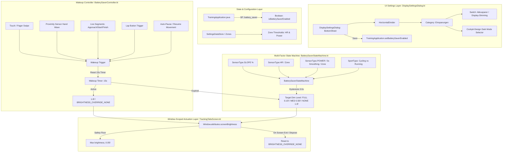

# Architectural Implementation Plan - ATT-1268: [Tracking] AMOLED Battery Saver Mode with display dimming and event-based wakeup

**Parent Ticket**: [ATT-1268](https://rainerblind.atlassian.net/browse/ATT-1268)  
**Parent Epic**: [ATT-1157](https://rainerblind.atlassian.net/browse/ATT-1157) (*[Epic] Optimize dark mode*)  
**Sub-task**: [ATT-1453](https://rainerblind.atlassian.net/browse/ATT-1453) (`[Impl-Plan]`)  
**Target Release**: `V4.9.38` (Sprint `2026-39.3`)  
**Requirement**: `REQ-UI-174` in [docs/requirements.md](file:///home/rainer/AndroidStudioProjects/aTrainingTracker/docs/requirements.md)  
**Test Specification**: `TST-UI-126` in [docs/tests.md](file:///home/rainer/AndroidStudioProjects/aTrainingTracker/docs/tests.md) & [docs/engineering/test_specs/ATT-1268_test_spec.md](file:///home/rainer/AndroidStudioProjects/aTrainingTracker/docs/engineering/test_specs/ATT-1268_test_spec.md)  
**Analysis Reference**: [docs/engineering/analysis/ATT-1268_analysis.md](file:///home/rainer/AndroidStudioProjects/aTrainingTracker/docs/engineering/analysis/ATT-1268_analysis.md)  
**Branch**: `feature/ATT-1268`  

---

## 1. Executive Summary & Architectural Overview

The objective of **ATT-1268** is to implement an intelligent **AMOLED Battery Saver Mode** that dynamically modulates display brightness during active workout tracking based on real-time topography (derived slope sensor) and athletic intensity (Heart Rate and Cycling Power zones), while instantly returning to full illumination upon explicit user interaction or critical workout events.

### 1.1 Core Architecture & Data Flow



---

## 2. Technical Component Design

### 2.1 Domain & State Machine Models

#### File: `app/src/main/java/com/atrainingtracker/trainingtracker/batterysaver/BatterySaverModel.kt`
```kotlin
package com.atrainingtracker.trainingtracker.batterysaver

enum class DimmingLevel(val brightness: Float) {
    FULL_DIM(0.15f),
    MEDIUM_DIM(0.50f),
    NO_DIM(1.0f);

    companion object {
        const val SAFETY_FLOOR = 0.05f
        const val WAKEUP_DURATION_MS = 15_000L
        const val DOWNWARD_HYSTERESIS_MS = 3_000L
    }
}

data class TelemetrySnapshot(
    val slopePercent: Float?,
    val hrZone: Int?,
    val powerZone: Int?,
    val isCycling: Boolean
)
```

#### File: `app/src/main/java/com/atrainingtracker/trainingtracker/batterysaver/BatterySaverStateMachine.kt`
Evaluates the multi-factor dimming rules with sensor fallback and hysteresis:
- **Rule 1: Full Dimming (`FULL_DIM`, 0.15f)**:
  - If cycling: `slope < 2.0%` **AND** (`hrZone == null || hrZone <= 2`) **AND** (`powerZone == null || powerZone <= 2`).
  - If running / other sport: `slope < 2.0%` **AND** (`hrZone == null || hrZone <= 2`).
  - If neither HR nor Power is present: `slope < 2.0%`.
- **Rule 2: Medium Dimming (`MEDIUM_DIM`, 0.50f)**:
  - `slope in 2.0%..5.0%` **OR** `hrZone == 3` **OR** (`isCycling && powerZone == 3`).
- **Rule 3: No Dimming / Full Illumination (`NO_DIM`, 1.0f)**:
  - `slope > 5.0%` **OR** (`hrZone != null && hrZone >= 4`) **OR** (`isCycling && powerZone != null && powerZone >= 4`).
- **Temporal Hysteresis**:
  - Transitions to a brighter state (e.g., `FULL_DIM` $\rightarrow$ `MEDIUM_DIM` or `NO_DIM`) are executed immediately ($0\text{s}$).
  - Transitions to a dimmer state (e.g., `NO_DIM` $\rightarrow$ `MEDIUM_DIM` or `FULL_DIM`) require the lower intensity condition to be sustained for $\ge 3\text{ seconds}$ to eliminate rapid brightness oscillations during brief coasting or pedaling dips.

### 2.2 Wakeup Controller & Hardware Actuation

#### File: `app/src/main/java/com/atrainingtracker/trainingtracker/batterysaver/BatterySaverController.kt`
Lifecycle-aware controller that manages:
1. **Window Brightness Manipulation**:
   - Updates `activity.window.attributes.screenBrightness`.
   - Strictly enforces safety floor $\ge 0.05f$.
   - When 100% full illumination is needed or Battery Saver is disabled: resets `screenBrightness = WindowManager.LayoutParams.BRIGHTNESS_OVERRIDE_NONE`.
2. **Proximity Sensor Listener**:
   - Subscribes to `SensorManager.getDefaultSensor(Sensor.TYPE_PROXIMITY)` during active tracking.
   - Detects `event.values[0] < sensor.maximumRange` (hand wave) and triggers wakeup.
   - Automatically unregisters on pause, backgrounding, or screen exit.
3. **Event-Based Wakeup Triggers**:
   - `onWakeupEvent()`: Resets the 15-second timer and sets brightness to 100%.
   - Overlapping triggers cancel previous pending expiration and extend the 15-second countdown.
   - Listens to:
     - Pointer touch / drag on `TrackingTabsScreen`.
     - Proximity hand wave.
     - Live Strava Segments: status transition to `APPROACHING`, `ON_SEGMENT`, or `FINISHED`.
     - Lap button click (`lapEvent`).
     - Tracking mode transitions (auto-pause / restart).

### 2.3 Persistence & Settings Layer

#### File: `app/src/main/java/com/atrainingtracker/trainingtracker/TrainingApplication.java`
Add SharedPreferences accessors:
```java
public static final String SP_BATTERY_SAVER = "battery_saver";
public static final boolean DEFAULT_BATTERY_SAVER = false;

public static boolean isBatterySaverEnabled() {
    return cSharedPreferences.getBoolean(SP_BATTERY_SAVER, DEFAULT_BATTERY_SAVER);
}

public static void setBatterySaverEnabled(boolean enabled) {
    cSharedPreferences.edit().putBoolean(SP_BATTERY_SAVER, enabled).apply();
}
```

### 2.4 UI Integration: `DisplaySettingsDialog.kt`

Modify `app/src/main/java/com/atrainingtracker/trainingtracker/ui/settings/display/DisplaySettingsDialog.kt`:
1. Add state variable `var isBatterySaverEnabled by remember { mutableStateOf(TrainingApplication.isBatterySaverEnabled()) }`.
2. Insert a horizontal divider above the new "Einsparungen" category.
3. Group the Akkusparer switch and the Cockpit Dark Mode selector into the "Einsparungen" category:
   - Header: `@string/settings_category_savings` ("Einsparungen")
   - Subtitle: `@string/settings_category_savings_desc` ("Energie- und Akkuoptimierung während des Trainings")
   - Akkusparer Toggle:
     - Label: `@string/prefs_battery_saver_title` ("Akkusparer / Display-Dimming")
     - Description: `@string/prefs_battery_saver_summary` ("Dimmt das Display bei Inaktivität basierend auf Steigung und Trainingszonen")
   - Cockpit-Design SegmentedButtonRow (System vs. Always Dark).
4. In `AppDialogActions.SaveCancel`:
   - Save: `TrainingApplication.setBatterySaverEnabled(isBatterySaverEnabled)`.
   - Cancel: Dismiss without modifying SharedPreferences.

### 2.5 Tracking Telemetry & Composition Integration

#### File: `app/src/main/java/com/atrainingtracker/trainingtracker/ui/tracking/trackingtabs/TrackingTabsScreen.kt`
1. **Touch Wakeup Detection**:
   - Wrap the outer `Box` with `Modifier.pointerInput(Unit) { awaitPointerEventScope { while (true) { awaitPointerEvent(); batterySaverController.onWakeupEvent() } } }` so all user interactions wake the display without intercepting or consuming events.
2. **Telemetry Observation**:
   - Collect derived slope from `BANALServiceRepository` (`allFilteredSensorData` for `SensorType.SLOPE`).
   - Collect Heart Rate and Cycling Power values from `allFilteredSensorData`.
   - Resolve zones via `SettingsDataStoreJavaHelper.getZoneMax(...)` or `ZoneType`.
   - Feed snapshot to `batterySaverController.updateTelemetry(...)`.
3. **Event Subscriptions**:
   - `lapEvent`: Trigger `batterySaverController.onWakeupEvent()`.
   - `trackingMode`: Trigger `batterySaverController.onWakeupEvent()` on auto-pause / resume.
   - `liveSegments`: Trigger `batterySaverController.onWakeupEvent()` on approaching/start/finish.
4. **Lifecycle & Cleanup**:
   - `DisposableEffect(context)`:
     - Register proximity listener if battery saver enabled.
     - On dispose / screen unmount: cleanly reset `window.attributes.screenBrightness = BRIGHTNESS_OVERRIDE_NONE` and unregister proximity listener.

---

## 3. Localization Parity (9 Application Locales)

The following 4 string keys will be defined across all 9 supported locales in `app/src/main/res/values*/strings.xml`:

| Key | DE (German) | EN (English) | ES (Spanish) | FR (French) | IT (Italian) | JA (Japanese) | NL (Dutch) | PL (Polish) | PT (Portuguese) |
|---|---|---|---|---|---|---|---|---|---|
| `settings_category_savings` | Einsparungen | Power Savings | Ahorro de energía | Économie d'énergie | Risparmio energetico | 省電力 | Energiebesparingen | Oszczędzanie energii | Poupança de energia |
| `settings_category_savings_desc` | Optimierung des Energieverbrauchs während des Trainings | Optimize battery consumption during workouts | Optimizar el consumo de batería durante los entrenamientos | Optimiser la consommation de la batterie pendant l'entraînement | Ottimizza il consumo della batteria durante l'allenamento | ワークアウト中のバッテリー消費を最適化 | Optimaliseer batterijverbruik tijdens trainingen | Optymalizuj zużycie baterii podczas treningów | Otimizar o consumo de bateria durante os treinos |
| `prefs_battery_saver_title` | Akkusparer / Display-Dimming | Battery Saver / Display Dimming | Ahorro de batería / Atenuación de pantalla | Économiseur de batterie / Atténuation de l'écran | Risparmio batteria / Oscuramento schermo | バッテリーセーバー / 画面減光 | Batterijbesparing / Scherm dimmen | Oszczędzanie baterii / Przyciemnianie ekranu | Economia de bateria / Diminuição do ecrã |
| `prefs_battery_saver_summary` | Passt die Bildschirmhelligkeit dynamisch an Steigung und Trainingszonen an | Dynamically adjusts screen brightness based on grade and training zones | Ajusta dinámicamente el brillo de la pantalla según la pendiente y las zonas de entrenamiento | Ajuste dynamiquement la luminosité de l'écran en fonction de la pente et des zones d'entraînement | Regola dinamicamente la luminosità dello schermo in base a pendenza e zone di allenamento | 勾配とトレーニングゾーンに基づいて画面の明るさを動的に調整します | Past de schermhelderheid dynamisch aan op basis van helling en trainingszones | Dynamicznie dostosowuje jasność ekranu na podstawie nachylenia i stref treningowych | Ajusta dinamicamente o brilho do ecrã com base na inclinação e nas zonas de treino |

---

## 4. Preservation of Invariants & Safety Measures

1. **Hardware Safety Floor ($\ge 0.05f$)**: Screen brightness is never set below $0.05f$ (never completely black or turned off), ensuring that the athlete can always visually verify that tracking is active.
2. **Window Isolation**: Brightness overrides are strictly applied to the `Activity` window attributes (`window.attributes.screenBrightness`). When the user leaves `TrackingTabsScreen` or switches apps, `BRIGHTNESS_OVERRIDE_NONE` is immediately restored.
3. **Existing Display Options Intact**: `forcePortrait`, `keepScreenOn`, and `noUnlocking` continue to be staged and persisted independently without side effects.
4. **Theme Isolation Intact**: `CockpitThemeMode` (Always Dark, System) remains strictly isolated and continues to function harmoniously alongside the new battery saver toggle.
5. **Zero Main-Thread Blocking**: All sensor sampling, smoothing calculations, and zone evaluations execute off the UI thread or within lightweight coroutines.

---

## 5. Verification & Test Plan

1. **Unit Tests**:
   - `BatterySaverStateMachineTest.kt`:
     - Test full dimming matrix (slope $< 2\%$, HR $\le$ Z2, Power $\le$ Z2).
     - Test medium dimming matrix (slope $2-5\%$, HR == Z3, Power == Z3).
     - Test no dimming matrix (slope $> 5\%$, HR $\ge$ Z4, Power $\ge$ Z4).
     - Test sensor fallback matrices (running without power, cycling without HR, pure GPS standalone).
     - Test 3-5s downward damping hysteresis and immediate upward transitions.
   - `BatterySaverControllerTest.kt`:
     - Test wakeup trigger snaps brightness to 100% (`BRIGHTNESS_OVERRIDE_NONE`).
     - Test 15-second timer countdown and overlapping reset.
     - Test proximity sensor events.
     - Test window-scoped brightness bounds and safety floor ($\ge 0.05f$).
   - `DisplaySettingsDialogTest.kt`:
     - Test category layout rendering ("Einsparungen" header + divider).
     - Test staging and persistence of Akkusparer switch.
     - Test dismissal without mutation.
   - `TranslationParityTest.kt`:
     - Confirm all 4 new string keys exist in all 9 locales.
2. **Clean-Room Regression**:
   - Execute `./gradlew testDebugUnitTest` and assert 100% pass with 0 regressions.
