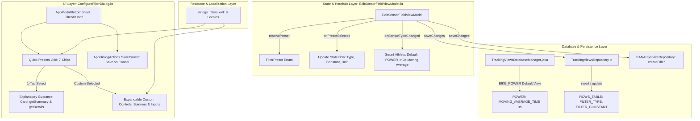

# Architectural Implementation Plan - ATT-1276: [Cockpit] Intuitive smoothing presets and simplified filter configuration

**Ticket**: [ATT-1276](https://rainerblind.atlassian.net/browse/ATT-1276)  
**Sub-tasks**: [ATT-1395](https://rainerblind.atlassian.net/browse/ATT-1395) (Analysis [Erledigt]), [ATT-1397](https://rainerblind.atlassian.net/browse/ATT-1397) (Test Spec [Erledigt]), [ATT-1403](https://rainerblind.atlassian.net/browse/ATT-1403) (Impl-Plan [In Bearbeitung]), `[Implementation]`, `[Test]`  
**Target Release**: `V4.9.38`  
**Active Sprint**: `2026-39.3`  
**Requirement**: `REQ-UI-167` (*Intuitive Smoothing Presets, Simplified Filter Configuration & Smart Athletic Defaults*), referencing `REQ-UI-149` and `REQ-UI-150`  
**Test Spec ID**: `TST-UI-119`  
**Branch**: `feature/ATT-1276`  

---

## 1. Technical Architecture & Modifications

To eliminate technical DSP jargon, provide 1-tap quick presets, and enforce smart athletic defaults (such as 3-second power smoothing), the filtering configuration architecture is systematically refined across presentation, ViewModel, database, and localization layers:



---

## 2. Detailed Technical Components

### 2.1 ViewModel State Machine & Preset Engine (`EditSensorFieldViewModel.kt`)

1. **Enum `FilterPreset`**:
   ```kotlin
   enum class FilterPreset {
       DIRECT,        // Direct / Instantaneous (1s / Raw)
       SMOOTH_3S,     // 3 Seconds (Cycling Power Standard)
       SMOOTH_10S,    // 10 Seconds (Pacing / Steady State)
       SMOOTH_30S,    // 30 Seconds (Endurance / Long-term)
       SESSION_AVG,   // Session Average (Ø)
       SESSION_MAX,   // Session Peak Max
       CUSTOM         // Granular Expert / Manual
   }
   ```

2. **Bidirectional Preset Resolution (`resolvePreset`)**:
   Pure deterministic mapping function:
   ```kotlin
   fun resolvePreset(filterType: FilterType, constant: Double, unit: String): FilterPreset {
       return when (filterType) {
           FilterType.INSTANTANEOUS -> FilterPreset.DIRECT
           FilterType.AVERAGE -> FilterPreset.SESSION_AVG
           FilterType.MAX_VALUE -> FilterPreset.SESSION_MAX
           FilterType.MOVING_AVERAGE_TIME -> {
               val seconds = if (unit == "min") constant * 60 else constant
               when {
                   unit == "samples" -> FilterPreset.CUSTOM
                   seconds == 3.0 -> FilterPreset.SMOOTH_3S
                   seconds == 10.0 -> FilterPreset.SMOOTH_10S
                   seconds == 30.0 -> FilterPreset.SMOOTH_30S
                   else -> FilterPreset.CUSTOM
               }
           }
           FilterType.MOVING_AVERAGE_NUMBER,
           FilterType.EXPONENTIAL_SMOOTHING -> FilterPreset.CUSTOM
       }
   }
   ```

3. **Preset State Transition (`onPresetSelected`)**:
   ```kotlin
   fun onPresetSelected(preset: FilterPreset) {
       val context = getApplication<Application>().applicationContext
       when (preset) {
           FilterPreset.DIRECT -> {
               _uiState.update {
                   it.copy(
                       selectedFilterType = FilterType.INSTANTANEOUS,
                       filterConstant = 1.0,
                       movingAverageUnit = "sec",
                       filterSummary = FilterType.INSTANTANEOUS.getSummary(context, 1.0)
                   )
               }
           }
           FilterPreset.SMOOTH_3S -> {
               _uiState.update {
                   it.copy(
                       selectedFilterType = FilterType.MOVING_AVERAGE_TIME,
                       filterConstant = 3.0,
                       movingAverageUnit = "sec",
                       filterSummary = FilterType.MOVING_AVERAGE_TIME.getSummary(context, 3.0)
                   )
               }
           }
           FilterPreset.SMOOTH_10S -> {
               _uiState.update {
                   it.copy(
                       selectedFilterType = FilterType.MOVING_AVERAGE_TIME,
                       filterConstant = 10.0,
                       movingAverageUnit = "sec",
                       filterSummary = FilterType.MOVING_AVERAGE_TIME.getSummary(context, 10.0)
                   )
               }
           }
           FilterPreset.SMOOTH_30S -> {
               _uiState.update {
                   it.copy(
                       selectedFilterType = FilterType.MOVING_AVERAGE_TIME,
                       filterConstant = 30.0,
                       movingAverageUnit = "sec",
                       filterSummary = FilterType.MOVING_AVERAGE_TIME.getSummary(context, 30.0)
                   )
               }
           }
           FilterPreset.SESSION_AVG -> {
               _uiState.update {
                   it.copy(
                       selectedFilterType = FilterType.AVERAGE,
                       filterConstant = 1.0,
                       movingAverageUnit = "sec",
                       filterSummary = FilterType.AVERAGE.getSummary(context, 1.0)
                   )
               }
           }
           FilterPreset.SESSION_MAX -> {
               _uiState.update {
                   it.copy(
                       selectedFilterType = FilterType.MAX_VALUE,
                       filterConstant = 1.0,
                       movingAverageUnit = "sec",
                       filterSummary = FilterType.MAX_VALUE.getSummary(context, 1.0)
                   )
               }
           }
           FilterPreset.CUSTOM -> {
               // Retain current values, revealing custom granular controls in the UI
           }
       }
   }
   ```

4. **Smart Athletic Default Heuristics**:
   - In `setupDefaultState()`:
     ```kotlin
     val defaultFilterType = if (defaultSensor == SensorType.POWER) FilterType.MOVING_AVERAGE_TIME else FilterType.INSTANTANEOUS
     val defaultConstant = if (defaultSensor == SensorType.POWER) 3.0 else 1.0
     ```
   - In `onSensorTypeChanged(newSensorType: SensorType)`:
     ```kotlin
     val isPower = newSensorType == SensorType.POWER
     val defaultFilterType = if (isPower) FilterType.MOVING_AVERAGE_TIME else FilterType.INSTANTANEOUS
     val defaultConstant = if (isPower) 3.0 else 1.0
     val defaultUnit = "sec"
     ```

---

### 2.2 Modernized Bottom Sheet UI (`ConfigureFilterDialog.kt`)

1. **Header & Dialog Scaffold**:
   - Retains `AppModalBottomSheet` with `Icons.Default.FilterAlt` and localized title `R.string.filter_configure_smoothing` (`REQ-UI-149`).
   - Retains `AppDialogActions.SaveCancel` with "Abbrechen" (`R.string.Cancel`) and "Speichern" (`R.string.save`) (`REQ-UI-150`).

2. **Quick Preset Chip Group**:
   - Section header: `Text(stringResource(R.string.filter_presets_header), style = MaterialTheme.typography.labelLarge)`.
   - Grid / FlowRow layout of 7 `FilterChip` items with touch targets $\ge 48\text{dp}$:
     1. `Direkt (1s)` (`R.string.filter_preset_direct`)
     2. `3 Sek (Power)` (`R.string.filter_preset_3s`)
     3. `10 Sek (Pacing)` (`R.string.filter_preset_10s`)
     4. `30 Sek (Ausdauer)` (`R.string.filter_preset_30s`)
     5. `Durchschnitt Ø` (`R.string.filter_preset_avg`)
     6. `Maximalwert` (`R.string.filter_preset_max`)
     7. `Manuell / Experte` (`R.string.filter_preset_custom`)
   - Selected state: dynamic evaluation matching `resolvePreset(uiState.selectedFilterType, uiState.filterConstant, uiState.movingAverageUnit)`.

3. **Explanatory Guidance Surface**:
   - Material 3 `Surface(color = MaterialTheme.colorScheme.surfaceVariant, shape = RoundedCornerShape(12.dp))`:
     - Header: Formatted filter summary (`finalFilterType.getSummary(context, finalConstant)`).
     - Body: Athletic behavior description (`finalFilterType.getDetails(context, finalConstant)`).

4. **Expandable Custom / Expert Section**:
   - Animated or conditional expansion when active preset is `FilterPreset.CUSTOM`:
     - Section divider and header `R.string.filter_custom_header`.
     - `FilterTypeSpinner`: Dropdown selector for raw `FilterType`.
     - Value input: `OutlinedTextField` for numeric seconds/samples or decimal alpha.
     - `UnitSpinner`: Dropdown selector for unit (`sec`, `min`, `samples`).

5. **Compose Previews**:
   - Add `@Preview` functions for Light Theme and Dark Theme (`AppTheme`).

---

### 2.3 Cockpit Default Database Initialization (`TrackingViewsDatabaseManager.java`)

- In `getDefaultStartRowDataList(ActivityType)` for `ActivityType.BIKE_POWER`:
  - When `SensorType.POWER` row is added, set `values.put(FILTER_TYPE, FilterType.MOVING_AVERAGE_TIME.name())` and `values.put(FILTER_CONSTANT, 3)`.

---

### 2.4 Localization Parity (`strings_filters.xml` across all 9 locales)

Add the following keys across `values/`, `values-de/`, `values-es/`, `values-fr/`, `values-it/`, `values-ja/`, `values-nl/`, `values-pl/`, and `values-pt/`:
* `filter_presets_header`: "Quick Presets" / "Schnellauswahl"
* `filter_preset_direct`: "Direct (1s)" / "Direkt (1s)"
* `filter_preset_3s`: "3s (Power)" / "3 Sek (Power)"
* `filter_preset_10s`: "10s (Pacing)" / "10 Sek (Pacing)"
* `filter_preset_30s`: "30s (Endurance)" / "30 Sek (Ausdauer)"
* `filter_preset_avg`: "Session Avg (Ø)" / "Durchschnitt (Ø)"
* `filter_preset_max`: "Session Max" / "Maximalwert"
* `filter_preset_custom`: "Custom / Expert" / "Manuell / Experte"
* `filter_custom_header`: "Custom Configuration" / "Erweiterte Einstellungen"

---

## 3. Preserved Invariants & Defensive Architecture

1. **Modal Bottom Sheet Protocol (`REQ-UI-149`)**: `ConfigureFilterDialog` remains an `AppModalBottomSheet` anchored above navigation bar with `statusBarsPadding()` and `navigationBarsPadding()`.
2. **Action Button Semantics (`REQ-UI-150`)**: Primary button remains "Speichern" (`R.string.save`). Unsaved modifications are discarded on dismiss (`onFilterConfigDismissed`), restoring initial configuration.
3. **Database Schema & Signal Processing Integrity**: `ROWS_TABLE` schema (`FILTER_TYPE` as TEXT, `FILTER_CONSTANT` as REAL) and `FilterManager` / `BANALService` signal processing algorithms remain 100% untouched.
4. **9-Language Parity (`REQ-UI-106`)**: All 9 locales receive identical string keys with positional format specifiers.

---

## 4. Test Strategy & Verification Plan (`TST-UI-119`)

1. **Unit Test Suite (`ConfigureFilterDialogTest.kt` / `EditSensorFieldViewModelTest.kt`)**:
   - Test default filter for `SensorType.POWER` is `MOVING_AVERAGE_TIME` (3s).
   - Test default filter for `SensorType.HR` and `SensorType.SPEED_mps` is `INSTANTANEOUS` (1s).
   - Test `resolvePreset` maps all standard combinations and returns `CUSTOM` for arbitrary inputs.
   - Test `onPresetSelected` updates state cleanly.
2. **Contract Verification (`ModalBottomSheetDialogsIntegrityTest.kt`)**:
   - Verify `ConfigureFilterDialog` signature and reflection contracts.
3. **Clean-Room Regression**:
   - Run `./gradlew testDebugUnitTest` to guarantee 0 regressions across all modules.
