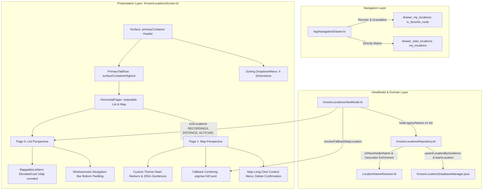

# Architectural Implementation Plan - ATT-1382: Improve Lieblingsorte UI

**Ticket**: [ATT-1382](https://rainerblind.atlassian.net/browse/ATT-1382)  
**Sub-tasks**: [ATT-1384](https://rainerblind.atlassian.net/browse/ATT-1384) (Analysis), [ATT-1385](https://rainerblind.atlassian.net/browse/ATT-1385) (Test Spec), [ATT-1386](https://rainerblind.atlassian.net/browse/ATT-1386) (Plan), [ATT-1387](https://rainerblind.atlassian.net/browse/ATT-1387) (Implementation)  
**Target Release**: `V4.9.38`  
**Active Sprint**: `2026-39.2`  
**Requirement**: `REQ-UI-166` (*Lieblingsorte UI/UX Harmonization, Standard Tabbed Layout, Sorting Options & Map Deletion Context Menu*), referencing `REQ-UI-165`  
**Test Spec ID**: `TST-UI-118`  
**Branch**: `feature/ATT-1382`  

---

## 1. Technical Architecture & Modifications

To achieve complete aesthetic and ergonomic parity with the established `aTrainingTracker` design system (`RouteTabbedScreen`, `WorkoutTabsScreen`, `SegmentsTabsScreen`), the presentation layer is systematically refactored across distinct technical components:


### 1.1 Navigation Drawer Hierarchy & Vector Asset Creation
1. **New Vector Asset `app/src/main/res/drawable/ic_favorite_route.xml`**:
   - Create vector asset combining a route path trajectory with a heart glyph overlay.
   - Tint: `#000000` / default drawable tinting support; width/height 24dp.
2. **Drawer Configuration in `AppNavigationDrawer.kt`**:
   - Reorder items in `drawer__maps` so `drawer_my_locations` (*Lieblingsstrecken*) precedes `drawer_start_locations` (*Lieblingsorte*).
   - Assign `R.drawable.ic_favorite_route` to `drawer_my_locations`.
   - Assign `R.drawable.my_locations` (the location pin with embedded heart) to `drawer_start_locations`.
   - Preserve existing route resolution contracts: `NavRoutes.START_LOCATIONS` and `NavRoutes.MY_LOCATIONS`.

### 1.2 Standard Tabbed Header Surface, Tab Row & Sorting Menu
In `KnownLocationsScreen.kt`:
1. **Header Surface**:
   - Remove generic `TopAppBar`, hamburger drawer icon, location counter badge, and search filter input.
   - Enclose header in `Surface(color = MaterialTheme.colorScheme.primaryContainer)`.
   - Add status bar padding: `Column(modifier = Modifier.statusBarsPadding())`.
   - Title Row (`LayoutConstants.HEADER_TITLE_ROW_HEIGHT`):
     - Title: `Text(text = stringResource(R.string.known_locations_title), style = MaterialTheme.typography.titleLarge, color = MaterialTheme.colorScheme.onPrimaryContainer)`.
     - Trailing action: Sort button (`Icons.Default.Sort`) with `DropdownMenu` offering 4 dimensions:
       1. Starts (`RECORDINGS`, `@string/filter_section_recordings`)
       2. Closest to Current Location (`DISTANCE_TO_USER`, `@string/sort_closest`) - dimmed if GPS unavailable
       3. Altitude (`ALTITUDE`, `@string/sort_altitude`)
       4. Name (`NAME`, `@string/sort_name`)
2. **PrimaryTabRow**:
   - Replace standard `TabRow` with text-only `PrimaryTabRow(selectedTabIndex = pagerState.currentPage, containerColor = MaterialTheme.colorScheme.surfaceContainerHighest, divider = {})`.
   - Tab 0: "Liste" (`R.string.known_locations_tab_list`).
   - Tab 1: "Karte" (`R.string.known_locations_tab_map`).
3. **Fluid Horizontal Pager**:
   - Host screen content in `HorizontalPager(state = pagerState, modifier = Modifier.fillMaxSize())` with `pageCount = 2`.
   - Page 0 renders `KnownLocationsListContent` (`userScrollEnabled = true`).
   - Page 1 renders `KnownLocationsMapContent` (`userScrollEnabled = false` to enable map drag gestures).
   - Bidirectional synchronization: swiping from List to Map navigates to page 1; tapping tabs triggers `pagerState.animateScrollToPage(index)`.

### 1.3 Intelligent Fallback Map Centering on Max HitCount
In `KnownLocationsViewModel.kt`:
- Pure domain helper:
  ```kotlin
  fun getFallbackMapLocation(): KnownLocationItem? {
      val locations = uiState.value.locations
      return if (locations.isEmpty()) null else locations.maxByOrNull { it.hitCount }
  }
  ```
In `KnownLocationsScreen.kt`:
- When opening the map perspective or resetting camera without an explicitly clicked location and without GPS:
  - If `fallbackLocation != null`, center camera on `fallbackLocation.latLng` at zoom level 15f.
  - If no locations exist in SQLite, center on standard default coordinates (Munich `48.13715, 11.57612`).

### 1.4 Custom Theme-Colored Map Markers & Long-Click Deletion Context Menu
In `KnownLocationsScreen.kt` / `MapUtils.kt`:
- Render custom `BitmapDescriptor` markers styled with primary theme pin and crisp contrasting white heart glyph via `createHeartPinMarker(context, pinColor, heartColor)`.
- 200m circular geofence overlays rendered with semi-transparent primary fill (`0x332196F3`) and stroke (`0x882196F3`).
- **Map Deletion Context Menu**: Long-pressing a marker or geofence circle opens an anchored `DropdownMenu` offering Delete (`@string/delete`).
- Tapping Delete presents `DeleteConfirmationDialog` before purging the location from SQLite.

### 1.5 List Item Card Standardization (`MappableListItem`) & Bottom Inset Handling
In `KnownLocationsScreen.kt`:
- Compose `MappableListItem` (`ElevatedCard`, 16dp rounded corners, 2dp elevation) with modern icon badge layout (Variant 2):
  - Leading 44dp container with `my_locations` heart pin.
  - Location title with inline ascent and starts count metrics.
  - Trailing edit button (`R.drawable.ic_table_edit`).
  - Single tap opens `EditKnownLocationDialog` with map preview.
  - Long-press triggers anchored `DropdownMenu` with Edit, Show on Map, and Delete.
- **System Navigation Inset**: `LazyColumn` content padding includes `WindowInsets.navigationBars.asPaddingValues().calculateBottomPadding()` ensuring the last item is never hidden behind system navigation bars.

### 1.6 Automatic Legacy Name Healing & Geocoder Auto-Naming
In `KnownLocationsViewModel.kt`, `KnownLocationsRepository.kt`, `KnownLocationsDatabaseManager.java`, and `LocationNameResolver.kt`:
- `healLegacyNames()` is executed automatically in background IO upon initialization.
- Expanded `LocationNameResolver.isPlaceholderName()` recognizes coordinate fallback patterns across all locales.
- Geocoded addresses enrich legacy placeholder entries while strictly preserving manual user edits (`source == MANUAL_USER` or custom names).

### 1.7 9-Language Domain Localization Parity
Update string resources across all 9 supported application locales (EN, DE, ES, FR, IT, JA, NL, PL, PT):
- German (`values-de/strings.xml`):
  - `drawer_start_locations`: `"Lieblingsorte"`
  - `known_locations_title`: `"Lieblingsorte"`
  - `known_locations_empty_title`: `"Keine Lieblingsorte"`
  - `known_location_edit_title`: `"Lieblingsort bearbeiten"`
- English (`values/strings.xml`):
  - `drawer_start_locations`: `"Favorite Locations"`
  - `known_locations_title`: `"Favorite Locations"`
  - `known_locations_empty_title`: `"No Favorite Locations"`
  - `known_location_edit_title`: `"Edit Favorite Location"`
- Parity across Spanish, French, Italian, Japanese, Dutch, Polish, and Portuguese.

---

## 2. Invariant Verification & Architectural Integrity

1. **Database Schema & Storage Invariant (`REQ-DAT-014`)**:
   - `StartLocation2Altitude.db` SQLite schema V5 MUST NOT be altered.
   - Altitude storage MUST strictly remain SI meters (`Double`).
   - Single-threaded dispatcher confinement (`KnownLocationsDB-Thread`) MUST NOT be altered.
2. **Auto-Locking & User Sovereignty Invariant (`REQ-UI-165`)**:
   - Manual altitude edits via `EditKnownLocationDialog` MUST continue to automatically set `is_locked = 1` and `source = MANUAL_USER`.
3. **Start Count Accumulation Invariant (`REQ-DAT-007`)**:
   - Workout starts within a 200m geofence MUST continue to increment `hitCount` while preserving reference altitude.
4. **Navigation Route Stability (`NavRoutes.kt`)**:
   - `NavRoutes.START_LOCATIONS` (`"known_locations"`) and `NavRoutes.MY_LOCATIONS` (`"my_locations"`) route IDs and contracts MUST NOT be broken.
5. **Separation of Concerns (SWE.2)**:
   - Presentation logic is strictly isolated in Jetpack Compose UI components.
   - Domain logic (e.g. `getFallbackMapLocation`) resides in `KnownLocationsViewModel`.
   - Data access remains encapsulated within `KnownLocationsRepository`.

---

## 3. Verification Coverage & Test Plan (`TST-UI-118`)

| Test Case | Target Class / File | Verification Method | Pass Criteria |
| :--- | :--- | :--- | :--- |
| **TST-UI-118.1** | `AppNavigationDrawerTest.kt` | Unit test inspecting `DrawerGroup(titleRes = R.string.drawer__maps)` | `drawer_my_locations` precedes `drawer_start_locations`; icons are `ic_favorite_route` and `my_locations`. |
| **TST-UI-118.2** | `KnownLocationsViewModelTest.kt` | Unit test calling `getFallbackMapLocation()` with varying `hitCount` values | Returns item with `argmax(hitCount)`; returns `null` when list is empty. |
| **TST-UI-118.3** | `KnownLocationsScreenTest.kt` | Composable / UI unit test inspecting card container | Cards render inside `MappableListItem` container with Name, Altitude, Source badge, Hit Count, Coordinates. |
| **TST-UI-118.4** | `KnownLocationsScreenTest.kt` | Composable / UI unit test inspecting tabs and pager | Composes `PrimaryTabRow` with container color `surfaceContainerHighest` and `HorizontalPager` with 2 pages. |
| **TST-UI-118.5** | `KnownLocationsScreenTest.kt` | Marker bitmap generation test | Custom marker bitmap is non-null and themed; red default marker is avoided. |
| **TST-UI-118.6** | `KnownLocationsScreenTest.kt` | 9-Language string resource audit | All 16 keys exist across all 9 locales; DE="Lieblingsorte", EN="Favorite Locations"; zero missing/blank values. |
| **TST-UI-118.7** | Full Repository | `./gradlew testDebugUnitTest` | 100% test success across all modules (0 failures, 0 regressions). |

---

## 4. Step-by-Step Implementation Sequence (Stage 4 Roadmap)

1. **Create Vector Drawable**:
   - Add `app/src/main/res/drawable/ic_favorite_route.xml` representing route with heart overlay.
2. **Update Navigation Drawer**:
   - In `AppNavigationDrawer.kt`, reorder `drawer_start_locations` below `drawer_my_locations` and update icon resources.
3. **Refactor `KnownLocationsScreen.kt`**:
   - Replace `TopAppBar` with `primaryContainer` `Surface` header.
   - Replace standard `TabRow` with `PrimaryTabRow(containerColor = surfaceContainerHighest, divider = {})`.
   - Implement `HorizontalPager(state = pagerState)`.
   - Wrap location items in `MappableListItem`.
   - Apply custom theme-colored heart markers on the map.
   - Implement fallback map camera target to $\operatorname{argmax}(\text{hitCount})$.
4. **Update `KnownLocationsViewModel.kt`**:
   - Add `getFallbackMapLocation()` helper.
5. **Update Localization Strings**:
   - Update strings across `values/strings.xml`, `values-de/strings.xml`, and remaining 7 locales.
6. **Update Test Suites**:
   - Add drawer ordering & icon assertions in `AppNavigationDrawerTest.kt`.
   - Add fallback location resolver tests in `KnownLocationsViewModelTest.kt`.
   - Update `KnownLocationsScreenTest.kt`.
7. **Clean-Room Verification & Device Installation**:
   - Run `./gradlew testDebugUnitTest`.
   - Build and verify APK.
   - Run Agent 2 Gate 4 audit and present for human approval.
