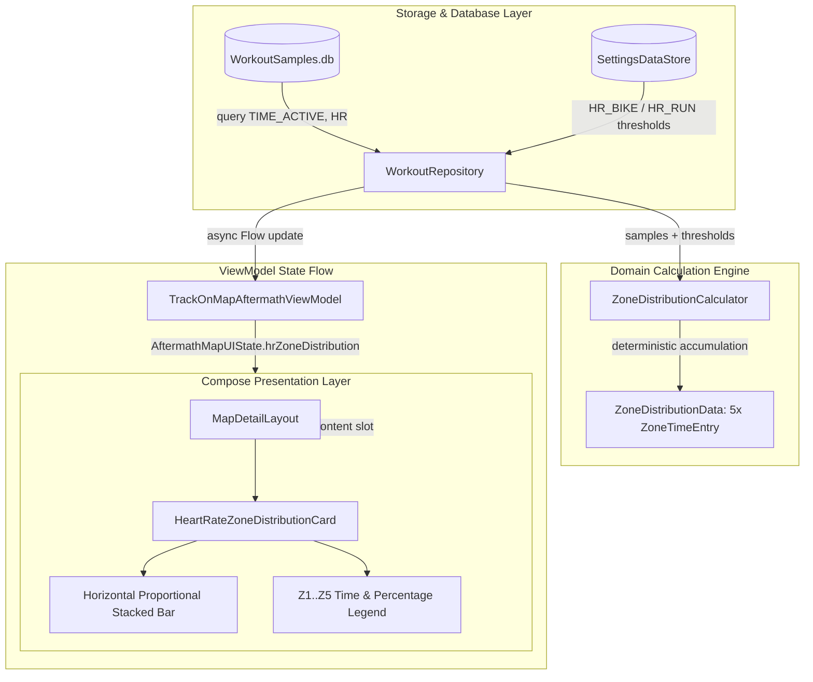

# Stage 3: Implementation Plan - ATT-1389: Aftermath: Heart Rate 5-Zone Distribution Bar (Time-in-Zones)

**Ticket**: [ATT-1389](https://atrainingtracker.atlassian.net/browse/ATT-1389)  
**Sub-task**: [ATT-1711](https://atrainingtracker.atlassian.net/browse/ATT-1711) (`[Impl-Plan]`)  
**Parent Epic**: [ATT-111](https://atrainingtracker.atlassian.net/browse/ATT-111) (*Aftermath: Compact Post-Workout Visual Analytics & Graphs*)  
**Target Release**: `V4.9.38`  
**Active Sprint**: `2026-40.5`  
**Requirement Mapping**: `REQ-UI-202` (*Aftermath: Heart Rate 5-Zone Distribution Bar (Time-in-Zones) Architecture*)  
**Test Mapping**: `TST-UI-156`  
**Branch**: `feature/ATT-1389`  
**Author**: AI Agent 1 (Implementer)  
**Date**: 2026-09-30  

---

## 1. Problem Description & Background

In post-workout aftermath inspection (`TrackOnMapScreen.kt` / `MapDetailLayout.kt`), athletes can review their route on the map, elevation profile, and summary metrics (average/max heart rate, cadence, calories). However, athletes have no immediate visibility into their physiological training stress or metabolic distribution—specifically how much time was spent in each of the 5 Heart Rate training zones (Active Recovery, Aerobic/Base, Tempo, Threshold, and VO2 Max/Anaerobic).

This feature delivers:
1. **Domain Models (`ZoneDistributionModels.kt`)**: Structured, immutable representations of athlete zone thresholds, individual zone time entries, and 5-zone aggregate distribution data.
2. **Pure Mathematical Engine (`ZoneDistributionCalculator.kt`)**: Deterministic, testable domain engine that classifies continuous HR samples against sport-specific thresholds and accumulates active time with pause clamping ($\Delta t \le 5\text{s}$).
3. **Full-Fidelity SQLite Telemetry Extraction (`WorkoutRepository.kt`)**: Thread-safe query on `Dispatchers.IO` extracting `TIME_ACTIVE`, `TIME_TOTAL`, and `HR` from `WorkoutSamples.db`, with defensive handling of workouts lacking HR telemetry.
4. **ViewModel State Flow (`TrackOnMapAftermathViewModel.kt`)**: Asynchronous resolution and reactive state delivery via `AftermathMapUIState.hrZoneDistribution`.
5. **Modern Visual Component (`HeartRateZoneDistributionCard.kt`)**: Clean Jetpack Compose card featuring a rounded horizontal stacked percentage bar rendered with `TTColor.Zone1`..`Zone5`, accompanied by a compact time-in-zone and percentage legend.
6. **Slotted MapDetailLayout Integration (`MapDetailLayout.kt`, `TrackOnMapScreen.kt`)**: Flexible `@Composable ColumnScope.() -> Unit` slot supporting outdoor GPS and indoor stationary trainer workouts.
7. **100% 9-Language Localization Parity**: Exact localized headers across English, German, Spanish, French, Italian, Japanese, Dutch, Polish, and Portuguese.

---

## 2. Traceability & Requirements Mapping

* **Primary Requirement**: `REQ-UI-202` (*Aftermath: Heart Rate 5-Zone Distribution Bar (Time-in-Zones) Architecture*)
* **Test Mapping**: `TST-UI-156` (*Aftermath Heart Rate 5-Zone Distribution Bar Verification*)
* **Supporting Requirements**:
  - `REQ-UI-201`: Aftermath Synchronized Multi-Metric Scrubbing on Elevation Profile.
  - `REQ-UI-106`: 9-Language Localization Parity.
  - `REQ-PRO-001`: ASPICE Stage-Gated Life Cycle Governance.
  - `REQ-PRO-016`: Inviolable ASPICE Human Decision Gates.

---

## 3. System Invariants & Preserved Behavior

1. **Zero Degradation of Existing Screens**:
   - `MapDetailLayout` provides an optional default no-op parameter `analyticsContent: @Composable ColumnScope.() -> Unit = {}`, preserving 100% compatibility with Routes and Segments detail views.
   - Workouts recorded without a heart rate sensor cleanly evaluate to `hrZoneDistribution = null`, consuming zero vertical space without empty placeholders.
2. **Indoor & Stationary Workout Integrity**:
   - For indoor sessions (`trainer = true`, `showMap = false`, `showElevationProfile = false`), the analytics slot remains fully visible and properly spaced below the summary metrics card.
3. **Database Concurrency & Confinement**:
   - Telemetry extraction from `WorkoutSamples.db` executes strictly within `Dispatchers.IO` using Android's SQLite cursor abstraction. Zero database schema migrations or writes.
4. **Color & Branding Consistency**:
   - Zone colors strictly utilize established theme tokens `TTColor.Zone1` through `TTColor.Zone5`.
5. **Subtask Self-Sufficiency & Process Governance**:
   - Stage deliverables are written directly into subtask descriptions before review transitions.
   - Subtasks transition to `Erledigt` upon passing Gate audit via `freigabe`.

---

## 4. Proposed Architectural Changes



---

## 5. Step-by-Step Implementation Sequence

### Step 1: Domain Models (`ZoneDistributionModels.kt`)
* **Path**: `app/src/main/java/com/atrainingtracker/trainingtracker/ui/aftermath/zones/ZoneDistributionModels.kt`
* **Contents**:
  ```kotlin
  data class HeartRateZoneThresholds(
      val z1Max: Int,
      val z2Max: Int,
      val z3Max: Int,
      val z4Max: Int
  )

  data class ZoneSample(
      val timeActiveSec: Long,
      val value: Int
  )

  data class ZoneTimeEntry(
      val zoneIndex: Int, // 1..5
      val zoneLabelResId: Int,
      val durationSec: Long,
      val percentage: Float,
      val color: Color
  )

  data class ZoneDistributionData(
      val totalActiveTimeSec: Long,
      val entries: List<ZoneTimeEntry>
  )
  ```

### Step 2: Pure Calculation Engine (`ZoneDistributionCalculator.kt`)
* **Path**: `app/src/main/java/com/atrainingtracker/trainingtracker/ui/aftermath/zones/ZoneDistributionCalculator.kt`
* **Algorithm**:
  - Classify each sample:
    - $\text{HR} \le Z1_{\max} \implies \text{Zone 1}$
    - $Z1_{\max} < \text{HR} \le Z2_{\max} \implies \text{Zone 2}$
    - $Z2_{\max} < \text{HR} \le Z3_{\max} \implies \text{Zone 3}$
    - $Z3_{\max} < \text{HR} \le Z4_{\max} \implies \text{Zone 4}$
    - $\text{HR} > Z4_{\max} \implies \text{Zone 5}$
  - Accumulate active duration across consecutive sample timestamps $\Delta t = (t_{i+1} - t_i)$ clamped to $[0\text{s}, 5\text{s}]$.
  - For single or terminal sample, assign $1\text{s}$.
  - If total duration is $0\text{s}$ or samples list is empty, return `null`.
  - Calculate percentage for each zone: $P_z = (\text{duration}_z / \text{totalDuration}) \times 100$.
  - Map to `ZoneTimeEntry` using `TTColor.Zone1`..`Zone5` and `R.string.zone_1_label`..`zone_5_label`.

### Step 3: SQLite Telemetry Query (`WorkoutRepository.kt`)
* **Path**: `app/src/main/java/com/atrainingtracker/trainingtracker/data/repository/WorkoutRepository.kt`
* **Implementation**:
  - Add `suspend fun getHeartRateZoneDistribution(workoutId: Long, bSportType: BSportType?): ZoneDistributionData? = withContext(Dispatchers.IO)`.
  - Resolve sport zone type: `val zoneType = if (bSportType == BSportType.BIKE) ZoneType.HR_BIKE else ZoneType.HR_RUN`.
  - Fetch thresholds via `SettingsDataStoreJavaHelper.getZoneMax(context, zoneType, 1..4)`.
  - Open workout samples table; inspect columns via `cursor.getColumnIndex(SensorType.HR.name)`.
  - If column absent or empty, return `null`.
  - Extract valid `ZoneSample(timeActiveSec, hr)` and invoke `ZoneDistributionCalculator.calculateHeartRateDistribution`.

### Step 4: ViewModel Integration (`TrackOnMapAftermathViewModel.kt`)
* **Path**: `app/src/main/java/com/atrainingtracker/trainingtracker/ui/aftermath/TrackOnMapAftermathViewModel.kt`
* **Implementation**:
  - Add `val hrZoneDistribution: ZoneDistributionData? = null` to `AftermathMapUIState`.
  - In `loadAftermathData(workoutData: WorkoutData)`, launch async query for `getHeartRateZoneDistribution` and emit to `_uiState`.

### Step 5: Visual Composable (`HeartRateZoneDistributionCard.kt`)
* **Path**: `app/src/main/java/com/atrainingtracker/trainingtracker/ui/aftermath/zones/HeartRateZoneDistributionCard.kt`
* **UI Elements**:
  - Header: Heart icon + `stringResource(R.string.aftermath_hr_zones_title)`.
  - Stacked Bar: Row of rounded segments clipped to `RoundedCornerShape(6.dp)` with heights of `12.dp`, weighted by `percentage.coerceAtLeast(0.001f)`.
  - Legend: FlowRow or Row with 5 items displaying color dot, zone label (Z1..Z5), formatted time (`m:ss` or `h:mm:ss`), and percentage (`X%`).

### Step 6: Layout Integration (`MapDetailLayout.kt` & `TrackOnMapScreen.kt`)
* **Paths**:
  - `app/src/main/java/com/atrainingtracker/trainingtracker/ui/map/MapDetailLayout.kt`: Add `analyticsContent: @Composable ColumnScope.() -> Unit = {}`.
  - `app/src/main/java/com/atrainingtracker/trainingtracker/ui/aftermath/TrackOnMapScreen.kt`: Pass `analyticsContent = { uiState.hrZoneDistribution?.let { HeartRateZoneDistributionCard(it) } }`.

### Step 7: 9-Language Localization Parity
* **Key**: `aftermath_hr_zones_title`
* Values:
  - English (`values/strings.xml`): `Heart Rate Zones`
  - German (`values-de/strings.xml`): `Herzfrequenz-Zonen`
  - Spanish (`values-es/strings.xml`): `Zonas de frecuencia cardíaca`
  - French (`values-fr/strings.xml`): `Zones de fréquence cardiaque`
  - Italian (`values-it/strings.xml`): `Zone di frequenza cardiaca`
  - Japanese (`values-ja/strings.xml`): `心拍ゾーン`
  - Dutch (`values-nl/strings.xml`): `Hartslagzones`
  - Polish (`values-pl/strings.xml`): `Strefy tętna`
  - Portuguese (`values-pt/strings.xml`): `Zonas de frequência cardíaca`

### Step 8: Comprehensive Unit Testing (`TST-UI-156`)
* `ZoneDistributionCalculatorTest.kt`: Threshold categorization, time accumulation, gap clamping, sum to 100%, null cases.
* `HeartRateZoneLocalizationTest.kt`: String presence across all 9 locales.
* Clean-room full regression: `./gradlew testDebugUnitTest`.

---

## 6. Review & Human Decision Gate Readiness

Upon completion of this plan:
1. Update sub-task [ATT-1711](https://atrainingtracker.atlassian.net/browse/ATT-1711) description with this implementation plan.
2. Transition ATT-1711 to `In Überprüfung`.
3. Execute external auditor check via `python3 tools/review_agent.py audit ATT-1711` to obtain Gate 3 approval.
