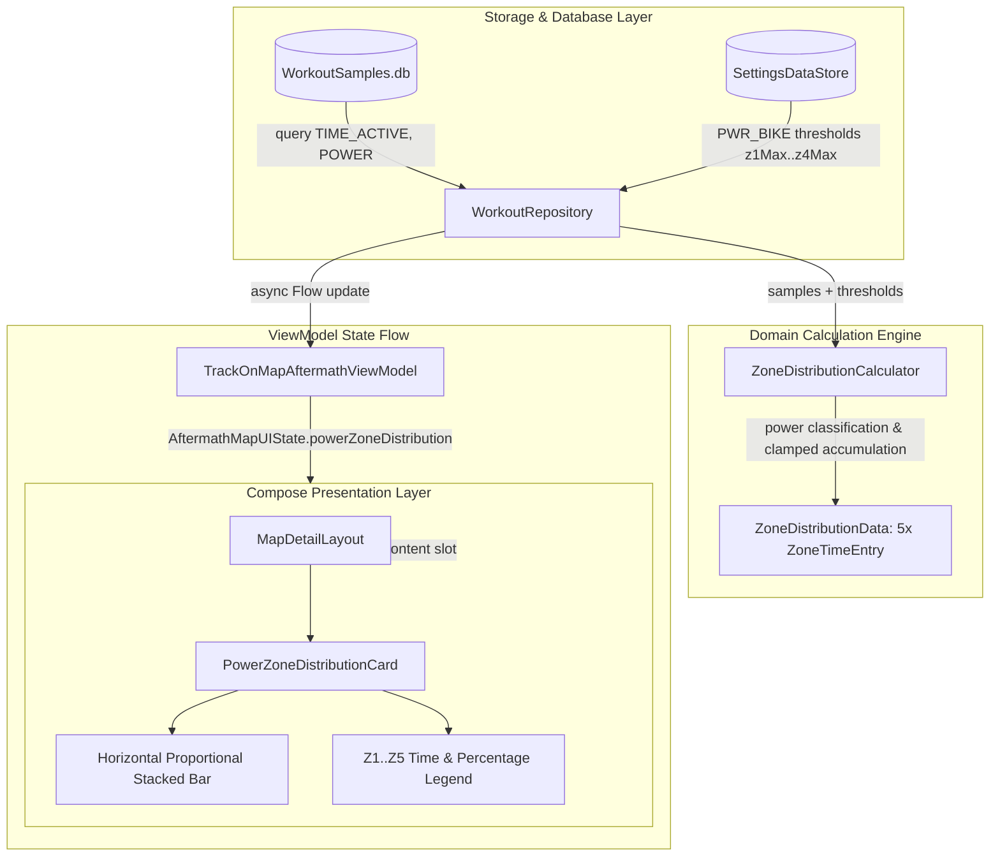

# Stage 3: Implementation Plan - ATT-1390: Aftermath: Cycling Power 5-Zone Distribution Bar (Time-in-Zones)

**Ticket**: [ATT-1390](https://atrainingtracker.atlassian.net/browse/ATT-1390)  
**Sub-task**: [ATT-1718](https://atrainingtracker.atlassian.net/browse/ATT-1718) (`[Plan]`)  
**Parent Epic**: [ATT-111](https://atrainingtracker.atlassian.net/browse/ATT-111) (*Aftermath: Compact Post-Workout Visual Analytics & Graphs*)  
**Target Release**: `V4.9.38`  
**Active Sprint**: `2026-40.5`  
**Requirement Mapping**: `REQ-UI-203` (*Aftermath Cycling Power 5-Zone Distribution Bar (Time-in-Zones) Architecture*)  
**Test Mapping**: `TST-UI-157`  
**Branch**: `feature/ATT-1390`  
**Author**: AI Agent 1 (Implementer)  
**Date**: 2026-09-30  

---

## 1. Problem Description & Background

In post-workout aftermath inspection (`TrackOnMapScreen.kt` / `MapDetailLayout.kt`), cyclists recording power meter telemetry currently only see aggregate extrema (Average Power and Max Power in `WorkoutExtrema`). There is no visual breakdown of time spent in each power training zone (Active Recovery, Endurance, Tempo, Threshold, and VO2 Max/Anaerobic). 

Building upon the 5-zone distribution architecture established in `ATT-1389`, this feature delivers:
1. **Domain Models (`ZoneDistributionModels.kt`)**: Structured, immutable `PowerZoneThresholds(z1Max, z2Max, z3Max, z4Max)` integrated with existing `ZoneSample`, `ZoneTimeEntry`, and `ZoneDistributionData`.
2. **Pure Mathematical Engine (`ZoneDistributionCalculator.kt`)**: Deterministic, testable power distribution engine that classifies continuous power samples against athlete power thresholds and accumulates active time with pause clamping ($\Delta t \le 5\text{s}$).
3. **Full-Fidelity SQLite Telemetry Extraction (`WorkoutRepository.kt`)**: Safe, thread-confined telemetry query on `Dispatchers.IO` extracting `TIME_ACTIVE` and `POWER` from `WorkoutSamples.db`, with defensive null handling when power telemetry is absent or non-positive.
4. **ViewModel State Flow (`TrackOnMapAftermathViewModel.kt`)**: Asynchronous resolution and reactive state delivery via `AftermathMapUIState.powerZoneDistribution`.
5. **Modern Visual Component (`PowerZoneDistributionCard.kt`)**: Clean Jetpack Compose card featuring a rounded horizontal stacked percentage bar rendered with `TTColor.Zone1`..`Zone5`, accompanied by a compact time-in-zone and percentage legend.
6. **Slotted MapDetailLayout Integration (`MapDetailLayout.kt`, `TrackOnMapScreen.kt`)**: Stacking seamlessly below `HeartRateZoneDistributionCard` in `analyticsContent` with consistent `8.dp` spacing.
7. **100% 9-Language Localization Parity**: Exact localized headers across English, German, Spanish, French, Italian, Japanese, Dutch, Polish, and Portuguese.

---

## 2. Traceability & Requirements Mapping

* **Primary Requirement**: `REQ-UI-203` (*Aftermath Cycling Power 5-Zone Distribution Bar (Time-in-Zones) Architecture*)
* **Test Mapping**: `TST-UI-157` (*Aftermath Cycling Power 5-Zone Distribution Bar Verification*)
* **Supporting Requirements**:
  - `REQ-UI-202`: Aftermath Heart Rate 5-Zone Distribution Bar Architecture.
  - `REQ-UI-201`: Aftermath Synchronized Multi-Metric Scrubbing on Elevation Profile.
  - `REQ-UI-106`: 9-Language Localization Parity.
  - `REQ-PRO-001`: ASPICE Stage-Gated Life Cycle Governance.
  - `REQ-PRO-016`: Inviolable ASPICE Human Decision Gates.

---

## 3. System Invariants & Preserved Behavior

1. **Zero Degradation of Existing Screens**:
   - `analyticsContent` slot in `MapDetailLayout` cleanly accommodates both HR and Power cards, or either independently.
   - Workouts recorded without a cycling power meter evaluate to `powerZoneDistribution = null`, consuming zero vertical space without placeholders.
2. **Indoor & Stationary Workout Support**:
   - For stationary turbo-trainer workouts recorded with smart trainer or power pedals, the Power Zone card displays cleanly below summary metrics.
3. **Database Concurrency & Confinement**:
   - Telemetry extraction from `WorkoutSamples.db` executes strictly within `Dispatchers.IO` using Android's SQLite cursor abstraction. Zero database schema migrations or writes.
4. **Color & Branding Consistency**:
   - Zone colors strictly utilize established theme tokens `TTColor.Zone1` through `TTColor.Zone5`.
5. **Subtask Self-Sufficiency & Process Governance**:
   - Stage deliverables are written directly into subtask descriptions before review transitions.
   - Subtasks transition to `Erledigt` upon passing Gate audit via `freigabe`.

---

## 4. Proposed Architectural Changes

---

## 5. Step-by-Step Implementation Sequence

### Step 1: Domain Models (`ZoneDistributionModels.kt`)
* **Path**: `app/src/main/java/com/atrainingtracker/trainingtracker/ui/aftermath/zones/ZoneDistributionModels.kt`
* **Changes**:
  - Add `PowerZoneThresholds(val z1Max: Int, val z2Max: Int, val z3Max: Int, val z4Max: Int)`.

### Step 2: Pure Calculation Engine (`ZoneDistributionCalculator.kt`)
* **Path**: `app/src/main/java/com/atrainingtracker/trainingtracker/ui/aftermath/zones/ZoneDistributionCalculator.kt`
* **Changes**:
  - Add `calculatePowerDistribution(samples: List<ZoneSample>, thresholds: PowerZoneThresholds): ZoneDistributionData?`.
  - Classify each sample:
    - $P \le Z1_{\max} \implies \text{Zone 1}$
    - $Z1_{\max} < P \le Z2_{\max} \implies \text{Zone 2}$
    - $Z2_{\max} < P \le Z3_{\max} \implies \text{Zone 3}$
    - $Z3_{\max} < P \le Z4_{\max} \implies \text{Zone 4}$
    - $P > Z4_{\max} \implies \text{Zone 5}$
  - Accumulate active duration across consecutive sample timestamps $\Delta t = (t_{i+1} - t_i)$ clamped to $[0\text{s}, 5\text{s}]$.
  - For single or terminal sample, assign $1\text{s}$.
  - If total duration is $0\text{s}$ or samples list has no positive power values, return `null`.
  - Calculate percentage for each zone: $P_z = (\text{duration}_z / \text{totalDuration}) \times 100$.
  - Map to `ZoneTimeEntry` using `TTColor.Zone1`..`Zone5` and `R.string.zone_1_label`..`zone_5_label`.

### Step 3: SQLite Telemetry Query (`WorkoutRepository.kt`)
* **Path**: `app/src/main/java/com/atrainingtracker/trainingtracker/data/repository/WorkoutRepository.kt`
* **Changes**:
  - Add `suspend fun getPowerZoneDistribution(workoutId: Long): ZoneDistributionData? = withContext(Dispatchers.IO)`.
  - Fetch thresholds via `SettingsDataStoreJavaHelper.getZoneMax(application, ZoneType.PWR_BIKE, 1..4)`.
  - Open workout samples table; inspect columns via `cursor.getColumnIndex(SensorType.POWER.name)`.
  - If column absent or empty, return `null`.
  - Extract valid `ZoneSample(timeActiveSec, power)` where `power > 0` and invoke `ZoneDistributionCalculator.calculatePowerDistribution`.

### Step 4: ViewModel Integration (`TrackOnMapAftermathViewModel.kt`)
* **Path**: `app/src/main/java/com/atrainingtracker/trainingtracker/ui/aftermath/TrackOnMapAftermathViewModel.kt`
* **Changes**:
  - Add `val powerZoneDistribution: ZoneDistributionData? = null` to `AftermathMapUIState`.
  - In `loadAftermathData(workoutData: WorkoutData)`, launch async query for `getPowerZoneDistribution` and emit to `_uiState`.

### Step 5: Visual Composable (`PowerZoneDistributionCard.kt`)
* **Path**: `app/src/main/java/com/atrainingtracker/trainingtracker/ui/aftermath/zones/PowerZoneDistributionCard.kt`
* **UI Elements**:
  - Header: Power icon (`R.drawable.ic_power`) + `stringResource(R.string.aftermath_power_zones_title)`.
  - Stacked Bar: Row of rounded segments clipped to `RoundedCornerShape(6.dp)` with heights of `12.dp`, weighted by `percentage.coerceAtLeast(0.001f)`.
  - Legend: Row with 5 items displaying color dot, zone label (Z1..Z5), formatted time (`m:ss` or `h:mm:ss`), and percentage (`X%`).

### Step 6: Layout Integration (`TrackOnMapScreen.kt`)
* **Path**: `app/src/main/java/com/atrainingtracker/trainingtracker/ui/aftermath/TrackOnMapScreen.kt`
* **Changes**:
  - In `analyticsContent`, render both `HeartRateZoneDistributionCard` and `PowerZoneDistributionCard`, separated by `Spacer(modifier = Modifier.height(8.dp))` if both are present.

### Step 7: 9-Language Localization Parity
* **Key**: `aftermath_power_zones_title`
* Values:
  - English (`values/strings.xml`): `Power Zones`
  - German (`values-de/strings.xml`): `Leistungszonen`
  - Spanish (`values-es/strings.xml`): `Zonas de potencia`
  - French (`values-fr/strings.xml`): `Zones de puissance`
  - Italian (`values-it/strings.xml`): `Zone di potenza`
  - Japanese (`values-ja/strings.xml`): `パワーゾーン`
  - Dutch (`values-nl/strings.xml`): `Vermogenszones`
  - Polish (`values-pl/strings.xml`): `Strefy mocy`
  - Portuguese (`values-pt/strings.xml`): `Zonas de potência`

### Step 8: Comprehensive Unit Testing (`TST-UI-157`)
* `PowerZoneDistributionCalculatorTest.kt`: Threshold categorization, time accumulation, gap clamping, sum to 100%, null cases.
* `PowerZoneLocalizationTest.kt`: String presence across all 9 locales.
* Clean-room full regression: `./gradlew testDebugUnitTest`.

---

## 6. Review & Human Decision Gate Readiness

Upon completion of this plan:
1. Update sub-task [ATT-1718](https://atrainingtracker.atlassian.net/browse/ATT-1718) description with this implementation plan.
2. Transition ATT-1718 to `In Überprüfung`.
3. Execute external auditor check via `python3 tools/review_agent.py audit ATT-1718` to obtain Gate 3 approval.
