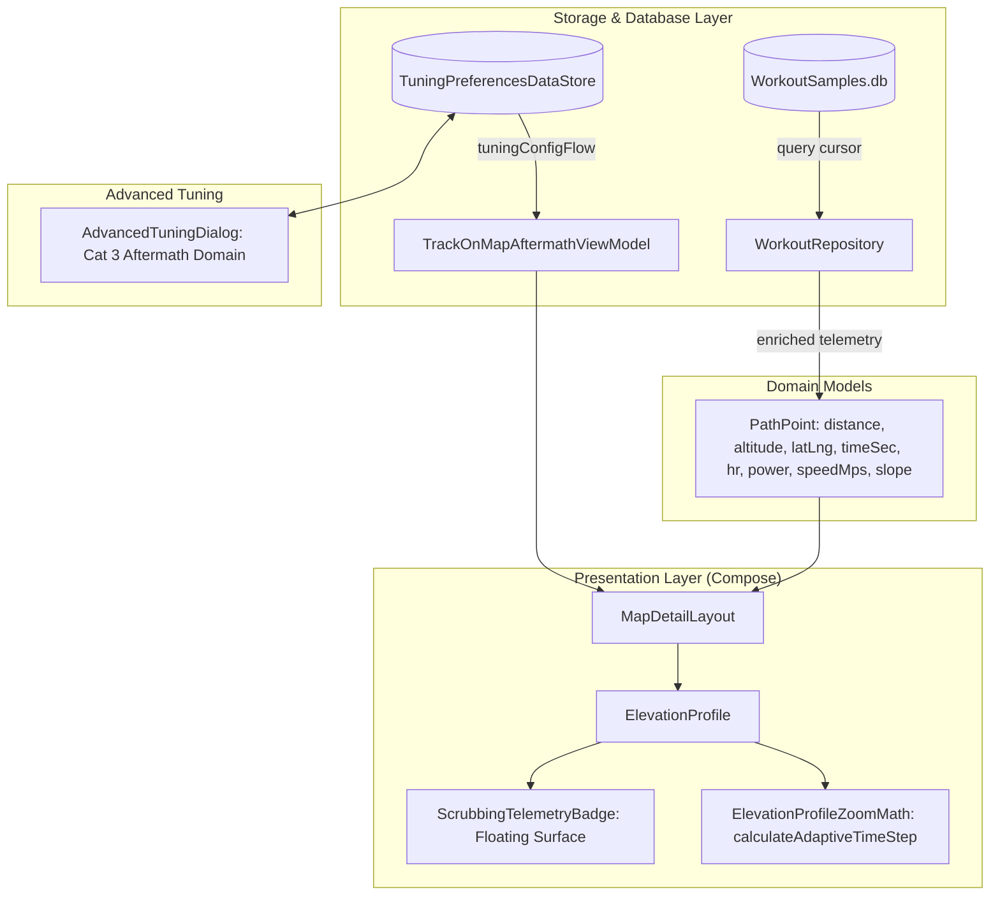

# Stage 3: Implementation Plan - ATT-1391: Aftermath: Synchronized Multi-Metric Scrubbing on Elevation Profile

**Ticket**: [ATT-1391](https://atrainingtracker.atlassian.net/browse/ATT-1391)  
**Sub-task**: [ATT-1706](https://atrainingtracker.atlassian.net/browse/ATT-1706) (`[Impl-Plan]`)  
**Parent Epic**: [ATT-111](https://atrainingtracker.atlassian.net/browse/ATT-111) (*Aftermath: Compact Post-Workout Visual Analytics & Graphs*)  
**Target Release**: `V4.9.38`  
**Active Sprint**: `2026-40.5`  
**Requirement Mapping**: `REQ-UI-201` (*Aftermath: Synchronized Multi-Metric Scrubbing on Elevation Profile with Configurable X-Axis Domain Architecture*)  
**Test Mapping**: `TST-UI-155`  
**Branch**: `feature/ATT-1391`  
**Author**: AI Agent 1 (Implementer)  
**Date**: 2026-09-30  

---

## 1. Problem Description & Background

In the Aftermath workout inspection view (`MapDetailLayout.kt` / `ElevationProfile.kt`), scrubbing along the elevation profile currently only moves a spatial marker on the map and shows distance and altitude. Athletes lack immediate correlation between elevation/gradient and their physical effort (heart rate, power, pace/speed). Furthermore, athletes analyzing interval training or criteriums have no way to switch the elevation profile's horizontal axis from *Distance* to *Elapsed Time*.

This feature delivers:
1. Enriched `PathPoint` telemetry extracted directly from existing `WorkoutSamples.db` tables.
2. Synchronized multi-metric scrubbing with a modern floating telemetry badge (`ScrubbingTelemetryBadge`) in Compose, displaying Heart Rate, Power, Speed/Pace, Altitude, Slope, Distance, and Time with graceful fallback for absent sensors.
3. User-configurable Profile X-Axis Domain (`ProfileXAxisDomain.DISTANCE` vs `ProfileXAxisDomain.TIME`) persisted in `TuningPreferencesDataStore` and customizable in `AdvancedTuningDialog`.
4. Adaptive time-step scaling and formatting (`m:ss` / `h:mm:ss`) in `ElevationProfileZoomMath`.
5. Complete 9-language localization parity.

---

## 2. Traceability & Requirements Mapping

* **Requirement**: `REQ-UI-201` (*Aftermath: Synchronized Multi-Metric Scrubbing on Elevation Profile with Configurable X-Axis Domain Architecture*)
* **Test Mapping**: `TST-UI-155` (*Aftermath Synchronized Multi-Metric Scrubbing & X-Axis Domain Verification*)
* **Supporting Requirements**:
  - `REQ-UI-192`: Interactive Elevation Profile Zoom, Pan & Centered Scaling Navigation.
  - `REQ-UI-197`: Elevation Profile Contextual Zoom Controls Visibility & Non-Overlapping Scrubber Text Architecture.
  - `REQ-SET-074`: Advanced Tuning Drawer Partitioning & Safety Defaults.
  - `REQ-UI-106`: 9-Language Localization Parity.
  - `REQ-PRO-001`: ASPICE Stage-Gated Life Cycle Governance.

---

## 3. System Invariants & Preserved Behavior

1. **Zero Unintended Regressions**:
   - `PathPoint` constructor backward compatibility: default parameters (`timeSec = 0L`, `hr = null`, `power = null`, `speedMps = null`, `slope = null`) ensure existing callers continue compiling and running without modification.
   - `ElevationProfile` constructor backward compatibility: existing overloads and default parameter values (`showZoomControls = false`, `onDistanceSelected = {}`) remain preserved for preview list items (`WorkoutSummary`, `RouteItem`, `SegmentItem`).
2. **Thread Safety & Dispatcher Affinity**:
   - Database cursor operations in `WorkoutRepository.getWorkoutTrackPoints()` remain strictly bound to `Dispatchers.IO`.
3. **Database Schema Immutability**:
   - Telemetry columns (`HR`, `POWER`, `SPEED_mps`, `SLOPE`, `TIME_ACTIVE`, `TIME_TOTAL`) already exist in SQLite `WorkoutSamples.db`. Zero SQLite migrations or schema modifications are introduced.
4. **Subtask Self-Sufficiency & Human Gate Invariance**:
   - Subtasks transition directly to `Erledigt` upon passing Gate audit via `freigabe`.
   - Terminal completion of parent tickets remains reserved for the human user in `Final Review (Human)`.

---

## 4. Proposed Architectural Changes



### Component 1: `MapModels.kt`
- Extend `PathPoint` with backward-compatible telemetry fields:
  ```kotlin
  data class PathPoint(
      val distance: Double,
      val latLng: LatLng,
      val altitude: Double,
      val timeSec: Long = 0L,
      val hr: Int? = null,
      val power: Int? = null,
      val speedMps: Double? = null,
      val slope: Double? = null
  )
  ```

### Component 2: `WorkoutRepository.kt`
- In `getWorkoutTrackPoints(workoutId, trackType)`:
  - Query existing columns: `TIME_ACTIVE`, `TIME_TOTAL`, `HR`, `POWER`, `SPEED_mps`, `SLOPE`.
  - Parse values safely from cursor and populate `PathPoint`.

### Component 3: `TuningPreferencesDataStore.kt` & `AdvancedTuningDialog.kt`
- Add `enum class ProfileXAxisDomain { DISTANCE, TIME }`.
- Add `KEY_PROFILE_X_AXIS_DOMAIN` to `TuningPreferencesDataStore` with default `ProfileXAxisDomain.DISTANCE`.
- Add `profileXAxisDomain` property to `TuningConfig` and `TuningPreferencesDefaults`.
- In `AdvancedTuningDialog.kt`, add Category 3: *"Aftermath & Profil-Analytik"* with an intuitive toggle/radio selector.

### Component 4: `ElevationProfileZoomMath.kt`
- Add `fun calculateAdaptiveTimeStep(visibleTimeSec: Double): Long` returning standard step intervals (e.g., 30s, 60s, 120s, 300s, 600s, 1800s, 3600s).

### Component 5: `ElevationProfile.kt` & `MapDetailLayout.kt`
- Accept `xAxisDomain: ProfileXAxisDomain = ProfileXAxisDomain.DISTANCE`, `bSportType: BSportType = BSportType.CYCLING`, and `onPointSelected: ((PathPoint?) -> Unit)? = null`.
- When `xAxisDomain == ProfileXAxisDomain.TIME`, plot horizontal coordinates against `timeSec` with `m:ss` or `h:mm:ss` labels.
- When scrubbing, resolve the nearest `PathPoint` and display `ScrubbingTelemetryBadge` floating surface containing:
  - Distance & Time
  - Altitude & Slope
  - HR (bpm)
  - Power (W)
  - Speed/Pace (formatted per sport type)
  - Clean omission of absent sensors (`null`).

---

## 5. Step-by-Step Implementation Sequence (Stage 4 Construction)

### Step 1: Extend `PathPoint` Domain Model
* **File**: `app/src/main/java/com/atrainingtracker/trainingtracker/ui/map/MapModels.kt`
* **Changes**: Add default arguments (`timeSec = 0L`, `hr = null`, `power = null`, `speedMps = null`, `slope = null`) to `PathPoint`.

### Step 2: Telemetry Extraction in `WorkoutRepository.kt`
* **File**: `app/src/main/java/com/atrainingtracker/trainingtracker/ui/aftermath/WorkoutRepository.kt`
* **Changes**: In `getWorkoutTrackPoints()`, resolve column indices for `TIME_ACTIVE`, `TIME_TOTAL`, `HR`, `POWER`, `SPEED_mps`, `SLOPE` and map into `PathPoint`.

### Step 3: Implement `ProfileXAxisDomain` Preference
* **Files**:
  - `app/src/main/java/com/atrainingtracker/trainingtracker/settings/TuningPreferencesDataStore.kt`
  - `app/src/main/java/com/atrainingtracker/trainingtracker/ui/settings/tuning/AdvancedTuningDialog.kt`
* **Changes**: Define `ProfileXAxisDomain`, add DataStore key and `TuningConfig` field, expose UI controls under Aftermath category in `AdvancedTuningDialog`.

### Step 4: Add Adaptive Time Step in `ElevationProfileZoomMath.kt`
* **File**: `app/src/main/java/com/atrainingtracker/trainingtracker/ui/map/ElevationProfileZoomMath.kt`
* **Changes**: Implement `calculateAdaptiveTimeStep(visibleTimeSec: Double): Long`.

### Step 5: Implement `ScrubbingTelemetryBadge` and Time Domain Support in `ElevationProfile.kt` & `MapDetailLayout.kt`
* **Files**:
  - `app/src/main/java/com/atrainingtracker/trainingtracker/ui/map/ElevationProfile.kt`
  - `app/src/main/java/com/atrainingtracker/trainingtracker/ui/map/MapDetailLayout.kt`
* **Changes**:
  - Add `xAxisDomain`, `bSportType`, and `onPointSelected` parameters.
  - Implement time-based coordinate mapping when `xAxisDomain == ProfileXAxisDomain.TIME`.
  - Implement floating `ScrubbingTelemetryBadge` Composable rendered when scrubbing is active.
  - Wire `MapDetailLayout` to pass sport type, domain preference, and telemetry callback.

### Step 6: 9-Language Localization Parity
* **Files**: `app/src/main/res/values*/strings.xml` (all 9 locales)
* **Changes**: Add `tuning_cat_aftermath`, `tuning_profile_x_axis_title`, `tuning_profile_x_axis_desc`, `tuning_profile_x_axis_distance`, and `tuning_profile_x_axis_time`.

### Step 7: Author Targeted Unit Tests
* **Files**:
  - `app/src/test/java/com/atrainingtracker/trainingtracker/ui/map/PathPointTelemetryTest.kt`
  - `app/src/test/java/com/atrainingtracker/trainingtracker/settings/ProfileXAxisDomainTest.kt`
  - `app/src/test/java/com/atrainingtracker/trainingtracker/ui/map/ElevationProfileZoomMathTimeTest.kt`
  - `app/src/test/java/com/atrainingtracker/trainingtracker/ui/map/ElevationProfileScrubbingTest.kt`
  - `app/src/test/java/com/atrainingtracker/trainingtracker/ui/aftermath/AftermathTuningLocalizationTest.kt`
* **Execution**: Run `./gradlew testDebugUnitTest --tests "com.atrainingtracker.trainingtracker.ui.map.*" --tests "com.atrainingtracker.trainingtracker.settings.*" --tests "com.atrainingtracker.trainingtracker.ui.aftermath.AftermathTuningLocalizationTest"`.

---

## 6. Verification & Rollback Plan

* **Verification**:
  - Targeted unit tests verify all components in isolation.
  - 9-language localization audit ensures zero missing tokens or formatting defects.
  - Full clean-room test suite run (`./gradlew testDebugUnitTest`) guarantees zero regressions.
* **Rollback Plan**:
  - Feature branch `feature/ATT-1391` is completely isolated from `sprint/2026-40.5`. If unexpected issues arise, resetting to branch HEAD cleanly restores original state.
